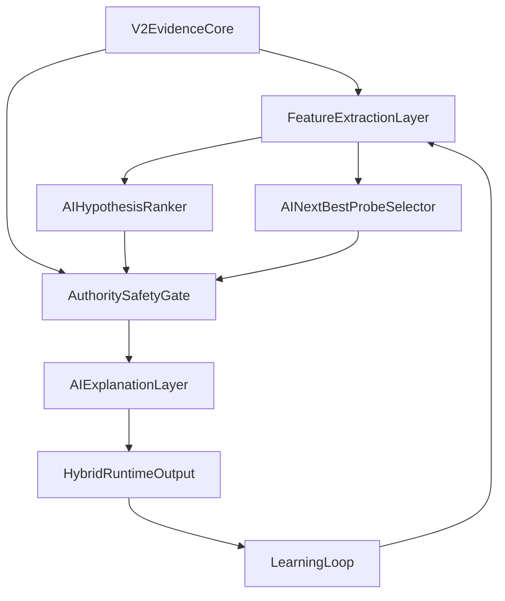

# AI-Hybrid Diagnostic Engine Master Plan

## Program Goal
Build a next-generation hybrid diagnostic engine where `diagnosticEngineV2` remains the hard authority core and AI adds bounded probabilistic intelligence (ranking, probe selection, explanation, longitudinal personalization) without breaking safety gates.

## 1) Current Engine Baseline (V2)

### What V2 already does (kept as authority core)
- **Diagnosis per unit (row/topic)** via taxonomy + recurrence logic in [`utils/diagnostic-engine-v2/run-diagnostic-engine-v2.js`](c:/Users/ERAN%20YOSEF/Desktop/final%20projects/FINAL-WEB/LIOSH-WEB-TRY/utils/diagnostic-engine-v2/run-diagnostic-engine-v2.js), with taxonomy sources in [`utils/diagnostic-engine-v2/taxonomy-registry.js`](c:/Users/ERAN%20YOSEF/Desktop/final%20projects/FINAL-WEB/LIOSH-WEB-TRY/utils/diagnostic-engine-v2/taxonomy-registry.js) and subject taxonomy files.
- **Confidence policy** (`high/moderate/low/early_signal_only/insufficient_data/contradictory`) in [`utils/diagnostic-engine-v2/confidence-policy.js`](c:/Users/ERAN%20YOSEF/Desktop/final%20projects/FINAL-WEB/LIOSH-WEB-TRY/utils/diagnostic-engine-v2/confidence-policy.js).
- **Priority policy** (`P1..P4`) in [`utils/diagnostic-engine-v2/priority-policy.js`](c:/Users/ERAN%20YOSEF/Desktop/final%20projects/FINAL-WEB/LIOSH-WEB-TRY/utils/diagnostic-engine-v2/priority-policy.js).
- **Output gating** (`cannotConcludeYet`, `diagnosisAllowed`, `probeOnly`, `interventionAllowed`, `humanReviewRecommended`) in [`utils/diagnostic-engine-v2/output-gating.js`](c:/Users/ERAN%20YOSEF/Desktop/final%20projects/FINAL-WEB/LIOSH-WEB-TRY/utils/diagnostic-engine-v2/output-gating.js).
- **Probe plan generation** in [`utils/diagnostic-engine-v2/probe-layer.js`](c:/Users/ERAN%20YOSEF/Desktop/final%20projects/FINAL-WEB/LIOSH-WEB-TRY/utils/diagnostic-engine-v2/probe-layer.js) and intervention planning in [`utils/diagnostic-engine-v2/intervention-layer.js`](c:/Users/ERAN%20YOSEF/Desktop/final%20projects/FINAL-WEB/LIOSH-WEB-TRY/utils/diagnostic-engine-v2/intervention-layer.js).
- **Authority model integration** (`diagnosticPrimarySource`) in [`utils/parent-report-v2.js`](c:/Users/ERAN%20YOSEF/Desktop/final%20projects/FINAL-WEB/LIOSH-WEB-TRY/utils/parent-report-v2.js) and [`utils/detailed-parent-report.js`](c:/Users/ERAN%20YOSEF/Desktop/final%20projects/FINAL-WEB/LIOSH-WEB-TRY/utils/detailed-parent-report.js).
- **Harness coverage** via [`scripts/diagnostic-engine-v2-harness.mjs`](c:/Users/ERAN%20YOSEF/Desktop/final%20projects/FINAL-WEB/LIOSH-WEB-TRY/scripts/diagnostic-engine-v2-harness.mjs) (+ broader pipeline harnesses in package scripts).

### Strengths
- Deterministic evidence-first logic with explicit recurrence and gating.
- Built-in weak evidence and contradiction safety behavior.
- Human-boundary sanitization in [`utils/diagnostic-engine-v2/human-boundaries.js`](c:/Users/ERAN%20YOSEF/Desktop/final%20projects/FINAL-WEB/LIOSH-WEB-TRY/utils/diagnostic-engine-v2/human-boundaries.js).
- Structured per-unit outputs suitable for feature extraction (`evidenceTrace`, confidence, priority, gating).

### What V2 still does not do (AI opportunity)
- Probabilistic hypothesis ranking/calibration beyond deterministic pick order.
- Utility-optimized next-best-probe selection.
- Evidence-constrained NLG explanation quality scoring.
- Child-level longitudinal personalization using intervention/probe outcomes.
- Native labeled dataset and gold-review pipeline for ML training.

### What must not break
- `cannotConcludeYet` contracts, weak-evidence safeguards, contradiction safeguards, human boundary restrictions, deterministic override, and V2-first source-of-truth routing as defined in [`docs/DIAGNOSTIC_ENGINE_V2.md`](c:/Users/ERAN%20YOSEF/Desktop/final%20projects/FINAL-WEB/LIOSH-WEB-TRY/docs/DIAGNOSTIC_ENGINE_V2.md) and [`docs/stage1-scientific-blueprint-source-of-truth.md`](c:/Users/ERAN%20YOSEF/Desktop/final%20projects/FINAL-WEB/LIOSH-WEB-TRY/docs/stage1-scientific-blueprint-source-of-truth.md).

## 2) AI Target Architecture (Hybrid Layered)



### Layer 1 — Evidence Core (existing V2)
- Keep deterministic computation of maps/raw mistakes/recurrence/confidence/priority/gating/probe/intervention.
- Emit immutable `v2AuthoritySnapshot` per unit to prevent post-hoc AI mutation.

### Layer 2 — Feature Extraction Layer
- Canonical feature schema per `(childId, subject, topicRowKey, windowId)` with groups:
  - Subject/topic/subskill identifiers.
  - Row metrics (accuracy, wrong counts, latency bands, attempts).
  - Trend/behavior/hint dependence.
  - Recurrence + contradiction signals.
  - Support-response and transfer/recovery metrics.
  - Recency and coverage breadth.
  - Authority states (`cannotConcludeYet`, gating reasons, confidence/priority).
  - Prior probe and prior intervention outcome features.
- Persist as versioned schema (`featureSchemaVersion`) for reproducible training.

### Layer 3 — AI Hypothesis Ranker
- Input: feature vector + candidate hypotheses from V2 taxonomy neighborhood.
- Output: ranked hypotheses, calibrated probabilities, ambiguity score, confidence-support delta, disagreement signal vs deterministic top diagnosis.
- Hard constraint: ranker cannot create out-of-taxonomy diagnosis classes.

### Layer 4 — AI Next-Best-Probe Selector
- Input: current uncertainty profile + candidate probes + historical utility.
- Output: probe candidate, uncertainty-reduction estimate, stop/escalation recommendation.
- Includes stopping rule (target ambiguity reduction or max probe budget) and escalation rule (human review thresholds).

### Layer 5 — AI Explanation Layer
- Parent-facing and teacher/internal explanation templates generated only from approved evidence bundle.
- Uncertainty-aware wording; explicit reason strings for cannot-conclude states.
- Hallucination prevention by retrieval-constrained prompting from `v2AuthoritySnapshot` + approved AI scores.

### Layer 6 — Learning Loop
- Track intervention/probe outcomes over windows.
- Update child-level priors and intervention success likelihoods.
- Strengthen/weaken hypotheses using outcome deltas, never bypassing authority gate.

## 3) Safety and Authority Rules (Explicit)

### Authority contract
- V2 remains **hard authority** for: diagnosis eligibility, cannot-conclude, intervention eligibility, contradiction and weak-evidence suppression.
- AI may **augment ranking/probe/explanation** only when V2 state is not suppressed.

### Decision table
- **AI assist allowed (full)**: V2 `diagnosisAllowed=true` and not contradictory/insufficient/weak-evidence.
- **AI rank-only**: V2 allows diagnosis but confidence is `moderate/low` with incomplete recurrence.
- **AI explain-only**: V2 `confidenceOnly=true` or `probeOnly=true`.
- **AI suppressed**: `cannotConcludeYet=true`, contradiction triggered, human-boundary risk, missing minimal feature completeness.
- **Deterministic override**: if AI disagrees and delta confidence < threshold or ambiguity high, keep V2 top diagnosis and attach disagreement note.
- **Mandatory disagreement surfacing**: if AI top-1 differs materially from V2 with calibrated probability gap above threshold.
- **Cannot automate**: clinical-style claims, school-readiness verdict from AI alone, irreversible learner labeling, autonomous intervention enforcement.

## 4) Data and Labeling Program

### Training examples required
- Unit-level snapshots: V2 outputs + raw event aggregates + temporal context.
- Probe decisions and observed outcomes.
- Intervention recommendations and post-window changes.
- Explanation drafts + human quality annotations.

### Label schema (gold)
- **Diagnosis labels**: primary hypothesis, alt hypotheses, adjudication confidence, evidence sufficiency tag.
- **Confidence labels**: calibrated confidence bin + expected reliability.
- **Probe labels**: probe selected, rationale category, observed uncertainty reduction.
- **Intervention outcome labels**: improved/stable/worsened/mixed + effect size bucket.
- **Explanation quality labels**: factual grounding, uncertainty honesty, clarity, actionability, boundary compliance.

### Label quality tiers
- **Strong labels**: expert-reviewed adjudications (gold set).
- **Weak labels**: V2-derived pseudo labels and outcome heuristics.
- Use weak labels for pretraining/ranking warm start; final model gates must be tuned on strong labels.

### Gold set scope and minimums (mandatory)
- **Minimum total gold examples (Phase B exit):** 4,800 unit-level labeled examples.
- **Minimum per subject:** 800 per subject across 6 subjects (`math`, `geometry`, `english`, `science`, `hebrew`, `moledet`).
- **Minimum per scenario family (each subject):**
  - High confidence stable pattern: 120
  - Moderate/ambiguous pattern: 120
  - Weak evidence / sparse data: 120
  - Contradictory evidence: 120
  - Cannot-conclude required: 120
  - Probe-recommended path: 100
  - Intervention follow-up outcome available: 100
- **Expert review quota:** at least 35% of gold set fully expert-labeled (minimum 1,680 items), 100% of contradiction and P4 slices expert-labeled.
- **Inter-rater agreement target:** Cohen's kappa >= 0.78 overall and >= 0.72 in every subject slice.
- **Adjudication rule when reviewers disagree:**
  - Two-reviewer conflict -> mandatory third senior reviewer.
  - Final label = majority vote if confidence gap <= 1 bin.
  - If disagreement persists on diagnosis class or cannot-conclude status -> adjudication panel decision is binding and item marked `high_dispute`.

### Dataset build plan from existing logs
- Extract from local report-generation inputs/outputs in [`utils/parent-report-v2.js`](c:/Users/ERAN%20YOSEF/Desktop/final%20projects/FINAL-WEB/LIOSH-WEB-TRY/utils/parent-report-v2.js) and diagnostic payload shape.
- Add explicit telemetry schema for probe/intervention execution outcomes (currently largely planned but not outcome-logged).
- Build review queue tooling to sample edge cases: weak evidence, contradictory, sparse data, high-priority P4.

### Must be manually reviewed
- Disagreement cases (AI vs V2), high-ambiguity cases, all P4 recommendations, all boundary-flagged explanations.

### Cannot be learned well yet from current data
- True causal intervention efficacy per child without outcome instrumentation.
- Probe effectiveness without executed-probe logging.
- Long-term personalization effects without multi-window stable identifiers and adherence tracking.

## 4.1) Privacy, Minors, and Data Governance (Mandatory)

### Child data allowed for training
- Pseudonymous identifiers only (`childPseudoId`, `windowId`, `subject`, `topicRowKey`).
- Derived learning signals only: row metrics, trend, behavior flags, recurrence, contradiction, gating states, probe/intervention outcomes.
- Explanation quality annotations detached from direct child identity.

### Data that must be anonymized or excluded
- Remove direct identifiers before any training export: full name, phone, email, free-text notes, device fingerprints, exact IP, precise geo.
- Replace timestamps with coarser buckets (day/week window) in training sets unless recency feature requires bounded offsets.
- Never train on raw freeform parent text containing personal details.

### Retention policy
- Raw event logs (pseudonymous) retained up to 180 days.
- Curated training snapshots retained up to 365 days with rolling revalidation.
- Gold/adjudicated datasets retained up to 24 months for calibration drift tracking.
- Immediate purge path required for revoked consent records (within 30 days SLA).

### Reviewer access policy
- Least-privilege, role-based access: annotator, senior reviewer, data steward.
- Annotators get pseudonymized samples only.
- Re-identification keys available only to designated data steward, never to model trainers.
- All review actions must be audited (who viewed, what changed, when).

### Consent and internal-use boundaries
- AI training and evaluation restricted to internally approved educational-improvement scope.
- Minors data included only for users covered by valid product consent terms and policy version.
- Explicit opt-out flow must exclude future samples from dataset refresh cycles.

### Data that cannot be used for model training
- Any sample lacking valid consent state.
- Any sample flagged for legal/privacy hold.
- Any explanation text that failed boundary or hallucination validator.
- Any record with unresolved identity ambiguity or incomplete anonymization checks.

## 5) Model Strategy (Explicit recommendation)

### Recommended stack (initial)
- **Feature layer**: deterministic transforms + schema validation (rule-based).
- **Hypothesis ranker**: Gradient Boosted Trees (e.g., LightGBM/XGBoost-style) for tabular mixed signals + probability calibration layer (isotonic/temperature scaling).
- **Probe selector**: contextual bandit-style scorer (or uplift-inspired utility model) over candidate probes, with hard rules for forbidden contexts.
- **Explanation layer**: retrieval-constrained LLM generation from approved evidence bundle + deterministic post-generation validator.
- **Learning loop**: Bayesian child-level prior updater (simple hierarchical priors first), not end-to-end deep sequence model initially.

### What should remain rule-based
- All authority/gating/suppression logic.
- Human-boundary enforcement and prohibited-claim filtering.
- Hard escalation/stopping minimum constraints.

### What should be learned
- Hypothesis ordering probabilities.
- Probe utility ranking.
- Personalized intervention effectiveness priors.
- Explanation quality scoring/reranking.

### What should be LLM-only
- Surface wording/explanation variants under strict evidence retrieval and template constraints.

### What NOT to do yet
- No freeform LLM diagnosis generation.
- No end-to-end neural replacement of V2.
- No unconstrained RL personalization.
- No production auto-actions from AI outputs without human + authority gates.

## 5.1) Hybrid Runtime Contract (Exact)

### Runtime payload additions
- Add `hybridRuntime` object at report level with versioned contract:
```json
{
  "hybridRuntimeVersion": "1.0",
  "v2AuthoritySnapshot": {},
  "aiAssist": {
    "eligible": true,
    "mode": "assist|rank_only|explain_only|suppressed",
    "suppressionFlags": []
  },
  "hypothesisRanking": {
    "candidates": [],
    "top1Id": "",
    "top1Probability": 0.0,
    "calibrationBand": "well_calibrated|borderline|uncalibrated",
    "ambiguityScore": 0.0
  },
  "disagreement": {
    "hasDisagreement": false,
    "severity": "none|low|medium|high",
    "v2TopId": "",
    "aiTopId": "",
    "probabilityGap": 0.0,
    "action": "retain_v2|surface_review|suppress_ai"
  },
  "probeIntelligence": {
    "suggestedProbeId": "",
    "uncertaintyReductionEstimate": 0.0,
    "stoppingRuleMet": false,
    "escalationRuleTriggered": false
  },
  "explanationContract": {
    "inputBundleId": "",
    "outputStatus": "ok|fallback|failed",
    "validatorPass": true,
    "failureReason": ""
  }
}
```

### Disagreement object schema (required fields)
- `hasDisagreement`, `severity`, `v2TopId`, `aiTopId`, `probabilityGap`, `ambiguityScore`, `reasonCodes[]`, `action`.

### AI score/probability fields
- Every candidate must include: `candidateId`, `rank`, `probability`, `calibratedProbability`, `confidenceSupportDelta`.
- Probabilities must sum to `1.0 +/- 0.01`; otherwise set `suppressionFlags += ["probability_invalid"]` and disable assist.

### Suppression flags (enum)
- `v2_cannot_conclude`, `weak_evidence`, `contradictory_evidence`, `human_boundary_risk`, `feature_incomplete`, `calibration_untrusted`, `probability_invalid`, `policy_blocked`.

### Explanation input/output contract
- Input bundle = `v2AuthoritySnapshot` + approved `hypothesisRanking` summary + approved `probeIntelligence`.
- Output fields = `audience`, `text`, `uncertaintyLine`, `evidenceRefs[]`, `boundaryCheck`, `hallucinationCheck`, `status`.

### UI-internal vs persisted
- Persisted: authority snapshot hash, ranking scores, suppression flags, disagreement object, validator outcomes, fallback reason.
- UI-internal only: prompt templates, token-level model traces, ephemeral draft variants.

## 6) Evaluation Framework

### Offline evaluation
- Diagnostic accuracy vs gold labels (top-1/top-3).
- Ranking quality (NDCG/MRR), calibration (ECE/Brier/reliability curves).
- Error profile: false positives/false negatives/overclaim rate.
- Probe usefulness: expected vs observed uncertainty reduction.
- Intervention usefulness: outcome lift estimates stratified by confidence bands.
- Agreement/disagreement matrices: AI vs V2, AI vs expert review.
- Explanation quality rubric: factuality, evidence linkage, uncertainty honesty, boundary compliance.

### Shadow mode evaluation
- Run hybrid outputs silently alongside V2-only runtime.
- Log disagreement slices and simulated decision impact.
- Safety KPIs: suppressed-AI compliance, no forbidden-claim leakage, no cannot-conclude violations.

### Guarded rollout evaluation
- Cohort-based progressive exposure (internal, pilot subset, controlled beta).
- Gate by predefined SLOs: calibration, overclaim, boundary violations, human-review burden.
- Auto rollback triggers on safety regressions.

## 6.1) Numeric Gates and Transition Thresholds (Mandatory)

### Global quality gates
- **Overclaim rate (hard max):** <= 2.0% overall and <= 3.0% in every subject slice.
- **Calibration target:** ECE <= 0.05 overall; no subject slice above 0.08.
- **AI vs V2 disagreement threshold:** high-severity disagreement <= 6.0% of eligible cases.
- **Minimum ranking gain to justify hybrid:** NDCG@3 uplift >= +0.05 vs V2 deterministic ordering baseline.
- **Minimum probe utility gain:** >= 12% relative improvement in uncertainty reduction over rule-only probe baseline.
- **Explanation safety:** forbidden-claim leakage = 0 in validation set; evidence-link pass rate >= 99.5%.

### Phase transition pass/fail criteria
- **A -> B:** feature completeness >= 98%, schema validation pass >= 99.5%, governance checks implemented and audited.
- **B -> C:** gold set minimum counts reached, expert quota reached, kappa targets met, adjudication policy operational.
- **C -> D:** ranker passes offline targets: NDCG@3 uplift >= +0.05, ECE <= 0.06 pre-calibration and <= 0.05 post-calibration.
- **D -> E:** probe selector shows >= 12% utility gain and false escalation <= 5%.
- **E -> F:** runtime contract integrated with 100% suppression-flag correctness on regression suite.
- **F -> G:** explanation validator pass >= 99.5%, hallucination fail rate <= 0.5%, fallback handling 100% deterministic.
- **G -> H:** shadow mode meets all global quality gates for 4 consecutive weekly windows.
- **H rollout expansion:** no safety rollback trigger for 6 consecutive weeks, with stable or improving calibration.

### Automatic fail conditions (any phase)
- Any cannot-conclude violation in production candidate build.
- Any forbidden-claim leak in approved explanation set.
- Any slice-level calibration above 0.10.
- Any unresolved privacy/consent compliance blocker.

## 7) Execution Phases (A–H)

### Phase A — AI foundation and schema
- Finalize feature schema, label schema, event logging contracts, dataset extraction spec.
- Add schema validation and data quality checks.
- Implement governance controls: anonymization, retention clocks, access controls, consent-state filters.

### Phase B — Dataset and gold set
- Build initial historical dataset and review splits.
- Define expert labeling protocol and adjudication guidelines.
- Produce first gold set with inter-rater agreement metrics.
- Enforce minimum subject/scenario quotas and expert coverage thresholds before phase exit.

### Phase C — First model iteration
- Train initial hypothesis ranker on weak+gold labels.
- Calibrate probabilities and evaluate offline against baselines.

### Phase D — Probe intelligence
- Implement next-best-probe scorer with utility objective.
- Validate uncertainty reduction and stop/escalation behavior offline.

### Phase E — Hybrid runtime integration
- Integrate AI outputs behind authority gate into runtime payload.
- Add explicit disagreement objects and suppression audit fields.
- Freeze `hybridRuntimeVersion` contract and payload backward-compatibility policy.

### Phase F — Explanation intelligence
- Build constrained explanation generation pipeline.
- Add explanation validators (evidence-link, boundary, uncertainty checks).
- Enforce deterministic fallback behavior and validator-based release gates.

### Phase G — Hybrid QA and shadow validation
- Run V2-only vs hybrid shadow comparisons.
- Quantify gains, regressions, and new risk classes.
- Require safety sign-off and operational readiness checklist.

### Phase H — Controlled rollout
- Limited exposure by cohort with monitoring dashboards.
- Expand only if all safety/performance gates remain green.

## 8) Explicit Non-Goals
- No replacement of deterministic V2 engine.
- No freeform LLM-only diagnosis.
- No AI-only school-readiness or clinical-style claims.
- No autonomous personalized interventions without evidence and gates.
- No uncontrolled personalization loops without measurable outcomes.

## 8.1) Explanation Safety Execution Spec (Mandatory)

### Approved evidence bundle only
- Explanation generator may consume only: `v2AuthoritySnapshot`, approved AI ranking summary, approved probe summary, and gating reasons.
- No direct access to raw unrestricted logs at generation time.

### Forbidden wording / claim categories
- No clinical diagnosis language.
- No immutable trait labeling ("always", "cannot learn", "incapable").
- No certainty claims when state is ambiguous or cannot-conclude.
- No causal claims not supported by explicit evidence refs.

### Uncertainty wording requirements
- If ambiguity score >= 0.35 or V2 confidence below `high`, explanation must include explicit uncertainty sentence.
- If suppressed or cannot-conclude, explanation must state "insufficient evidence for definitive diagnosis" equivalent wording.

### Hallucination prevention checks
- Retrieval-anchored generation with strict evidence IDs.
- Post-generation verifier must confirm every diagnosis/probe/intervention claim maps to evidence refs.
- Any unmapped claim triggers hard fail and fallback.

### Output validator contract
- Validator outputs: `boundaryPass`, `evidenceLinkPass`, `uncertaintyCompliancePass`, `forbiddenClaimPass`, `overallPass`, `reasonCodes[]`.
- `overallPass=false` must force `outputStatus=fallback`.

### Fallback behavior on generation failure
- Use deterministic template explanation from V2/gating only.
- Include safe uncertainty statement and recommended next review/probe action.
- Log `failureReason` and validator reason codes for audit and retraining.

## 9) Final Deliverable Definition
At program completion, produce:
- Final hybrid architecture spec.
- Production feature/label data contracts and dataset lineage.
- Model cards (ranker/probe/explanation) with calibration and risk sections.
- Full evaluation report (offline + shadow + rollout).
- Authority/safety rulebook with executable checks.
- Rollout decision memo.

### Readiness recommendation
- **Ready to execute AI-hybrid program** at the program level (start with Phase A under governance + numeric gate enforcement).
- **Not ready to execute AI-hybrid program** if governance controls, gold minimums, or numeric gates are not accepted as binding entry criteria.
- **Not ready for production hybrid rollout** until Phases G–H gates are passed.

## File Anchors to Leverage During Execution
- V2 authority and contracts: [`docs/DIAGNOSTIC_ENGINE_V2.md`](c:/Users/ERAN%20YOSEF/Desktop/final%20projects/FINAL-WEB/LIOSH-WEB-TRY/docs/DIAGNOSTIC_ENGINE_V2.md), [`docs/stage1-scientific-blueprint-source-of-truth.md`](c:/Users/ERAN%20YOSEF/Desktop/final%20projects/FINAL-WEB/LIOSH-WEB-TRY/docs/stage1-scientific-blueprint-source-of-truth.md)
- Runtime integration: [`utils/parent-report-v2.js`](c:/Users/ERAN%20YOSEF/Desktop/final%20projects/FINAL-WEB/LIOSH-WEB-TRY/utils/parent-report-v2.js), [`utils/detailed-parent-report.js`](c:/Users/ERAN%20YOSEF/Desktop/final%20projects/FINAL-WEB/LIOSH-WEB-TRY/utils/detailed-parent-report.js)
- Core policies: [`utils/diagnostic-engine-v2/output-gating.js`](c:/Users/ERAN%20YOSEF/Desktop/final%20projects/FINAL-WEB/LIOSH-WEB-TRY/utils/diagnostic-engine-v2/output-gating.js), [`utils/diagnostic-engine-v2/confidence-policy.js`](c:/Users/ERAN%20YOSEF/Desktop/final%20projects/FINAL-WEB/LIOSH-WEB-TRY/utils/diagnostic-engine-v2/confidence-policy.js), [`utils/diagnostic-engine-v2/priority-policy.js`](c:/Users/ERAN%20YOSEF/Desktop/final%20projects/FINAL-WEB/LIOSH-WEB-TRY/utils/diagnostic-engine-v2/priority-policy.js)
- Existing harnesses: [`scripts/diagnostic-engine-v2-harness.mjs`](c:/Users/ERAN%20YOSEF/Desktop/final%20projects/FINAL-WEB/LIOSH-WEB-TRY/scripts/diagnostic-engine-v2-harness.mjs), [`scripts/parent-report-phase6-suite.mjs`](c:/Users/ERAN%20YOSEF/Desktop/final%20projects/FINAL-WEB/LIOSH-WEB-TRY/scripts/parent-report-phase6-suite.mjs), [`docs/full-test-matrix.md`](c:/Users/ERAN%20YOSEF/Desktop/final%20projects/FINAL-WEB/LIOSH-WEB-TRY/docs/full-test-matrix.md)