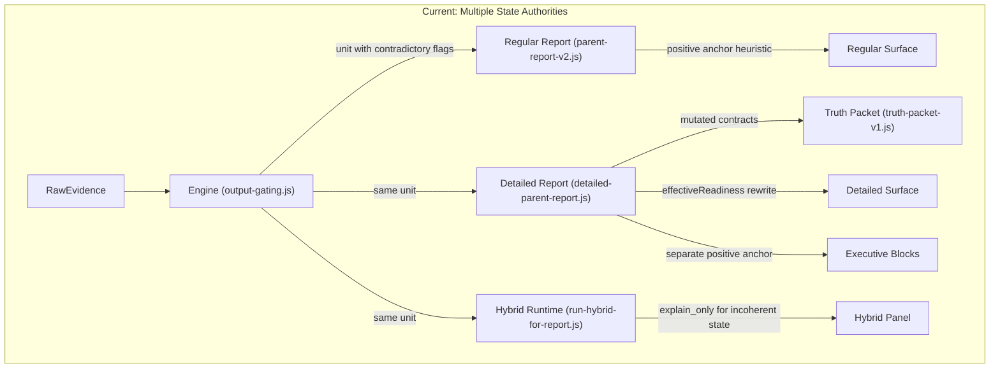
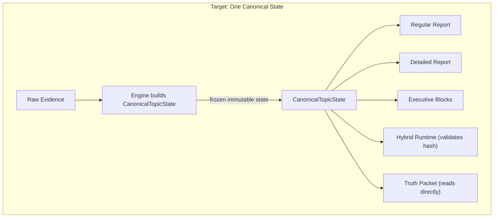

# Authoritative Parent Report Machine — Execution Plan

## Current state of failure (proven by audit)

The engine emits a unit where `probeOnly=true`, `confidence=low`, `readiness=insufficient`, but also `positiveAuthorityLevel=excellent`, `positiveConclusionAllowed=true`. Downstream, `detailed-parent-report.js` rewrites readiness to `ready` and confidence to `medium` when it sees `positiveConclusionAllowed`. The regular report treats the same unit as a strength. Hybrid accepts the incoherent state as `explain_only`. Result: one topic tells four different stories across four surfaces.

## Data flow (current vs target)





---

## 1. Files to create

- **`utils/canonical-topic-state/schema.js`** — `CanonicalTopicState` type definition, `ACTION_STATES`, `RECOMMENDATION_FAMILIES`, field enumerations
- **`utils/canonical-topic-state/build-canonical-state.js`** — single builder function: takes engine evidence/classification/gating inputs, returns frozen `CanonicalTopicState` with `topicStateId` and `stateHash`
- **`utils/canonical-topic-state/invariant-validator.js`** — validates all hard invariants at creation time; throws on illegal combinations
- **`utils/canonical-topic-state/decision-table.js`** — unified decision table mapping (confidence, readiness, taxonomyMatch, recurrence, evidence) to `actionState` and `recommendation.family`
- **`utils/canonical-topic-state/index.js`** — re-exports
- **`tests/fixtures/canonical-topic-state-scenarios.mjs`** — 10 fixture cases (see Phase 9)
- **`scripts/canonical-topic-state-e2e.mjs`** — end-to-end integration test harness

## 2. Files to edit

### Phase 0 + 1 + 2: Engine refactor

- **[utils/diagnostic-engine-v2/output-gating.js](utils/diagnostic-engine-v2/output-gating.js)**
  - **Remove** `positiveConclusionAllowed` from all decisioning logic. Replace with `_deprecated_positiveConclusionAllowed` computed as `actionState in ["maintain", "expand_cautiously"]` — a read-only mirror with zero decision power.
  - Fix taxonomy-mismatch early return (line 162) so it also sets `confidenceOnly=true` when `confidence=low`
  - Make positive authority subordinate to actionState: if actionState is `withhold` or `probe_only`, positive evidence cannot upgrade it
  - Pass real `subjectId` and `topicKey` to `buildContractsBundle` (currently passes defaults)
  - After computing all gating flags, call `buildCanonicalState()` with all `decisionInputs` (priority, counterEvidenceStrong, weakEvidence, hintInvalidates, hardDenyReason, taxonomyMismatchReason) and attach frozen `unit.canonicalState`
  - Throw if `subjectId` or `topicKey` is `__unknown__` or composite

- **[utils/diagnostic-engine-v2/run-diagnostic-engine-v2.js](utils/diagnostic-engine-v2/run-diagnostic-engine-v2.js)**
  - Import canonical state builder and unified enums from `utils/canonical-topic-state/`
  - After `applyOutputGating()` (line 143), build `CanonicalTopicState` from unit evidence, classification, confidence, gating, strength profile, and all `decisionInputs`
  - Attach frozen `unit.canonicalState` to each unit
  - Pass real `subjectId` and `topicKey` to output gating (line 143-158)
  - **Phase 7 enforcement**: Before building canonical state, validate that `topicKey` does not contain `\u0001` (composite separator). Throw if it does — engine must reject non-collapsed topic entities.

- **[utils/diagnostic-engine-v2/confidence-policy.js](utils/diagnostic-engine-v2/confidence-policy.js)**
  - No structural changes needed; confidence resolution stays as-is
  - Import confidence level enum from `utils/canonical-topic-state/schema.js` instead of local string literals

### Phase 3: Contracts as mirror only

- **[utils/contracts/decision-readiness-contract-v1.js](utils/contracts/decision-readiness-contract-v1.js)**
  - Add `buildContractsFromCanonicalState(canonicalState)` function that maps canonical state to contract format
  - Existing `buildDecisionReadinessContractsBundleV1` remains for backward compat but delegates to canonical state when present

### Phase 4A: Regular report

- **[utils/parent-report-v2.js](utils/parent-report-v2.js)**
  - `summarizeV2UnitsForSubject()` (line 716): replace `positiveAllowed` filter with canonical actionState check; only treat unit as strength if `canonicalState.actionState` is `"maintain"` or `"expand_cautiously"` (unified enum)
  - `actionAnchor` selection (line 726): use canonical actionState priority, not positive-conclusion heuristic
  - `summaryHe` logic (lines 812-845): gate on canonical state, not on `positiveConclusionAllowed`/`positiveAuthorityLevel`
  - `parentActionHe`/`nextWeekGoalHe`/`subjectDoNowHe` (lines 864-870): use canonical recommendation family (unified enum)
  - Expose `topicStateId` and `stateHash` as explicit fields in regular payload anchored topics
  - Use unified enum imports from `utils/canonical-topic-state/schema.js`

### Phase 4B: Detailed report

- **[utils/detailed-parent-report.js](utils/detailed-parent-report.js)**
  - `recommendationFromV2Unit()` (starting ~line 1726): **delete** lines 1770-1808 (the entire `effectiveReadiness`/`effectiveConfidenceBand`/`effectiveDecisionTier` promotion block). Replace with direct read from `unit.canonicalState`
  - `buildSubjectProfilesFromV2()` (line 1895): change `topWeakUnit` fallback (line 1911) to respect canonical actionState — do not fall back to positive units when canonical state says `probe_only` or `withhold`
  - `buildExecutiveSummaryFromV2()` (line 2074): remove `strongPosExec`/`leadPosX` positive-lead heuristic (lines 2082-2091); use canonical state instead
  - Subject summary `summaryHe` (lines 1965-1987): gate on canonical actionState
  - `parentActionHe`/`subjectDoNowHe`/`subjectDeferredActionHe` (lines 2005, 2052-2056): use canonical recommendation family (unified enum)
  - `confidenceSummaryHe` (line 2015): use canonical `assessment.confidenceLevel`
  - Home plan and next period goals (lines 2160-2182): filter by canonical `recommendation.allowed`
  - Expose `topicStateId` and `stateHash` as explicit fields in each detailed topic row and in executive entries (`executiveSummary.anchoredTopicStateIds[]`)
  - Use unified enum imports — no local string constants for action states or families

### Phase 4C: Executive blocks

- Same file `detailed-parent-report.js`:
  - `mainHomeRecommendationHe` (lines 2117-2121): remove `strongPosExec && resolveUnitParentActionHe(leadPosX)` path
  - `transferReadyAreasHe` (line 2141): only include units with canonical `actionState` of `maintain` or `expand_cautiously`
  - `monitoringOnlyAreasHe` (line 2135): use canonical `actionState === "withhold"`

### Phase 4E: Recommendation mapping

- **[utils/parent-report-recommendation-consistency.js](utils/parent-report-recommendation-consistency.js)**
  - `hasStrongPositiveShape()` (line 39): replace with canonical state check — `canonicalState.actionState === "maintain" || canonicalState.actionState === "expand_cautiously"`
  - `classifyParentRecommendationState()` (line 53): derive from canonical state, not from independent positive-authority signals
  - `resolveUnitParentActionHe()` (line 87): if canonical recommendation.allowed is false, return null; if canonical family is `maintain`/`expand_cautiously`, use positive template; otherwise use probe/intervention text
  - Remove `BLOCKED_FAMILY_MARKERS` (line 8-13) — family blocking is now in canonical state

- **[utils/minimal-safe-scope-enforcement.js](utils/minimal-safe-scope-enforcement.js)**
  - `applyGateToTextClampToTopicRecord()` (line 226): read canonical state contracts instead of rebuilding them
  - `capInterventionIntensityByContract()` (line 206): use canonical `recommendation.intensityCap`

### Phase 5: Hybrid coherence

- **[utils/ai-hybrid-diagnostic/run-hybrid-for-report.js](utils/ai-hybrid-diagnostic/run-hybrid-for-report.js)**
  - Pass `unit.canonicalState` into each hybrid unit (line 68 area)
  - Store `topicStateId` and `canonicalStateHash` (= `canonicalState.stateHash`) in hybrid unit for downstream validation

- **[utils/ai-hybrid-diagnostic/authority-gate.js](utils/ai-hybrid-diagnostic/authority-gate.js)**
  - Add canonical state coherence check: if `canonicalState.actionState` is `withhold` or `probe_only` and positive authority exists, suppress
  - If `canonicalState` invariant validation fails, suppress with `"incoherent_canonical_state"` flag
  - Validate using unified `ACTION_STATES` enum — no local string comparisons

- **[utils/ai-hybrid-diagnostic/explanation-layer.js](utils/ai-hybrid-diagnostic/explanation-layer.js)**
  - `buildHybridExplanations()`: receive canonical state; if explanation would frame `probe_only` as success, force fallback text
  - Add canonical family coherence to `requireUncertainty` logic
  - Use unified enum imports for all family/actionState comparisons

- **[utils/ai-hybrid-diagnostic/explanation-validator.js](utils/ai-hybrid-diagnostic/explanation-validator.js)**
  - Add `stateCoherencePass` check: validate that explanation text does not contradict canonical actionState
  - Add `familyCoherencePass`: explanation family matches `canonicalState.recommendation.family`
  - Add `readinessConfidenceCoherencePass`: explanation does not claim readiness/confidence levels inconsistent with canonical state
  - Include all three in `overallPass` gate

- **[utils/ai-hybrid-diagnostic/v2-authority-snapshot.js](utils/ai-hybrid-diagnostic/v2-authority-snapshot.js)**
  - Include `topicStateId` and `canonicalStateHash` in snapshot

### Phase 6: Truth packet

- **[utils/parent-copilot/truth-packet-v1.js](utils/parent-copilot/truth-packet-v1.js)**
  - For topic/subject scope: read canonical state directly from payload instead of re-deriving from row contracts (lines 83-109)
  - For executive scope: aggregate canonical states instead of re-deriving readiness/confidence from rows (lines 127-159)
  - `derivedLimits` must mirror canonical state, not local computation
  - Expose `topicStateId` and `stateHash` as explicit fields in truth packet output
  - Use unified enum imports from `utils/canonical-topic-state/schema.js` for all family/readiness/confidence comparisons

### Phase 7: Topic identity enforcement (not just verification)

- **[utils/parent-report-v2.js](utils/parent-report-v2.js)**
  - `collapseTopicRowsToCanonicalTopicEntity()` already exists (line 256). It is already called before engine runs (line 973-983).
  - **Enforcement**: Add a guard at the entry of `generateParentReportV2()` that validates all topic maps are collapsed. Throw if any topic key contains `\u0001` (composite separator).
  - **Enforcement**: Add same guard in `summarizeV2UnitsForSubject()` — reject any unit whose `topicKey` is composite.

- **[utils/canonical-topic-state/build-canonical-state.js](utils/canonical-topic-state/build-canonical-state.js)**
  - Builder throws on `topicKey` containing `\u0001` — this is the final invariant enforcement point.
  - Builder throws on `subjectId === "__unknown_subject__"` or `topicKey === "__unknown_topic__"`.

- **[utils/diagnostic-engine-v2/run-diagnostic-engine-v2.js](utils/diagnostic-engine-v2/run-diagnostic-engine-v2.js)**
  - Before calling `buildCanonicalState()`, validate that the unit's `topicKey` is collapsed. Throw with descriptive error if not.

Identity normalization is now **enforced at three layers** (report entry, engine, builder) — not observational.

### Phase 8: Zero-data

- **[utils/detailed-parent-report.js](utils/detailed-parent-report.js)**
  - `buildSubjectProfilesFromV2()`: if no units for a subject, emit minimal stub (subject label, `actionState: "withhold"`, no trend, no recommendation)
  - Executive: do not include empty subjects in trend/recommendation lists

- **[utils/parent-report-v2.js](utils/parent-report-v2.js)**
  - `summarizeV2UnitsForSubject()`: if units is empty, return `{ hasAnySignal: false }` stub with no summary/action/goal

## 3. Files to delete or neutralize logic in

- **`utils/detailed-parent-report.js` lines 1770-1808** — entire `effectiveReadiness`/`effectiveConfidenceBand`/`effectiveDecisionTier` block: **DELETE**
- **`utils/detailed-parent-report.js` lines 2082-2091** — `strongPosExec`/`leadPosX` positive-lead executive heuristic: **DELETE** (replace with canonical state read)
- **`utils/parent-report-recommendation-consistency.js` lines 8-13** — `BLOCKED_FAMILY_MARKERS`: **DELETE** (canonical state handles family blocking)
- **`utils/parent-report-recommendation-consistency.js` lines 30-47** — `readinessState()` and `hasStrongPositiveShape()` independent checks: **DELETE** and replace with canonical state read
- **`utils/diagnostic-engine-v2/output-gating.js` line 76** — `positiveConclusionAllowed` as boolean authority: **REMOVE from decisioning**. Keep only as a deprecated read-only field whose value is derived from `canonicalState.actionState in ["maintain", "expand_cautiously"]`. Add CI grep-assert: no file outside `output-gating.js` and `build-canonical-state.js` may reference `positiveConclusionAllowed` in a conditional/ternary/if statement.

## 4. Exact invariant set

Enforced at canonical state creation time in `invariant-validator.js`. All throw on violation.

### Unified enum definitions (single source of truth)

```
ACTION_STATES     = ["withhold", "probe_only", "diagnose_only", "intervene", "maintain", "expand_cautiously"]
REC_FAMILIES      = ["withhold", "probe_only", "diagnose_only", "intervene", "maintain", "expand_cautiously"]
CONFIDENCE_LEVELS = ["high", "moderate", "low", "early_signal_only", "insufficient_data", "contradictory"]
READINESS_STATES  = ["ready", "emerging", "forming", "insufficient"]
INTENSITY_CAPS    = ["RI0", "RI1", "RI2", "RI3"]
CLAIM_CLASSES     = ["no_claim", "descriptive_observation", "gentle_pattern", "stable_pattern", "actionable_guidance"]
POS_AUTH_LEVELS   = ["none", "good", "very_good", "excellent"]
SUFFICIENCY       = ["low", "medium", "strong"]
```

Every enum is defined once in `utils/canonical-topic-state/schema.js` and imported everywhere. No mixed naming variants allowed. `recommendation.family` uses the same enum as `actionState`.

### Invariants (all enforced at creation; all throw)

1. `actionState === "probe_only" => recommendation.family === "probe_only" && recommendation.allowed === false`
2. `assessment.confidenceLevel === "low" => assessment.readiness !== "ready"`
3. `evidence.taxonomyMatch === false => actionState in ["withhold", "probe_only"]`
4. `assessment.cannotConcludeYet === true => actionState in ["withhold", "probe_only"]`
5. `recommendation.allowed === false => actionState in ["withhold", "probe_only"]`
6. `actionState === "withhold" => recommendation.family === "withhold" && recommendation.allowed === false`
7. `actionState === "expand_cautiously" => assessment.confidenceLevel in ["high", "moderate"] && assessment.readiness in ["ready", "emerging"]`
8. `actionState === "intervene" => assessment.readiness in ["ready", "emerging", "forming"] && assessment.cannotConcludeYet === false`
9. `evidence.stableMastery === true && assessment.confidenceLevel === "low" => actionState in ["withhold", "probe_only"]` (stable mastery evidence never overrides low confidence)
10. `stateHash` is deterministic from all canonical fields (computed, not random)
11. `recommendation.family === actionState` always (they are the same enum; family mirrors action)
12. `subjectId` is not `"__unknown_subject__"` and `topicKey` is not `"__unknown_topic__"` — throw on either
13. `topicKey` does not contain `\u0001` (must be collapsed canonical bucket, not composite key) — throw if composite
14. `Object.isFrozen(canonicalState) === true` after creation — builder must deep-freeze before returning

## 5. CanonicalTopicState schema

```javascript
/**
 * @typedef {Object} CanonicalTopicState
 *
 * --- IDENTITY (throw on __unknown__ or composite keys) ---
 * @property {string} topicStateId         - "{subjectId}::{topicKey}" (deterministic)
 * @property {string} stateHash            - deterministic hash of ALL fields below (not random)
 * @property {string} subjectId            - real subject id; NEVER "__unknown_subject__"
 * @property {string} topicKey             - collapsed bucket key; NEVER composite with \u0001; NEVER "__unknown_topic__"
 * @property {string} bucketKey            - same as topicKey (alias for readability)
 * @property {string} displayName
 *
 * --- EVIDENCE (raw inputs; annotation only; no decision power) ---
 * @property {Object} evidence
 * @property {number} evidence.questions
 * @property {number} evidence.correct
 * @property {number} evidence.wrong
 * @property {number} evidence.wrongEventCount
 * @property {boolean} evidence.recurrenceFull
 * @property {boolean} evidence.taxonomyMatch
 * @property {string} evidence.dataSufficiencyLevel    - from SUFFICIENCY enum
 * @property {number|null} evidence.confidence01
 * @property {boolean} evidence.stableMastery
 * @property {boolean} evidence.needsPractice
 * @property {string} evidence.positiveAuthorityLevel  - from POS_AUTH_LEVELS enum (annotation only; zero decision power)
 *
 * --- DECISION INPUTS (explicit trace of every input that drove actionState) ---
 * @property {Object} decisionInputs
 * @property {string} decisionInputs.priorityLevel     - "P1"|"P2"|"P3"|"P4"
 * @property {string} decisionInputs.breadth            - "narrow"|"moderate"|"broad"
 * @property {boolean} decisionInputs.counterEvidenceStrong
 * @property {boolean} decisionInputs.weakEvidence
 * @property {boolean} decisionInputs.hintInvalidates
 * @property {boolean} decisionInputs.narrowSample
 * @property {string|null} decisionInputs.hardDenyReason - null if no hard deny; else "contradictory"|"counter_evidence"|"weak_evidence"|"insufficient_data"|"early_signal_invalidated"
 * @property {string|null} decisionInputs.taxonomyMismatchReason - null if match; else "taxonomy_not_matched"|"weak_taxonomy_fallback_blocked"
 *
 * --- CLASSIFICATION ---
 * @property {Object} classification
 * @property {string|null} classification.taxonomyId
 * @property {string} classification.classificationState - "classified"|"unclassified_no_taxonomy_match"|"unclassified_weak_evidence"
 * @property {string|null} classification.classificationReasonCode
 *
 * --- ASSESSMENT (derived from decision table) ---
 * @property {Object} assessment
 * @property {string} assessment.confidenceLevel       - from CONFIDENCE_LEVELS enum
 * @property {string} assessment.readiness             - from READINESS_STATES enum
 * @property {number} assessment.decisionTier          - 0-4
 * @property {boolean} assessment.cannotConcludeYet
 * @property {string} assessment.allowedClaimClass     - from CLAIM_CLASSES enum
 *
 * --- ACTION STATE (single authoritative decision) ---
 * @property {string} actionState                      - from ACTION_STATES enum
 *
 * --- RECOMMENDATION (mirrors actionState; no independent derivation) ---
 * @property {Object} recommendation
 * @property {string} recommendation.family            - from REC_FAMILIES enum; MUST === actionState
 * @property {boolean} recommendation.allowed
 * @property {string} recommendation.intensityCap      - from INTENSITY_CAPS enum
 * @property {string[]} recommendation.reasonCodes
 *
 * --- NARRATIVE CONSTRAINTS ---
 * @property {Object} narrativeConstraints
 * @property {boolean} narrativeConstraints.uncertaintyRequired
 * @property {string[]} narrativeConstraints.allowedSections
 * @property {string[]} narrativeConstraints.forbiddenPhrases
 *
 * --- RENDER FLAGS (pure derived; no decisions; read-only projections) ---
 * @property {Object} renderFlags
 * @property {boolean} renderFlags.showAsStrength
 * @property {boolean} renderFlags.showAsWeakness
 * @property {boolean} renderFlags.showAsMonitoring
 * @property {boolean} renderFlags.suppressActionText
 *
 * --- DEPRECATED MIRRORS (backward compat only; derived from canonical state) ---
 * @property {boolean} _deprecated_positiveConclusionAllowed  - === (actionState in ["maintain", "expand_cautiously"]); NO code may use for decisions
 */
```

### Immutability and fail-closed rules

- Builder must call `Object.freeze()` recursively (deep freeze) on the returned object.
- Builder must throw if `subjectId === "__unknown_subject__"` or `topicKey === "__unknown_topic__"`.
- Builder must throw if `topicKey` contains `\u0001` (composite/non-collapsed key).
- Builder must throw if any invariant from section 4 is violated.
- Any downstream code that attempts to assign to a frozen canonical state property will throw at runtime (strict mode).

### Payload presence rule

`topicStateId` and `stateHash` must appear as explicit fields in:
- Engine unit (`unit.canonicalState.topicStateId`, `unit.canonicalState.stateHash`)
- Regular payload (`patternDiagnostics.subjects[*].topicStateId`, `.stateHash` per anchored topic)
- Detailed topic rows (`subjectProfiles[*].topicRecommendations[*].topicStateId`, `.stateHash`)
- Executive entries (`executiveSummary.anchoredTopicStateIds[]`)
- Hybrid snapshot (`hybridRuntime.units[*].canonicalStateHash`)
- Truth packet (`truthPacket.topicStateId`, `.stateHash`)

The E2E suite must assert exact field equality across all of these, not inferred equivalence.

## 6. Decision table

All enum values use the unified names from section 4.

```
INPUTS (all explicit in decisionInputs + evidence + assessment):
  C  = confidenceLevel    (from CONFIDENCE_LEVELS enum)
  T  = taxonomyMatch      (bool)
  R  = recurrenceFull     (bool)
  CE = counterEvidenceStrong (bool, in decisionInputs)
  WE = weakEvidence        (bool, in decisionInputs)
  HI = hintInvalidates     (bool, in decisionInputs)
  SM = stableMastery       (bool)
  Q  = questions           (number)
  A  = accuracy            (number, derived: correct/questions)
  P  = priorityLevel       (string, in decisionInputs: "P1"|"P2"|"P3"|"P4")

EVALUATION ORDER: top-to-bottom, first match wins.

────────────────────────────────────────────────────────────────────────
RULE 1 — HARD DENY (cannotConcludeYet=true):
  C in {"contradictory", "insufficient_data"} OR CE OR WE OR (HI AND C="early_signal_only")
  hardDenyReason = "contradictory"|"counter_evidence"|"weak_evidence"|"insufficient_data"|"early_signal_invalidated"
  => actionState = "withhold"
  => recommendation = { family: "withhold", allowed: false, intensityCap: "RI0" }
  => readiness = "insufficient"
  => cannotConcludeYet = true
  => positiveAuthorityLevel stays as evidence annotation; zero decision power

RULE 2 — NO TAXONOMY MATCH:
  T=false AND NOT hard_deny
  taxonomyMismatchReason = "taxonomy_not_matched"|"weak_taxonomy_fallback_blocked"
  => actionState = "probe_only"
  => recommendation = { family: "probe_only", allowed: false, intensityCap: "RI0" }
  => readiness = derived from C: low->"insufficient", moderate->"forming", high->"emerging"
  => cannotConcludeYet = false

RULE 3 — LOW CONFIDENCE:
  C="low" AND T=true AND NOT hard_deny
  => actionState = "probe_only"
  => readiness = "insufficient"
  => recommendation = { family: "probe_only", allowed: false, intensityCap: "RI0" }
  => cannotConcludeYet = false

RULE 4 — EARLY SIGNAL:
  C="early_signal_only" AND T=true AND NOT hard_deny
  => actionState = "probe_only"
  => readiness = "forming"
  => recommendation = { family: "probe_only", allowed: false, intensityCap: "RI0" }
  => cannotConcludeYet = false

RULE 5 — POSITIVE STABLE (checked before intervention because stable mastery overrides weakness):
  SM=true AND Q>=10 AND A>=90 AND NOT hard_deny AND T=true
  AND C in {"moderate", "high"}
  5a. If C="high" AND Q>=20 AND A>=95:
    => actionState = "expand_cautiously"
    => readiness = "ready"
    => recommendation = { family: "expand_cautiously", allowed: true, intensityCap: "RI1" }
  5b. Else:
    => actionState = "maintain"
    => readiness = C="high" -> "ready", C="moderate" -> "emerging"
    => recommendation = { family: "maintain", allowed: true, intensityCap: "RI1" }

  KEY RULE: If C="low", even with SM=true and excellent volume metrics,
  Rule 3 already matched. actionState stays "probe_only".

RULE 6 — MODERATE CONFIDENCE + DIAGNOSIS:
  C="moderate" AND T=true AND R=true AND NOT CE AND NOT hard_deny
  6a. If P in {"P3", "P4"}:
    => actionState = "intervene"
    => readiness = "emerging"
    => recommendation = { family: "intervene", allowed: true, intensityCap: "RI2" }
    => cannotConcludeYet = false
  6b. Else:
    => actionState = "diagnose_only"
    => readiness = "emerging"
    => recommendation = { family: "diagnose_only", allowed: true, intensityCap: "RI2" }
    => cannotConcludeYet = false

RULE 7 — HIGH CONFIDENCE + FULL RECURRENCE:
  C="high" AND T=true AND R=true AND NOT CE AND NOT hard_deny
  7a. If P in {"P3", "P4"}:
    => actionState = "intervene"
    => readiness = "ready"
    => recommendation = { family: "intervene", allowed: true, intensityCap: "RI3" }
    => cannotConcludeYet = false
  7b. Else:
    => actionState = "diagnose_only"
    => readiness = "ready"
    => recommendation = { family: "diagnose_only", allowed: true, intensityCap: "RI3" }
    => cannotConcludeYet = false

RULE 8 — FALLBACK (nothing matched):
  => actionState = "probe_only"
  => readiness = "insufficient"
  => recommendation = { family: "probe_only", allowed: false, intensityCap: "RI0" }
  => cannotConcludeYet = false
────────────────────────────────────────────────────────────────────────

POST-RULE UNIVERSAL ASSIGNMENTS:
  recommendation.family = actionState (always)
  _deprecated_positiveConclusionAllowed = actionState in {"maintain", "expand_cautiously"}
```

## 7. Downstream refactor map by file

- **`utils/canonical-topic-state/schema.js`** — Phase 1: Define all enums (`ACTION_STATES`, `REC_FAMILIES`, `CONFIDENCE_LEVELS`, `READINESS_STATES`, `INTENSITY_CAPS`, `CLAIM_CLASSES`, `POS_AUTH_LEVELS`, `SUFFICIENCY`), `CanonicalTopicState` type, `decisionInputs` sub-type. Single source for all enum values used everywhere.
- **`utils/canonical-topic-state/build-canonical-state.js`** — Phase 1: Builder function. Validates identity (throws on `__unknown__`, composite keys). Runs decision table. Attaches `decisionInputs` trace. Computes `stateHash`. Deep-freezes result. Derives `_deprecated_positiveConclusionAllowed`.
- **`utils/canonical-topic-state/invariant-validator.js`** — Phase 1: All 14 invariants from section 4. Throws on any violation.
- **`utils/canonical-topic-state/decision-table.js`** — Phase 1: Implements exact rules from section 6. Pure function: inputs -> { actionState, readiness, recommendation, cannotConcludeYet }.
- **`utils/canonical-topic-state/index.js`** — Phase 1: Re-exports.
- **`utils/diagnostic-engine-v2/output-gating.js`** — Phase 1,2: Remove `positiveConclusionAllowed` as decision authority. Keep only as `_deprecated_positiveConclusionAllowed` derived from canonical state. Pass real identity. Fix taxonomy-mismatch ordering. Build canonical state after gating.
- **`utils/diagnostic-engine-v2/run-diagnostic-engine-v2.js`** — Phase 1: Attach frozen `unit.canonicalState` to each unit. Pass real `subjectId` and `topicKey`.
- **`utils/contracts/decision-readiness-contract-v1.js`** — Phase 3: Add `buildContractsFromCanonicalState()`. Contracts become read-only mirror.
- **`utils/parent-report-v2.js`** — Phase 4A, 7: `summarizeV2UnitsForSubject`: consume canonical state for anchor/strength/summary. Expose `topicStateId`/`stateHash` in payload. Phase 7: Add pre-engine validation that topic entities are collapsed (throw on composite).
- **`utils/detailed-parent-report.js`** — Phase 4B, 4C, 8: Delete effectiveReadiness/effectiveConfidenceBand/effectiveDecisionTier. Read canonical state. Delete positive-lead executive heuristic. Expose `topicStateId`/`stateHash` in detailed rows and executive entries. Zero-data stubs for empty subjects.
- **`utils/parent-report-recommendation-consistency.js`** — Phase 4E: Delete `BLOCKED_FAMILY_MARKERS`, `readinessState()`, `hasStrongPositiveShape()`. Replace all with canonical state reads.
- **`utils/minimal-safe-scope-enforcement.js`** — Phase 4E: Read canonical contracts/intensityCap, not rebuild.
- **`utils/ai-hybrid-diagnostic/run-hybrid-for-report.js`** — Phase 5: Pass `unit.canonicalState`. Store `topicStateId` and `canonicalStateHash` in hybrid unit.
- **`utils/ai-hybrid-diagnostic/authority-gate.js`** — Phase 5: Add canonical coherence check. Suppress on incoherent state.
- **`utils/ai-hybrid-diagnostic/explanation-layer.js`** — Phase 5: Gate on canonical family. Force fallback on probe_only framed as success.
- **`utils/ai-hybrid-diagnostic/explanation-validator.js`** — Phase 5: Add `stateCoherencePass`, `familyCoherencePass`, `readinessConfidenceCoherencePass` to `overallPass`.
- **`utils/ai-hybrid-diagnostic/v2-authority-snapshot.js`** — Phase 5: Include `topicStateId` and `canonicalStateHash` in snapshot.
- **`utils/parent-copilot/truth-packet-v1.js`** — Phase 6: Read canonical state directly. Expose `topicStateId`/`stateHash`. No re-derivation.
- **`tests/fixtures/canonical-topic-state-scenarios.mjs`** — Phase 9: 10 fixture cases.
- **`scripts/canonical-topic-state-e2e.mjs`** — Phase 9: E2E harness asserting `topicStateId`/`stateHash` equality across all payload layers.
- **`.github/workflows/parent-report-tests.yml`** — Phase 9: Add `npm run test:canonical-state-e2e` and add CI grep-assert for `positiveConclusionAllowed` usage.

## 8. Test plan

Test runner: `tsx` with `node:assert/strict` (existing infrastructure).

New script: `scripts/canonical-topic-state-e2e.mjs`
New fixtures: `tests/fixtures/canonical-topic-state-scenarios.mjs`
CI additions in `.github/workflows/parent-report-tests.yml`:
- `npm run test:canonical-state-e2e`
- `npm run test:no-positive-conclusion-decisioning` (grep-assert that no decisioning code references `positiveConclusionAllowed`)

### 10 mandatory scenarios (all use unified enum values)

1. **Strong stable positive** — Q=25, A=97, stableMastery, C="high", T=true, P="P2" => actionState="expand_cautiously", recommendation.family="expand_cautiously", readiness="ready", all surfaces say "strength"
2. **Positive but insufficient data** — Q=5, A=100, stableMastery, C="insufficient_data", P="P2" => actionState="withhold", recommendation.family="withhold", readiness="insufficient", hardDenyReason="insufficient_data", no surface says "strength"
3. **Probe-only taxonomy-mismatch** — Q=20, A=95, T=false, C="low", P="P2" => actionState="probe_only", recommendation.family="probe_only", readiness="insufficient", taxonomyMismatchReason="taxonomy_not_matched", no positive wording anywhere
4. **Low-confidence topic** — Q=8, A=70, C="low", T=true, P="P2" => actionState="probe_only", recommendation.family="probe_only", readiness="insufficient"
5. **True support/remedial** — Q=20, A=60, C="high", T=true, R=true, P="P4" => actionState="intervene", recommendation.family="intervene", readiness="ready", cannotConcludeYet=false
6. **Maintain-only** — Q=15, A=92, stableMastery, C="moderate", T=true, P="P2" => actionState="maintain", recommendation.family="maintain", readiness="emerging"
7. **Expand-cautiously** — Q=25, A=97, stableMastery, C="high", T=true, R=false, P="P2" => actionState="expand_cautiously", recommendation.family="expand_cautiously", readiness="ready"
8. **Empty subject** — 0 units => minimal stub, no summary/trend/recommendation
9. **Same pedagogical topic across modes** — collapsed by `collapseTopicRowsToCanonicalTopicEntity`, one canonical state, one `topicStateId`
10. **Reproduced audit contradiction** — Q=20, A=95, stableMastery, T=false, C="low", P="P2" => MUST be actionState="probe_only", recommendation.family="probe_only"; same across all surfaces

### Per-scenario assertions

For each scenario, trace through engine -> regular payload -> detailed payload -> executive -> hybrid -> truth packet and assert:
- **Exact field equality**: `topicStateId` and `stateHash` are present and identical across all payload layers (not inferred equivalence — literal field match)
- Same readiness, confidenceLevel, actionState, recommendation.family (all from unified enums)
- `recommendation.family === actionState` always
- No invariant violation (run invariant validator on each canonical state)
- No surface contradicts canonical state
- `_deprecated_positiveConclusionAllowed` is never read in any conditional
- Canonical state is frozen (`Object.isFrozen()` assertion)
- `decisionInputs` trace fields are present and non-null
- No `__unknown_topic__` or `__unknown_subject__` in any payload
- No composite `topicKey` (no `\u0001`) in any payload

## 9. Migration risks

- **Backward compatibility of positive wording**: Topics that were previously rendered as strengths may now render as `probe_only`/`withhold` if their confidence is actually low. This is correct behavior, not a regression. But parent-facing text will change for some topics.
- **`positiveConclusionAllowed` removal**: All code that currently reads `positiveConclusionAllowed` for decisioning will break. Known consumers: `detailed-parent-report.js`, `parent-report-v2.js`, `parent-report-recommendation-consistency.js`. All are in the refactor list. CI grep-assert will catch any missed references.
- **Existing test fixtures**: Existing harness tests (diagnostic-engine-v2-harness, ai-hybrid-harness, phase6-suite) will need fixture updates because: (a) engine output shape changes (new `canonicalState` field with `decisionInputs`), (b) old enum names like `"probe"`, `"expand"`, `"diagnose"`, `"success"` are replaced with unified names. Existing backward-compat fields like `_deprecated_positiveConclusionAllowed` exist but cannot be used in conditionals.
- **Deep freeze breaking mutations**: Any downstream code that currently mutates engine unit properties (e.g., `unit.readiness = "ready"`) will throw at runtime because canonical state is frozen. This is intentional — it surfaces hidden mutation bugs.
- **Strict identity enforcement**: The `throw` on `__unknown_topic__`/`__unknown_subject__` and composite keys will surface data pipeline issues that were previously silent. Any code path that feeds uncollapsed topic entities to the engine will now fail loudly.
- **Parent copilot**: truth-packet-v1.js currently re-derives state. Refactoring it to read canonical state directly means the copilot's behavior changes. The copilot imports from `contract-reader.js` which reads row-level contracts; those contracts must now mirror canonical state.
- **Topic identity enforcement**: `collapseTopicRowsToCanonicalTopicEntity` already runs before the engine. The new three-layer enforcement (report entry, engine, builder) means any code path that bypasses collapsing will throw. Risk: third-party callers or test harnesses that construct units manually must now provide collapsed keys.

## 10. Final pass/fail checklist

### Schema and enums
- [ ] `CanonicalTopicState` schema defined and exported with all fields including `decisionInputs`
- [ ] Unified enums (`ACTION_STATES`, `REC_FAMILIES`, `CONFIDENCE_LEVELS`, `READINESS_STATES`, `INTENSITY_CAPS`, `CLAIM_CLASSES`, `POS_AUTH_LEVELS`, `SUFFICIENCY`) defined once in `schema.js` and imported everywhere — no mixed naming variants
- [ ] `REC_FAMILIES === ACTION_STATES` — same enum values, `recommendation.family === actionState` always

### Invariants and immutability
- [ ] Invariant validator catches all 14 invariants and throws on violation
- [ ] Canonical state is deep-frozen (`Object.isFrozen()` passes recursively)
- [ ] Builder throws on `__unknown_subject__` or `__unknown_topic__`
- [ ] Builder throws on composite `topicKey` containing `\u0001`
- [ ] Any downstream attempted mutation of canonical state throws at runtime

### Engine
- [ ] Engine attaches frozen `canonicalState` to every unit
- [ ] Real `subjectId`/`topicKey` in canonical state (no `__unknown__`)
- [ ] `decisionInputs` trace (priority, counterEvidenceStrong, weakEvidence, hardDenyReason, taxonomyMismatchReason) present in every canonical state
- [ ] Engine rejects non-collapsed topic entities before state creation

### Positive authority elimination
- [ ] `positiveConclusionAllowed` removed from all decisioning code
- [ ] `_deprecated_positiveConclusionAllowed` exists only as derived read-only mirror
- [ ] CI grep-assert: no file references `positiveConclusionAllowed` in if/ternary/conditional (outside deprecation mirror)
- [ ] `positiveAuthorityLevel` is evidence annotation only — zero decision power

### Downstream surfaces
- [ ] `effectiveReadiness`/`effectiveConfidenceBand`/`effectiveDecisionTier` deleted from detailed report
- [ ] No surface rewrites readiness/confidence/family
- [ ] Regular report summary uses canonical actionState for strength/weakness classification
- [ ] Detailed report topic rows read canonical state directly
- [ ] Executive blocks use canonical state, not positive-lead heuristics
- [ ] Subject summary does not fall back to positive units when canonical state is `probe_only`/`withhold`
- [ ] Recommendation family is precomputed in canonical state (`recommendation.family === actionState`)
- [ ] `resolveUnitParentActionHe` derives from canonical family, not `hasStrongPositiveShape`

### Payload fields
- [ ] `topicStateId` and `stateHash` appear as explicit fields in: engine unit, regular payload, detailed rows, executive entries, hybrid snapshot, truth packet
- [ ] E2E test asserts exact field equality (not inferred equivalence) across all layers

### Hybrid
- [ ] Hybrid stores `topicStateId` and `canonicalStateHash` and validates coherence
- [ ] Hybrid suppresses on incoherent state instead of explaining it
- [ ] Explanation validator checks state coherence + family coherence + readiness/confidence coherence, not just text shape

### Truth packet
- [ ] Truth packet reads canonical state directly, not from mutated rows
- [ ] Truth packet exposes `topicStateId`/`stateHash`

### Topic identity enforcement
- [ ] `generateParentReportV2()` throws on non-collapsed topic maps
- [ ] `summarizeV2UnitsForSubject()` rejects units with composite `topicKey`
- [ ] `buildCanonicalState()` throws on composite `topicKey`
- [ ] Identity normalization enforced at three layers (report entry, engine, builder)

### Zero data
- [ ] Empty subjects produce minimal stub only

### Tests
- [ ] All 10 E2E scenarios pass
- [ ] Reproduced contradiction case (Q=20, A=95, stableMastery, T=false, C="low") produces consistent `probe_only` across all surfaces
- [ ] CI green with all existing + new tests
- [ ] CI grep-assert for `positiveConclusionAllowed` passes
