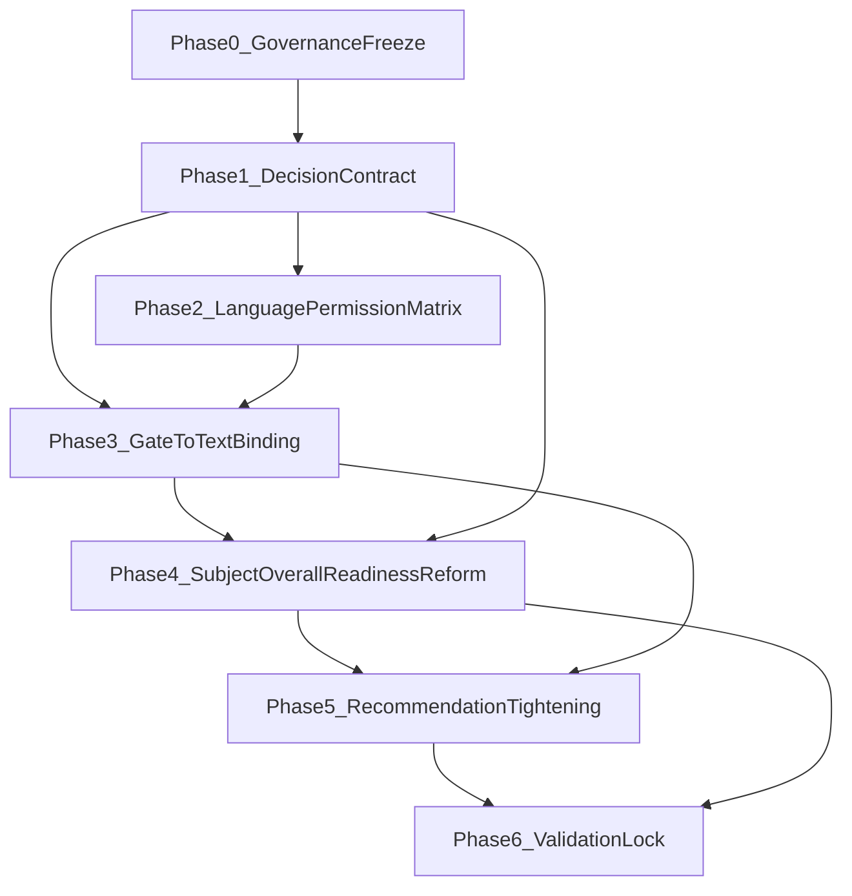

# Parent Report Decision-Contract Master Plan

## A. Executive Direction

The correct direction is to lock policy before implementation: first define a strict cross-level decision contract (`row/topic/subject/overall`), then bind allowed language to evidence bands, then enforce gate-to-text behavior, and only then tune recommendations and aggregate conclusions.

This sequence is required because current risk is not lack of engine logic, but mismatch between evidence strength and parent-facing phrasing. Jumping directly into code edits before policy lock would create scattered fixes, regressions in confidence integrity, and inconsistent behavior across short vs detailed outputs.

What must not happen early:
- No recommendation tuning before decision-contract approval.
- No subject/overall rewrite before evidence-band definitions are frozen.
- No wording cleanup before language-permission matrix is approved.

## B. Locked Findings

Plan is based on these locked findings:
- `row/topic` logic is materially stronger than `subject/overall` contract enforcement.
- Overstating risk exists in parent-facing phrasing under mixed/partial evidence.
- `subject` readiness can be inflated relative to underlying row evidence.
- Gate-to-text mismatch appears in some outputs (e.g., strong-sounding narrative while gates are not fully ready).
- No fully strict global contract currently governs `subject/overall` conclusion eligibility.
- A language-permission policy is required to prevent certainty drift.
- Output-proof audit already identified concrete mismatch classes: overstated, too-early, generic, unsupported.
- PDF is locked as verified and out of scope.

## C. Final Target State

Target end-state definition:
- Decision contract is explicit and enforced for all four levels (`row/topic/subject/overall`) with identical semantics for evidence maturity.
- Every conclusion type has allowed/forbidden phrasing bands tied to evidence bands.
- Recommendation behavior is contract-aware (no strong directive when decision band forbids it).
- `subject/overall` conclusions require strict breadth + depth + freshness conditions, not only heuristic aggregation.
- Parent-facing wording is evidence-honest, concise, and non-robotic; weak evidence is explicitly marked as early/partial.
- Product-level done criteria:
  - No output marked as high confidence without meeting contract conditions.
  - No stable/decisive language under early-signal or partial-readiness bands.
  - Scenario proof suite passes all contract assertions.

## D. Master Plan by Phases

### Phase Artifacts (Locked Names)

- **Phase 0 artifact:** `governance-freeze-v1.md`
- **Phase 1 artifact:** `decision-contract-v1.md`
- **Phase 2 artifacts:** `evidence-band-dictionary-v1.md`, `language-permission-matrix-v1.md`
- **Phase 3 artifact:** `gate-to-text-binding-v1.md`
- **Phase 4 artifact:** `subject-overall-readiness-policy-v1.md`
- **Phase 5 artifact:** `recommendation-intensity-contract-v1.md`
- **Phase 6 artifact:** `execution-readiness-bundle-v1.md`

### Phase 0 — Governance Freeze
- **Goal:** Lock scope, exclusions, and policy-first workflow.
- **Why now:** Prevent execution drift and accidental early coding.
- **Includes:**
  - Confirm immutable assumptions and out-of-scope list.
  - Define decision authority and approval checkpoints.
- **Excludes:** Any code/content/UI changes.
- **Likely owner files:**
  - [docs/PARENT_REPORT.md](C:/Users/ERAN YOSEF/Desktop/final projects/FINAL-WEB/LIOSH-WEB-TRY/docs/PARENT_REPORT.md)
  - [docs/PARENT_REPORT_ENGINE.md](C:/Users/ERAN YOSEF/Desktop/final projects/FINAL-WEB/LIOSH-WEB-TRY/docs/PARENT_REPORT_ENGINE.md)
- **Deliverable:** Governance lock note + phase gates.
- **Acceptance:** Explicit signed freeze on: no code edits, PDF excluded, policy-first.
- **Risks:** Scope creep into ad-hoc fixes.
- **Regression check:** N/A (no implementation).

### Phase 1 — Canonical Decision Contract (All Levels)
- **Goal:** Freeze formal decision contract by level and conclusion type.
- **Why before all:** All later work depends on these rules.
- **Includes:**
  - Evidence unit definitions by level.
  - Band taxonomy (early/cautious/stable/high-confidence).
  - Disallowed-before conditions.
  - Per-conclusion-type thresholds and constraints.
- **Excludes:** Text rewrite or algorithm tuning.
- **Likely owner files/inputs:**
  - [utils/parent-report-row-diagnostics.js](C:/Users/ERAN YOSEF/Desktop/final projects/FINAL-WEB/LIOSH-WEB-TRY/utils/parent-report-row-diagnostics.js)
  - [utils/parent-report-diagnostic-restraint.js](C:/Users/ERAN YOSEF/Desktop/final projects/FINAL-WEB/LIOSH-WEB-TRY/utils/parent-report-diagnostic-restraint.js)
  - [utils/parent-report-decision-gates.js](C:/Users/ERAN YOSEF/Desktop/final projects/FINAL-WEB/LIOSH-WEB-TRY/utils/parent-report-decision-gates.js)
  - [utils/detailed-parent-report.js](C:/Users/ERAN YOSEF/Desktop/final projects/FINAL-WEB/LIOSH-WEB-TRY/utils/detailed-parent-report.js)
  - [utils/learning-patterns-analysis.js](C:/Users/ERAN YOSEF/Desktop/final projects/FINAL-WEB/LIOSH-WEB-TRY/utils/learning-patterns-analysis.js)
- **Deliverable:** Approved Decision Contract v1.
- **Acceptance:** Each conclusion type has explicit contract row/topic/subject/overall eligibility.
- **Risks:** Overfitting to current heuristics.
- **What may break later if weak:** Inconsistent enforcement and repeated rework.
- **Validation:** Contract review against existing output-proof findings.

### Phase 2 — Evidence Bands + Language Permission Matrix
- **Goal:** Map evidence maturity to allowed phrasing strength.
- **Why here:** Must follow contract and precede wording changes.
- **Includes:**
  - Evidence-band dictionary.
  - Allowed/forbidden phrase classes per band.
  - Mandatory uncertainty markers.
- **Excludes:** Engine threshold edits.
- **Likely owner files/inputs:**
  - [utils/parent-report-language/confidence-parent-he.js](C:/Users/ERAN YOSEF/Desktop/final projects/FINAL-WEB/LIOSH-WEB-TRY/utils/parent-report-language/confidence-parent-he.js)
  - [utils/parent-report-language/index.js](C:/Users/ERAN YOSEF/Desktop/final projects/FINAL-WEB/LIOSH-WEB-TRY/utils/parent-report-language/index.js)
  - [utils/parent-report-language/parent-facing-normalize-he.js](C:/Users/ERAN YOSEF/Desktop/final projects/FINAL-WEB/LIOSH-WEB-TRY/utils/parent-report-language/parent-facing-normalize-he.js)
  - [utils/parent-report-language/forbidden-terms.js](C:/Users/ERAN YOSEF/Desktop/final projects/FINAL-WEB/LIOSH-WEB-TRY/utils/parent-report-language/forbidden-terms.js)
- **Deliverable:** Language Permission Matrix v1.
- **Acceptance:** Deterministic mapping from band to phrase strength + banned classes.
- **Risks:** Matrix too broad/subjective.
- **Regression check:** Apply to existing output samples and classify pass/fail.

### Phase 3 — Gate-to-Text Binding Spec
- **Goal:** Ensure narrative cannot exceed gate readiness.
- **Why before recommendation tuning:** Prevent strong wording leaks regardless of recommendation logic.
- **Includes:**
  - Binding rules: `gateState`, `conclusionStrength`, `dataSufficiencyLevel` -> max phrasing strength.
  - Conflict resolution precedence when signals disagree.
- **Excludes:** UI rearrangement.
- **Likely owner files/inputs:**
  - [utils/topic-next-step-engine.js](C:/Users/ERAN YOSEF/Desktop/final projects/FINAL-WEB/LIOSH-WEB-TRY/utils/topic-next-step-engine.js)
  - [utils/parent-report-ui-explain-he.js](C:/Users/ERAN YOSEF/Desktop/final projects/FINAL-WEB/LIOSH-WEB-TRY/utils/parent-report-ui-explain-he.js)
  - [components/parent-report-topic-explain-row.jsx](C:/Users/ERAN YOSEF/Desktop/final projects/FINAL-WEB/LIOSH-WEB-TRY/components/parent-report-topic-explain-row.jsx)
  - [components/parent-report-detailed-surface.jsx](C:/Users/ERAN YOSEF/Desktop/final projects/FINAL-WEB/LIOSH-WEB-TRY/components/parent-report-detailed-surface.jsx)
- **Deliverable:** Gate-to-Text Binding Rules v1.
- **Acceptance:** No output class can exceed permitted language band when gate is weak/not-ready.
- **Risks:** Hidden narrative paths not covered.
- **Regression check:** Run scenario proof matrix and ensure no over-band phrasing.

### Phase 4 — Subject/Overall Readiness Reform Spec
- **Goal:** Replace inflated readiness heuristics with strict contract criteria.
- **Why after foundational policy:** Depends on locked contract + language matrix.
- **Includes:**
  - Subject readiness minimum breadth/depth/freshness definitions.
  - Overall readiness eligibility based on multi-subject evidence quality.
  - Override rules for contradictory/misaligned evidence.
- **Excludes:** Recommendation micro-tuning.
- **Likely owner files/inputs:**
  - [utils/detailed-parent-report.js](C:/Users/ERAN YOSEF/Desktop/final projects/FINAL-WEB/LIOSH-WEB-TRY/utils/detailed-parent-report.js)
  - [utils/learning-patterns-analysis.js](C:/Users/ERAN YOSEF/Desktop/final projects/FINAL-WEB/LIOSH-WEB-TRY/utils/learning-patterns-analysis.js)
- **Deliverable:** Subject/Overall Readiness Policy v1.
- **Acceptance:** No `ready` state without contract-compliant minima.
- **Risks:** More conservative outputs initially.
- **Regression check:** Compare old/new scenario classification drift.

### Phase 5 — Recommendation Behavior Tightening Spec
- **Goal:** Align recommendation intensity with decision confidence policy.
- **Why after readiness reform:** Recommendation strength must consume final readiness rules.
- **Includes:**
  - Recommendation intensity caps by evidence/gate bands.
  - Rules for when only monitoring/probe-style actions are allowed.
  - Anti-generic recommendation requirements.
- **Excludes:** Visual/UI redesign.
- **Likely owner files/inputs:**
  - [utils/topic-next-step-engine.js](C:/Users/ERAN YOSEF/Desktop/final projects/FINAL-WEB/LIOSH-WEB-TRY/utils/topic-next-step-engine.js)
  - [utils/topic-next-step-phase2.js](C:/Users/ERAN YOSEF/Desktop/final projects/FINAL-WEB/LIOSH-WEB-TRY/utils/topic-next-step-phase2.js)
  - [utils/diagnostic-engine-v2/output-gating.js](C:/Users/ERAN YOSEF/Desktop/final projects/FINAL-WEB/LIOSH-WEB-TRY/utils/diagnostic-engine-v2/output-gating.js)
- **Deliverable:** Recommendation Intensity Contract v1.
- **Acceptance:** No high-intensity recommendation in disallowed evidence bands.
- **Risks:** Actionability may become too cautious if over-restricted.
- **Regression check:** Scenario-level actionability checks (not only caution checks).

### Phase 6 — Validation & Proof Framework Lock
- **Goal:** Freeze acceptance tests and proof artifacts before implementation.
- **Why last pre-execution phase:** Defines objective green-light for coding.
- **Includes:**
  - Required scenario packs and verdict schema.
  - Pass/fail rubric for overstating, unsupported claims, genericity.
  - Required CI checks list.
- **Excludes:** Implementation changes.
- **Likely owner files/inputs:**
  - [scripts/parent-report-phase1-selftest.mjs](C:/Users/ERAN YOSEF/Desktop/final projects/FINAL-WEB/LIOSH-WEB-TRY/scripts/parent-report-phase1-selftest.mjs)
  - [scripts/topic-next-step-phase2.test.mjs](C:/Users/ERAN YOSEF/Desktop/final projects/FINAL-WEB/LIOSH-WEB-TRY/scripts/topic-next-step-phase2.test.mjs)
  - [scripts/parent-report-phase6-suite.mjs](C:/Users/ERAN YOSEF/Desktop/final projects/FINAL-WEB/LIOSH-WEB-TRY/scripts/parent-report-phase6-suite.mjs)
  - [tests/fixtures/parent-report-pipeline.mjs](C:/Users/ERAN YOSEF/Desktop/final projects/FINAL-WEB/LIOSH-WEB-TRY/tests/fixtures/parent-report-pipeline.mjs)
  - [.github/workflows/parent-report-tests.yml](C:/Users/ERAN YOSEF/Desktop/final projects/FINAL-WEB/LIOSH-WEB-TRY/.github/workflows/parent-report-tests.yml)
- **Deliverable:** Execution-readiness validation bundle.
- **Acceptance:** All required policy docs + scenario proof templates approved.
- **Risks:** Under-specified tests miss edge paths.
- **Regression check:** Dry-run proof classification on existing snapshots.

### Approval Checkpoints (Locked)

#### Checkpoint P0 (end of Phase 0)
- **What is checked:** Scope freeze, PDF exclusion lock, no-code-until-approval rule, authority chain.
- **Approved when:** `governance-freeze-v1.md` is signed and all out-of-scope items are explicit.
- **Rework trigger:** Any ambiguity in scope or approval authority.
- **Cannot start before approved:** Phase 1.

#### Checkpoint P1 (end of Phase 1)
- **What is checked:** Full decision contract by level and conclusion type, including disallowed-before clauses.
- **Approved when:** `decision-contract-v1.md` covers row/topic/subject/overall with no missing conclusion class.
- **Rework trigger:** Missing thresholds, unclear minima, or unresolved contradictions.
- **Cannot start before approved:** Phase 2 and Phase 3.

#### Checkpoint P2 (end of Phase 2)
- **What is checked:** Evidence band definitions and language permission rules.
- **Approved when:** `evidence-band-dictionary-v1.md` and `language-permission-matrix-v1.md` are complete and deterministic.
- **Rework trigger:** Any band without explicit allowed/forbidden phrasing classes.
- **Cannot start before approved:** Narrative-bound implementation planning (Phase 3+).

#### Checkpoint P3 (end of Phase 3)
- **What is checked:** Gate-to-text precedence and max-allowed phrasing by gate state.
- **Approved when:** `gate-to-text-binding-v1.md` maps all relevant gate/confidence combinations.
- **Rework trigger:** Any uncovered narrative path or unresolved precedence conflict.
- **Cannot start before approved:** Phase 4 and Phase 5.

#### Checkpoint P4 (end of Phase 4)
- **What is checked:** Strict subject/overall readiness minima and override logic.
- **Approved when:** `subject-overall-readiness-policy-v1.md` prevents readiness inflation by contract.
- **Rework trigger:** Any `ready` condition without explicit breadth+depth+freshness minima.
- **Cannot start before approved:** Subject/overall rewrite and recommendation finalization.

#### Checkpoint P5 (end of Phase 5)
- **What is checked:** Recommendation intensity ceilings tied to allowed evidence/gate bands.
- **Approved when:** `recommendation-intensity-contract-v1.md` defines hard caps and disallowed escalations.
- **Rework trigger:** Any recommendation class that can exceed allowed confidence band.
- **Cannot start before approved:** Phase 6 final validation lock.

#### Checkpoint P6 (end of Phase 6)
- **What is checked:** Final readiness package, scenario proof rubric, pass/fail enforcement.
- **Approved when:** `execution-readiness-bundle-v1.md` is complete and acceptance framework is fully testable.
- **Rework trigger:** Missing scenarios, unclear verdict schema, or non-binary pass/fail definitions.
- **Cannot start before approved:** Any execution/coding phase.

## E. Dependency Map

Critical dependencies:
- Narrative rewrite cannot start before Decision Contract + Language Matrix are approved.
- Recommendation tuning cannot start before Gate-to-Text binding is finalized.
- Subject/overall rewrite cannot start before contract definitions for breadth/depth/freshness are locked.
- Any content cleanup depends on policy lock to avoid style-only fixes that violate evidence integrity.

## F. Workstreams

### WS1 — Decision Policy Core
- **Owner area:** Evidence + confidence logic.
- **Main files:**
  - [utils/parent-report-row-diagnostics.js](C:/Users/ERAN YOSEF/Desktop/final projects/FINAL-WEB/LIOSH-WEB-TRY/utils/parent-report-row-diagnostics.js)
  - [utils/parent-report-diagnostic-restraint.js](C:/Users/ERAN YOSEF/Desktop/final projects/FINAL-WEB/LIOSH-WEB-TRY/utils/parent-report-diagnostic-restraint.js)
  - [utils/parent-report-decision-gates.js](C:/Users/ERAN YOSEF/Desktop/final projects/FINAL-WEB/LIOSH-WEB-TRY/utils/parent-report-decision-gates.js)
- **Risks:** Ambiguous thresholds across layers.
- **Done when:** Contract rows are unambiguous and approved.

### WS2 — Evidence Bands
- **Owner area:** Confidence maturity model.
- **Main files:**
  - [utils/topic-next-step-config.js](C:/Users/ERAN YOSEF/Desktop/final projects/FINAL-WEB/LIOSH-WEB-TRY/utils/topic-next-step-config.js)
  - [utils/detailed-parent-report.js](C:/Users/ERAN YOSEF/Desktop/final projects/FINAL-WEB/LIOSH-WEB-TRY/utils/detailed-parent-report.js)
- **Risks:** Divergent interpretations by level.
- **Done when:** Shared evidence band dictionary frozen for all levels.

### WS3 — Language Permission Matrix
- **Owner area:** Parent-facing language policy.
- **Main files:**
  - [utils/parent-report-language/confidence-parent-he.js](C:/Users/ERAN YOSEF/Desktop/final projects/FINAL-WEB/LIOSH-WEB-TRY/utils/parent-report-language/confidence-parent-he.js)
  - [utils/parent-report-language/index.js](C:/Users/ERAN YOSEF/Desktop/final projects/FINAL-WEB/LIOSH-WEB-TRY/utils/parent-report-language/index.js)
  - [utils/parent-report-language/parent-facing-normalize-he.js](C:/Users/ERAN YOSEF/Desktop/final projects/FINAL-WEB/LIOSH-WEB-TRY/utils/parent-report-language/parent-facing-normalize-he.js)
- **Risks:** Overly broad language classes.
- **Done when:** Allowed/forbidden phrasing list approved per band.

### WS4 — Gate-to-Text Binding
- **Owner area:** Recommendation-to-narrative bridge.
- **Main files:**
  - [utils/topic-next-step-engine.js](C:/Users/ERAN YOSEF/Desktop/final projects/FINAL-WEB/LIOSH-WEB-TRY/utils/topic-next-step-engine.js)
  - [utils/parent-report-ui-explain-he.js](C:/Users/ERAN YOSEF/Desktop/final projects/FINAL-WEB/LIOSH-WEB-TRY/utils/parent-report-ui-explain-he.js)
- **Risks:** Hidden message paths bypass gating.
- **Done when:** Every narrative path maps to gate-based max phrasing strength.

### WS5 — Subject/Overall Readiness Reform
- **Owner area:** Aggregation policy.
- **Main files:**
  - [utils/detailed-parent-report.js](C:/Users/ERAN YOSEF/Desktop/final projects/FINAL-WEB/LIOSH-WEB-TRY/utils/detailed-parent-report.js)
  - [utils/learning-patterns-analysis.js](C:/Users/ERAN YOSEF/Desktop/final projects/FINAL-WEB/LIOSH-WEB-TRY/utils/learning-patterns-analysis.js)
- **Risks:** Conservative shift may reduce assertive summaries.
- **Done when:** No readiness inflation against contract minima.

### WS6 — Output Wording Normalization
- **Owner area:** Parent copy consistency.
- **Main files:**
  - [utils/parent-report-language/v2-parent-copy.js](C:/Users/ERAN YOSEF/Desktop/final projects/FINAL-WEB/LIOSH-WEB-TRY/utils/parent-report-language/v2-parent-copy.js)
  - [utils/parent-report-language/short-report-v2-copy.js](C:/Users/ERAN YOSEF/Desktop/final projects/FINAL-WEB/LIOSH-WEB-TRY/utils/parent-report-language/short-report-v2-copy.js)
  - [components/parent-report-topic-explain-row.jsx](C:/Users/ERAN YOSEF/Desktop/final projects/FINAL-WEB/LIOSH-WEB-TRY/components/parent-report-topic-explain-row.jsx)
  - [components/parent-report-detailed-surface.jsx](C:/Users/ERAN YOSEF/Desktop/final projects/FINAL-WEB/LIOSH-WEB-TRY/components/parent-report-detailed-surface.jsx)
- **Risks:** Robot-like redundancy remains if done before WS3/WS4.
- **Done when:** Output-proof matrix shows no over-band language.

### WS7 — Validation/QA Scenario Proofing
- **Owner area:** Regression and proof quality.
- **Main files:**
  - [scripts/parent-report-phase6-suite.mjs](C:/Users/ERAN YOSEF/Desktop/final projects/FINAL-WEB/LIOSH-WEB-TRY/scripts/parent-report-phase6-suite.mjs)
  - [tests/fixtures/parent-report-pipeline.mjs](C:/Users/ERAN YOSEF/Desktop/final projects/FINAL-WEB/LIOSH-WEB-TRY/tests/fixtures/parent-report-pipeline.mjs)
  - [.github/workflows/parent-report-tests.yml](C:/Users/ERAN YOSEF/Desktop/final projects/FINAL-WEB/LIOSH-WEB-TRY/.github/workflows/parent-report-tests.yml)
- **Risks:** Proof suite not representative.
- **Done when:** Scenario classes cover sparse/medium/rich/mixed-risk and pass rubric.

## G. Priority Order

1. Decision Contract freeze (`row/topic/subject/overall`).
2. Evidence bands + language-permission matrix.
3. Gate-to-text binding.
4. Subject/overall readiness reform.
5. Recommendation intensity tightening.
6. Output wording normalization.
7. Validation lock + scenario proof baseline.

Can be deferred:
- Non-critical style polish not tied to confidence integrity.

Must not be done before prerequisites:
- Any wording changes before WS3 (language matrix) and WS4 (gate binding).
- Any recommendation tuning before WS1+WS4 are approved.

## H. Minimal Safe Scope vs Professional Full Scope

### A) Minimal Safe Scope
- **Includes:**
  - Contract freeze for all levels.
  - Language-permission matrix.
  - Gate-to-text binding for key output paths.
  - Subject/overall readiness anti-inflation minimum rules.
  - Basic proof regression set.
- **Excludes:**
  - Deep recommendation redesign.
  - Broad narrative quality overhaul.
  - Structural refactor.
- **Tradeoffs:** Fastest risk reduction, limited expressiveness gains.
- **Risks:** Residual genericity and verbosity.
- **Expected outcome:** Significant overstating reduction + stronger trust integrity.

### B) Professional Full Scope
- **Includes:**
  - Everything in minimal scope.
  - Full recommendation intensity policy alignment.
  - Comprehensive wording normalization across short+detailed outputs.
  - Expanded scenario proof suite with strict fail rules.
- **Excludes:**
  - Architecture-level refactor unrelated to confidence integrity.
  - UI redesign.
- **Tradeoffs:** Higher effort, stronger and more durable product quality.
- **Risks:** Larger change surface, higher coordination load.
- **Expected outcome:** Professional-grade, evidence-honest, consistent parent report behavior.

## I. Acceptance Framework

Required approvals before execution:
- Decision Contract v1 approved.
- Evidence Band Dictionary v1 approved.
- Language Permission Matrix v1 approved.
- Gate-to-Text Binding Rules v1 approved.
- Subject/Overall Readiness Policy v1 approved.

Required proof artifacts:
- Scenario proof matrix covering:
  - sparse data
  - medium data
  - rich data
  - strong topic
  - weak topic
  - unstable topic
  - improvement
  - deterioration
  - partial subject
  - mixed overall
- Output verdict classes enforced:
  - valid
  - weak but acceptable
  - overstated
  - unsupported
  - generic
  - too early

Explicit forbidden phrasing classes (pre-implementation lock):
- Stable/final certainty under early/partial evidence bands.
- Strong subject/overall claims without breadth+depth+freshness criteria.
- Recommendation intensity exceeding permitted band.

Pass/fail logic:
- **Pass:** zero critical overstating violations; no readiness inflation violations; all mandatory docs approved.
- **Fail:** any critical mismatch between evidence band and phrasing strength.

### Explicit Blocker List (Immediate Approval Stop)

- Stable/final wording under partial, early-signal, or insufficient evidence.
- `subject` readiness marked as ready without locked minima.
- `overall` conclusion emitted without sufficient multi-subject coverage.
- Recommendation intensity exceeding the allowed band for current evidence/gate state.
- Any gate/text mismatch where phrasing strength is higher than gate permission.

## J. Execution Readiness Gate

Implementation may start only when all conditions are true:
- Policy stack (Contract + Bands + Language Matrix + Gate Binding + Subject/Overall Readiness) is approved.
- Scenario proof rubric is approved.
- Out-of-scope constraints are re-affirmed (PDF excluded, no UI redesign, no refactor-first).
- You provide explicit go/no-go approval.

Pre-execution package to deliver before coding:
- Final signed policy documents.
- Final scenario-proof template and expected verdict schema.
- Ordered implementation checklist mapped to approved phases.

Green-light definition:
- All policy documents approved + proof framework approved + explicit user approval to execute.

### No Silent Scope Expansion (Locked)

The following are explicitly out of execution scope unless separately re-approved:
- UI redesign.
- Broad copy rewrite beyond approved policy-binding scope.
- Architectural refactor.
- Heuristic replacement outside approved contract work.
- Any PDF reopening unless a new regression is proven from current code/output evidence.

## K. Final Recommendation

Approve the **Minimal Safe Scope** as mandatory baseline, then optionally extend to **Professional Full Scope** in the same policy framework.

Reason: it eliminates current credibility risks (overstating/readiness inflation/gate mismatch) first, without premature widening of scope. Once integrity is locked, deeper quality improvements become safer and faster to implement.
