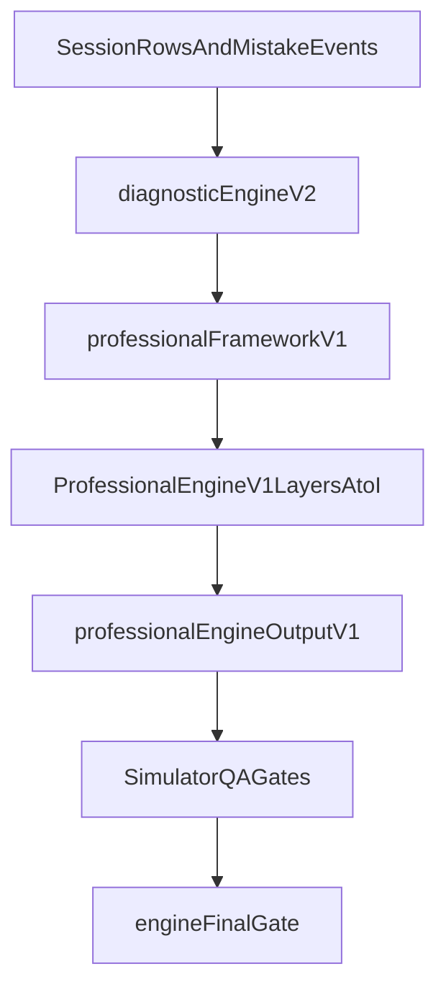

# Final Engine Professionalization Plan

## Scope Lock (Engine-Only)
- Extend existing engine additively; do not rewrite `[c:\Users\ERAN YOSEF\Desktop\final projects\FINAL-WEB\LIOSH-WEB-TRY\utils\diagnostic-engine-v2\run-diagnostic-engine-v2.js](c:\Users\ERAN YOSEF\Desktop\final projects\FINAL-WEB\LIOSH-WEB-TRY\utils\diagnostic-engine-v2\run-diagnostic-engine-v2.js)`.
- Keep all parent-facing wording/UI/PDF behavior unchanged; changes stay internal to engine data and simulator QA.
- Preserve green baseline gates and only add stricter engine gates.

## Current Baseline Integration Points (Confirmed)
- Core engine output is produced by `[c:\Users\ERAN YOSEF\Desktop\final projects\FINAL-WEB\LIOSH-WEB-TRY\utils\diagnostic-engine-v2\run-diagnostic-engine-v2.js](c:\Users\ERAN YOSEF\Desktop\final projects\FINAL-WEB\LIOSH-WEB-TRY\utils\diagnostic-engine-v2\run-diagnostic-engine-v2.js)`.
- Existing professional layer enrichment is in `[c:\Users\ERAN YOSEF\Desktop\final projects\FINAL-WEB\LIOSH-WEB-TRY\utils\learning-diagnostics\diagnostic-framework-v1.js](c:\Users\ERAN YOSEF\Desktop\final projects\FINAL-WEB\LIOSH-WEB-TRY\utils\learning-diagnostics\diagnostic-framework-v1.js)` and attached in report assembly flow.
- QA gate wiring lives in `[c:\Users\ERAN YOSEF\Desktop\final projects\FINAL-WEB\LIOSH-WEB-TRY\package.json](c:\Users\ERAN YOSEF\Desktop\final projects\FINAL-WEB\LIOSH-WEB-TRY\package.json)` and `[c:\Users\ERAN YOSEF\Desktop\final projects\FINAL-WEB\LIOSH-WEB-TRY\scripts\learning-simulator\run-orchestrator.mjs](c:\Users\ERAN YOSEF\Desktop\final projects\FINAL-WEB\LIOSH-WEB-TRY\scripts\learning-simulator\run-orchestrator.mjs)`.

## Execution Strategy (Staged, Safe, Non-Breaking)

### Stage 1 — Foundation + Metadata (Phase A)
- Build standardized metadata helper:
  - `[c:\Users\ERAN YOSEF\Desktop\final projects\FINAL-WEB\LIOSH-WEB-TRY\utils\learning-diagnostics\question-skill-metadata-v1.js](c:\Users\ERAN YOSEF\Desktop\final projects\FINAL-WEB\LIOSH-WEB-TRY\utils\learning-diagnostics\question-skill-metadata-v1.js)`
- Audit question sources and adapters (no behavior break):
  - `[c:\Users\ERAN YOSEF\Desktop\final projects\FINAL-WEB\LIOSH-WEB-TRY\utils\math-question-generator.js](c:\Users\ERAN YOSEF\Desktop\final projects\FINAL-WEB\LIOSH-WEB-TRY\utils\math-question-generator.js)`
  - `[c:\Users\ERAN YOSEF\Desktop\final projects\FINAL-WEB\LIOSH-WEB-TRY\utils\hebrew-question-generator.js](c:\Users\ERAN YOSEF\Desktop\final projects\FINAL-WEB\LIOSH-WEB-TRY\utils\hebrew-question-generator.js)`
  - `[c:\Users\ERAN YOSEF\Desktop\final projects\FINAL-WEB\LIOSH-WEB-TRY\pages\learning\english-master.js](c:\Users\ERAN YOSEF\Desktop\final projects\FINAL-WEB\LIOSH-WEB-TRY\pages\learning\english-master.js)`
  - `[c:\Users\ERAN YOSEF\Desktop\final projects\FINAL-WEB\LIOSH-WEB-TRY\data\science-questions.js](c:\Users\ERAN YOSEF\Desktop\final projects\FINAL-WEB\LIOSH-WEB-TRY\data\science-questions.js)`
  - `[c:\Users\ERAN YOSEF\Desktop\final projects\FINAL-WEB\LIOSH-WEB-TRY\utils\geometry-question-generator.js](c:\Users\ERAN YOSEF\Desktop\final projects\FINAL-WEB\LIOSH-WEB-TRY\utils\geometry-question-generator.js)`
  - `[c:\Users\ERAN YOSEF\Desktop\final projects\FINAL-WEB\LIOSH-WEB-TRY\utils\moledet-geography-question-generator.js](c:\Users\ERAN YOSEF\Desktop\final projects\FINAL-WEB\LIOSH-WEB-TRY\utils\moledet-geography-question-generator.js)`
  - `[c:\Users\ERAN YOSEF\Desktop\final projects\FINAL-WEB\LIOSH-WEB-TRY\scripts\learning-simulator\lib\question-generator-adapters.mjs](c:\Users\ERAN YOSEF\Desktop\final projects\FINAL-WEB\LIOSH-WEB-TRY\scripts\learning-simulator\lib\question-generator-adapters.mjs)`
- Add artifacts:
  - `[c:\Users\ERAN YOSEF\Desktop\final projects\FINAL-WEB\LIOSH-WEB-TRY\reports\learning-simulator\engine-professionalization\question-skill-tagging-audit.md](c:\Users\ERAN YOSEF\Desktop\final projects\FINAL-WEB\LIOSH-WEB-TRY\reports\learning-simulator\engine-professionalization\question-skill-tagging-audit.md)`
  - `[c:\Users\ERAN YOSEF\Desktop\final projects\FINAL-WEB\LIOSH-WEB-TRY\reports\learning-simulator\engine-professionalization\question-skill-tagging-audit.json](c:\Users\ERAN YOSEF\Desktop\final projects\FINAL-WEB\LIOSH-WEB-TRY\reports\learning-simulator\engine-professionalization\question-skill-tagging-audit.json)`
- Add gate runner + script:
  - `[c:\Users\ERAN YOSEF\Desktop\final projects\FINAL-WEB\LIOSH-WEB-TRY\scripts\learning-simulator\run-question-skill-metadata-qa.mjs](c:\Users\ERAN YOSEF\Desktop\final projects\FINAL-WEB\LIOSH-WEB-TRY\scripts\learning-simulator\run-question-skill-metadata-qa.mjs)`
  - `qa:learning-simulator:question-skill-metadata`

Acceptance:
- All six subjects mapped to metadata strategy.
- Missing/unknown metadata is reported explicitly.
- Existing question integrity remains green.

### Stage 2 — Core Diagnostic Intelligence Layers (Phases B-H)
Create new layer modules under `[c:\Users\ERAN YOSEF\Desktop\final projects\FINAL-WEB\LIOSH-WEB-TRY\utils\learning-diagnostics\](c:\Users\ERAN YOSEF\Desktop\final projects\FINAL-WEB\LIOSH-WEB-TRY\utils\learning-diagnostics\)`:
- `misconception-engine-v1.js`
- `mastery-engine-v1.js`
- `dependency-engine-v1.js`
- `calibration-engine-v1.js`
- `reliability-engine-v1.js`
- `probe-engine-v1.js`
- `cross-subject-engine-v1.js`

Integration approach:
- Add additive enrichers orchestrated after existing framework enrichment in report/engine assembly path, reusing `units[]`, `canonicalState`, existing row evidence, and summary counts.
- Do not alter current diagnosis gating semantics; these layers provide structured internal findings plus confidence/reasoning/doNotConclude.

Add per-layer artifact writers in `reports/learning-simulator/engine-professionalization/`:
- `misconception-engine-summary.md/json`
- `mastery-engine-summary.md/json`
- `dependency-engine-summary.md/json`
- `calibration-engine-summary.md/json`
- `reliability-engine-summary.md/json`
- `probe-engine-summary.md/json`
- `cross-subject-engine-summary.md/json`

Add per-layer QA runners:
- `[c:\Users\ERAN YOSEF\Desktop\final projects\FINAL-WEB\LIOSH-WEB-TRY\scripts\learning-simulator\run-misconception-qa.mjs](c:\Users\ERAN YOSEF\Desktop\final projects\FINAL-WEB\LIOSH-WEB-TRY\scripts\learning-simulator\run-misconception-qa.mjs)`
- `[c:\Users\ERAN YOSEF\Desktop\final projects\FINAL-WEB\LIOSH-WEB-TRY\scripts\learning-simulator\run-mastery-qa.mjs](c:\Users\ERAN YOSEF\Desktop\final projects\FINAL-WEB\LIOSH-WEB-TRY\scripts\learning-simulator\run-mastery-qa.mjs)`
- `[c:\Users\ERAN YOSEF\Desktop\final projects\FINAL-WEB\LIOSH-WEB-TRY\scripts\learning-simulator\run-dependency-qa.mjs](c:\Users\ERAN YOSEF\Desktop\final projects\FINAL-WEB\LIOSH-WEB-TRY\scripts\learning-simulator\run-dependency-qa.mjs)`
- `[c:\Users\ERAN YOSEF\Desktop\final projects\FINAL-WEB\LIOSH-WEB-TRY\scripts\learning-simulator\run-calibration-qa.mjs](c:\Users\ERAN YOSEF\Desktop\final projects\FINAL-WEB\LIOSH-WEB-TRY\scripts\learning-simulator\run-calibration-qa.mjs)`
- `[c:\Users\ERAN YOSEF\Desktop\final projects\FINAL-WEB\LIOSH-WEB-TRY\scripts\learning-simulator\run-reliability-qa.mjs](c:\Users\ERAN YOSEF\Desktop\final projects\FINAL-WEB\LIOSH-WEB-TRY\scripts\learning-simulator\run-reliability-qa.mjs)`
- `[c:\Users\ERAN YOSEF\Desktop\final projects\FINAL-WEB\LIOSH-WEB-TRY\scripts\learning-simulator\run-probe-qa.mjs](c:\Users\ERAN YOSEF\Desktop\final projects\FINAL-WEB\LIOSH-WEB-TRY\scripts\learning-simulator\run-probe-qa.mjs)`
- `[c:\Users\ERAN YOSEF\Desktop\final projects\FINAL-WEB\LIOSH-WEB-TRY\scripts\learning-simulator\run-cross-subject-qa.mjs](c:\Users\ERAN YOSEF\Desktop\final projects\FINAL-WEB\LIOSH-WEB-TRY\scripts\learning-simulator\run-cross-subject-qa.mjs)`

Add npm scripts:
- `qa:learning-simulator:misconceptions`
- `qa:learning-simulator:mastery`
- `qa:learning-simulator:dependencies`
- `qa:learning-simulator:calibration`
- `qa:learning-simulator:reliability`
- `qa:learning-simulator:probes`
- `qa:learning-simulator:cross-subject`

Acceptance:
- Structured, cautious evidence-based findings per layer.
- Thin evidence remains low confidence.
- Repeated patterns strengthen confidence; mixed patterns reduce it.
- No clinical labels or claims.

### Stage 3 — Unified Internal Output (Phase I)
- Create:
  - `[c:\Users\ERAN YOSEF\Desktop\final projects\FINAL-WEB\LIOSH-WEB-TRY\utils\learning-diagnostics\professional-engine-output-v1.js](c:\Users\ERAN YOSEF\Desktop\final projects\FINAL-WEB\LIOSH-WEB-TRY\utils\learning-diagnostics\professional-engine-output-v1.js)`
- Attach internal output as additive field:
  - `diagnosticEngineV2.professionalEngineV1`
- Keep existing report rendering behavior unchanged.
- Add QA runner/script:
  - `[c:\Users\ERAN YOSEF\Desktop\final projects\FINAL-WEB\LIOSH-WEB-TRY\scripts\learning-simulator\run-professional-engine-output-qa.mjs](c:\Users\ERAN YOSEF\Desktop\final projects\FINAL-WEB\LIOSH-WEB-TRY\scripts\learning-simulator\run-professional-engine-output-qa.mjs)`
  - `qa:learning-simulator:professional-engine-output`

Acceptance:
- All layer outputs present and enum-valid.
- Every finding includes evidence, confidence, reasoning, and doNotConclude.
- Unsupported subject/data conditions fail safely (no crash).

### Stage 4 — Real + Synthetic Validation (Phase J)
- Extend validation harness/scenario expectations in existing simulator QA libs:
  - `[c:\Users\ERAN YOSEF\Desktop\final projects\FINAL-WEB\LIOSH-WEB-TRY\scripts\learning-simulator\lib\engine-truth-golden.mjs](c:\Users\ERAN YOSEF\Desktop\final projects\FINAL-WEB\LIOSH-WEB-TRY\scripts\learning-simulator\lib\engine-truth-golden.mjs)`
  - `[c:\Users\ERAN YOSEF\Desktop\final projects\FINAL-WEB\LIOSH-WEB-TRY\scripts\learning-simulator\lib\profile-library.mjs](c:\Users\ERAN YOSEF\Desktop\final projects\FINAL-WEB\LIOSH-WEB-TRY\scripts\learning-simulator\lib\profile-library.mjs)`
  - `[c:\Users\ERAN YOSEF\Desktop\final projects\FINAL-WEB\LIOSH-WEB-TRY\scripts\learning-simulator\lib\behavior-oracle.mjs](c:\Users\ERAN YOSEF\Desktop\final projects\FINAL-WEB\LIOSH-WEB-TRY\scripts\learning-simulator\lib\behavior-oracle.mjs)`
- Add new runner/script:
  - `[c:\Users\ERAN YOSEF\Desktop\final projects\FINAL-WEB\LIOSH-WEB-TRY\scripts\learning-simulator\run-professional-engine-validation.mjs](c:\Users\ERAN YOSEF\Desktop\final projects\FINAL-WEB\LIOSH-WEB-TRY\scripts\learning-simulator\run-professional-engine-validation.mjs)`
  - `qa:learning-simulator:professional-engine`
- Add artifacts:
  - `[c:\Users\ERAN YOSEF\Desktop\final projects\FINAL-WEB\LIOSH-WEB-TRY\reports\learning-simulator\engine-professionalization\professional-engine-validation.md](c:\Users\ERAN YOSEF\Desktop\final projects\FINAL-WEB\LIOSH-WEB-TRY\reports\learning-simulator\engine-professionalization\professional-engine-validation.md)`
  - `[c:\Users\ERAN YOSEF\Desktop\final projects\FINAL-WEB\LIOSH-WEB-TRY\reports\learning-simulator\engine-professionalization\professional-engine-validation.json](c:\Users\ERAN YOSEF\Desktop\final projects\FINAL-WEB\LIOSH-WEB-TRY\reports\learning-simulator\engine-professionalization\professional-engine-validation.json)`

Acceptance:
- Required real/synthetic scenarios pass.
- Topic-vs-subject distinction preserved.
- Uncertainty produces probes, not overconfident conclusions.

### Stage 5 — Final Engine Gate + Orchestrator Wiring (Phase K)
- Add final gate runner/script:
  - `[c:\Users\ERAN YOSEF\Desktop\final projects\FINAL-WEB\LIOSH-WEB-TRY\scripts\learning-simulator\run-engine-final-gate.mjs](c:\Users\ERAN YOSEF\Desktop\final projects\FINAL-WEB\LIOSH-WEB-TRY\scripts\learning-simulator\run-engine-final-gate.mjs)`
  - `qa:learning-simulator:engine-final`
- Update orchestration in:
  - `[c:\Users\ERAN YOSEF\Desktop\final projects\FINAL-WEB\LIOSH-WEB-TRY\scripts\learning-simulator\run-orchestrator.mjs](c:\Users\ERAN YOSEF\Desktop\final projects\FINAL-WEB\LIOSH-WEB-TRY\scripts\learning-simulator\run-orchestrator.mjs)`
  - Place new professional engine layer gates after `engineTruth` and before deep/release suffix checks.
- Add final artifacts:
  - `[c:\Users\ERAN YOSEF\Desktop\final projects\FINAL-WEB\LIOSH-WEB-TRY\reports\learning-simulator\engine-professionalization\engine-final-summary.md](c:\Users\ERAN YOSEF\Desktop\final projects\FINAL-WEB\LIOSH-WEB-TRY\reports\learning-simulator\engine-professionalization\engine-final-summary.md)`
  - `[c:\Users\ERAN YOSEF\Desktop\final projects\FINAL-WEB\LIOSH-WEB-TRY\reports\learning-simulator\engine-professionalization\engine-final-summary.json](c:\Users\ERAN YOSEF\Desktop\final projects\FINAL-WEB\LIOSH-WEB-TRY\reports\learning-simulator\engine-professionalization\engine-final-summary.json)`

Acceptance:
- `engineFinalStatus === PASS`
- all six subjects covered
- all layers active
- build/release remain green
- no parent-facing/UI/PDF/Hebrew copy changes

## File Change Set (Exact Target List)
- Engine layers and helpers:
  - `utils/learning-diagnostics/question-skill-metadata-v1.js`
  - `utils/learning-diagnostics/misconception-engine-v1.js`
  - `utils/learning-diagnostics/mastery-engine-v1.js`
  - `utils/learning-diagnostics/dependency-engine-v1.js`
  - `utils/learning-diagnostics/calibration-engine-v1.js`
  - `utils/learning-diagnostics/reliability-engine-v1.js`
  - `utils/learning-diagnostics/probe-engine-v1.js`
  - `utils/learning-diagnostics/cross-subject-engine-v1.js`
  - `utils/learning-diagnostics/professional-engine-output-v1.js`
- Existing integration points:
  - `utils/learning-diagnostics/diagnostic-framework-v1.js`
  - report assembly integration file where `enrichDiagnosticEngineV2WithProfessionalFrameworkV1` is currently applied
- QA runners:
  - `scripts/learning-simulator/run-question-skill-metadata-qa.mjs`
  - `scripts/learning-simulator/run-misconception-qa.mjs`
  - `scripts/learning-simulator/run-mastery-qa.mjs`
  - `scripts/learning-simulator/run-dependency-qa.mjs`
  - `scripts/learning-simulator/run-calibration-qa.mjs`
  - `scripts/learning-simulator/run-reliability-qa.mjs`
  - `scripts/learning-simulator/run-probe-qa.mjs`
  - `scripts/learning-simulator/run-cross-subject-qa.mjs`
  - `scripts/learning-simulator/run-professional-engine-output-qa.mjs`
  - `scripts/learning-simulator/run-professional-engine-validation.mjs`
  - `scripts/learning-simulator/run-engine-final-gate.mjs`
- QA harness extensions:
  - `scripts/learning-simulator/lib/engine-truth-golden.mjs`
  - related `lib/*` scenario/oracle files used by engine truth and behavior assertions
- Command wiring:
  - `package.json`
  - `scripts/learning-simulator/run-orchestrator.mjs`
- Artifacts folder:
  - `reports/learning-simulator/engine-professionalization/*`

## Required Verification Order
- Run all new individual gates first:
  - `npm run qa:learning-simulator:question-skill-metadata`
  - `npm run qa:learning-simulator:misconceptions`
  - `npm run qa:learning-simulator:mastery`
  - `npm run qa:learning-simulator:dependencies`
  - `npm run qa:learning-simulator:calibration`
  - `npm run qa:learning-simulator:reliability`
  - `npm run qa:learning-simulator:probes`
  - `npm run qa:learning-simulator:cross-subject`
  - `npm run qa:learning-simulator:professional-engine-output`
  - `npm run qa:learning-simulator:professional-engine`
- Then run final required top-level sequence:
  - `npm run qa:learning-simulator:engine-final`
  - `npm run qa:learning-simulator:engine`
  - `npm run qa:learning-simulator:release`
  - `npm run build`

## Final Delivery Contract
- Produce final engine report with exactly the 18 sections requested by you (files created/changed, each layer status, command pass/fail, limitations, safety-to-move decision, explicit confirmation of no parent-facing changes).
- If any gate fails, keep closure status as not ready and document blockers in `knownLimitations` and `requiresHumanExpertReview`.
