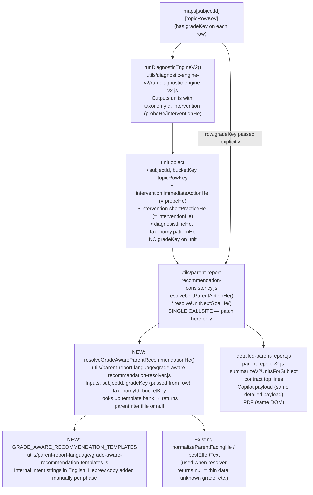

# Grade-Aware Recommendation Resolver — Implementation Plan

## Confirmed no source changes for this planning task

---

## 1. Architecture

### Core insight from research

`row.gradeKey` **exists on map rows before `runDiagnosticEngineV2` is called** (set in `buildRowSummary` / `collapseTopicRowsToCanonicalTopicEntity` in `utils/parent-report-v2.js` ~line 502). However, `runDiagnosticEngineV2` iterates `maps[subjectId][topicRowKey]` but **never reads `row.gradeKey`** when selecting taxonomy or calling `buildInterventionPlan`. The grade is available in the data pipeline; it is simply not wired into the text selection step.

The `unit` object emitted by the engine contains `subjectId`, `bucketKey`, `topicRowKey`, and the chosen taxonomy strings — but no `gradeKey`. Grade is on the **input row**, not on the unit.

### Architecture decision: resolver wrapper (not taxonomy row changes)

Taxonomy rows remain internal analytics and diagnostic records. A new **grade-aware parent recommendation resolver** sits between unit output and the parent-facing string functions.



### Exact insertion boundary

**`utils/parent-report-recommendation-consistency.js`** — `resolveUnitParentActionHe()` and `resolveUnitNextGoalHe()` are the **single point** where `unit.intervention.immediateActionHe` and `unit.intervention.shortPracticeHe` become parent-facing strings. The caller (`summarizeV2UnitsForSubject` in `parent-report-v2.js` ~line 1374, and `buildSubjectProfiles` in `detailed-parent-report.js`) already receives both the unit and the topic-map row (which carries `gradeKey`). Passing `gradeKey` to the resolver from here is a **minimal, safe change**.

### What stays internal

All `TaxonomyRow` fields (`patternHe`, `probeHe`, `interventionHe`, `subskillHe`, `rootsHe`, `competitorsHe`, `doNotConcludeHe`, escalation English tokens) remain engine-internal. They must **never** be passed verbatim to parent-facing copy functions after Phase 1 implements the resolver.

---

## 2. Data inputs

| Input | Available today | Source | Reliability | Phase 1 | Later |
|---|---|---|---|---|---|
| `subjectId` | yes | `unit.subjectId` | high | yes | yes |
| `gradeKey` (g1–g6) | yes — on row, not on unit | `maps[sid][trk].gradeKey` (set by `buildRowSummary`) | high for math; partial for non-math (depends on session grade) | yes | yes |
| `bucketKey` | yes | `unit.bucketKey` | high | yes | yes |
| `taxonomyId` | yes | `unit.diagnosis.taxonomyId` or `unit.intervention.taxonomyId` | high when matched; null when no taxonomy match | yes | yes |
| `topicRowKey` | yes | `unit.topicRowKey` | high | partial (grade embedded in key for math) | yes |
| `levelKey` | yes — on row | `maps[sid][trk].levelKey` | high for math (mode-grade-level key); partial for others | no | yes |
| `subskillKey` / `subskillHe` | yes — internal only | `unit.taxonomy.subskillHe` | medium | no | phase 2+ |
| `questionType` / item template | no | not stored on row today | n/a | no | future |
| `expectedErrorTypes` | partial | `unit.taxonomy.observableMarkersHe` (internal) | internal only | no | future |
| `cognitiveLevel` | partial | question metadata field `cognitiveLevel` where present | low (partial metadata coverage) | no | future |
| `magnitudeBand` / digit count | no | not derived today | n/a | no | future |
| `mode` | yes — on row | `maps[sid][trk].modeKey` | high | no | yes |
| `recurrence counts` | yes | `unit.recurrence.wrongCountForRules`, `wrongEventCount` | high | no | phase 2+ |

**Phase 1 inputs required:** `subjectId`, `gradeKey`, `bucketKey`, `taxonomyId`. No new data collection needed.

---

## 3. Phase breakdown

### Phase 0 — Safety architecture and test infrastructure only

**Scope:**
- Create `utils/parent-report-language/grade-aware-recommendation-templates.js`: empty structure, all entries `textHe: null`, stable keys, grade bands, `intentDescriptionEn` comments, `TODO` blocks. No Hebrew copy.
- Create `utils/parent-report-language/grade-aware-recommendation-resolver.js`: function signature only — always returns `null` for every input. No logic, no call-site wiring.
- Export both from `utils/parent-report-language/index.js`.
- Create `scripts/parent-report-grade-aware-recommendation-selftest.mjs`: **all tests must be green in Phase 0**. Tests assert:
  - Resolver returns `null` for every known `(subjectId, gradeKey, taxonomyId)` triple.
  - Resolver returns `null` for `null` gradeKey, empty string gradeKey, unknown taxonomyId.
  - Templates file is parseable and every `textHe` entry is `null` (no accidental copy leak).
- Add a **pending-fix manifest entry** in the selftest (a plain `console.log` comment block or a non-asserting `TODO` list in the file) documenting that M-09 / grade 4 must be fixed in Phase 1. This is documentation only — it does not throw or fail.
- Create `scripts/parent-report-grade-aware-coverage-manifest.mjs`: reads all six `taxonomy-*.js` files, enumerates every taxonomy id, and emits a JSON/Markdown coverage table with status `covered_by_template`, `pending_manual_hebrew`, or `not_parent_facing`. In Phase 0 every id is `pending_manual_hebrew` (no templates filled yet). Script must exit 0. Does not enforce coverage; only reports it.
- Add a section to `docs/PARENT_REPORT_HEBREW_STYLE_GUIDE.md` for the grade-aware banned-phrase registry (M-09 / g3–g6 entry as first example).
- No call-site wiring. No product report output changes.

**Files changed:**
- `utils/parent-report-language/grade-aware-recommendation-templates.js` (new)
- `utils/parent-report-language/grade-aware-recommendation-resolver.js` (new)
- `utils/parent-report-language/index.js` (add exports)
- `scripts/parent-report-grade-aware-recommendation-selftest.mjs` (new)
- `scripts/parent-report-grade-aware-coverage-manifest.mjs` (new)
- `docs/PARENT_REPORT_HEBREW_STYLE_GUIDE.md` (add banned-phrase registry section)

**Risk:** Low (no production paths changed, no diagnostic engine touched)

**Acceptance criteria (all must pass before Phase 1 starts):**
- No product-visible Hebrew text changes.
- No report output changes (short report, detailed report, PDF, Copilot payload identical to before).
- No taxonomy files changed.
- No diagnostic engine files changed (`intervention-layer.js`, `taxonomy-*.js`, `run-diagnostic-engine-v2.js`).
- All existing selftests pass: `parent-report-insights-selftest.mjs` 67/67, `parent-report-phase1-selftest.mjs`, all `npm test` or CI commands.
- New selftest `parent-report-grade-aware-recommendation-selftest.mjs` runs and is fully green.
- Coverage manifest script runs and exits 0; outputs a table showing all taxonomy ids as `pending_manual_hebrew`.
- Feature flag `ENABLE_GRADE_AWARE_RECOMMENDATIONS` defaults to `false` (any call-site prep must short-circuit when flag is off).

**Rollback:** Remove `utils/parent-report-language/grade-aware-recommendation-templates.js` and `grade-aware-recommendation-resolver.js`; revert `utils/parent-report-language/index.js` export additions; delete `scripts/parent-report-grade-aware-recommendation-selftest.mjs` and `scripts/parent-report-grade-aware-coverage-manifest.mjs`; revert `docs/PARENT_REPORT_HEBREW_STYLE_GUIDE.md` section 11; delete generated `reports/parent-report-grade-aware-coverage-manifest.json` and `reports/parent-report-grade-aware-coverage-manifest.md` if present.

---

### Phase 1 — Math subtraction (M-09) and addition (M-02) only

**Scope:**
- Fill `grade-aware-recommendation-templates.js` with grade-banded intents for:
  - `math:subtraction` (taxonomy M-09): g1–g2 / g3–g4 / g5–g6
  - `math:addition` (taxonomy M-02): g1–g2 / g3–g4 / g5–g6
- **Hebrew copy must be provided manually** — no AI-invented copy; templates have `intentDescriptionEn` (design) and `textHe: null` placeholders until editorial sign-off
- Wire resolver at `resolveUnitParentActionHe` and `resolveUnitNextGoalHe` in `utils/parent-report-recommendation-consistency.js`; pass `gradeKey` from caller
- Callers to update: `summarizeV2UnitsForSubject` in `parent-report-v2.js`, `buildSubjectProfiles` in `detailed-parent-report.js`
- Resolver returns `null` for any template that has no approved Hebrew yet (falls back to existing normalizer)
- **Banned phrase assertion test turns green** for M-09 grade 4

**Files likely changed:**
- `utils/parent-report-language/grade-aware-recommendation-templates.js` — math add/sub entries
- `utils/parent-report-language/grade-aware-recommendation-resolver.js` — lookup logic
- `utils/parent-report-recommendation-consistency.js` — pass `gradeKey` to resolver
- `utils/parent-report-v2.js` — pass `gradeKey` to `resolveUnit*` calls
- `utils/detailed-parent-report.js` — same
- `scripts/parent-report-grade-aware-recommendation-selftest.mjs` — tests go green for M-09 g4

**Risk:** Medium. The resolver is on the critical path for `doNowHe` / parent action. Use feature-flag env var `ENABLE_GRADE_AWARE_RECOMMENDATIONS=true` to limit blast radius.

**Test plan:**
- Unit: `resolveGradeAwareParentRecommendationHe("math", "g4", "M-09", "subtraction")` returns grade-appropriate Hebrew (not "ציר + סימבולי")
- Unit: `resolveGradeAwareParentRecommendationHe("math", "g1", "M-09", "subtraction")` returns grade 1–2 intent
- Unit: resolver returns `null` (not empty string) when grade is unknown → falls back gracefully
- Integration: run `node scripts/parent-report-insights-selftest.mjs` (67/67)
- Integration: run phase1 selftest
- Snapshot: rendered report for a grade 4 subtraction row must not contain "ציר + סימבולי"

**Acceptance:** «ציר + סימבולי» does not appear parent-facing for g3–g6; grade 1–2 gets appropriate concrete-first wording; all prior tests pass.

**Rollback:** Set `ENABLE_GRADE_AWARE_RECOMMENDATIONS=false`; resolver short-circuits to `null` restoring prior behavior.

---

### Phase 2 — Remaining math taxonomy rows (M-01, M-03 through M-10)

**Scope:** Add grade-banded intents for all other math buckets in `grade-aware-recommendation-templates.js`. Hebrew copy provided manually.

**Files:** `grade-aware-recommendation-templates.js` only (resolver logic unchanged).

**Risk:** Low (templates only; resolver already wired)

**Acceptance:** All 10 math taxonomy ids return grade-appropriate text; no raw `patternHe` / `probeHe` / `interventionHe` strings leak to parents for math.

---

### Phase 3 — Geometry (G-01 through G-08)

**Scope:** Geometry grade bands: g3–g4 (basic shapes / area / perimeter) vs g5–g6 (volume / pythagoras / advanced transformations). Hebrew copy provided manually.

**Risk:** Low

---

### Phase 4 — Hebrew and English language recommendations (H-01 through H-08, E-01 through E-08)

**Scope:** Grade-banded intents for language subjects. Extra priority: removing English tokens from `patternHe` / `subskillHe` that currently embed in diagnosis lines for English subject.

**Files:** Templates + possibly a `diagnosisLineEnglishTokenFilter` helper in `parent-facing-normalize-he.js` to clean `subskillHe: "collocation"` type strings.

**Risk:** Medium (diagnosis line cleanup touches `run-diagnostic-engine-v2.js` diagnosis string builder or normalizer)

---

### Phase 5 — Science and Moledet/Geography (S-01 through S-08, MG-01 through MG-08)

**Scope:** Grade-banded intents. Science grade bands: g1–g2 (observation/concrete) vs g3–g4 (classification/experimentation) vs g5–g6 (systems/evidence).

**Risk:** Low

---

### Phase 6 — Copilot grounding filter / prompt guard

**Scope:** Audit whether `nar.action` / `nar.observation` slots in the truth packet (used by `llm-orchestrator.js`) are built from `immediateActionHe` / `shortPracticeHe`. If so, the Copilot LLM prompt may echo grade-agnostic strings even after Phase 1–5. Add a truth-packet assembly guard that routes through the resolver before populating narrative action slots.

**Files:** Depends on truth-packet builder location (investigate in implementation prep)

**Risk:** Medium (touches Copilot path, requires careful output testing)

---

### Phase 7 — Rendered corpus QA and PDF verification

**Scope:**
- Run `scripts/parent-report-rendered-product-snapshots.mjs` for all 6 subjects × 6 grades × short/detailed profiles
- Run `scripts/learning-simulator/run-pdf-export-gate.mjs` — add extraction check that "ציר + סימבולי" and banned internal terms not in PDF text
- Run `scripts/parent-report-narrative-safety-selftest.mjs`
- Hebrew copy final sign-off across all phases

**Risk:** Low (verification only; no new logic changes)

---

## 4. File change map

| File | Why | Phase | Layer |
|---|---|---|---|
| `utils/parent-report-language/grade-aware-recommendation-templates.js` | New template bank (intents keyed by subject, gradeBand, taxonomyId) | 0 | display / copy |
| `utils/parent-report-language/grade-aware-recommendation-resolver.js` | New resolver function | 0 | display / copy |
| `utils/parent-report-language/index.js` | Export resolver + templates | 0 | display |
| `utils/parent-report-recommendation-consistency.js` | Wire gradeKey → resolver before `bestEffortText` fallback | 1 | display |
| `utils/parent-report-v2.js` | Pass `row.gradeKey` to `resolveUnit*` calls | 1 | payload builder |
| `utils/detailed-parent-report.js` | Same — pass `gradeKey` to `resolveUnit*` | 1 | payload builder |
| `utils/parent-report-language/parent-facing-normalize-he.js` | Phase 4: add English token filter for `subskillHe`-derived diagnosis lines | 4 | display normalizer |
| `utils/diagnostic-engine-v2/intervention-layer.js` | **Do not change** — keep as internal; resolver gates output | — | core diagnostic |
| `utils/diagnostic-engine-v2/taxonomy-*.js` | **Do not change** — internal analytics only | — | core diagnostic |
| `utils/diagnostic-engine-v2/run-diagnostic-engine-v2.js` | **Do not change** | — | core diagnostic |
| `utils/topic-next-step-engine.js` | **No change needed** — step decisions (gradeKey already used there) are separate from taxonomy text | — | recommendation logic |
| `utils/contracts/parent-product-contract-v1.js` | Low risk: `doNowHe` flows in from `resolveUnitParentActionHe` — no direct change unless upstream covers it | later | contract display |
| `components/parent-report-topic-explain-row.jsx` | `parentFacingEngineLine` will receive cleaner input; no change required unless tests reveal residual leaks | 7 | UI display |
| `lib/parent-copilot/copilot-turn-payload.server.js` | Phase 6 (depends on truth-packet investigation) | 6 | Copilot grounding |
| `scripts/parent-report-grade-aware-recommendation-selftest.mjs` | New test file | 0 | tests |
| `docs/PARENT_REPORT_HEBREW_STYLE_GUIDE.md` | Add grade-aware banned-phrase registry section | 0 | governance |

---

## 5. Hebrew copy governance

### Where templates live
`utils/parent-report-language/grade-aware-recommendation-templates.js`

### Template key structure
```
{
  [subjectId]: {
    [taxonomyId]: {
      gradeBands: {
        "g1_g2": { textHe: null, intentDescriptionEn: "..." },
        "g3_g4": { textHe: null, intentDescriptionEn: "..." },
        "g5_g6": { textHe: null, intentDescriptionEn: "..." }
      },
      fallback: { textHe: null, intentDescriptionEn: "grade-agnostic fallback" }
    }
  }
}
```

Hebrew copy slots start as `null`. **Resolver returns `null` when `textHe === null`**; caller falls back to existing `normalizeParentFacingHe`. Hebrew is never invented by Cursor; it is filled manually and committed after editorial sign-off per phase.

### Preventing raw taxonomy strings leaking

- `buildInterventionPlan` output (`immediateActionHe`, `shortPracticeHe`) is used only through `resolveUnitParentActionHe` / `resolveUnitNextGoalHe`
- Those functions call the resolver **first**; they only fall back to `bestEffortText(unit.intervention.immediateActionHe)` when resolver returns `null`
- Phase 1 acceptance criterion: `unit.intervention.immediateActionHe` value of "ציר + סימבולי" must NOT reach the parent-facing string for g3–g6

### Internal-only marker

`utils/parent-report-language/forbidden-terms.js` already exports `FORBIDDEN_PARENT_REPORT_SUBSTRINGS`. Add the engine shorthand phrases (per-phase) to that list after their grade-aware replacements are approved.

`utils/parent-narrative-safety/parent-report-text-extractor.js` already collects parent-surface strings — wire it into the selftest to scan for any newly banned terms.

### Test for banned phrases

`scripts/parent-report-grade-aware-recommendation-selftest.mjs` must assert:
- For each `(subjectId, gradeKey, taxonomyId)` triple that has an approved template, the output does NOT match `FORBIDDEN_PARENT_REPORT_SUBSTRINGS`
- For M-09 + any grade ≥ g3: output does not contain "ציר + סימבולי" or "ציר + מרחק"
- For M-01: output does not contain "מניפולציה"
- For M-04: output does not contain "קונקרטי" (at least for g4+)

---

## 6. Product definitions

| Term | Definition |
|---|---|
| **Internal diagnostic taxonomy** | `TaxonomyRow` fields (`patternHe`, `probeHe`, `interventionHe`, `subskillHe`, etc.). Engine-only, never parent-facing after Phase 1. |
| **Parent-facing recommendation** | `textHe` from `GRADE_AWARE_RECOMMENDATION_TEMPLATES`, approved editorially. Short (1–2 sentences), actionable, grade-appropriate. |
| **Grade-aware intent** | `intentDescriptionEn` in template — captures pedagogical direction without being final Hebrew. Authors Hebrew from this. |
| **Evidence** | `unit.recurrence.wrongCountForRules`, `unit.confidence.level`, dataSufficiency — shown to parent as "how certain we are", not as raw counts. |
| **Fallback behavior** | When `textHe === null` (no approved copy yet) or `gradeKey` is unknown: resolver returns `null`; `resolveUnitParentActionHe` falls back to existing `normalizeParentFacingHe(bestEffortText(unit.intervention.immediateActionHe))`. Thin-data path: existing `topicRecommendationV2CautionGatedHe()` is unchanged. |

---

## 7. Test coverage

| Test | File | Phase |
|---|---|---|
| Resolver returns `null` for unknown grade | `grade-aware-recommendation-selftest.mjs` | 0 — green |
| Resolver returns `null` for null gradeKey | same | 0 — green |
| Resolver returns `null` for empty string gradeKey | same | 0 — green |
| Resolver returns `null` for unknown taxonomyId | same | 0 — green |
| Every `textHe` entry in templates is `null` (no accidental copy leak) | same | 0 — green |
| Coverage manifest exits 0; all ids listed as `pending_manual_hebrew` | `grade-aware-coverage-manifest.mjs` | 0 — green |
| `parent-report-insights-selftest.mjs` 67/67 passes | existing | every phase |
| `parent-report-phase1-selftest.mjs` passes | existing | every phase |
| M-09 g2 returns concrete-first `textHe` (when copy approved) | `grade-aware-recommendation-selftest.mjs` | 1 — green |
| M-09 g4 does NOT return "ציר + סימבולי" (when copy approved) | same | 1 — green |
| M-09 g6 returns estimation-aware `textHe` (when copy approved) | same | 1 — green |
| M-02 g2 vs g4 vs g6 returns different `textHe` (when copy approved) | same | 1 — green |
| Coverage manifest shows M-02 + M-09 as `covered_by_template` | `grade-aware-coverage-manifest.mjs` | 1 |
| Raw English tokens not in parent output for English subject (diagnosis lines) | `grade-aware-recommendation-selftest.mjs` | 4 — green |
| Snapshot: rendered report g4 subtraction no "ציר + סימבולי" | `grade-aware-recommendation-selftest.mjs` or `run-parent-report-review-pack.mjs` | 1 — green |
| PDF text extraction: no banned phrases | `run-pdf-export-gate.mjs` (extend) | 7 |
| Copilot FACTS_JSON: no banned phrases | `parent-copilot-recommendation-semantic-suite.mjs` (extend) | 6 |

---

## 8. Risk analysis

| Risk | Mitigation |
|---|---|
| Changing recommendation copy but not Copilot grounding | Phase 6 explicitly audits truth-packet / narrative-slot assembly; feature-flag allows staging |
| Changing detailed report but not short report | Both go through `resolveUnitParentActionHe` — same resolver; checked in selftest with both short and detailed report fixtures |
| Resolver running too late (after normalizer already ran) | Resolver sits at `resolveUnitParentActionHe`, which is upstream of `normalizeParentFacingHe`; the fallback only passes through normalizer if resolver returns null |
| Missing grade context (gradeKey null on row) | Resolver returns `null` on null gradeKey; falls back to existing behavior; no regression |
| Wrong fallback for thin data | Thin data path (`topicRecommendationV2CautionGatedHe`) is bypassed before resolver is called (existing gating check); no change to that path |
| Breaking existing tests | Feature-flag env var gates new behavior; existing tests run with flag off until Phase 1 is validated |
| Making Hebrew clear but pedagogically wrong | Hebrew is `null` (returns null → fallback) until editorial manually approves `textHe`; Cursor never writes final Hebrew copy |

---

## 9. Implementation recommendation

**Recommended approach: wrapper resolver (Option B), not taxonomy row changes.**

Reasons:
- Taxonomy rows serve as analytics anchors and scientific records; changing them creates diff drift and risks breaking diagnostic confidence scoring
- The resolver boundary (`resolveUnitParentActionHe`) is narrow, testable, and already the single place that converts internal taxonomy strings to parent copy
- `gradeKey` is already on map rows; no new data pipeline required for Phase 1
- `textHe: null` template slots mean zero regression risk — the resolver silently falls back until copy is approved

**Safest first code step (Phase 0) — all CI green, no intentionally failing tests:**
1. Create `utils/parent-report-language/grade-aware-recommendation-templates.js` — empty structure, all `textHe: null`
2. Create `utils/parent-report-language/grade-aware-recommendation-resolver.js` — always returns `null`
3. Export both from `utils/parent-report-language/index.js`
4. Create `scripts/parent-report-grade-aware-recommendation-selftest.mjs` — all tests fully green (resolver returns null, templates are null, manifest exits 0)
5. Create `scripts/parent-report-grade-aware-coverage-manifest.mjs` — scans taxonomy ids, outputs coverage table, exits 0
6. Add pending-fix documentation comment in selftest (not an assertion — documents M-09/g4 as Phase 1 target)
7. Confirm all existing tests still pass

**Do not** change `intervention-layer.js`, any `taxonomy-*.js`, or `run-diagnostic-engine-v2.js` — those are internal and must stay untouched.

**Cursor does not author final Hebrew copy.** All `textHe` fields start as `null` and are filled manually after editorial sign-off, per phase. Cursor may only add keys, grade-band stubs, `intentDescriptionEn` labels, and `TODO` comments.
