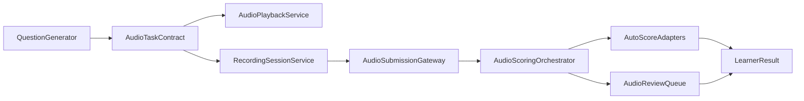

# Hebrew Audio / Recording Execution Plan (Hebrew-first, English-ready)

## A. Current gap

- Existing runtime supports only UI/game SFX playback via [`hooks/useSound.js`](hooks/useSound.js) and `/public/sounds`, not pedagogical listening/recording tasks.
- Hebrew generation path [`utils/hebrew-question-generator.js`](utils/hebrew-question-generator.js) returns text/choice/typing only; no per-item `audio`, recording contract, or STT artifacts.
- Hebrew grade maps [`data/hebrew-g1-content-map.js`](data/hebrew-g1-content-map.js) … [`data/hebrew-g6-content-map.js`](data/hebrew-g6-content-map.js) carry `audio: "off"` placeholders but these are not runtime-enforced by UI flows.
- Missing capabilities today:
  - listening tasks
  - oral discrimination
  - phonological awareness with sound
  - spoken response / guided recording
  - read aloud
  - speaking assessment
  - audio-driven comprehension
  - recording capture/upload/review flow
- No mic permission orchestration, capture fallback, or audio scoring/review pipeline exists in current learning pages.

## B. Scope definition

### 1) Shared platform scope (build once)

- **Question media contract**: add shared optional audio block (`playback`, `recording`, `scoringHints`) to the normalized question shape used by subject generators.
- **Playback runtime**: common audio player service/component (play/pause/replay count/speed controls/captions/transcript toggle).
- **Recording runtime**: shared mic permission + capture state machine (idle/requesting/recording/review/uploaded/failed).
- **Permission/fallback policy**: standard blocked-mic behavior (degraded non-recording alternative where valid, or “cannot complete” gate where recording is mandatory).
- **Storage model**: shared recording metadata contract (attempt id, locale, duration, asset key, consent flags) and upload abstraction (local temp + remote object storage).
- **Review model**: shared manual-review queue model for borderline or non-auto-scorable speaking tasks.
- **Scoring hooks**: common interface for auto-score adapters (MCQ, transcript rules, keyword rules, future pronunciation engines).
- **Cross-device handling**: browser/mobile support matrix and feature detection policy.
- **Asset model**: canonical audio prompt registry (subject/grade/domain/task/item id -> asset URI + checksum + duration + transcript).

### 2) Hebrew scope now

- Launch Hebrew listening + recording task families only.
- Enable Hebrew phonological/audio tasks (first sound, rhyme, syllables, read aloud short forms).
- Add Hebrew spoken response paths for constrained prompts and guided recording.
- Add Hebrew audio comprehension (listen then answer MCQ/constrained response).
- Keep high-risk free speech grading human-reviewed by default.

### 3) Future English-ready scope

- Keep shared contracts locale-agnostic (`language`, `locale`, `phonologyProfile`, `scoringAdapter`).
- Support future English task modes without refactor:
  - phonics listening/minimal pairs
  - repeat-after-audio
  - pronunciation path
  - oral comprehension path
  - reusable recording submission + review
  - shared validation/error taxonomy.

## C. Exact grade/domain map (Hebrew now + English reuse)

### g1/g2

- **reading**: first-sound identification, rhyme discrimination, syllable count by audio, listen-and-choose letter/word; reusable for English phonics with different phoneme inventory.
- **comprehension**: listen to short sentence/storylet + MCQ detail retrieval; reusable for English oral comprehension.
- **writing**: dictated word/short phrase choose-or-type (low-risk constrained); English reusable for spelling-from-audio.
- **grammar**: choose correct sentence/punctuation after hearing utterance; reusable for English grammar listening contrasts.
- **vocabulary**: word-to-picture/audio cue mapping; reusable for English vocabulary listening.
- **speaking**: guided repeat + short prompted recording (must be constrained); reusable for English repeat-after-audio.
- **Not age/product fit**: open-ended long recordings and auto pronunciation scoring at this band.
- **Priority**: listening MCQ + constrained recording only.

### g3/g4

- **reading**: read-aloud short sentences, fluency snippets; English reusable with grade text packs.
- **comprehension**: audio paragraphs + inference/detail MCQ; reusable.
- **writing**: dictated sentence with constrained validation; reusable.
- **grammar**: tense/agreement recognition from spoken prompts; reusable with locale rules.
- **vocabulary**: context-clue by audio; reusable.
- **speaking**: short structured oral response (keyword/rubric assisted); reusable.
- **Not fit now**: fully automatic speaking grade as final authority.
- **Priority**: comprehension audio + read-aloud capture.

### g5/g6

- **reading**: read-aloud paragraph and expression cues.
- **comprehension**: multi-step oral comprehension with note-based MCQ.
- **writing**: dictation with punctuation/structure constraints.
- **grammar**: register/complex syntax discrimination by audio.
- **vocabulary**: synonym/nuance through spoken context.
- **speaking**: guided monologue/dialogue completion recording.
- **Not fit now**: high-stakes auto pronunciation-only pass/fail.
- **Priority**: robust recording + review workflows, richer rubrics.

## D. Exact task taxonomy

- **Shared tasks**
  - `listen_and_choose` (g1-g6, reading/comprehension/vocabulary) — answer mode MCQ; UX: playback controls + replay cap; difficulty low; risk low.
  - `oral_comprehension_mcq` (g2-g6, comprehension) — MCQ; UX transcript toggle policy; difficulty medium; risk low.
  - `guided_recording` (g1-g6, speaking/writing) — short recording; UX permission/capture/re-record/upload; difficulty medium; risk medium.
  - `read_aloud` (g2-g6, reading) — recording; UX inline script + timer; difficulty medium-high; risk medium-high.
- **Hebrew-specific tasks**
  - `hear_first_sound_he` (g1-g2, reading) — MCQ; UX minimal audio loops; difficulty medium; risk medium (phonology confusion).
  - `rhyme_discrimination_he` (g1-g2, reading) — MCQ; UX A/B audio comparison; difficulty medium; risk medium.
  - `syllable_count_audio_he` (g1-g2, reading) — constrained choice; UX segmented playback; difficulty medium; risk medium.
  - `punctuation_by_intonation_he` (g2-g4, grammar/writing) — MCQ; UX paired utterances; difficulty medium; risk medium.
- **Future English-ready tasks**
  - `minimal_pairs_en` (future g1-g4, reading) — MCQ; UX pair playback; difficulty medium; risk medium-high.
  - `repeat_after_audio_en` (future g1-g6, speaking) — recording; UX prompt + compare; difficulty medium-high; risk high.
  - `pronunciation_path_en` (future g3-g6, speaking) — recording + scoring adapter; difficulty high; risk high.
  - `dialogue_completion_voice` (future g4-g6, speaking/comprehension) — recording/rubric; difficulty high; risk high.

## E. Exact architecture plan

- **Build once (shared)**
  - `AudioTaskContract`: normalized question extension (playback asset refs, recording requirements, scoring policy id).
  - `AudioPlaybackService`: preload/cache/replay-rate/events/latency metrics.
  - `RecordingSessionService`: permission checks, MediaRecorder lifecycle, retries, duration limits.
  - `AudioSubmissionGateway`: upload abstraction + metadata persistence + secure URL issuance.
  - `AudioScoringOrchestrator`: routes to auto-score adapter or manual-review queue.
  - `AudioReviewQueue`: admin-facing state model only (no UI redesign now; backend/API readiness).
  - `AudioSafetyLayer`: content validation hooks, consent flags, retention policy tagging.
- **Hebrew adaptation layer**
  - Hebrew task templates and prompt assets.
  - Hebrew phonological rule packs and rubric profiles.
  - Hebrew STT configuration (if enabled for constrained tasks only).
- **English extension layer (future)**
  - English phonics/pronunciation configs + locale-specific scoring adapters.
  - Reuse same recording, permission, upload, queue, and validation contracts.

### Runtime modes

- **Playback only**: listen-and-choose; no mic required.
- **Playback + local interaction**: listen + typed/MCQ response.
- **Recording flow**: mic permission -> capture -> preview -> submit -> score/review.

### STT/pronunciation policy

- **Now (Hebrew)**: STT optional and constrained; pronunciation scoring advisory only.
- **Future (English)**: adapter slot ready; no hard dependency in v1 shared platform.

### Non-functional constraints

- **Privacy**: minimum retention, student-safe metadata, explicit consent gates.
- **Latency**: target sub-300ms playback start from cache, bounded upload retry.
- **Mobile-first**: iOS/Safari permission sequencing and foreground constraints.
- **Fallbacks**: blocked mic -> alternate non-recording tasks where pedagogically valid.
- **Moderation/safety**: flag suspicious audio/transcripts to manual review path.

## F. Exact evaluation / scoring plan

- **Safe to auto-score**
  - Audio->MCQ (`listen_and_choose`, oral comprehension MCQ).
  - Constrained spoken response with exact/fixed phrase sets.
  - Keyword-presence checks in short structured responses.
- **Borderline (auto + review sampling)**
  - Fuzzy phrase match (minor morphology/word-order variation).
  - Transcript-based validation where ASR confidence is moderate.
- **Must not auto-score (manual review first)**
  - Open-ended spoken explanations.
  - Pronunciation quality as high-stakes signal.
  - Noisy/low-confidence captures.

### Shared vs Hebrew vs future English

- **Shared**: MCQ scoring, confidence thresholds, transcript confidence gating, rubric plumbing.
- **Hebrew-specific**: niqqud/spelling tolerance rules, morphology-aware keyword sets, Hebrew ASR confidence tuning.
- **Future English**: phonics/minimal-pair evaluators, pronunciation adapters, stress/phoneme rubric options.

## G. Exact rollout plan

- **Build 1 (highest value / lowest risk, Hebrew)**
  - Shared playback + Hebrew listen-and-choose + oral comprehension MCQ.
  - Recording MVP for guided short responses (stored + manual review fallback).
- **Build 2 (Hebrew expansion)**
  - Read-aloud short word/sentence tasks.
  - Hebrew phonological tasks (first sound/rhyme/syllable audio).
  - Constrained transcript checks with conservative thresholds.
- **Build 3 (English-ready hardening)**
  - Generalize scoring adapter contracts and locale configs.
  - Add robust review queue states, moderation tags, retention automation.
  - Add reusable asset pipeline tooling and validation.
- **Later English activation**
  - Add English task packs/assets and scoring configs.
  - Calibrate English ASR/pronunciation and grade-level rubrics.
  - Enable English progressively per grade band.

## H. Risks and blockers

- **Mic permission denial** — Severity high, Likelihood high, Mitigation: preflight permission UX + non-recording alternatives + retry guidance.
- **Browser/mobile inconsistencies** — Sev high, Likely medium-high, Mitigation: compatibility matrix + capability detection + kill switches.
- **Hebrew ASR quality variance** — Sev high, Likely medium-high, Mitigation: constrained prompts, confidence gates, manual review fallback.
- **English pronunciation future mismatch** — Sev medium-high, Likely medium, Mitigation: adapter abstraction now, locale-specific scorers later.
- **Child speech variability/noise** — Sev high, Likely high, Mitigation: short prompts, noise detection, re-record allowance, rubric fallback.
- **False positives/negatives in auto-score** — Sev high, Likely medium, Mitigation: conservative thresholds, borderline queue, audit sampling.
- **Privacy/storage compliance** — Sev high, Likely medium, Mitigation: retention limits, encrypted storage, metadata minimization, consent tracking.
- **Moderation/safety** — Sev medium-high, Likely medium, Mitigation: automated flagging + reviewer workflow.
- **UX overload** — Sev medium, Likely medium, Mitigation: gradual task introduction and consistent interaction model.
- **Accessibility gaps** — Sev high, Likely medium, Mitigation: captions/transcripts, keyboard controls, visual alternatives.

## I. Verification plan

- **Shared platform checks (once)**
  - Playback reliability, caching, replay limits, latency budgets.
  - Permission lifecycle across browsers/devices.
  - Recording integrity (duration, file format, retry, upload states).
  - Scoring-or-review routing correctness.
  - Privacy/retention and moderation tagging behavior.
- **Hebrew-specific checks**
  - Hebrew asset correctness (prompt-audio alignment, transcript accuracy).
  - Phonological task validity by grade band.
  - Hebrew constrained-response scoring calibration.
  - Pedagogical checks for read-aloud and spoken comprehension.
- **Future English test backlog**
  - English phonics/minimal-pair validation packs.
  - Pronunciation adapter calibration tests.
  - Locale-specific rubric reliability tests.

## J. Freeze definition

- **`Hebrew audio close achieved` when all true**
  - Hebrew scoped audio tasks (Build 1+2 targets) are live and stable across support matrix.
  - Recording flow passes permission/fallback/storage/review checks.
  - Auto-score coverage is limited to approved-safe classes; borderline and unsafe routes are enforced.
  - No critical privacy/safety blockers open.
  - Regression suite for non-audio Hebrew paths remains green.

- **`English-ready` shared platform when all true**
  - Shared audio contract is locale-agnostic and documented.
  - Scoring adapter interface supports adding English without shared refactor.
  - Asset pipeline and recording lifecycle are language-neutral.
  - Verification suite has explicit shared + language-pack separation.

## K. Recommended first implementation pass

- Implement **Build 1 only** with strict guardrails:
  - Shared playback + shared recording core + shared metadata/upload contract.
  - Hebrew `listen_and_choose` + `oral_comprehension_mcq` + `guided_recording` constrained tasks.
  - Manual-review-first for spoken responses; no high-stakes pronunciation scoring.
- Keep all UI changes minimal and local to existing learning flow integration points (no parent-report expansion now).
- Exit Build 1 only after shared verification gates and Hebrew pilot metrics pass.