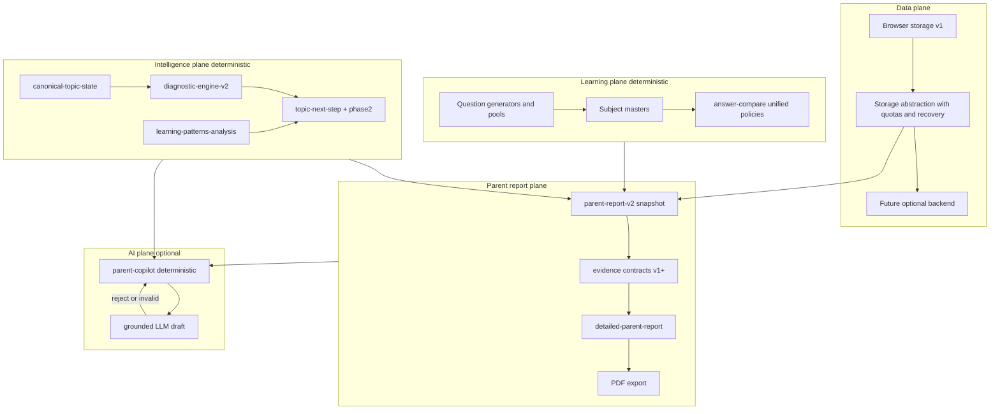

# LIOSH Master Roadmap — Learning / Parent Report / AI (Full Product + Technical)

**Status:** planning document only — no code changes implied.  
**Principles:** deterministic engines and contracts remain **source of truth**; AI may explain, personalize, and surface questions — **never** invent clinical diagnosis or override grounded limits. LLM does **not** replace deterministic pipelines.

**Product Completion Layer:** Sections **K–O** define parent-facing quality, final AI role, a **late** subject-content phase (Phase 7), subsystem “done” criteria, and a **detailed execution plan** (Section O). Section **E** defers to **O** for authoritative phase detail.

**Difficulty key:** S = days, M = 1–2 weeks focused work, L = multi-sprint / needs product+eng.  
**Release gate:** Y = required before any public “production” claim; P = partial (some sub-scope); N = can ship without (with documented limits).

---

## A. Current system truth (what exists today)

### A1. Parent Report Engine

| Component | Location / behavior |
|-----------|---------------------|
| V2 snapshot generator | [`utils/parent-report-v2.js`](utils/parent-report-v2.js) — `generateParentReportV2`: reads time-tracking + progress per subject from **localStorage**, builds per-topic rows (`buildMapFromBucket`, `buildRowSummary`), collapses canonical topic entities, attaches global score, evidence contract version. |
| Row diagnostics / trend / behavior | [`utils/parent-report-row-diagnostics.js`](utils/parent-report-row-diagnostics.js), [`utils/parent-report-row-trend.js`](utils/parent-report-row-trend.js), [`utils/parent-report-row-behavior.js`](utils/parent-report-row-behavior.js) — sufficiency-style signals, session-window trends, behavior profiles (consumed from report + topic-next-step + learning-patterns). |
| Evidence contract (additive) | [`utils/contracts/parent-report-contracts-v1.js`](utils/contracts/parent-report-contracts-v1.js) — `EVIDENCE_CONTRACT_VERSION`, bands E0–E4, sufficiency/trend/variance/signal quality derivation from counts + stability/confidence signals. |
| Detailed report payload | [`utils/detailed-parent-report.js`](utils/detailed-parent-report.js) — consumes `generateParentReportV2`, `topic-next-step-engine`, narrative contracts, diagnostic V2 / hybrid validation, Hebrew executive copy from [`utils/parent-report-language/`](utils/parent-report-language/). |
| Next-step / readiness | [`utils/topic-next-step-engine.js`](utils/topic-next-step-engine.js), [`utils/topic-next-step-phase2.js`](utils/topic-next-step-phase2.js) — sufficiency gates, recalibration, recommendation copy, decision/readiness bundles. |
| Patterns / diagnostics | [`utils/learning-patterns-analysis.js`](utils/learning-patterns-analysis.js), [`utils/diagnostic-engine-v2/`](utils/diagnostic-engine-v2/) — taxonomy-backed diagnostics, strength profiles, recurrence hooks. |
| Canonical topic state | [`utils/canonical-topic-state/`](utils/canonical-topic-state/) — invariant validation at state build (referenced from report/copilot flows). |
| UI | [`pages/learning/parent-report.js`](pages/learning/parent-report.js), [`pages/learning/parent-report-detailed.js`](pages/learning/parent-report-detailed.js) (+ renderable JSX); PDF via **jspdf** stack (dependencies in `package.json`). |
| Intelligence layer (emerging) | [`utils/system-intelligence/*.js`](utils/system-intelligence/) — dependency/time/priority engines (confirm wiring into production paths vs experimental). |

### A2. AI / Parent Copilot

| Component | Location / behavior |
|-----------|---------------------|
| Sync deterministic turn | [`utils/parent-copilot/index.js`](utils/parent-copilot/index.js) — `runDeterministicCore` / `runParentCopilotTurn`: truth packet, validators, clarification paths. |
| Async optional LLM | Same file — `runParentCopilotTurnAsync`: deterministic core first; `maybeGenerateGroundedLlmDraft` from [`utils/parent-copilot/llm-orchestrator.js`](utils/parent-copilot/llm-orchestrator.js); on failure or gate → `generationPath: "deterministic"`. |
| Env gates | [`utils/parent-copilot/rollout-gates.js`](utils/parent-copilot/rollout-gates.js) — `PARENT_COPILOT_LLM_ENABLED`, `PARENT_COPILOT_LLM_EXPERIMENT`, optional `PARENT_COPILOT_FORCE_DETERMINISTIC`; rollout stage must be `internal` \| `beta` \| `full` (default `internal`). KPI thresholds exist but **are not** wired into `getLlmGateDecision`. |
| Safety | [`utils/parent-copilot/llm-orchestrator.js`](utils/parent-copilot/llm-orchestrator.js) — clinical regex blocklist, required hedges / forbidden phrases from truth packet, draft validation. |

### A3. Student Learning Engine

| Area | Truth |
|------|--------|
| Subjects | Six report-tracked subjects in `SUBJECTS` inside [`utils/parent-report-v2.js`](utils/parent-report-v2.js): math, geometry, english, science, hebrew, moledet-geography. |
| Grades / levels | Session fields `grade`, `level`, `mode`; canonicalization via [`utils/math-report-generator.js`](utils/math-report-generator.js) exports used by topic/next-step. |
| Masters | Per-subject pages under [`pages/learning/`](pages/learning/) (e.g. `*-master.js`) with subject-specific generators and pools. |
| Adaptive / next-step | Logic spread across topic-next-step engines, diagnostic V2, learning-patterns-analysis; **not** a single unified adaptive LMS backend. |

### A4. Answer checking

| Module | [`utils/answer-compare.js`](utils/answer-compare.js) — `compareAnswers` modes (mcq, integers, Hebrew relaxed/strict niqqud, numeric tolerances, exact text); `compareMathLearnerAnswer`; `compareGeometryLearnerAnswer` (comma→dot only in geometry path). |

### A5. Data layer

| Truth | Browser-only persistence: `localStorage` / JSON across pages and [`utils/progress-storage.js`](utils/progress-storage.js) (some try/catch patterns). No server DB in-repo. |
| Hybrid / consent | [`utils/ai-hybrid-diagnostic/governance.js`](utils/ai-hybrid-diagnostic/governance.js) and related modules — consent / legal-hold concepts for hybrid diagnostic flows. |

### A6. Testing / quality

| Truth | Rich `npm` scripts in [`package.json`](package.json): parent-report phase1/phase6, topic-next-step, diagnostic-engine-v2 harness, ai-hybrid harness, many parent-copilot suites, Hebrew audits, oracle conformance, canonical-state e2e, answer-compare selftest. |

---

## B. Critical gaps (evidence-backed + product-risk)

Each row: **exact area** | **why it matters** | **risk if ignored** | **difficulty** | **required before release**

| Exact area | Why it matters | Risk if ignored | Difficulty | Release |
|------------|----------------|-----------------|------------|---------|
| `generateParentReportV2` — raw `JSON.parse(localStorage…)` for mistakes + daily/weekly challenge (~1251–1266, 1416–1421 in `parent-report-v2.js`) | Full report aborts on corrupt/quota/private storage | Parents see blank or error; trust collapse | S | **Y** |
| `improvement` / explicit trend contract vs UI (`buildRowSummary` only sets `improvement` for math as `null` at ~491) | Narrative promises “trend” without stable metric | Misleading UX; support burden | M | **P** (must document or implement) |
| Evidence band inputs depend on downstream signals; weak session volume | Over-strong copy when data thin | Overconfident guidance | M | **P** |
| `answer-compare.js` — no mixed-number mode; math string path vs geometry comma normalization | Wrong marking or unfair failures | Learner frustration; false mastery signals | M | **P** (math-heavy release **Y**) |
| `numeric_absolute_tolerance` — no upper bound on `tolerance` | Caller bug accepts all answers | Integrity of scores | S | **P** |
| Hebrew relaxed strips niqqud only — no full Unicode NFC | Edge duplicates in Hebrew compare | Rare false wrong/correct | S | N |
| localStorage project-wide — inconsistent guard pattern | Games/masters throw on restricted storage | Crashes outside report path | M | **P** |
| No accounts / no sync | Multi-device families lose continuity | Product expectation mismatch | L | Document N until backend |
| KPI thresholds not enforcing LLM in `getLlmGateDecision` | Ops may assume KPI blocks bad rollout | Policy drift between code and ops | S | N (docs only) unless KPI gate is product requirement |
| `utils/system-intelligence/*` integration unclear | Duplicate or conflicting “intelligence” | Inconsistent recommendations | M | Verify **P** before marketing “smart” features |

---

## C. Final target architecture (north star)

**Invariants:** (1) All numeric and recommendation **decisions** trace to deterministic code + contracts. (2) LLM output must validate against `truthPacket` / allowed envelopes. (3) Any new “intelligence” module must declare single writer to canonical state to avoid split-brain.

---

## D. Phase-by-phase roadmap (full product, not only Phase 1)

### Phase 0 — Truth and gates (already partially done)

- Lock “current system truth” doc (Section A) in repo docs or keep this plan updated.
- Define **release scope**: “at-home practice web” vs “school-grade SIS” (drives backend need).

### Phase 1 — Stability + report reliability (client-only)

| Deliverable | Exact area |
|-------------|------------|
| Defensive reads in `generateParentReportV2` | `parent-report-v2.js` mistakes + challenge JSON.parse blocks |
| Extend pattern to other **report-critical** readers | Same file any remaining unguarded parse in report path |
| CI subset | `npm run test:parent-report-phase1` + `test:parent-report-phase6` where feasible |

### Phase 2 — Contract completeness (deterministic)

| Deliverable | Exact area |
|-------------|------------|
| `improvement` / trend spec + implementation or UI removal | `buildRowSummary`, consumers in `detailed-parent-report.js` / UI |
| Align evidence narrative with `TREND_STATES` in contracts | `parent-report-contracts-v1.js` + language layer |
| Canonical state single pipeline audit | `canonical-topic-state/*` vs `topic-next-step-engine.js` inputs |

### Phase 3 — Answer-check integrity

| Deliverable | Exact area |
|-------------|------------|
| Mixed rational numbers policy (design doc + tests first) | `answer-compare.js`, `compareMathLearnerAnswer` |
| Shared numeric normalization (comma, unicode fraction) — **policy table per subject** | `answer-compare.js` + callers in `*-master.js` |
| Tolerance caps | `compareAnswers` numeric modes + call sites |

### Phase 4 — Storage abstraction + export/import (still client-first)

| Deliverable | Exact area |
|-------------|------------|
| `safeLocalStorage` module: get/set JSON with try/catch, quota detection, structured logging hook | new `utils/safe-local-storage.js` (example name) |
| Gradual adoption | `parent-report-v2.js`, `progress-storage.js`, then high-traffic pages |
| Export/import JSON bundle for family backup | new thin UI flow + file download (no backend) |

### Phase 5 — Copilot “smart but subordinate”

| Deliverable | Exact area |
|-------------|------------|
| Keep deterministic default; document env matrix | `rollout-gates.md` (doc), `rollout-gates.js` |
| Optional: wire **offline** KPI evaluation into release checklist scripts (not necessarily runtime) | scripts + `evaluateKpiGate` |
| Expand refusal/hedge coverage with **test-driven** utterance suites | `scripts/parent-copilot-*` |

### Phase 6 — Backend (optional product track)

| Deliverable | Exact area |
|-------------|------------|
| Auth (parent/child), encrypted sync, server-side report snapshot | new service — **L** |
| Consent migration from `ai-hybrid-diagnostic` patterns | governance module as template |

### Phase 7 — Subject content completion (after reliability + contracts)

| Deliverable | Exact area |
|-------------|------------|
| Per-subject audits: question quality, grade alignment, topic coverage, difficulty progression | `pages/learning/*-master.js`, subject `utils/*-question*`, `data/*`, `npm run audit:questions`, `audit:hebrew-*`, generator harness scripts |
| Full detail | See **Section M** |

---

## E. Exact order of execution (summary)

Authoritative per-phase goals, files, guardrails, tests, and **done criteria** are in **Section O**. High-level sequence: **0 → 1 → 2 → 3 → 4 → 5 → 6 (optional) → 7 (content)**.

---

## F. What NOT to touch yet (without explicit approval)

| Item | Reason |
|------|--------|
| Wholesale replacement of question pools / generator semantics | High regression surface; use audits (`audit:questions`, `audit:hebrew-*`) before bulk edits |
| Enabling LLM by default or removing env gates | Safety and cost; violates “deterministic source of truth” principle |
| Merging `utils/system-intelligence/*` into live path without duplication audit | Risk of double-counting signals |
| UI redesign of parent reports | Out of scope for integrity track; do after copy/contracts stable |
| “AI Hybrid” training pipelines in production without consent UX review | Legal/product surface |

---

## G. AI integration plan (LLM subordinate to deterministic)

### G1. Roles

| Role | Owner | Allowed |
|------|-------|---------|
| Decisions on recommendations, readiness, evidence tier | Deterministic: `truthPacket`, `topic-next-step-*`, contracts | Change only via coded rules + tests |
| Wording polish, empathy, reordering blocks | LLM optional | Must pass `validateLlmDraft` / existing validators |
| Clinical / diagnostic | **Nobody automated** | Copilot uses boundary answers + hedges |

### G2. When AI may answer

| Condition | Proof / mechanism |
|-----------|------------------|
| `getLlmGateDecision().enabled` | `rollout-gates.js` |
| Resolved deterministic core with `truthPacket` | `index.js` `runParentCopilotTurnAsync` |
| Intent not `clinical_boundary` skip path | `index.js` ~750–760 |

### G3. When AI must refuse / hedge / ask

| Case | Mechanism |
|------|-----------|
| Clinical boundary intent | LLM skipped; deterministic `clinical_boundary` path |
| Missing required hedges / forbidden phrases | `llm-orchestrator.js` validation |
| LLM draft invalid | Fallback to `baseResponse` deterministic |

### G4. Using canonical state only

| Action | Exact area |
|--------|------------|
| Ensure payload reader for copilot never reads raw localStorage for “truth” | `contract-reader.js`, `truth-packet-v1.js` (verify all fields sourced from composed snapshot) |
| Add contract test: LLM prompt builder only serializes allowlisted keys | `llm-orchestrator.js` `buildGroundedPrompt` |

### G5. Recommendations table (AI track)

| Exact area | Why it matters | Risk if ignored | Difficulty | Release |
|------------|----------------|-----------------|------------|---------|
| Document env + `generationPath` telemetry for support | Ops/debuggability | Misconfigured prod | S | Y |
| E2E test: gate off → no network | Trust | Accidental API calls | S | Y |
| Optional KPI gate in **CI script only** | Prevents “soft” launch without metrics | Bad rollout narrative | M | N |
| Parent-facing explanation of “AI assisted vs not” | Transparency | Regulatory/reputation | M | P |

---

## H. Backend / data plan

| Exact area | Why it matters | Risk if ignored | Difficulty | Release |
|------------|----------------|-----------------|------------|---------|
| `safeLocalStorage` + corruption recovery | Same as Phase 1 but systemic | Silent data loss | M | P without backend; Y with large user base |
| Export/import JSON | Family backup before backend | Lock-in anger | M | P |
| Future DB: store **snapshots** not raw regen every open | Reproducible reports | Non-reproducible audits | L | N until backend |
| Accounts + multi-device | Core product for families | Limited adoption | L | N for v1 web-only |
| Privacy policy linkage to hybrid governance | Trust | Compliance | M | Y (copy) if hybrid enabled |

---

## I. Test plan (layers)

| Layer | Command / artifact | Purpose |
|-------|-------------------|---------|
| Unit / selftest | `npm run test:answer-compare`, `test:parent-report-phase1` | Fast regression |
| Report Hebrew | `npm run test:parent-report-hebrew-language`, `test:parent-report-phase6` | Wording + SSR pages |
| Copilot safety | `test:parent-copilot-phase*`, `test:parent-rollout-release-matrix` | Intent + guardrails |
| Diagnostic | `test:diagnostic-engine-v2-harness` | Taxonomy stability |
| Canonical | `test:canonical-state-e2e` | State invariants |
| Golden snapshots | **Add** committed fixtures: deterministic `generateParentReportV2` output hash per period | Detect drift (**new work**; scripts TBD) |
| E2E browser | `test:e2e-hebrew-niqqud`, `test:e2e-hebrew-g1-g2-ab` | Real browser paths |

**Gap to close:** golden parent-report snapshots are a **recommended addition**, not yet a single npm script in the excerpt reviewed — mark as roadmap item with new script in Phase 2.

---

## J. Acceptance criteria — “system is ready” (public kid/parent facing)

Subsystem-level **“done”** definitions are expanded in **Section N**. The list below remains the cross-cutting minimum.

**Must all be true:**

1. `generateParentReportV2` never throws solely due to malformed optional keys (mistakes, challenges) — defensive parse **Y**.
2. `npm run test:parent-report-phase1` and `npm run test:parent-report-phase6` pass in CI.
3. `npm run test:answer-compare` passes; math release adds mixed-number policy tests if product enables that content.
4. Copilot: with default env, **no** LLM network path invoked (`llm_disabled_by_rollout_gate` or skipped) — verified by `test:parent-copilot-async-llm-gate` in CI.
5. Any displayed “trend” or `improvement` string is backed by contract field **or** explicitly hidden (“לא זמין”) — product-signed **P→Y**.
6. Privacy: if hybrid/AI features exposed, governance copy and toggles reviewed — **P** minimum.

**Strong but not blocking v1 web-only:**

- Backend absent: document “single device; export recommended.”

---

## Appendix — recommendation schema (used throughout B, G, H)

Each improvement in execution should be logged as:

- **Exact area:** path + symbol  
- **Why it matters:** user/trust/integrity  
- **Risk if ignored:** concrete failure mode  
- **Difficulty:** S / M / L  
- **Required before release:** Y / P / N  

---

## K. Product Completion Layer — Parent Report Quality Standard

**Definition of “good enough” for parent-facing outputs** (regular report, detailed report, PDF export, and Copilot answers that reference the report). Each bullet is a **pass/fail** review gate before marking “parent report ready” (see Section N).

| Criterion | Meaning | How to verify (no code in this doc) |
|-----------|---------|-------------------------------------|
| **Clear Hebrew** | Short sentences; correct gender/number where the product uses it; no mixed Hebrew/English jargon in parent copy | Manual + `npm run test:parent-report-hebrew-language` / phase6 |
| **No robotic wording** | Varied connectors; avoids repeating the same template twice in one screen when two different facts apply | Copy review checklist on `utils/parent-report-language/*`, `detailed-report-parent-letter-he.js`, `parent-report-ui-explain-he.js` |
| **No repeated text** | Same fact not stated verbatim in three blocks; cross-subject summary does not duplicate per-subject paragraphs | UI review + optional golden snapshot diff (Section I) |
| **Concrete explanation** | Every interpretive sentence ties to a visible number, label, or contract field (accuracy, questions, evidence band, readiness) | Traceability table: narrative line → `truthPacket` / contract field |
| **Actionable next step** | Parent knows *one* next action (topic, mode, or “ask teacher”) bounded by `recommendationEligible` / intensity caps | Align with `topic-next-step-engine.js`, `minimal-safe-scope-enforcement.js` |
| **No overconfidence** | Copy matches evidence tier (E0–E4 / insufficient → no “בוודאות”) | Contract rules in `parent-report-contracts-v1.js` + language gating |
| **No internal engine language** | No “truthPacket”, “E3”, “canonicalState” in parent UI; use Hebrew labels from `parent-report-ui-explain-he.js` | String grep on UI-facing bundles; product sign-off |
| **Surface agreement** | Regular report, detailed report, PDF, and Copilot **must not contradict** the same scoped facts (accuracy, totals, topic names) for the same period | **Cross-channel checklist:** same inputs → compare four outputs for one fixture period; mismatches = release blocker |

**If ignored:** parents lose trust; support cannot reconcile “what the app said” vs PDF vs chat.

---

## L. Product Completion Layer — Final AI Role Definition

**Deterministic engine decides (source of truth, not negotiable by LLM):** readiness tier, recommendation eligibility and intensity caps, evidence band, diagnostic taxonomy labels fed to UI, which topics appear as weak/strong, numeric aggregates from sessions, and any “cannot conclude yet” flags. Implemented in `topic-next-step-*`, `parent-report-contracts-v1.js`, `diagnostic-engine-v2/*`, `learning-patterns-analysis.js`, `canonical-topic-state/*`, and deterministic Copilot composition in `utils/parent-copilot/index.js`.

**AI is allowed to explain (optional LLM path only when gates on):** rephrase deterministic `answerBlocks` within the same facts; add empathy; reorder blocks; clarify *how to read* the report using only allowlisted JSON in `buildGroundedPrompt` (`llm-orchestrator.js`).

**AI is forbidden to decide:** diagnoses (dyslexia, ADHD, learning disability), certainty beyond evidence, new topics not in scope, new numbers, reversing `recommendationEligible` / caps, or inventing sessions. Enforced by validators + clinical regex + required hedges + fallback to deterministic response.

**AI may personalize:** tone and reading level *within* the same allowed claims (e.g. shorter paragraphs); must not add facts about the child not in the truth packet.

**AI may ask the parent:** clarification questions already supported by deterministic clarification flows; LLM must not introduce new data-collection paths not approved in product spec.

**Hallucination prevention:** (1) grounded prompt from composed snapshot only; (2) `validateLlmDraft`; (3) `forbiddenPhrases` / `requiredHedges`; (4) automatic fallback to `baseResponse` on any failure (`index.js` async path); (5) **no LLM by default** (`rollout-gates.js`).

**How to test this:** `npm run test:parent-copilot-async-llm-gate`; `test:parent-copilot-phase4` / `phase5` / `phase6`; `test:parent-hebrew-*`; `test:parent-copilot-executive-answer-safe-matrix`; manual red-team list for clinical paraphrases. Add CI assertion: default env → **zero** outbound LLM calls in automated suites.

---

## M. Phase 7 — Subject Content Completion Phase (explicitly late)

**Placement:** Run **only after** Phase 1–2 (report reliability + contract/copy alignment) and **after** Phase 3–4 where they touch integrity (answer-check policy, storage). May overlap **Phase 5** (Copilot tests/docs) only if resourcing allows; must **not** block Phase 1–2.

| Exact area | Why it matters | Risk if ignored | Difficulty | Required before release |
|------------|----------------|-----------------|------------|---------------------------|
| Question quality per subject | Wrong or ambiguous items undermine all reports | False weak/strong signals | L | **P** for soft launch; **Y** for “curriculum-grade” claim |
| Grade alignment (g1–g6) | Parents compare to school | Mistrust | L | P |
| Topic coverage vs ministry / internal matrix | Marketing and teacher credibility | Misleading “complete” | L | N unless claimed |
| Difficulty progression | Too hard too early → dropout | Engagement collapse | M | P |
| Hebrew audits | Largest surface area | Hebrew-specific regressions | M | Y for Hebrew-first positioning |
| English / math / geometry / science / geography audits | Uneven quality | Subject-level complaints | M | P per subject shipped |

**Commands already in repo (examples):** `npm run audit:questions`, `npm run audit:hebrew-subtopics`, `npm run verify:hebrew-perfect-credible` (as applicable), `audit:hebrew-official-divergence`, subject harness scripts from `package.json`.

**What must not change without approval:** wholesale generator rewrites; removing deterministic checks in favor of “LLM judged quality.”

---

## N. Final “Done” Definition — Acceptance by subsystem

| Subsystem | “Ready” means (exact) |
|-----------|------------------------|
| **Report engine** | `generateParentReportV2` completes for fixture periods without throw on optional keys; row diagnostics + contracts attach consistently; `npm run test:parent-report-phase1` passes. |
| **Parent report (product)** | Section **K** checklist passes; regular + detailed + PDF agree on facts (Section K last row); `npm run test:parent-report-phase6` passes; trend/improvement either implemented per spec or hidden with explicit copy. |
| **AI Copilot** | Default env: deterministic-only behavior verified; Section **L** satisfied; `test:parent-copilot-async-llm-gate` + at least one full `test:parent-copilot-phase5` or `phase6` in CI as agreed; no default LLM enablement. |
| **Learning engine** | Six subjects load and persist per existing keys; no unhandled storage throw on primary flows after Phase 4 scope for adopted pages; subject-specific audits (Phase 7) at level agreed in release notes. |
| **Answer checking** | `npm run test:answer-compare` passes; documented policy for mixed numbers / comma / tolerance caps implemented **or** explicitly deferred with “known limitations” in release notes (math-heavy **Y** if claiming fair grading). |
| **Storage / data** | Phase 1 report-path hardening done; Phase 4 wrapper + export/import **or** published limitation “single device, backup via export”; Phase 6 only if multi-device promised. |

---

## O. Execution Plan (authoritative — Phase 1, Phase 2, …)

**Global rules for every phase:** deterministic engines remain authoritative; **do not** enable LLM by default; **do not** UI-redesign parent pages in these phases (copy/layout tweaks only where required for clarity bugs); preserve existing `npm` scripts unless replacing with stricter superset.

### Phase 0 — Truth, scope, ownership

| Field | Content |
|-------|---------|
| **Goal** | Freeze “current truth” (Section A), release SKU (“home web” vs “school”), owners per subsystem. |
| **Files / modules** | This plan, optional `docs/` product note (no code required). |
| **What changes** | Documentation and sign-offs only. |
| **What must not change** | Application behavior. |
| **Tests required** | None beyond existing CI if already on. |
| **Done criteria** | Stakeholders agree Phase 1–2 priority and Definition of Done (Section N). |

### Phase 1 — Report reliability + crash prevention

| Field | Content |
|-------|---------|
| **Goal** | Parent report generation never dies on malformed mistakes/challenge JSON or storage access errors in the report path. |
| **Files / modules** | [`utils/parent-report-v2.js`](utils/parent-report-v2.js) (`generateParentReportV2`, mistakes + daily/weekly challenge reads). |
| **What changes** | Defensive `try/catch` + safe fallbacks (`[]` / `{}`) + `Array.isArray` guards where needed. |
| **What must not change** | Scoring formulas for valid data; subject list; evidence contract math in `parent-report-contracts-v1.js`. |
| **Tests required** | `npm run test:parent-report-phase1`; add/extend selftest cases for corrupt keys if missing. |
| **Done criteria** | Section N “Report engine” minimum satisfied; no regression on phase1 tests. |

### Phase 2 — Contract + narrative integrity (+ golden snapshots)

| Field | Content |
|-------|---------|
| **Goal** | Trends/improvements align with contracts; no overconfidence; optional golden outputs prevent silent drift; Hebrew parent copy passes quality bar (Section K). |
| **Files / modules** | `parent-report-v2.js` (`buildRowSummary`), `parent-report-contracts-v1.js`, `detailed-parent-report.js`, `parent-report-language/*`, `minimal-safe-scope-enforcement.js`; new golden fixture script (per Section I gap). |
| **What changes** | Spec’d `improvement`/trend **or** UI/contract explicit “לא זמין”; narrative clamps; committed snapshot hashes. |
| **What must not change** | Diagnostic taxonomy semantics without coordinated `diagnostic-engine-v2` tests. |
| **Tests required** | `npm run test:parent-report-phase6`, `test:parent-report-hebrew-language`, `test:minimal-safe-scope`; golden snapshot script once added. |
| **Done criteria** | Section N “Parent report (product)” satisfied; Section K cross-channel agreement on sample periods. |

### Phase 3 — Answer-check integrity

| Field | Content |
|-------|---------|
| **Goal** | Fair, documented comparison rules per subject; caps on abusive tolerances; optional mixed-number policy **with tests first**. |
| **Files / modules** | [`utils/answer-compare.js`](utils/answer-compare.js); callers in `pages/learning/*-master.js` as needed per policy table. |
| **What changes** | Normalization policy, tolerance max, new compare mode only after selftests. |
| **What must not change** | MCQ index semantics without `warnDuplicateMcqOptionsDevOnly` audit. |
| **Tests required** | `npm run test:answer-compare`; extend `scripts/answer-compare-selftest.mjs` before behavior change. |
| **Done criteria** | Section N “Answer checking” at agreed release tier. |

### Phase 4 — Storage abstraction + export/import

| Field | Content |
|-------|---------|
| **Goal** | Systemic safe storage pattern + family backup/restore without backend. |
| **Files / modules** | New `utils/safe-local-storage.js` (or agreed name); [`utils/progress-storage.js`](utils/progress-storage.js); [`utils/parent-report-v2.js`](utils/parent-report-v2.js); then pilot one `*-master.js`. |
| **What changes** | Wrapped get/set/JSON parse; export/import JSON flow (thin UI). |
| **What must not change** | Storage key names and on-disk JSON shapes (backward compatibility) unless migration doc ships. |
| **Tests required** | Targeted manual + existing suites per touched pages; add unit tests for wrapper if introduced. |
| **Done criteria** | Section N “Storage / data” at P or Y per release promise. |

### Phase 5 — Copilot: documentation + safety tests (no default LLM)

| Field | Content |
|-------|---------|
| **Goal** | Ops and dev understand gates; CI proves safe default; optional LLM remains strictly opt-in (Section L). |
| **Files / modules** | `rollout-gates.js`, `llm-orchestrator.js`, `parent-copilot/index.js`; docs; `scripts/parent-copilot-*`. |
| **What changes** | Documentation, tests, optional **CI-only** KPI script — **not** default-on LLM. |
| **What must not change** | `getLlmGateDecision` semantics without product/legal approval. |
| **Tests required** | `npm run test:parent-copilot-async-llm-gate`, `test:parent-rollout-release-matrix` (as applicable), Hebrew drift suites if touching copy. |
| **Done criteria** | Section N “AI Copilot” satisfied. |

### Phase 6 — Backend / accounts (optional track)

| Field | Content |
|-------|---------|
| **Goal** | Multi-device, auth, server snapshots — **only if** product promises it. |
| **Files / modules** | New service + client sync layer (TBD). |
| **What changes** | New infrastructure; migrations from localStorage. |
| **What must not change** | Deterministic report generation semantics on server (regenerate from stored events, not from LLM). |
| **Tests required** | Contract tests + integration tests TBD. |
| **Done criteria** | Section N “Storage / data” Y for multi-device SKU. |

### Phase 7 — Subject content completion

| Field | Content |
|-------|---------|
| **Goal** | Curriculum-facing quality: pools, generators, grade/topic/difficulty coverage (Section M). |
| **Files / modules** | `pages/learning/*-master.js`, subject generators, `data/*`, audit scripts. |
| **What changes** | Content and generator fixes driven by audit reports; **no** removal of deterministic safety. |
| **What must not change** | Answer contract of MCQ index until duplicates resolved; do not tie content quality to LLM grading. |
| **Tests required** | `audit:questions`, Hebrew/science/etc. audits per subject touched; generator harness where used. |
| **Done criteria** | Phase 7 sign-off matrix per subject; Section N “Learning engine” at claimed tier. |

---

*End of master roadmap.*
