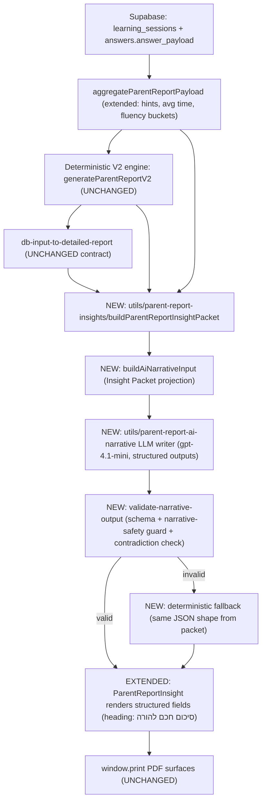

# Parent AI Report Engine — Engineering Plan

Code/file names are in English. Narrative copy is Hebrew.

---

## 0. Confirmed product decisions (from clarifications)

- New rich narrative renders **in place** of the current "תובנה להורה" block via an **upgraded `ParentReportInsight`** that accepts structured fields. Heading becomes **"סיכום חכם להורה"**. Layout, grid, and PDF print rules stay as-is.
- AI provider/model: **OpenAI `gpt-4.1-mini` via `/v1/responses`** (matches `utils/parent-copilot/llm-orchestrator.js`, supports native structured outputs, unifies infra). Env overrides: `PARENT_REPORT_NARRATIVE_LLM_API_KEY`, `_MODEL`, `_BASE_URL`, `_ENABLED`. Default falls back to `OPENAI_API_KEY`.

---

## 1. Current system mapping

### Data already in DB
- `learning_sessions` (`supabase/migrations/001_learning_core_foundation.sql`): `subject`, `topic`, `started_at`, `ended_at`, `duration_seconds`, `status`, `metadata` (jsonb).
- `answers.answer_payload` (jsonb) is written in [`pages/api/learning/answer.js`](pages/api/learning/answer.js) lines 98–108 with: `subject`, `topic`, `questionFingerprint`, `prompt`, `expectedAnswer`, `userAnswer`, `hintsUsed`, `timeSpentMs`, `clientMeta`.

### What `aggregateParentReportPayload` currently returns
From [`lib/parent-server/report-data-aggregate.server.js`](lib/parent-server/report-data-aggregate.server.js) (lines 127–287):
- `student`, `range`, `summary` (sessions/answers/correct/wrong/accuracy/totalDurationSeconds), `subjects[*]` with `answers/correct/wrong/accuracy/durationSeconds/topics{...}`, `dailyActivity[]`, `recentMistakes[]` (≤20, with `prompt/expectedAnswer/userAnswer`), `meta`.

### Exposure status of fields you asked about
- `hintsUsed` — **NOT exposed** (stored in `answer_payload`, never aggregated).
- `timeSpentMs` — **NOT exposed** (stored in `answer_payload`, never aggregated).
- `mode`, `level`, `clientMeta` — **NOT exposed** (read-side ignores them).
- `gradeLevel` — exposed only as `student.grade_level` from `students` row.
- `recentMistakes` — exposed but **without** `hintsUsed` / `timeSpentMs` / `clientMeta`.

### Deterministic vs AI today
- Deterministic source of truth: [`utils/parent-report-v2.js`](utils/parent-report-v2.js) (`generateParentReportV2`) → diagnostics/trends/strengths/focus/recommendations/data-confidence/thin-data warnings (`insufficientSubjectQuestionsLineHe`, hybrid runtime, executive summary).
- DB → V2 hop: [`lib/parent-server/db-input-to-detailed-report.server.js`](lib/parent-server/db-input-to-detailed-report.server.js) seeds a synthetic localStorage snapshot (hard-coded `mode:"learning"`, `grade:"g4"`, `level:"medium"`).
- AI surfaces today (two distinct paths):
  - Parent report explainer → [`utils/parent-report-ai/parent-report-ai-explainer.js`](utils/parent-report-ai/parent-report-ai-explainer.js) (`gpt-4o-mini`, `/v1/chat/completions`, JSON `{text}`, single primary subject) → rendered by [`components/ParentReportInsight.jsx`](components/ParentReportInsight.jsx).
  - Parent Copilot Q&A → [`utils/parent-copilot/llm-orchestrator.js`](utils/parent-copilot/llm-orchestrator.js) (`gpt-4.1-mini`, `/v1/responses`, `answerBlocks[]`).

### Safety today
- [`utils/parent-narrative-safety/parent-narrative-safety-guard.js`](utils/parent-narrative-safety/parent-narrative-safety-guard.js): medical/diagnostic regexes, permanent-ability, overconfidence × thin-data, mastery vs guessing, recommendation-tier vs escalation, raw-key bans.
- [`lib/parent-report-ai/parent-report-ai-validate.js`](lib/parent-report-ai/parent-report-ai-validate.js) wires the guard via `validateParentReportAIText({ runNarrativeGuard: true, ... })` — used by the explainer.
- Copilot uses [`utils/parent-copilot/guardrail-validator.js`](utils/parent-copilot/guardrail-validator.js) instead (asymmetric).

---

## 2. Data gaps for a professional AI report

The deterministic V2 engine internally derives much of this from `localStorage`, but it is **not** in the API/aggregate payload, so any cross-subject AI narrative seeing only the aggregate would be flying blind. Concrete gaps in `aggregateParentReportPayload`:

- Per-topic and per-subject **average time per question** (only sums today).
- Per-topic and per-subject **average hints per question** (`hintsUsed` ignored entirely).
- **Correct-but-slow** counts (no time × correctness coupling).
- **Correct-with-many-hints** counts (no hints × correctness).
- **Wrong-but-fast** counts (no time × correctness on wrong answers).
- **Repeated mistake patterns** beyond a flat 20-row recent list (e.g. same `questionFingerprint` ×N, same topic-key ×N).
- **Per-subject daily trend** (`dailyActivity` is global only, no subject breakdown per day).
- **Subject trend** (improving/stable/declining) is only computed by V2 from a **collapsed pseudo-session** seeded from the aggregate, weakening fidelity.
- **Data confidence per subject/topic** (V2 has it internally; not surfaced cleanly in the aggregate).
- **Thin-data limitations** flags per subject/topic in a normalized form.
- **Hebrew display names** for subjects/topics — exist in `utils/math-report-generator.js` and `utils/parent-report-language/*` but the aggregate emits raw English topic keys.
- `recentMistakes` is **missing** `hintsUsed` / `timeSpentMs` / `attemptCount`.

---

## 3. Architecture proposal



### New module: `utils/parent-report-insights/`

Suggested function surface:

- `buildParentReportInsightPacket({ aggregate, v2Report, detailedPayload, options }) → InsightPacket`
- `deriveTopicInsights(aggregate) → TopicInsight[]`
- `deriveFluencySignals(aggregate, thresholds) → FluencySignals`
- `deriveMistakePatterns(aggregate) → MistakePattern[]`
- `deriveTrendSignals(aggregate, v2Report) → TrendSignals`
- `deriveDataConfidence(aggregate, v2Report) → ConfidenceMap`
- `normalizeParentFacingLabels(keys) → HebrewLabelMap` (delegates to existing `getHebrewTopicName` / `V2_SUBJECT_LABEL_HE`).
- `buildAiNarrativeInput(packet) → AiNarrativeInput` (a strict, minified projection: only what the AI may see).

The Insight Packet is the **only** thing the AI ever receives. No raw answers, no `prompt`/`expectedAnswer`/`userAnswer`, no `clientMeta`, no diagnostics blobs.

---

## 4. Insight Packet schema (deterministic, testable)

```json
{
  "version": "v1",
  "generatedAt": "ISO8601",
  "student": { "displayName": "string", "gradeLevel": "g4" },
  "range": { "from": "YYYY-MM-DD", "to": "YYYY-MM-DD", "label": "week|month|custom", "totalDays": 7 },
  "overall": {
    "totalSessions": 0, "totalQuestions": 0, "correctQuestions": 0,
    "accuracyPct": 0, "totalTimeMinutes": 0,
    "avgTimePerQuestionSec": 0, "avgHintsPerQuestion": 0,
    "dataConfidence": "thin|low|moderate|strong",
    "modeCounts": { "learning": 0, "review": 0, "drill": 0 },
    "levelCounts": { "easy": 0, "medium": 0, "hard": 0 },
    "normalizedGradeLevel": "g4"
  },
  "subjects": [{
    "key": "math", "displayNameHe": "חשבון", "sourceId": "subject:math",
    "totalQuestions": 0, "accuracyPct": 0, "totalTimeMinutes": 0,
    "avgTimePerQuestionSec": 0, "avgHintsPerQuestion": 0,
    "trend": "improving|stable|declining|insufficient_data",
    "dataConfidence": "thin|low|moderate|strong",
    "modeCounts": { "learning": 0, "review": 0, "drill": 0 },
    "levelCounts": { "easy": 0, "medium": 0, "hard": 0 },
    "topicHighlights": { "strengthHe": [], "focusHe": [] }
  }],
  "topics": [{
    "key": "fractions_basic", "subjectKey": "math",
    "displayNameHe": "שברים — יסודות",
    "totalQuestions": 0, "accuracyPct": 0,
    "avgTimePerQuestionSec": 0, "avgHintsPerQuestion": 0,
    "fluency": "fluent|effortful|struggling|insufficient",
    "isStrength": false, "isFocusArea": false,
    "dataConfidence": "thin|low|moderate|strong"
  }],
  "fluencySignals": {
    "thresholds": { "slowSecPerQuestion": 60, "manyHints": 3, "fastWrongSec": 6 },
    "correctSlowTopicsHe": [], "correctManyHintsTopicsHe": [], "wrongFastTopicsHe": []
  },
  "mistakePatterns": [
    { "topicDisplayHe": "string", "subjectKey": "math",
      "occurrences": 3, "kind": "topic_recurrence|same_question_recurrence" }
  ],
  "trendSignals": {
    "dailyTotals": [{ "date": "YYYY-MM-DD", "answers": 0, "accuracyPct": 0 }],
    "subjectTrends": [{ "subjectKey": "math", "trend": "improving|stable|declining|insufficient_data" }]
  },
  "strengths": [
    { "sourceId": "subject:math", "scope": "subject|topic",
      "displayNameHe": "string", "evidenceHe": "string" }
  ],
  "focusAreas": [
    { "sourceId": "topic:math:multiplication_table", "scope": "subject|topic",
      "displayNameHe": "string", "evidenceHe": "string", "thinData": false }
  ],
  "availableStrengthSourceIds": ["subject:math", "topic:math:..."],
  "availableFocusSourceIds": ["topic:math:multiplication_table", "subject:hebrew"],
  "deterministicRecommendationsHe": ["string"],
  "thinDataWarnings": [
    { "scope": "overall|subject|topic", "displayNameHe": "string", "questionCount": 0 }
  ],
  "limitations": ["string"],
  "sourceMetadata": {
    "engineVersion": "v2",
    "aggregateVersion": "string",
    "insightPacketVersion": "v1",
    "preferDeterministic": false,
    "thresholds": { "thinTotalQuestions": 6, "moderateTotalQuestions": 12, "strongTotalQuestions": 40 }
  }
}
```

### Stable `sourceId` format (binding)

Every strength and focus item in the Insight Packet carries a stable, machine-readable `sourceId`:

- Subject scope: `subject:<subjectKey>` — example `subject:math`, `subject:hebrew`, `subject:moledet-geography`.
- Topic scope: `topic:<subjectKey>:<topicKey>` — example `topic:math:multiplication_table`, `topic:hebrew:reading_comprehension`.
- `<subjectKey>` and `<topicKey>` are the **raw English keys** from the aggregator (snake_case). They appear **only** in `sourceId` strings and **never** in any user-visible Hebrew text. The renderer never displays `sourceId`.
- The Insight Packet exposes `availableStrengthSourceIds[]` and `availableFocusSourceIds[]` as closed enums; the AI input projection reuses these for the LLM `enum` constraint in the JSON Schema.

### Mode / level / grade summarization rules (binding)

- Source priority for `mode` per answer row: `answer_payload.mode` → `answer_payload.clientMeta.mode` → linked `learning_sessions.metadata.mode` → `"unknown"`.
- Source priority for `level` per answer row: `answer_payload.level` → `answer_payload.clientMeta.level` → `learning_sessions.metadata.level` → `"unknown"`.
- Aggregator emits **count maps** only — never raw values, never the full `clientMeta` object. Only the small enum keys above are exposed (`learning`, `review`, `drill` for mode; `easy`, `medium`, `hard` for level; bucket label `"unknown"` is allowed but never sent to the AI).
- `normalizedGradeLevel` derives from `student.grade_level` (already exposed) using a small whitelist regex `^g[1-9]$`; otherwise `"unknown"`.
- `buildAiNarrativeInput(packet)` **drops the `"unknown"` bucket** before serialization and **never** forwards `modeCounts` / `levelCounts` keys whose total would identify a single session. (i.e. include the maps only if at least one bucket has count ≥ 2 across the period; else omit the maps.)
- **Hard rule**: the strict `AiNarrativeInput` projection **must not contain** raw `clientMeta`, raw `prompt` / `expectedAnswer` / `userAnswer`, raw English topic keys, DB ids, or any field whose name is `clientMeta`. The packet builder is allowed to read `clientMeta`; the AI input projector explicitly strips it.

### Determinism rules (binding)

- The core builder `buildParentReportInsightPacket(args, options)` **must NOT call `Date.now()`, `Math.random()`, or any wall-clock / RNG source** internally.
- `generatedAt` is injected by the caller via `options.now: string | Date` (ISO-8601). When the caller does not provide it, the builder writes `generatedAt: ""` (empty string) — never a fresh timestamp. The page-level adapter ([`utils/parent-report-ai/parent-report-ai-adapter.js`](utils/parent-report-ai/parent-report-ai-adapter.js)) is responsible for passing `options.now: new Date().toISOString()` from the request boundary.
- All array fields are emitted in a **sorted, stable order**: subjects in fixed `REPORT_AGG_SUBJECTS` order, topics by `subjectKey` then `key`, daily totals by `date` ASC, mistake patterns by `occurrences DESC` then `topicDisplayHe ASC`.
- The unit-test snapshot harness compares packets with `generatedAt` **excluded** from the diff (defense in depth even if a caller forgets to inject `options.now`).
- `Object.keys` iteration order is guaranteed by emitting via explicit object literals in the builder, not by `for...in` over input maps.

---

## 5. AI narrative layer (writer)

New module: `utils/parent-report-ai-narrative/`. Receives `AiNarrativeInput` (a stripped projection of the Insight Packet — only Hebrew display names, bands, and counts; never raw English keys, never raw mistake text).

### Output schema (extended with stable `sourceId` for grounding)

```json
{
  "summary": "2–3 משפטים בעברית",
  "strengths": [
    { "textHe": "string", "sourceId": "subject:math" }
  ],
  "focusAreas": [
    { "textHe": "string", "sourceId": "topic:math:multiplication_table" }
  ],
  "homeTips": ["...", "...", "..."],
  "cautionNote": "string (required when thinDataWarnings non-empty, else may be \"\")"
}
```

The OpenAI structured-output JSON Schema constrains each `strengths[*].sourceId` to the closed enum `availableStrengthSourceIds` from the packet, and each `focusAreas[*].sourceId` to `availableFocusSourceIds`. The renderer extracts only `textHe` for display; `sourceId` is for grounding/validation only and is never shown to the parent.

**UI rule (binding)**: `ParentReportInsight` reads `textHe` for visible bullets and ignores `sourceId`. `sourceId` is also stripped before any text passes through `validateParentNarrativeSafety`.

### Prompt rules (system message, Hebrew)
- Audience: הורה. Voice: חמה, מקצועית, פשוטה.
- אין שפה רפואית/אבחנתית, אין ADHD/לקויות למידה/חרדה/דיכאון/חוסר ביטחון.
- אין הנחות רגשיות.
- חובה לציין מגבלת נתונים אם `thinDataWarnings` קיים.
- לתת 2–3 טיפים פרקטיים לבית.
- להתבסס **רק** על Hebrew display labels וההמלצות הדטרמיניסטיות מה-Insight Packet.
- אסור להמציא נושאים, מקצועות, מספרים או שמות מורים.
- חייב להחזיר JSON בלבד, ללא Markdown.

### LLM call
- `model = process.env.PARENT_REPORT_NARRATIVE_LLM_MODEL || "gpt-4.1-mini"`.
- Endpoint: `${BASE_URL}/v1/responses`.
- Use OpenAI `response_format` JSON Schema (structured outputs) for the schema above so the SDK enforces shape.
- `max_output_tokens` ~ 700, `temperature` 0.3.
- Hard 4 KB cap on prompt facts; if `JSON.stringify(input).length > 4000` → throw → fallback.

### Gate flags (mirroring copilot)
- `PARENT_REPORT_NARRATIVE_LLM_ENABLED` (default false in CI/dev without key).
- `PARENT_REPORT_NARRATIVE_FORCE_DETERMINISTIC` (always fallback).
- Default behavior: if no API key → deterministic fallback (no error).

---

## 6. Safety and validation

New file: `utils/parent-report-ai-narrative/validate-narrative-output.js`. Layered checks (in order; first failure → fallback):

1. **Structural**: matches schema, all required fields present, types correct, array sizes (`strengths` ≤ 3, `focusAreas` ≤ 3, `homeTips` between 2 and 3).
2. **Length**: `summary` ≤ 600 chars, each bullet ≤ 160 chars, `cautionNote` ≤ 280 chars.
3. **Hebrew dominance**: per-field Hebrew-letter ratio ≥ 0.6 (reuse logic like `validateParentReportAIText` in [`lib/parent-report-ai/parent-report-ai-validate.js`](lib/parent-report-ai/parent-report-ai-validate.js)).
4. **No raw keys**: regex against `/[a-z][a-z0-9]+_[a-z0-9_]+/i` (e.g. `reading_comprehension`), and reuse `RAW_TOPIC_KEY_PATTERN` from `scripts/parent-ai-mass-simulation/lib/ai-response-quality-audit.mjs`.
5. **No Markdown only**: ban leading `#`, `*`, `-`, `>`, ``` ` ```.
6. **No diagnostic language**: run **each text field** through `validateParentNarrativeSafety` from [`utils/parent-narrative-safety/parent-narrative-safety-guard.js`](utils/parent-narrative-safety/parent-narrative-safety-guard.js) using `deriveEngineSnapshotForGuard(packet)`.
7. **Thin-data presence**: if `packet.thinDataWarnings.length > 0` → `cautionNote` must be non-empty AND match one of `SAFE_THIN_DATA_CAUTION_RES`.
8. **Contradiction check (deterministic, sourceId-grounded)**:
   - Every `strengths[i].sourceId` MUST be a member of `packet.availableStrengthSourceIds`. Hard block on miss.
   - Every `focusAreas[i].sourceId` MUST be a member of `packet.availableFocusSourceIds`. Hard block on miss.
   - Same `sourceId` may not appear in **both** `strengths` and `focusAreas` of the AI output.
   - Defense-in-depth: `strengths[i].textHe` should reference the corresponding packet item's `displayNameHe` (substring or normalized-Hebrew match) — soft block; logs a `narrative_text_displayname_drift` warning but does not by itself fall back unless combined with another failure.
   - This replaces the prior pure-substring matching approach.
9. **No unsupported claims**: ban absolute words ("תמיד", "אף פעם", "מצוין במיוחד", "צריך טיפול") via small regex set.

If any check fails → call `buildDeterministicFallbackNarrative(packet)` returning an identically-shaped object → **never break the report**.

---

## 7. Integration plan (UI / PDF)

- **Render contract change** is local: today `ParentReportInsight` accepts `{ ok, text, source }`. We extend to `{ ok, structured: { summary, strengths[], focusAreas[], homeTips[], cautionNote }, source, text? }` and render a single bordered card with:
  - bold heading **"סיכום חכם להורה"** (replaces "תובנה להורה")
  - `summary` paragraph
  - **חוזקות** sub-list, **לחיזוק** sub-list, **טיפים לבית** sub-list
  - `cautionNote` italic line at bottom (only if non-empty)
  - **Backward-compat shim**: if `structured` is missing but legacy `text` is present, fall back to current single-paragraph rendering. This protects any caller we miss.
- **Short report** ([`pages/learning/parent-report.js`](pages/learning/parent-report.js)) and **detailed report** ([`pages/learning/parent-report-detailed.js`](pages/learning/parent-report-detailed.js)) already mount `<ParentReportInsight explanation={report.parentAiExplanation} />`. We keep the prop name; the adapter ([`utils/parent-report-ai/parent-report-ai-adapter.js`](utils/parent-report-ai/parent-report-ai-adapter.js)) gets the new `structured` field added to its return shape — no page rewrite needed.
- **PDF (short)**: `exportReportToPDF` targets `#parent-report-pdf`; the existing `<ParentReportInsight />` in [`pages/learning/parent-report.js`](pages/learning/parent-report.js) (around line 1786) already sits **inside** that print root, so the new structured block prints automatically. No move needed on the short page.
- **PDF (detailed) — REQUIRED inclusion**: today `<ParentReportInsight />` is mounted at lines 1249–1255 of [`pages/learning/parent-report-detailed.js`](pages/learning/parent-report-detailed.js), which is **above** `#parent-report-detailed-print` and therefore **excluded from the printed PDF**. The integration must move that mount **inside** `#parent-report-detailed-print`, placed immediately after the report header (before `סיכום להורה` / `סיכום לתקופה` `SectionCard`s) so it appears in both the on-screen detailed UI and `window.print()` output. The existing `.parent-report-parent-ai-insight` print CSS in the page `<Head>` (lines 1211–1222) already handles this class inside the print root, so no print-CSS rewrites are required. The `.no-pdf` class is **not** added — the block is intentionally part of the PDF.
- **Detailed page edit scope**: this is the **only** change to [`pages/learning/parent-report-detailed.js`](pages/learning/parent-report-detailed.js) — relocating one existing JSX mount. No layout, grid, copy, or section change.

No changes to: existing report sections, executive summary, contract preview, copilot panel, disclaimer, or any deterministic Hebrew copy.

---

## 8. Testing strategy (proportional)

### A. During development — fast unit + smoke (run after each batch, no heavy sims)
- New: `node scripts/parent-report-insights-selftest.mjs` — golden-fixture tests for `buildParentReportInsightPacket` (10–15 fixtures: strong, weak, thin, declining, improving, mixed, fast-wrong, slow-correct, hint-heavy, empty).
- New: `node scripts/parent-report-ai-narrative-selftest.mjs` — narrative validator tests with **mocked** LLM responses (good, hallucinated-topic, English-leak, missing-thin-warning, diagnostic-language, oversize). Asserts validator decisions and fallback shape.
- Existing focused gates (already lightweight): `npm run test:parent-report-narrative-safety`, `npm run test:parent-report-hebrew-language`, `npm run test:parent-report-phase1`, `npm run test:parent-report-product-contract`.
- Existing schema gate after touching aggregate: `npm run qa:learning-simulator:schema`.

### B. After major integration — focused render + PDF
- `npm run audit:parent-report-ui-binding` — UI binding still valid after `ParentReportInsight` prop extension.
- `npm run audit:parent-report-readability` — readability stays in band.
- `npm run audit:parent-report-short-consistency` — short vs detailed parity.
- `npm run qa:parent-pdf-export` — single focused PDF export check.

### C. Final validation only (heavy, run **once** at acceptance)
- `npm run qa:parent-ai:mass-simulation` — full suite producing `MASS_SIMULATION_SUMMARY`, `AI_RESPONSE_QUALITY_AUDIT` (raw-key leakage, thin-data, contradiction), `QUALITY_FLAGS`, `EVIDENCE_SOURCES`.
- Manual review of `samples-for-manual-review/` for ~10 representative profiles.
- `npm run audit:parent-report-release-gate` as the final go/no-go.

---

## 9. Acceptance criteria (final)

- Aggregate exposes `hintsUsed` and `timeSpentMs` averages (per topic + per subject), fluency-bucket count maps, and summarized `modeCounts` / `levelCounts` / `normalizedGradeLevel`.
- Insight Packet is byte-stable for fixed inputs (snapshot test compares with `generatedAt` excluded; core builder never invokes `Date.now()` / RNG).
- AI receives only `AiNarrativeInput` (≤ 4 KB) — no raw rows, no DB ids, no raw English keys in user-visible text, no `clientMeta`, no raw mistake text.
- AI returns structured JSON validated against the schema, with each strength/focus carrying a stable `sourceId` drawn from a closed enum.
- Validation layer enforces all 9 checks in section 6, including `sourceId` membership and no `sourceId` overlap between strengths and focusAreas.
- Deterministic fallback returns identical shape (with `sourceId`s); report **never** breaks if AI is off, errors, or hallucinates.
- Short report, detailed report, and both PDFs render the new section without layout regressions. **Detailed PDF includes the new block** (mount sits inside `#parent-report-detailed-print`).
- No raw English topic keys leak into parent text (mass-sim audit zero); `sourceId` strings never appear in rendered DOM (`data-source-id` attribute is allowed for tests but is not visible).
- Thin-data students get a `cautionNote`; strong students aren't overpraised; weak students aren't described in scary or diagnostic language (mass-sim audit thresholds met).
- AI never contradicts deterministic strengths/focus/recommendations (sourceId-grounded contradiction check passes in mass sim).
- Final mass simulation green.

---

## 10. Implementation batches (order to avoid rework)

1. **Audit & freeze contracts** — re-read aggregate + V2 + adapter, write down field map. No code yet.
2. **Extend aggregation** in [`lib/parent-server/report-data-aggregate.server.js`](lib/parent-server/report-data-aggregate.server.js) only: add `avgTimePerQuestionSec`, `avgHintsPerQuestion`, `correctSlow/correctManyHints/wrongFast` counts per topic+subject, `modeCounts` / `levelCounts` per subject + overall, `recentMistakes` extra fields (`hintsUsed`, `timeSpentMs`), and read `mode`/`level` via the priority rules in §4. **Additive only**; bump `meta.version`. Raw `clientMeta` is consumed only in this layer and never re-emitted as-is.
3. **Build Insight Packet module** under `utils/parent-report-insights/`, including all `derive*` helpers and the schema doc.
4. **Add deterministic insight tests** (`scripts/parent-report-insights-selftest.mjs`) with golden fixtures.
5. **Build AI narrative service** (`utils/parent-report-ai-narrative/`) with prompt + LLM client + structured-output schema. Wire env gates. Default OFF without API key.
6. **Add validation/safety guard** (`validate-narrative-output.js`) reusing existing safety primitives.
7. **Add deterministic fallback** (`deterministic-fallback.js`) producing identical JSON shape.
8. **Integrate**: update [`utils/parent-report-ai/parent-report-ai-adapter.js`](utils/parent-report-ai/parent-report-ai-adapter.js) to call `buildParentReportInsightPacket` (passing `options.now`) then `buildParentReportAINarrative`; expose `structured` in its return. Extend [`components/ParentReportInsight.jsx`](components/ParentReportInsight.jsx) to render structured fields with backward-compat for legacy `text`. Move the `<ParentReportInsight />` mount in [`pages/learning/parent-report-detailed.js`](pages/learning/parent-report-detailed.js) **inside** `#parent-report-detailed-print` so the new block prints in the detailed PDF.
9. **Focused render + PDF check**: run audit B-set above on a few representative profiles only.
10. **Final heavy mass simulation + acceptance audit**.

---

## 11. Files to create / change

### Create

- `utils/parent-report-insights/index.js` — entry, exports `buildParentReportInsightPacket`. Risk: medium. Tests: golden fixtures.
- `utils/parent-report-insights/derive-topic-insights.js` — per-topic strength/focus/fluency assignment. Risk: medium. Tests: unit.
- `utils/parent-report-insights/derive-fluency-signals.js` — slow-correct / many-hints / fast-wrong buckets. Risk: medium. Tests: unit.
- `utils/parent-report-insights/derive-mistake-patterns.js` — recurrence detection over `recentMistakes`. Risk: medium. Tests: unit.
- `utils/parent-report-insights/derive-trend-signals.js` — daily totals + subject trend bands. Risk: medium. Tests: unit.
- `utils/parent-report-insights/derive-data-confidence.js` — thresholds → bands. Risk: low. Tests: unit.
- `utils/parent-report-insights/normalize-parent-facing-labels.js` — wraps `getHebrewTopicName`/`V2_SUBJECT_LABEL_HE`. Risk: low. Tests: golden mapping table.
- `utils/parent-report-insights/build-ai-narrative-input.js` — strict allowlisted projection. Risk: low. Tests: unit.
- `utils/parent-report-insights/insight-packet-schema.js` — exported JSON Schema doc + version. Risk: low.
- `utils/parent-report-ai-narrative/index.js` — `buildParentReportAINarrative(packet, options)`. Risk: high. Tests: mocked LLM unit + safety.
- `utils/parent-report-ai-narrative/llm-client.js` — `gpt-4.1-mini` via `/v1/responses` with structured outputs. Risk: high.
- `utils/parent-report-ai-narrative/prompt.js` — Hebrew system + facts builder. Risk: high.
- `utils/parent-report-ai-narrative/validate-narrative-output.js` — 9-step validator. Risk: high. Tests: unit.
- `utils/parent-report-ai-narrative/deterministic-fallback.js` — packet → identical-shape fallback JSON. Risk: medium. Tests: unit.
- `scripts/parent-report-insights-selftest.mjs` — light smoke. Risk: low.
- `scripts/parent-report-ai-narrative-selftest.mjs` — light smoke (mocked LLM). Risk: low.

### Change (additive / backward-compatible)

- [`lib/parent-server/report-data-aggregate.server.js`](lib/parent-server/report-data-aggregate.server.js) — read `payload.hintsUsed` and `payload.timeSpentMs`, accumulate sums and counts per topic+subject, compute averages and fluency buckets in the final assembly, include `hintsUsed` and `timeSpentMs` in `recentMistakes`. Bump `meta.version` to `"2026.05-insights"`. Risk: medium. Tests: schema gate + unit.
- [`utils/parent-report-ai/parent-report-ai-adapter.js`](utils/parent-report-ai/parent-report-ai-adapter.js) — replace internal `buildParentReportAIExplanation` call with `buildParentReportInsightPacket → buildParentReportAINarrative`. Keep public function names `enrichParentReportWithParentAi` / `enrichDetailedParentReportWithParentAi` and the `parentAiExplanation` shape, just add `structured`. Risk: medium-high. Tests: unit + UI binding audit.
- [`components/ParentReportInsight.jsx`](components/ParentReportInsight.jsx) — accept `explanation.structured`, render new heading "סיכום חכם להורה" + bullet sections; keep legacy `text` rendering as fallback. Risk: low-medium. Tests: snapshot via mass-sim PDF run.
- [`package.json`](package.json) — add `"test:parent-report-insights"` and `"test:parent-report-ai-narrative"` scripts. Risk: minimal.

### Deprecated but kept (no removal in this task)

- [`utils/parent-report-ai/parent-report-ai-explainer.js`](utils/parent-report-ai/parent-report-ai-explainer.js) — kept as a thin compatibility export of `getDeterministicParentReportExplanation` only (other utils may import it). All new traffic goes through the new narrative module.

### Do **not** touch

- [`utils/parent-report-v2.js`](utils/parent-report-v2.js)
- [`utils/parent-narrative-safety/*`](utils/parent-narrative-safety) (only consume)
- [`utils/parent-copilot/*`](utils/parent-copilot)
- [`pages/learning/parent-report.js`](pages/learning/parent-report.js) — no change required (Insight already inside `#parent-report-pdf`).
- [`pages/learning/parent-report-detailed.js`](pages/learning/parent-report-detailed.js) — **single, scoped change only**: relocate the existing `<ParentReportInsight />` mount inside `#parent-report-detailed-print`. No new sections, no copy changes, no grid/CSS changes.
- [`components/parent-report-detailed-surface.jsx`](components/parent-report-detailed-surface.jsx)
- Mass simulation scripts under `scripts/parent-ai-mass-simulation/`

---

## 12. Risks (and mitigations)

- **AI hallucination of topics/subjects** → contradiction check (validator step 8) blocks any AI output whose `strengths[*].sourceId` / `focusAreas[*].sourceId` is not a member of the closed `availableStrengthSourceIds` / `availableFocusSourceIds` enums published by the Insight Packet. OpenAI structured-output JSON Schema also constrains the model at generation time. Substring `displayNameHe` agreement is a defense-in-depth soft check.
- **Non-determinism in Insight Packet** → core builder forbids `Date.now()` / RNG; `generatedAt` is caller-injected; snapshot tests exclude `generatedAt`; arrays sorted by stable keys.
- **Privacy of `mode` / `level` / `clientMeta`** → only summarized count maps and `normalizedGradeLevel` reach the Insight Packet; `buildAiNarrativeInput` strips the maps when totals are too small to be safely anonymous, and `clientMeta` is never re-emitted at any layer.
- **Detailed PDF missing the new block** → the integration explicitly moves `<ParentReportInsight />` inside `#parent-report-detailed-print`, and the focused PDF check (`npm run qa:parent-pdf-export`) verifies the printed output contains the new heading text.
- **Hebrew/RTL issues in new UI block** → reuse existing `parent-report-parent-ai-insight` CSS class and existing `normalizeParentFacingHe`; no new CSS.
- **PDF overflow on long bullets** → enforce per-bullet 160-char cap in validator and `text-overflow: ellipsis` is unnecessary because content is bounded; existing `avoid-break` class is preserved.
- **Raw English keys leaking** → labels resolved only through `normalizeParentFacingLabels` before they reach the AI; validator regex blocks anything that slips through.
- **Contradiction with deterministic report** → AI receives `deterministicRecommendationsHe`; validator enforces strengths/focus subset.
- **Token cost / over-large prompt** → 4 KB hard cap on `AiNarrativeInput`; `gpt-4.1-mini` keeps cost low; gate behind env flag, default off when no key.
- **Privacy / data minimization** → packet contains no `prompt`, `expectedAnswer`, `userAnswer`, `clientMeta`, `studentId`, no DB row ids; only Hebrew labels, bands, counts, and rounded percentages.
- **Weak thin-data handling** → validator step 7 forces a `cautionNote` matching `SAFE_THIN_DATA_CAUTION_RES` whenever `thinDataWarnings` is non-empty.
- **Breaking existing report behavior** → adapter keeps the legacy `parentAiExplanation` shape; component keeps legacy `text` fallback; aggregate change is purely additive (existing fields untouched, version field bumped).
- **Asymmetry with copilot safety** → narrative path uses the stricter `parent-narrative-safety` guard (already wired through `validateParentReportAIText`); copilot stays on its existing path. Documented; no cross-contamination.
- **Deterministic regressions in V2** → V2 untouched; only the aggregate gains additive fields; `db-input-to-detailed-report.server.js` ignores the new fields on its existing seeding path.

---

## 13. Final deliverable

Once you approve this plan and ask to implement, the work proceeds strictly in the batch order in section 10, with **only** the lightweight smoke checks from section 8.A between batches. Heavy mass simulation runs **once**, at the end, as the acceptance gate.