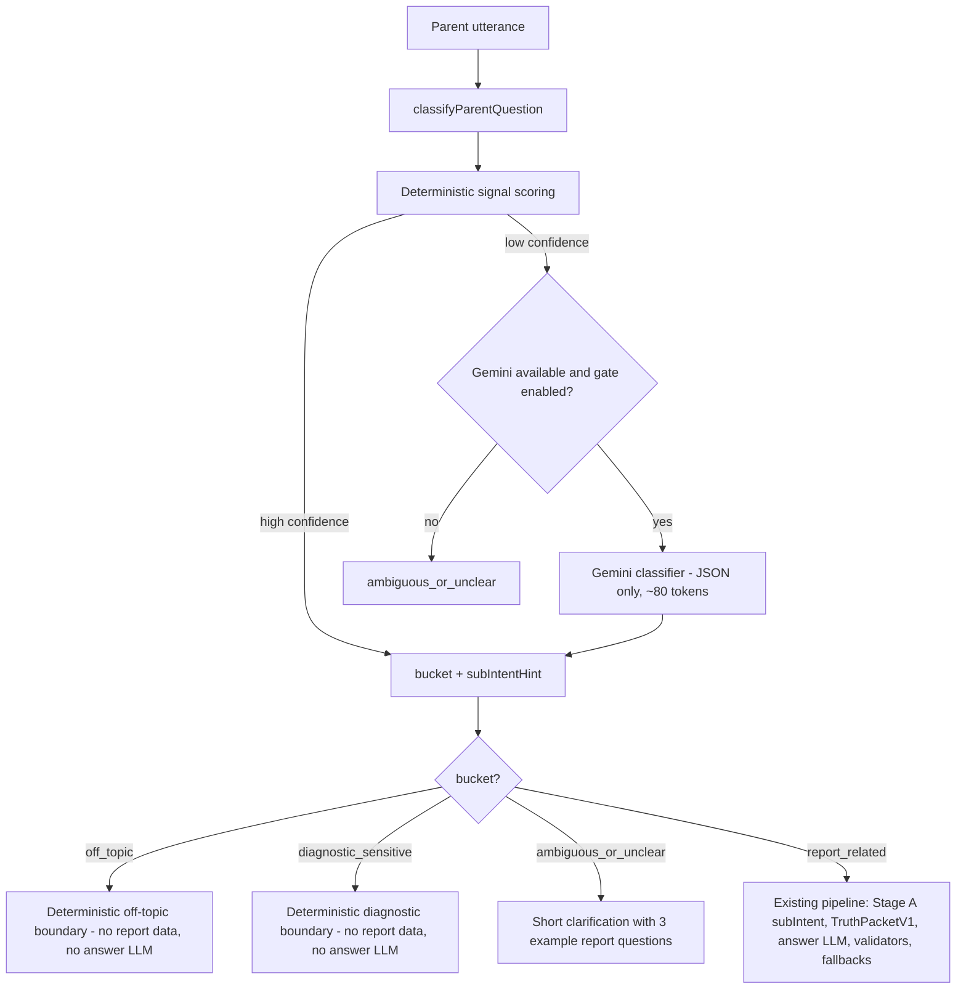

## Goal

Stop the FAQ/regex-as-classifier behavior. Build a single classifier in front of the existing pipeline that produces exactly 4 buckets and routes accordingly. Downstream code (Stage A sub-intents, Truth Packet, answer LLM, validators, fallbacks) stays as it is - the classifier is the only new gate.

## Architecture

The classifier is the only new gate. All downstream code below `report_related` is unchanged.

## Bucket definitions and behaviors

- `off_topic`: not about the report, the child's learning, parenting practice, or this report's subjects/topics. Returns the existing off-topic boundary copy from `OFF_TOPIC_RESPONSE_HE`. No report data. No answer LLM.
- `diagnostic_sensitive`: asks for a clinical label/diagnosis (ADHD, dyslexia, learning disability, emotional disorder, etc.). Returns the existing diagnostic boundary copy from `DIAGNOSTIC_BOUNDARY_RESPONSE_HE`. No report data. No answer LLM.
- `ambiguous_or_unclear`: too short, contradictory signals, no scope at all, or a low-confidence residual. Returns a short clarification with 3 concrete example questions ("מה הכי חשוב לתרגל השבוע?", "במה הילד התחזק?", "מה לעשות בבית?").
- `report_related`: hands off to the existing Stage A + TruthPacketV1 + answer pipeline unchanged.

## Files

### New

- `utils/parent-copilot/question-classifier.js`
  - `classifyParentQuestion({ utterance, payload, llmEnabled })` - returns `{ bucket, confidence, signals, source: "deterministic" | "llm" | "fallback" }`.
  - Deterministic step computes 4 scores in `[0,1]` from signal sets (lexicons + payload-derived subject/topic vocabulary). No regex example FAQ list as primary - signal sets are short and category-based.
  - Decision rules (in order):
    1. `diagnostic_signal >= 0.7` => `diagnostic_sensitive`.
    2. `off_topic_signal >= 0.7 and report_signal <= 0.2` => `off_topic`.
    3. `report_signal >= 0.6 and off_topic_signal <= 0.3` => `report_related`.
    4. Else low confidence: if `llmEnabled` => call classifier LLM; otherwise => `ambiguous_or_unclear`.
- `utils/parent-copilot/question-classifier-llm.js`
  - Tiny wrapper around `callCopilotLlmJson` from `[utils/parent-copilot/copilot-llm-client.js](utils/parent-copilot/copilot-llm-client.js)`. Different prompt, ~80 max tokens, 4s timeout. Output schema: `{ "bucket": "...", "confidence": 0..1, "reason": "..." }`. On any failure (timeout, parse error, http error) returns `{ ok: false }` and the classifier falls back to `ambiguous_or_unclear`.
- `scripts/parent-copilot-classifier-selftest.mjs`
  - Direct tests for `classifyParentQuestion` (deterministic only, Gemini disabled): asserts bucket for adversarial off-topic, diagnostic, ambiguous, and report cases. Also asserts pipeline-level behavior for the same cases via `runParentCopilotTurn` to prove no report data leaks.

### Edited

- `[utils/parent-copilot/question-router.js](utils/parent-copilot/question-router.js)`
  - Keeps `OFF_TOPIC_RESPONSE_HE` and `DIAGNOSTIC_BOUNDARY_RESPONSE_HE` exports (used by `index.js`).
  - `routeParentQuestion` becomes a thin sync deterministic-only wrapper that calls the classifier's deterministic step and returns the same `QaRouterResult` shape (back-compat with `index.js`).
  - Existing `OFF_TOPIC_PATTERNS` / `DIAGNOSTIC_PATTERNS` are reused as the lexical part of the new signal model, not as the primary decider. `INTENT_PATTERNS` (the 7 sub-intent patterns) is moved out: those sub-intents are still produced by `interpretFreeformStageA`, not the router.
- `[utils/parent-copilot/index.js](utils/parent-copilot/index.js)` (around line 466-510)
  - Replace the synchronous-only first gate with the new flow:
    - Sync path (`runParentCopilotTurn`): deterministic classifier only. Low-confidence => `ambiguous_or_unclear` clarification.
    - Async path (`runParentCopilotTurnAsync`): deterministic classifier first; if it returns `ambiguous_or_unclear` and Gemini gate is on, call the classifier LLM and possibly upgrade to `report_related`, `off_topic`, or `diagnostic_sensitive`. Final low-confidence => `ambiguous_or_unclear` clarification.
  - Add an explicit branch for `ambiguous_or_unclear` that returns a clarification response via `buildClarificationParentCopilotResponse` with intent `"unclear"`. No truth packet built. No report data accessed.
  - Telemetry: stamp `classifierBucket`, `classifierSource` (`deterministic` / `llm` / `fallback`), and `classifierConfidence` on the turn telemetry so we can verify in tests and in production logs.
- `[scripts/parent-copilot-qa-selftest.mjs](scripts/parent-copilot-qa-selftest.mjs)`
  - Add adversarial cases that current code fails on. Each must yield `routerExitEarly === true` (or the new ambiguous branch) and an empty surface of report facts. Examples to add:
    - `"מי המציא את החשמל?"` => off_topic
    - `"תכין לי מתכון לעוגיות"` => off_topic
    - `"מי כתב את הארי פוטר?"` => off_topic
    - `"מה זה פוטוסינתזה?"` => off_topic
    - `"כמה זה 17 כפול 24?"` => off_topic
    - `"כן"` / `"מה?"` / `"בסדר"` => ambiguous_or_unclear
    - `"הוא בסדר רגשית?"` => diagnostic_sensitive
- `[package.json](package.json)`
  - Add `"test:parent-copilot-classifier": "tsx scripts/parent-copilot-classifier-selftest.mjs"` script entry. No other config changes.

## Signal model details (deterministic step)

Two-tier signal vocabulary. Tier separation is critical: weak signals alone cannot classify a question as `report_related`.

- **STRONG report tokens (each contributes meaningful weight):**
  - Report vocabulary: `דוח, תרגול, להתאמן, להתקדם, התקדמות, חוזקה, חוזקות, קושי, מתקשה, חזק, חלש, ציון, הצלחה, שיפור, ירידה, מגמה, להתמקד, לתרגל, לעזור לו/לה, איך לעזור, לפי הדוח, על פי הדוח`.
  - Strong report intents: phrases like `במה חזק`, `במה מתקשה`, `מה לתרגל`, `מה לעשות בבית`, `מה הכי חשוב`, `איך לעזור לו/לה`, `יש שיפור`, `יש ירידה`.
  - Subject and topic name overlap with the **current report's** subjects/topics (`payload.subjectProfiles[*].subject` -> Hebrew label via `[utils/parent-copilot/contract-reader.js](utils/parent-copilot/contract-reader.js)` `subjectLabelHe`, plus `payload.subjectProfiles[*].topicRecommendations[*].displayName`). A subject/topic match is a **strong** signal **only when combined with** a child-pronoun OR a strong report intent (so "מה זה פוטוסינתזה" stays off_topic even if `science` is in the report; "מה עם פוטוסינתזה בדוח" / "הוא מתקשה בפוטוסינתזה" become report_related).
- **WEAK report tokens (require pairing with at least one STRONG token to count):**
  - Child pronouns: `הוא, היא, הילד, הילדה, בני, בתי`.
  - Time-only: `השבוע, היום, השנה, החודש, בבית` (when not paired with practice/learning intent these often appear in off-topic too: "מה לאכול היום", "הוא אוהב פיצה").
- `report_signal` formula:
  - Each STRONG token = +0.35 (cap at 1.0); WEAK token = +0.10 only if at least one STRONG token is present, else +0.0.
  - Subject/topic name match alone (no pronoun, no strong intent) = +0.20 (insufficient by itself; pushes toward `ambiguous_or_unclear` rather than `report_related`).
  - Generic-knowledge framing tokens (`מה זה`, `הסבר לי מה זה`, `מי המציא`, `מי גילה`, `כמה עולה`, `איך מכינים`, `מי כתב`) clamp `report_signal` to <= 0.3 even if a subject/topic name appears.
- `off_topic_signal`:
  - Category lexicons: weather, time-of-day, jokes, politics, sports, food/recipe, code, news, currency, world facts, general arithmetic, song-writing, generic chitchat (`מה אתה חושב`, `מה דעתך`, `מי אתה`).
  - Reduced when STRONG report signal is present.
- `diagnostic_signal`:
  - Clinical nouns/adjectives: `דיסלקציה, דיסלקסיה, דיסלקסי, דיסקלקוליה, ADHD, לקות למידה, הפרעת קשב, בעיית קשב, אוטיזם, חרדה, OCD, רגשית בסדר, רגשי בסדר, יש לו אבחון`.
  - Independent from report_signal: takes precedence in decision rules.
- `ambiguity_signal`:
  - Utterance has fewer than 3 meaningful tokens after normalization (e.g., `כן`, `לא`, `מה?`, `אוקיי`, `תסביר`, `מה אתה חושב`).
  - Both `report_signal` and `off_topic_signal` >= 0.4 (true mixed signals).
  - Subject/topic name without pronoun and without strong intent (e.g., `תסביר לי שברים`).

**Decision rules (revised, reflecting the two-tier model):**
1. `diagnostic_signal >= 0.7` => `diagnostic_sensitive`.
2. `off_topic_signal >= 0.6` AND no STRONG report token present => `off_topic`.
3. `report_signal >= 0.6` AND `off_topic_signal <= 0.3` AND at least one STRONG report token present => `report_related`.
4. Subject/topic name match WITHOUT a pronoun and WITHOUT a strong intent => `ambiguous_or_unclear` (not `report_related`).
5. Else low confidence: if `llmEnabled` and async path => call classifier LLM; otherwise => `ambiguous_or_unclear`.

Decision boundaries are exported as constants for direct test assertion.

**Concrete examples (must hold in deterministic step, no LLM):**
- `הוא אוהב פיצה?` -> `off_topic` (only weak `הוא` + food token).
- `הוא מתקשה בשברים?` -> `report_related` (`מתקשה` strong + topic match `שברים`).
- `מה זה פוטוסינתזה?` -> `off_topic` (generic-knowledge framing).
- `מה עם פוטוסינתזה בדוח?` -> `report_related` if `פוטוסינתזה` is a topic in the report (`בדוח` is a strong token).
- `תסביר לי שברים` -> `ambiguous_or_unclear` (topic match alone, no pronoun, no strong intent).
- `איך לעזור לו בשברים לפי הדוח?` -> `report_related` (strong `לעזור לו`, strong `לפי הדוח`, topic match).
- `הוא בסדר רגשית?` -> `diagnostic_sensitive`.
- `כמה עולה ביטקוין?` / `איך מכינים פיצה?` / `מי כתב את הארי פוטר?` / `מה מזג אויר?` -> `off_topic`.
- `מה אתה חושב?` / `תסביר` / `כן` -> `ambiguous_or_unclear`.

## LLM classifier (residual only)

- Provider: existing `[utils/parent-copilot/copilot-llm-client.js](utils/parent-copilot/copilot-llm-client.js)` via `callCopilotLlmJson`.
- Prompt (Hebrew, terse): system says "סווג את שאלת ההורה לאחת מ־4 קטגוריות בהקשר של דוח למידה. תחזיר JSON בלבד.", lists buckets and one-line definitions, includes the report's subjects (from payload), then the utterance.
- Output: strict `{ "bucket": "report_related" | "off_topic" | "diagnostic_sensitive" | "ambiguous_or_unclear", "confidence": 0..1 }`.
- Budget: `temperature: 0`, `maxOutputTokens: 80`, 4s timeout via `AbortController`. On any failure => deterministic fallback => `ambiguous_or_unclear`.
- Confidence floor for accepting LLM upgrade: 0.7. Below that, stay `ambiguous_or_unclear`.

## Hard gate guarantees (for off_topic / diagnostic_sensitive / ambiguous_or_unclear)

For every non-`report_related` bucket, the gate must hold these invariants. Tests assert each one:

- No `truthPacket` is built (`buildTruthPacketV1` is never called).
- No answer-generation LLM call is made (`maybeGenerateGroundedLlmDraft` is not invoked).
- The response text contains no subject names, no topic names, no question counts, and no `לפי הדוח` / `על פי הדוח` substring.
- Telemetry `generationPath` is `deterministic`.
- Telemetry `classifierBucket` matches the expected bucket and `classifierSource` is `deterministic`, `llm`, or `fallback`.

## Acceptance tests

### Deterministic test (`scripts/parent-copilot-classifier-selftest.mjs`)

Runs the classifier directly AND through the sync pipeline (Gemini disabled). Must include the **exact regression list** from the latest user feedback:

- `מה מזג אויר?` -> `off_topic`
- `כמה עולה ביטקוין?` -> `off_topic`
- `איך מכינים פיצה?` -> `off_topic`
- `מי כתב את הארי פוטר?` -> `off_topic`
- `מה זה פוטוסינתזה?` -> `off_topic`
- `הוא אוהב משחקים?` -> `off_topic` (weak pronoun + food/games, no strong intent)
- `מה אתה חושב?` -> `ambiguous_or_unclear`
- `תסביר` -> `ambiguous_or_unclear`

Plus the additional adversarial set:
- `מי המציא את החשמל?` / `תכין לי מתכון לעוגיות` / `כמה זה 17 כפול 24?` -> `off_topic`
- `כן` / `מה?` / `בסדר` / `אוקיי` -> `ambiguous_or_unclear`
- `הוא בסדר רגשית?` / `אולי יש לו לקות למידה?` / `יש לו ADHD?` / `האם הוא דיסלקסי?` -> `diagnostic_sensitive`
- `הוא מתקשה בשברים?` / `מה הכי חשוב לתרגל השבוע?` / `במה הוא חזק?` / `מה לעשות בבית?` / `איך לעזור לו בשברים לפי הדוח?` -> `report_related`
- Two-tier signal proof: `הוא אוהב פיצה?` -> NOT `report_related`; `הוא מתקשה בשברים?` -> `report_related`.

For every non-`report_related` case the test asserts the hard gate guarantees above.

The original 7 product questions remain `report_related` (sanity regression).

### Live classifier smoke test (`scripts/parent-copilot-classifier-live-smoke.mjs`)

Skips gracefully when no `GEMINI_API_KEY` and `PARENT_COPILOT_LLM_*` flags are set. When enabled, runs:

- 1-2 unrelated questions not pre-listed (e.g., `מה דעתך על הדגל הישראלי?`, `איך מתקנים מקרר?`).
- 1-2 vague questions (`תסביר`, `מה אתה חושב על זה?`).
- 1-2 report-related questions (`מה הכי חשוב לתרגל השבוע?`, `במה הוא חזק?`).
- 1-2 diagnostic questions (`האם יש לו ADHD?`, `הוא דיסלקסי?`).

For each it prints a single line: `bucket=... confidence=... source=deterministic|llm|fallback reportContextUsed=true|false`. `reportContextUsed=true` only when a `truthPacket` was built (i.e., `report_related` and the pipeline ran). Exit non-zero only on assertion failure (e.g., a diagnostic case classified as report_related), not on Gemini quota issues.

## Out of scope (per your constraints)

- No UI changes.
- No changes to the static "סיכום חכם להורה" block (that lives in `[utils/parent-report-ai-narrative](utils/parent-report-ai-narrative)`, untouched).
- No validator weakening.
- No heavy mass simulation - just the focused tests above.
- No new sample-output polish; the existing 7 baseline answers stay as-is.

## Verification commands (after implementation)

- `npm run test:parent-copilot-classifier` (new, deterministic-only)
- `npm run test:parent-copilot-classifier:live-smoke` (new, optional, skips when no Gemini key)
- `npm run test:parent-copilot-qa` (existing 117 still pass)
- `npm run test:parent-report-ai-narrative` (existing 21 still pass)
- `npm run build`