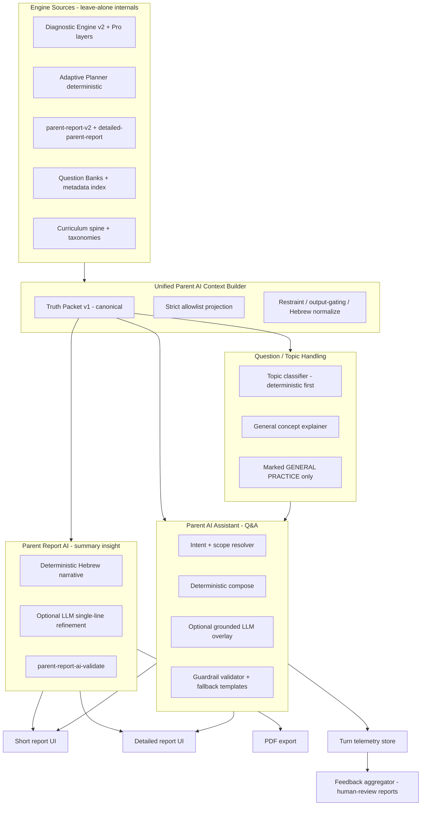

# Parent AI Final Architecture Plan

> Planning only. No edits, no long QA, no code in this document. All file references are read-only links to current sources.

---

## 1. Current State Map

### 1.1 Parent-facing AI surfaces (KEEP / EXTEND)

- [`utils/parent-report-ai/parent-report-ai-explainer.js`](utils/parent-report-ai/parent-report-ai-explainer.js) — **exists**. Builds strict-allowlist input, deterministic Hebrew narrative, optional OpenAI completion (`{ "text": "..." }`), validates output. **Reuse as the "summary insight" layer.**
- [`utils/parent-report-ai/parent-report-ai-adapter.js`](utils/parent-report-ai/parent-report-ai-adapter.js) — **exists**. Adapter from `generateParentReportV2` snapshot → strict input → `{ parentAiExplanation }`. **Reuse, extend with detailed-report adapter.**
- [`lib/parent-report-ai/parent-report-ai-validate.js`](lib/parent-report-ai/parent-report-ai-validate.js) — **exists**. Hebrew-safe one-line validator (length, ratio, no digits/markdown/emoji, no internal/medical/blame/scary/promise leakage). **Reuse.**
- [`scripts/parent-report-ai-scenario-simulator.mjs`](scripts/parent-report-ai-scenario-simulator.mjs) and [`scripts/parent-report-ai-integration.mjs`](scripts/parent-report-ai-integration.mjs) — **exist**. Scenario matrix + adapter integration tests. **Reuse, extend matrix.**
- [`utils/parent-copilot/`](utils/parent-copilot) — **exists** (~30 files, comprehensive). Q&A engine: `truth-packet-v1.js`, `scope-resolver.js`, `intent-resolver.js`, `stage-a-freeform-interpretation.js`, `conversation-planner.js`, `answer-composer.js`, `guardrail-validator.js`, `fallback-templates.js`, `llm-orchestrator.js` with rollout gates, `telemetry-store.js`, `turn-telemetry.js`, `rollout-gates.js` (KPI thresholds + LLM enable gates), `semantic-aggregate-answers.js`, `followup-engine.js`, `session-memory.js`, README, etc. Public entry: `runParentCopilotTurn` (deterministic) and `runParentCopilotTurnAsync` (deterministic-first + optional grounded LLM overlay). **This is the Parent AI Assistant foundation.**
- [`components/parent-copilot/parent-copilot-shell.jsx`](components/parent-copilot/parent-copilot-shell.jsx), [`parent-copilot-panel.jsx`](components/parent-copilot/parent-copilot-panel.jsx), [`parent-copilot-quick-actions.jsx`](components/parent-copilot/parent-copilot-quick-actions.jsx) — **exist**. Panel UI for Q&A, wired into both detailed-report pages.
- [`pages/learning/parent-report.js`](pages/learning/parent-report.js) — **exists**. Short report. Calls `enrichParentReportWithParentAi`, renders `report.parentAiExplanation.text` under the heading "תובנה להורה". **No copilot panel here.**
- [`pages/learning/parent-report-detailed.js`](pages/learning/parent-report-detailed.js) and [`pages/learning/parent-report-detailed.renderable.jsx`](pages/learning/parent-report-detailed.renderable.jsx) — **partial**. Render `ParentCopilotShell` but **do not** render `parentAiExplanation` summary insight (asymmetry with short report).
- [`utils/contracts/parent-product-contract-v1.js`](utils/contracts/parent-product-contract-v1.js) and [`utils/contracts/parent-report-contracts-v1.js`](utils/contracts/parent-report-contracts-v1.js) — **exist**. Canonical contracts feeding both surfaces. **Reuse.**
- [`PARENT_REPORT_PRODUCT_ORACLE.md`](PARENT_REPORT_PRODUCT_ORACLE.md) — **exists**. Per-`actionState` rules covering short, detailed, copilot intents, hybrid mode, intensity caps (RI0–RI3), `cannotConcludeYet`, `recommendationEligible`. **Authoritative product contract.**
- [`utils/parent-report-diagnostic-restraint.js`](utils/parent-report-diagnostic-restraint.js), [`utils/parent-report-ui-explain-he.js`](utils/parent-report-ui-explain-he.js), [`utils/parent-report-root-cause.js`](utils/parent-report-root-cause.js) — **exist**. Restraint, Hebrew sanitization, root-cause estimator. **Reuse upstream of AI.**

### 1.2 Engines/data the Parent AI must consume (REUSE, LEAVE-ALONE internally)

- Diagnostic v2 + sub-engines: [`utils/diagnostic-engine-v2/`](utils/diagnostic-engine-v2), [`utils/fast-diagnostic-engine/`](utils/fast-diagnostic-engine), [`utils/learning-diagnostics/`](utils/learning-diagnostics) (mastery, reliability, cross-subject, misconception, probe, dependency, calibration). **Source of truth.**
- Adaptive planner core: [`utils/adaptive-learning-planner/adaptive-planner.js`](utils/adaptive-learning-planner/adaptive-planner.js), `adaptive-planner-input-adapter.js`, `adaptive-planner-rules.js`, `adaptive-planner-runtime-bridge.js`, `adaptive-planner-metadata-context.js`, `diagnostic-unit-skill-alignment.js`, `adaptive-planner-contract.js`. **Deterministic; AI consumes outputs only.**
- Parent report builder: [`utils/parent-report-v2.js`](utils/parent-report-v2.js), [`utils/detailed-parent-report.js`](utils/detailed-parent-report.js), [`utils/topic-next-step-engine.js`](utils/topic-next-step-engine.js).
- Question banks (subjects = math, geometry, hebrew, english, science, moledet_geography): [`data/`](data) tables + generators in [`utils/`](utils); metadata QA in [`utils/question-metadata-qa/`](utils/question-metadata-qa); planner metadata index at [`reports/adaptive-learning-planner/metadata-index-snapshot.json`](reports/adaptive-learning-planner/metadata-index-snapshot.json).
- Topic/subskill metadata: [`utils/diagnostic-engine-v2/taxonomy-*.js`](utils/diagnostic-engine-v2), [`data/curriculum-spine/v1/skills.json`](data/curriculum-spine/v1/skills.json), `data/*-curriculum.js`, `utils/learning-diagnostics/question-skill-metadata-v1.js`.
- Student history: Supabase `learning_sessions` + `answers` (via [`pages/api/learning/session/start.js`](pages/api/learning/session/start.js), [`finish.js`](pages/api/learning/session/finish.js), [`answer.js`](pages/api/learning/answer.js)); parent rollup [`pages/api/parent/students/[studentId]/report-data.js`](pages/api/parent/students/[studentId]/report-data.js); legacy localStorage handled by [`lib/learning-supabase/report-data-adapter.js`](lib/learning-supabase/report-data-adapter.js).
- Existing PDF gates/scripts: [`scripts/qa-parent-pdf-export.mjs`](scripts/qa-parent-pdf-export.mjs) and [`scripts/learning-simulator/run-pdf-export-gate.mjs`](scripts/learning-simulator/run-pdf-export-gate.mjs).

### 1.3 Student-facing AI explainer (FREEZE — see §13)

- [`utils/adaptive-learning-planner/adaptive-planner-ai-explainer.js`](utils/adaptive-learning-planner/adaptive-planner-ai-explainer.js)
- [`pages/api/learning/planner-recommendation.js`](pages/api/learning/planner-recommendation.js) (the optional `explanation` payload only)
- [`components/LearningPlannerRecommendationBlock.js`](components/LearningPlannerRecommendationBlock.js)
- [`lib/learning-client/adaptive-planner-recommendation-view-model.js`](lib/learning-client/adaptive-planner-recommendation-view-model.js), [`lib/learning-client/adaptive-planner-explanation-validate.js`](lib/learning-client/adaptive-planner-explanation-validate.js)
- Wiring inside [`pages/learning/hebrew-master.js`](pages/learning/hebrew-master.js), [`math-master.js`](pages/learning/math-master.js), [`english-master.js`](pages/learning/english-master.js), [`geometry-master.js`](pages/learning/geometry-master.js), [`science-master.js`](pages/learning/science-master.js), [`moledet-geography-master.js`](pages/learning/moledet-geography-master.js)
- Scripts: [`scripts/adaptive-planner-ai-explainer.mjs`](scripts/adaptive-planner-ai-explainer.mjs), [`scripts/adaptive-planner-scenario-simulator.mjs`](scripts/adaptive-planner-scenario-simulator.mjs)

### 1.4 Asymmetries / gaps to close

- Short report: has summary insight, **no Q&A panel**.
- Detailed report: has Q&A panel, **no summary insight**.
- PDF/export: includes neither AI surface today (gates exist, content does not).
- Q&A scope-resolver works on report scopes; **no path** for "topic not in payload" or "external question pasted by parent".
- Telemetry: `telemetry-store.js` records turns; **no aggregation/feedback report** exists yet.
- Detailed report `.js` and `.renderable.jsx` are **drift-prone twins** (e.g. contract summary block exists in `.js` only).

---

## 2. Product Goal

A single professional Parent AI system that:

- Explains the child's report in plain Hebrew at three depths: short, detailed, PDF.
- Answers free-form parent questions grounded in the same Truth Packet.
- Explains why a recommendation was made.
- Suggests at-home practice **only** when contracts permit (`recommendationEligible`, intensity cap above RI0).
- Handles questions about topics/questions outside the bank with explicit "no evidence about your child" framing.
- States missing-data honestly (`cannotConcludeYet`, low confidence).
- Stays grounded; never invents weaknesses; never gives clinical/psychological diagnosis.
- Improves through a controlled feedback loop where humans review suggestions before any official change.

Out of scope: student-facing AI of any kind (explainers, chat, narrative coaching). Frozen.

---

## 3. Target Architecture

Layered model:

- **L0 Engines** (read-only to AI): diagnostic v2, planner, report builders, banks, taxonomies.
- **L1 Context Builder**: single canonical projection. Promote `utils/parent-copilot/truth-packet-v1.js` to be the **only** producer of the Parent AI Truth Packet. The current `parent-report-ai-adapter.js` becomes a thin caller that derives its strict allowlisted input **from** the same Truth Packet (kills divergence between short-form and Q&A grounding).
- **L2a Summary AI**: `parent-report-ai-explainer` produces the single-line Hebrew insight. Deterministic by default; LLM behind same env switches; validator gate.
- **L2b Assistant AI**: `parent-copilot/index.js` produces conversational answers. Deterministic-first with strict guardrails; LLM overlay only when rollout gates + KPI gates pass.
- **L2c External Question Handler**: new module on top of L1. Deterministic taxonomy match; if no match, "general concept" mode with explicit no-evidence framing.
- **L3 Surfaces**: short page, detailed page, PDF gate. All consume L2 outputs through the report payload (no surface re-runs engines).
- **L4 Feedback**: aggregator over `telemetry-store.js` writes human-review reports under `reports/parent-ai/feedback/` and `reports/parent-ai/improvement-suggestions/`. Never writes back to L0.

---

## 4. Data and Context Rules

### 4.1 Allowed inputs to AI

- Truth Packet v1 (already strict-allowlisted): `scopeType/Id/Label`, `derivedLimits` (`cannotConcludeYet`, `readiness`, `confidenceBand`, `recommendationEligible`, `recommendationIntensityCap`, `allowedFollowupFamilies`), `contracts.{evidence, decision, readiness, confidence, recommendation, narrative}`, sanitized Hebrew text slots.
- Aggregated report-level fields needed for "what does my child do well / where to start": `diagnosticOverviewHe`, `rawMetricStrengthsHe`, primary subject by question count, planner `nextAction` decision band — already projected by [`parent-report-ai-adapter.js`](utils/parent-report-ai/parent-report-ai-adapter.js).
- Topic-level deterministic recommendation lines from [`utils/topic-next-step-engine.js`](utils/topic-next-step-engine.js).

### 4.2 Forbidden to AI (must never reach prompt or output)

- Raw answer events, raw question text or IDs, internal scoring vectors.
- `RI0`–`RI3` codes, schema names, `truthPacket`, `contractsV1`, `JSON.stringify`, URLs, telemetry IDs (already enforced by `FORBIDDEN_PARENT_SURFACE_TOKENS` in [`guardrail-validator.js`](utils/parent-copilot/guardrail-validator.js)).
- PII: child name beyond payload's existing parent-facing label, parent contact info, access codes.
- Clinical/medical labels (dyslexia, dyscalculia, ADHD, "the diagnosis is …") — already in clinical regex sets.
- Numbers in summary line (digits forbidden in `validateParentReportAIText`).

### 4.3 Summarized-before-AI

- Per-subject mastery vectors → `confidenceBand`.
- Mistake recurrence → `cannotConcludeYet` + `readiness` only.
- Time-on-task → `derivedLimits` only, never raw seconds.

### 4.4 Missing data handling

- Below evidence threshold: AI must use the contract's `cannotConcludeYet=true` branch wording. Summary insight switches to deterministic "אין עדיין מספיק נתונים" template; assistant uses the existing `uncertainty_boundary` intent.
- Subject not present: assistant returns clarification (existing `clarification_required` path) — no invention.
- Topic not in bank: handled in §7.

---

## 5. Parent Report AI (summary insight)

### 5.1 Where it appears

- Short report [`pages/learning/parent-report.js`](pages/learning/parent-report.js): **already wired** at "תובנה להורה" — leave the slot, swap the input source to the Truth-Packet-derived adapter (Phase B).
- Detailed report [`pages/learning/parent-report-detailed.js`](pages/learning/parent-report-detailed.js) and [`.renderable.jsx`](pages/learning/parent-report-detailed.renderable.jsx): **add** a single insight block above `ParentCopilotShell` to match short-report parity. Same text, same validator.
- PDF export: include the rendered insight only. Do **not** include interactive Q&A. Optionally include a deterministic "answers to common parent questions" block built by running `runParentCopilotTurn` (sync, no LLM) over a short fixed prompt list per `actionState` — pre-rendered into the PDF.

### 5.2 Behavior rules

- One Hebrew sentence (existing length cap from `PARENT_REPORT_AI_DEFAULT_MAX_LEN`).
- No digits, no markdown, no emoji.
- Mirrors planner `nextAction` band wording from [`recommendedNextStepHeFromPlannerAction`](utils/parent-report-ai/parent-report-ai-explainer.js).
- Deterministic by default. LLM only when `OPENAI_API_KEY` + `PARENT_REPORT_AI_EXPLAINER_*` flags allow; falls back deterministically on any validator failure.

### 5.3 Files touched (Phase C)

- New thin adapter: extend [`parent-report-ai-adapter.js`](utils/parent-report-ai/parent-report-ai-adapter.js) with `enrichDetailedParentReportWithParentAi(detailedPayload)`.
- Mount point in detailed pages, `.js` and `.renderable.jsx` together (avoid drift).
- PDF gate update: extend [`scripts/qa-parent-pdf-export.mjs`](scripts/qa-parent-pdf-export.mjs) to assert presence of the insight; extend [`scripts/learning-simulator/run-pdf-export-gate.mjs`](scripts/learning-simulator/run-pdf-export-gate.mjs) similarly.

---

## 6. Parent AI Assistant / Q&A

### 6.1 Foundation

Use [`utils/parent-copilot/index.js`](utils/parent-copilot/index.js) as the single Q&A engine. Existing capabilities to preserve:

- `runParentCopilotTurn` (sync, deterministic only) — used in PDF/pre-render and tests.
- `runParentCopilotTurnAsync` (deterministic-first, optional grounded LLM overlay) — used at runtime.
- Rollout gates: `PARENT_COPILOT_FORCE_DETERMINISTIC`, `PARENT_COPILOT_LLM_ENABLED`, `PARENT_COPILOT_LLM_EXPERIMENT`, `PARENT_COPILOT_ROLLOUT_STAGE`.
- KPI thresholds for review: `PARENT_COPILOT_KPI_*`.
- Validator + clinical-boundary fallback.

### 6.2 Behavior matrix per parent intent

- "מה כדאי לתרגל בבית?" → existing `what_to_do_today` / `what_to_do_this_week` intents. Suppressed when `recommendationEligible=false` or cap=`RI0` → switch to general supportive copy from [`fallback-templates.js`](utils/parent-copilot/fallback-templates.js).
- "למה ההמלצה הזאת?" → existing `explain_recommendation` path; reads `contractsV1.recommendation` + `contractsV1.decision`.
- "מה זה הנושא הזה?" → existing `explain_report` path on topic scope.
- "הילד טעה בשאלה הזאת מבחוץ" → new external-question route (§7).
- "האם הילד חלש?" → suppressed-then-redirected by clinical-boundary detector; rephrases to evidence-based wording from contracts.
- "האם יש מספיק מידע?" → existing `uncertainty_boundary`; reads `derivedLimits.confidenceBand` + `cannotConcludeYet`.
- Unsafe / out-of-scope (medical, comparative, judgmental) → clinical-boundary copy + suggestion to consult a teacher (already in [`ParentReportImportantDisclaimer.js`](components/ParentReportImportantDisclaimer.js)).

### 6.3 New surfaces

- Wire `ParentCopilotShell` into [`pages/learning/parent-report.js`](pages/learning/parent-report.js) (short report) below the summary insight, gated by `NEXT_PUBLIC_ENABLE_PARENT_COPILOT_ON_SHORT` to allow staged rollout.
- Optional: extract a small REST endpoint (`pages/api/parent/copilot-turn.js`) so the panel can run server-side LLM calls without leaking keys to the client. Only needed if LLM rollout stage moves past `internal`.

### 6.4 Files touched (Phase D)

- [`pages/learning/parent-report.js`](pages/learning/parent-report.js) — mount shell.
- New: `pages/api/parent/copilot-turn.js` (server-side `runParentCopilotTurnAsync` invocation, scope from request body, payload from session-bound report fetch).
- Extend [`utils/parent-copilot/scope-resolver.js`](utils/parent-copilot/scope-resolver.js) with the external-question scope (§7) — additive only.

---

## 7. Question and Topic Handling

### 7.1 Three input shapes

1. **Topic in bank, child has data** → use existing `truth-packet-v1` topic scope. AI cites the report scope only.
2. **Topic in bank, child has insufficient data** → `cannotConcludeYet=true` + `confidenceBand=low`; AI explains the topic generically and explicitly says no child-specific evidence yet.
3. **Topic / question not in bank, or external question pasted** → new path:
   - Run a **deterministic topic classifier** (Tier 1) that maps free text to subject + closest taxonomy ID using existing tables in [`utils/diagnostic-engine-v2/taxonomy-*.js`](utils/diagnostic-engine-v2), `data/*-curriculum.js`, and [`utils/question-metadata-qa/*`](utils/question-metadata-qa). Confidence threshold required.
   - If matched → present as "נושא משוער: …", and AI may relate it to known report data **only if** the matched taxonomy ID overlaps with a scope present in the report. Otherwise remains generic.
   - If unmatched / low confidence → fall back to **general concept explainer** (Tier 2): single Hebrew paragraph, prefixed by an explicit no-evidence disclaimer from `fallback-templates.js`.
   - If parent asks for a similar practice question → AI may produce **at most one** practice idea, deterministically labeled "תרגול כללי – לא מתוך מאגר השאלות הרשמי, לא משתנה אבחון". Stored under `reports/parent-ai/practice-suggestions/` for human review. **Never inserted into banks.**

### 7.2 Hard rules

- AI **never** writes to question banks, taxonomies, or diagnostic decisions.
- AI **never** changes `recommendedNextStep` for a topic; it can only quote the existing one.
- The classifier is reviewable: its mappings are exported to `reports/parent-ai/topic-classifier-coverage.json`.

### 7.3 Files (Phase E)

- New: `utils/parent-ai-topic-classifier/classifier.js` (deterministic).
- New: `utils/parent-ai-topic-classifier/external-question-route.js` (composes scope and Hebrew prefix).
- Hook into `scope-resolver.js` as an additional resolution branch when the parent utterance carries an "external question" tag (UI-supplied) or when scope resolution returns `clarification_required` due to missing scope.
- New: `scripts/parent-ai-topic-classifier-coverage.mjs` writes coverage report.

---

## 8. Feedback / Learning Loop

### 8.1 Inputs already collected

- [`utils/parent-copilot/telemetry-store.js`](utils/parent-copilot/telemetry-store.js) appends `traceId`, `intent`, `scope`, `generationPath`, `fallbackUsed`, `fallbackReasonCodes`, `validatorStatus`, `validatorFailCodes`, `llmAttempt`.

### 8.2 New aggregation script (read-only over telemetry)

- New: `scripts/parent-ai-feedback-aggregate.mjs` produces, daily/manually:
  - `reports/parent-ai/feedback/turns-summary.{json,md}`: counts by intent, scope, fallback rate, validator failure rate, `cannotConcludeYet` rate per subject.
  - `reports/parent-ai/feedback/low-confidence.{json,md}`: turns where `intentConfidence` or `scopeConfidence` below threshold.
  - `reports/parent-ai/feedback/repeated-unanswered.{json,md}`: utterances repeating across sessions with no resolution.
  - `reports/parent-ai/improvement-suggestions/topic-gaps.md`: topics referenced by parents whose taxonomy ID does not exist in spine — proposed additions only.
  - `reports/parent-ai/improvement-suggestions/practice-ideas.md`: deduped Tier-2 practice suggestions awaiting human review.

### 8.3 Optional explicit feedback

- Quick-action thumbs in `parent-copilot-quick-actions.jsx` writing only to telemetry (no payload mutation).

### 8.4 Hard rules

- Aggregator outputs are **human-review queues**. No script in this repo modifies banks, taxonomies, contracts, or rendered text based on these reports.
- All accept/reject decisions remain manual edits to existing files.

---

## 9. Safety and Privacy

### 9.1 Reuse existing guards

- [`guardrail-validator.js`](utils/parent-copilot/guardrail-validator.js): `FORBIDDEN_PARENT_SURFACE_TOKENS`, clinical regex sets, recommendation eligibility checks.
- [`parent-report-ai-validate.js`](lib/parent-report-ai/parent-report-ai-validate.js): single-line Hebrew checks, no internal/medical/blame/scary/promise leakage, `parentReportAiInputToNarrativeEngineSnapshot` for `validateParentNarrativeSafety`.
- [`utils/parent-report-language/parent-facing-normalize-he.js`](utils/parent-report-language) for output normalization.
- [`ParentReportImportantDisclaimer.js`](components/ParentReportImportantDisclaimer.js) for the static "not a clinical diagnosis" notice.

### 9.2 Hallucination controls

- Deterministic-first everywhere (both summary and Q&A).
- LLM output must validate against the same guardrails as deterministic output, then re-validate as final response (`validateParentCopilotResponseV1`).
- LLM call only when env gates **and** KPI thresholds permit (`rollout-gates.js`).

### 9.3 Logging boundaries

- Telemetry stores `utteranceLength`, not the utterance itself. This must remain true for the new aggregator.
- No PII in `reports/parent-ai/**`. Aggregated counts only.

### 9.4 Child privacy

- Server endpoint `/api/parent/copilot-turn.js` requires the same parent auth used by [`pages/api/parent/students/[studentId]/report-data.js`](pages/api/parent/students/[studentId]/report-data.js).
- Per-session `sessionId` namespacing in `session-memory.js` already isolates conversations.

---

## 10. Simulation and QA Plan

### 10.1 Reuse / extend existing simulators

- Extend [`scripts/parent-report-ai-scenario-simulator.mjs`](scripts/parent-report-ai-scenario-simulator.mjs) with: detailed-report scenarios, PDF-snapshot insight presence, external-question scenarios, no-evidence scenarios.
- Extend [`scripts/parent-report-ai-integration.mjs`](scripts/parent-report-ai-integration.mjs) with: detailed adapter integration, copilot/short-report co-mount sanity.
- Reuse Parent Copilot suites: `npm run test:parent-copilot-async-llm-gate`, `test:parent-copilot-phase4`, `test:parent-copilot-phase5`, `test:parent-copilot-executive-answer-safe-matrix`, [`scripts/parent-copilot-parent-render-suite.mjs`](scripts/parent-copilot-parent-render-suite.mjs), [`scripts/parent-copilot-phase6-hebrew-robustness-suite.mjs`](scripts/parent-copilot-phase6-hebrew-robustness-suite.mjs).
- Reuse PDF gates: [`scripts/qa-parent-pdf-export.mjs`](scripts/qa-parent-pdf-export.mjs), [`scripts/learning-simulator/run-pdf-export-gate.mjs`](scripts/learning-simulator/run-pdf-export-gate.mjs).

### 10.2 New simulators

- New: `scripts/parent-ai-assistant-qa-simulator.mjs` — parent profiles × intents × scopes matrix; asserts grounding and refusal patterns.
- New: `scripts/parent-ai-external-question-simulator.mjs` — Tier-1 classifier hits, Tier-2 fallbacks, "no evidence" prefix presence, no bank mutation.
- New: `scripts/parent-ai-bad-prompt-simulator.mjs` — clinical, judgmental, comparative, jailbreak, off-topic; assert clinical-boundary or graceful redirect.
- New: `scripts/parent-ai-topic-classifier-coverage.mjs` — deterministic coverage map.

### 10.3 Test cadence

- **Focused tests** (after every relevant change):
  - `npm run test:parent-report-ai:integration`
  - `npm run test:parent-report-ai:scenario-simulator`
  - the specific parent-copilot suite touched
- **Build**: `npm run build` after each phase.
- **Quick QA**: PDF gate + the two new assistant simulators.
- **Full QA**: full learning-simulator orchestrator — **only at end of Phase H**, not after every small change.

### 10.4 Safety / no-leak / no-hallucination tests

- Safety: bad-prompt simulator + existing clinical-boundary tests.
- No-leak: assert `FORBIDDEN_PARENT_SURFACE_TOKENS` not present in any rendered surface or PDF.
- No-hallucination/grounding: every assistant answer block traceable to a `contractSourcesUsed` entry.

---

## 11. Execution Phases

> Each phase is finite. Risk levels: L (low), M (medium), H (high).

### Phase A — Audit and cleanup plan

- **Goal**: Lock the freeze list (§13), document drift between detailed report `.js` and `.renderable.jsx`, and produce a single-page audit doc at `docs/parent-ai/current-state.md`.
- **Files likely touched**: docs only. No code edits.
- **Tests needed**: none (markdown-only).
- **Acceptance**: `docs/parent-ai/current-state.md` exists, lists each parent-AI module + status + freeze flag.
- **UI changes**: none.
- **Risk**: L.
- **Do not change**: any source files.

### Phase B — Unified Parent AI context builder

- **Goal**: Single canonical Truth Packet feeding both the summary explainer and the Q&A copilot.
- **Files**: [`utils/parent-copilot/truth-packet-v1.js`](utils/parent-copilot/truth-packet-v1.js) (read-only consumer change), [`utils/parent-report-ai/parent-report-ai-adapter.js`](utils/parent-report-ai/parent-report-ai-adapter.js) (refactor to derive its strict input from the same Truth Packet projection).
- **What gets built**: a thin shared helper `utils/parent-ai-context/build-parent-ai-context.js` that returns `{ truthPacket, strictExplainerInput }` for a given report payload + scope.
- **Tests**: extended `parent-report-ai-integration.mjs` asserts both surfaces compute over the same packet keys.
- **Acceptance**: short report continues to render the same insight text on a fixed fixture; Q&A turns unchanged on the existing Phase 4–6 suites.
- **UI**: none.
- **Risk**: M (refactor under live surfaces).
- **Do not change**: contracts, diagnostic engines, planner.

### Phase C — Parent Report AI integration for detailed + PDF

- **Goal**: Add summary insight to detailed pages; include it in PDF.
- **Files**: [`pages/learning/parent-report-detailed.js`](pages/learning/parent-report-detailed.js), [`pages/learning/parent-report-detailed.renderable.jsx`](pages/learning/parent-report-detailed.renderable.jsx), `parent-report-ai-adapter.js` (add `enrichDetailedParentReportWithParentAi`), [`scripts/qa-parent-pdf-export.mjs`](scripts/qa-parent-pdf-export.mjs), [`scripts/learning-simulator/run-pdf-export-gate.mjs`](scripts/learning-simulator/run-pdf-export-gate.mjs).
- **What gets built**: a single `<ParentReportInsight />` component reused by short, detailed, and pre-render path of PDF.
- **Tests**: extend scenario simulator with `detailed_*` cases; PDF gate asserts insight present and within validator bounds.
- **Acceptance**: insight text appears in short, detailed, and PDF; identical wording for the same payload across surfaces.
- **UI**: yes, additive block above existing copilot shell on detailed.
- **Risk**: M.
- **Do not change**: existing detailed-report contract blocks, copilot panel layout.

### Phase D — Parent AI Assistant on short report + server endpoint

- **Goal**: Mount `ParentCopilotShell` on short report (gated). Add `pages/api/parent/copilot-turn.js`.
- **Files**: [`pages/learning/parent-report.js`](pages/learning/parent-report.js), new `pages/api/parent/copilot-turn.js`, [`components/parent-copilot/parent-copilot-shell.jsx`](components/parent-copilot/parent-copilot-shell.jsx) (no behavior change).
- **What gets built**: server-side turn invocation, parent-auth check, payload retrieval, telemetry write-through.
- **Tests**: existing copilot phase suites (no regression); new endpoint integration test.
- **Acceptance**: short report can run a Q&A turn end-to-end; LLM gate decisions logged; deterministic-only path verified.
- **UI**: yes — gated by `NEXT_PUBLIC_ENABLE_PARENT_COPILOT_ON_SHORT`.
- **Risk**: M (auth + new endpoint).
- **Do not change**: copilot internals, contract reader.

### Phase E — Question/topic/external-question handling

- **Goal**: Tier-1 deterministic classifier + Tier-2 fallback + safe practice suggestion path.
- **Files**: new `utils/parent-ai-topic-classifier/classifier.js`, `utils/parent-ai-topic-classifier/external-question-route.js`, additive branch in [`utils/parent-copilot/scope-resolver.js`](utils/parent-copilot/scope-resolver.js), new `scripts/parent-ai-topic-classifier-coverage.mjs`.
- **What gets built**: classifier with confidence threshold, "general concept" responder, "תרגול כללי" labeled output written to `reports/parent-ai/practice-suggestions/`.
- **Tests**: new external-question simulator; coverage script as a gate.
- **Acceptance**: parent can paste a question; assistant either matches a topic in spine (with "נושא משוער") or returns general concept + no-evidence prefix; bank/spine never modified.
- **UI**: small "שאלה מבחוץ" entry mode in the panel (additive button in `parent-copilot-quick-actions.jsx`).
- **Risk**: H (most novel logic).
- **Do not change**: taxonomies, banks, planner.

### Phase F — Parent AI simulation expansion

- **Goal**: New simulators wired into npm scripts and gated.
- **Files**: new `scripts/parent-ai-assistant-qa-simulator.mjs`, `scripts/parent-ai-external-question-simulator.mjs`, `scripts/parent-ai-bad-prompt-simulator.mjs`; entries in [`package.json`](package.json) under `test:parent-ai:*`.
- **Tests**: the simulators themselves are tests; their outputs go to `reports/parent-ai/simulations/`.
- **Acceptance**: each simulator green on a fixed seed corpus; markdown report generated.
- **UI**: none.
- **Risk**: L.
- **Do not change**: production code.

### Phase G — Feedback / learning loop

- **Goal**: Aggregator script + improvement-suggestions queues.
- **Files**: new `scripts/parent-ai-feedback-aggregate.mjs`; small additions to [`utils/parent-copilot/telemetry-store.js`](utils/parent-copilot/telemetry-store.js) only if a missing field is needed (otherwise read-only).
- **Tests**: dedicated unit test on aggregator with synthetic telemetry fixture.
- **Acceptance**: running the aggregator on a fixture produces all queue files; no fixture file leaks PII; no production file is mutated.
- **UI**: none.
- **Risk**: L.
- **Do not change**: telemetry write path semantics.

### Phase H — Final QA and definition of done

- **Goal**: Run agreed final QA pass once.
- **Tests**: focused suites + build + PDF gate + parent-AI simulators + parent-copilot suites + one orchestrator pass.
- **Acceptance**: all green; §12 satisfied.
- **UI**: none.
- **Risk**: L (gate only).
- **Do not change**: anything; only run.

---

## 12. Definition of Done

The Parent AI topic is complete when **all** of:

- Summary insight ("תובנה להורה") appears on short report (already), detailed report (Phase C), and is included in the exported PDF (Phase C).
- `ParentCopilotShell` is mounted on detailed report (already) and short report (Phase D, gated).
- Parent Q&A answers the eight intent classes in §6.2 from report context.
- Parent Q&A safely handles questions not in the bank via Tier-1/Tier-2 (Phase E) and never mutates banks/taxonomies.
- Topic classifier coverage report exists.
- Parent Q&A simulation reports exist (`assistant-qa`, `external-question`, `bad-prompt`).
- Feedback aggregator produces human-review queues from telemetry.
- All clinical/internal-leak guardrails pass on all simulators.
- Missing-data answers go through the existing `cannotConcludeYet` / `uncertainty_boundary` paths.
- Diagnostic engines, contracts, banks, planner contain **no AI-driven mutations**.
- Focused tests pass:
  - `npm run test:parent-report-ai:integration`
  - `npm run test:parent-report-ai:scenario-simulator`
  - all `test:parent-copilot-*` referenced in [`utils/parent-copilot/README.md`](utils/parent-copilot/README.md)
  - new `test:parent-ai:*` suites
- `npm run build` passes.
- Final agreed full QA (orchestrator + render gate + PDF gate) runs once at the end of Phase H, green.

---

## 13. What to Freeze / Stop Expanding

Frozen — keep working, do not develop further, do not delete:

- [`utils/adaptive-learning-planner/adaptive-planner-ai-explainer.js`](utils/adaptive-learning-planner/adaptive-planner-ai-explainer.js)
- The `explanation` payload branch inside [`pages/api/learning/planner-recommendation.js`](pages/api/learning/planner-recommendation.js)
- [`components/LearningPlannerRecommendationBlock.js`](components/LearningPlannerRecommendationBlock.js)
- Display merging in [`lib/learning-client/adaptive-planner-recommendation-view-model.js`](lib/learning-client/adaptive-planner-recommendation-view-model.js) and gating in [`lib/learning-client/adaptive-planner-explanation-validate.js`](lib/learning-client/adaptive-planner-explanation-validate.js)
- All six master pages' planner-explainer wiring: [`hebrew-master.js`](pages/learning/hebrew-master.js), [`math-master.js`](pages/learning/math-master.js), [`english-master.js`](pages/learning/english-master.js), [`geometry-master.js`](pages/learning/geometry-master.js), [`science-master.js`](pages/learning/science-master.js), [`moledet-geography-master.js`](pages/learning/moledet-geography-master.js)
- [`scripts/adaptive-planner-ai-explainer.mjs`](scripts/adaptive-planner-ai-explainer.mjs), [`scripts/adaptive-planner-scenario-simulator.mjs`](scripts/adaptive-planner-scenario-simulator.mjs)

Shared infrastructure — leave alone (used by both sides):

- Adaptive planner deterministic core (`adaptive-planner.js`, `adaptive-planner-rules.js`, `adaptive-planner-input-adapter.js`, `adaptive-planner-runtime-bridge.js`, `adaptive-planner-metadata-context.js`, `adaptive-planner-contract.js`, `diagnostic-unit-skill-alignment.js`)
- Learning APIs and Supabase helpers
- Diagnostic engines and learning-diagnostics layers
- Question bank generators and scanners
- Curriculum spine and taxonomies

Out of scope for Parent AI but not frozen elsewhere:

- [`pages/learning/dev-student-simulator.js`](pages/learning/dev-student-simulator.js) and [`utils/dev-student-simulator/`](utils/dev-student-simulator) — internal dev tooling.

Direction explicitly not to expand:

- No new student-facing AI surface, no AI in any `*-master.js` page, no AI-authored questions in production.

---

## 14. Open Questions / Decisions Needed

1. **Reuse `utils/parent-copilot/*` as the Parent AI Assistant foundation, or treat it as legacy and rebuild?**  
   The brief states "Parent AI Assistant / parent Q&A does not exist yet", but `utils/parent-copilot/*` (~30 files, README, telemetry, validator, LLM gate, scenario suites) is a near-complete skeleton already wired into both detailed-report pages. Recommendation: **reuse** (Phase B–D as written). Confirm before Phase B.

2. **Should the PDF include any Q&A content?**  
   The Q&A is interactive; PDFs are static. Recommendation: include only the deterministic summary insight in PDF, **not** Q&A. Optional: a small "answers to common parent questions" block pre-rendered from `runParentCopilotTurn` against a fixed prompt list per `actionState`. Confirm before Phase C.

3. **Topic classifier confidence threshold and corpus**  
   What minimum confidence should Tier-1 require before using a "נושא משוער" label? Default proposed: 0.65. Coverage corpus initially seeded from existing parent-copilot scenario reports — confirm this is acceptable before Phase E.

4. **Should the short-report Q&A panel be enabled by default once shipped, or remain behind `NEXT_PUBLIC_ENABLE_PARENT_COPILOT_ON_SHORT` indefinitely?**  
   Default proposed: gated until KPI thresholds (`PARENT_COPILOT_KPI_*`) are met in telemetry over a baseline window. Confirm rollout policy before Phase D.

5. **Detailed-report `.js` vs `.renderable.jsx` drift**  
   The contract summary blocks exist on `.js` only. Should Phase A include a one-time alignment of the two files (so insight + copilot mount land identically), or are they intentionally divergent? Confirm before Phase C.