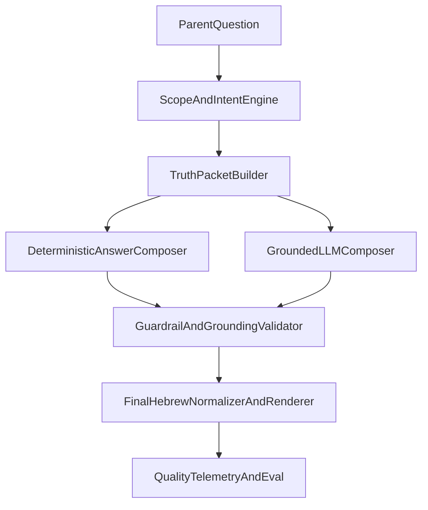

# תוכנית שדרוג AI מקצועית ל-Parent Copilot

## מצב קיים (ממצאים קריטיים)
- כיום מנגנון התשובה הוא דטרמיניסטי ולא מבוסס LLM: `[utils/parent-copilot/index.js](utils/parent-copilot/index.js)` מריץ `resolveScope -> buildTruthPacketV1 -> planConversation/semanticAggregate -> validate -> fallback`.
- מיפוי אינטנטים צר מדי, עם ברירת מחדל גנרית: `[utils/parent-copilot/intent-resolver.js](utils/parent-copilot/intent-resolver.js)` מחזיר `understand_meaning` כמעט לכל שאלה שלא נתפסה רג׳קסית.
- ניסוחי העברית ב-slotים מצומצמים מאוד: `[utils/contracts/narrative-contract-v1.js](utils/contracts/narrative-contract-v1.js)` מייצר מספר קטן של משפטים קבועים לפי envelope.
- נרמול עברית עשיר קיים בדוח אבל לא עובר ב-Copilot: `[utils/parent-report-language/parent-facing-normalize-he.js](utils/parent-report-language/parent-facing-normalize-he.js)` לא משולב בזרימת התשובה של Copilot.
- CI לא מפעיל את כל בדיקות השפה/סמנטיקה של Copilot: `[.github/workflows/parent-report-tests.yml](.github/workflows/parent-report-tests.yml)` מפעיל רק phaseA/B/C ולא מפעיל `test:parent-copilot-parent-language-semantic` ושאר semantic suites שכבר קיימות ב-`[package.json](package.json)`.

## ארכיטקטורת יעד (Professional AI Stack)


## שלב 1 — ייצוב ודיגנוסטיקה (Immediate)
- להוסיף Telemetry לכל turn ב-`[utils/parent-copilot/index.js](utils/parent-copilot/index.js)`: סיבת intent, סיבת scope, fallback reason, coverage של חוזים, ומדד "answer groundedness".
- לייצר סט בדיקות benchmark קבוע (עברית אמיתית מהורים) על בסיס הסקריפטים הקיימים ב-`[scripts/parent-copilot-parent-language-semantic-suite.mjs](scripts/parent-copilot-parent-language-semantic-suite.mjs)` ו-`[scripts/parent-copilot-recommendation-semantic-suite.mjs](scripts/parent-copilot-recommendation-semantic-suite.mjs)`.
- לחבר את הבדיקות הללו ל-CI ב-`[.github/workflows/parent-report-tests.yml](.github/workflows/parent-report-tests.yml)` כדי לעצור רגרסיות איכות.

## שלב 2 — שדרוג עומק מנוע דטרמיניסטי (High Impact, Low Risk)
- להרחיב משמעותית intent routing ב-`[utils/parent-copilot/intent-resolver.js](utils/parent-copilot/intent-resolver.js)`:
  - כיסוי וריאציות עברית יומיומית, שגיאות כתיב שכיחות, ושפה מעורבת עברית/אנגלית.
  - ציון confidence לכל intent + מעבר ל-clarification כש-confidence נמוך.
- לשדרג scope resolution ב-`[utils/parent-copilot/scope-resolver.js](utils/parent-copilot/scope-resolver.js)`:
  - למנוע נעילה על topic חלש/לא-מעוגן.
  - להוסיף disambiguation כשיש כמה topic matches דומים.
- להרחיב איכות ניסוח ב-`[utils/contracts/narrative-contract-v1.js](utils/contracts/narrative-contract-v1.js)`:
  - ספריית וריאנטים (2-5 לכל envelope+intent+subject) עם anti-repetition seed.
  - הפחתת חזרתיות של required hedges בלי לפגוע בבטיחות.
- להפעיל נרמול עברית גם על תשובות Copilot דרך `[utils/parent-report-language/parent-facing-normalize-he.js](utils/parent-report-language/parent-facing-normalize-he.js)` לפני render.

## שלב 3 — Grounded LLM Layer (כדי לצאת מגנרי באמת)
- להוסיף שכבת LLM אופציונלית ומבוקרת (feature flag) מעל TruthPacket, בלי לשבור determinism fallback.
- להגדיר Prompt Contract קשיח:
  - מקורות מותרי שימוש = facts מה-TruthPacket בלבד.
  - איסור עובדות חיצוניות/הסקות לא מגובות.
  - output schema מובנה (observation/meaning/action/uncertainty + evidence tags).
- להוסיף מודול orchestration חדש למשל `[utils/parent-copilot/llm-orchestrator.js](utils/parent-copilot/llm-orchestrator.js)` שמכיל:
  - provider abstraction (כיוון שאתה פתוח לכל ספק),
  - retry/timeouts,
  - strict JSON parsing,
  - fallback מיידי לדטרמיניסטי אם groundedness נכשל.

## שלב 4 — איכות עברית מקצועית (Editorial + Automated)
- ליצור Style Validator ייעודי לעברית הורה (טון מקצועי, בהירות, הימנעות מז׳רגון, משפטים קצרים) מעל `[docs/PARENT_REPORT_HEBREW_STYLE_GUIDE.md](docs/PARENT_REPORT_HEBREW_STYLE_GUIDE.md)`.
- להרחיב `forbidden/required` checks עם בדיקות fluency ולא רק blacklist.
- להוסיף Human-in-the-loop review של סט תשובות benchmark עד הגעה לסף איכות מוסכם לפני rollout מלא.

## שלב 5 — פריסה מדורגת למוצר
- Rollout ב-3 שלבים: internal -> % קטן של הורים -> full rollout.
- להגדיר KPIs מחייבים:
  - Hebrew Fluency Score
  - Grounded-to-Report Score
  - Genericness Rate
  - Fallback Rate
  - Clarification Success Rate
- rollback אוטומטי אם KPI יורד מתחת לסף.

## קטעי קוד קריטיים שמוכיחים את הפער
```js
// utils/parent-copilot/intent-resolver.js
if (/משמעות|מה\s*זה\s*אומר|למה|מסקנה|פירוש/.test(t)) return "understand_meaning";
return "understand_meaning";
```

```js
// utils/contracts/narrative-contract-v1.js
function buildInterpretationSlot(envelope, cannotConcludeYet) {
  if (cannotConcludeYet || envelope === "WE0") {
    return "בשלב זה לא קובעים מסקנה יציבה, והכיוון עדיין בבדיקה.";
  }
  // ... few fixed sentences ...
}
```

## תוצרים צפויים
- תשובות עברית טבעיות יותר, לא "תבניתיות".
- חיבור הדוק לדוח עם ראיות פנימיות ברורות בכל תשובה.
- מנוע כפול: deterministic safety + grounded LLM quality.
- CI שמגן על איכות לשונית וסמנטית באופן רציף.