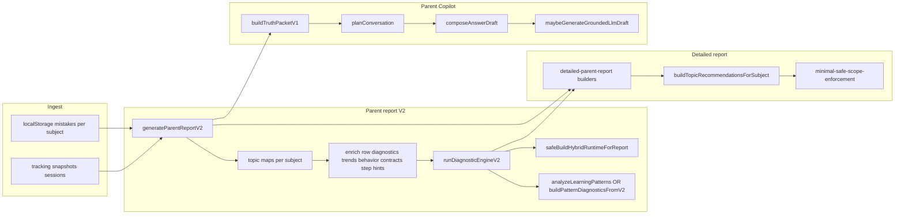

# Parent report / diagnostic / AI pipeline — audit and Phase 1 plan (read-only)

## A. Current architecture

### A.1 End-to-end data flow (high level)

### A.2 Exact file groups (inventory)

**Diagnostic engine v2** — [utils/diagnostic-engine-v2/](utils/diagnostic-engine-v2/)

- Orchestration: [run-diagnostic-engine-v2.js](utils/diagnostic-engine-v2/run-diagnostic-engine-v2.js), [index.js](utils/diagnostic-engine-v2/index.js)
- Taxonomies / bridge: `taxonomy-*.js`, [taxonomy-registry.js](utils/diagnostic-engine-v2/taxonomy-registry.js), [topic-taxonomy-bridge.js](utils/diagnostic-engine-v2/topic-taxonomy-bridge.js), [subject-ids.js](utils/diagnostic-engine-v2/subject-ids.js), [taxonomy-types.js](utils/diagnostic-engine-v2/taxonomy-types.js)
- Evidence / rules: [recurrence.js](utils/diagnostic-engine-v2/recurrence.js), [confidence-policy.js](utils/diagnostic-engine-v2/confidence-policy.js), [priority-policy.js](utils/diagnostic-engine-v2/priority-policy.js), [output-gating.js](utils/diagnostic-engine-v2/output-gating.js), [competing-hypotheses.js](utils/diagnostic-engine-v2/competing-hypotheses.js), [probe-layer.js](utils/diagnostic-engine-v2/probe-layer.js), [intervention-layer.js](utils/diagnostic-engine-v2/intervention-layer.js), [strength-profile.js](utils/diagnostic-engine-v2/strength-profile.js), [human-boundaries.js](utils/diagnostic-engine-v2/human-boundaries.js)

**Canonical state / decision contract** — [utils/canonical-topic-state/](utils/canonical-topic-state/)

- [build-canonical-state.js](utils/canonical-topic-state/build-canonical-state.js) (calls [decision-table.js](utils/canonical-topic-state/decision-table.js), [invariant-validator.js](utils/canonical-topic-state/invariant-validator.js), [schema.js](utils/canonical-topic-state/schema.js))
- Wired from DEv2: `buildCanonicalState({...})` inside [run-diagnostic-engine-v2.js](utils/diagnostic-engine-v2/run-diagnostic-engine-v2.js) (per unit)

**Parent report generation (V2)** — [utils/parent-report-v2.js](utils/parent-report-v2.js)

- Row intelligence: [parent-report-row-diagnostics.js](utils/parent-report-row-diagnostics.js), [parent-report-row-trend.js](utils/parent-report-row-trend.js), [parent-report-row-behavior.js](utils/parent-report-row-behavior.js)
- Integrity / restraint / evidence: [parent-report-data-integrity.js](utils/parent-report-data-integrity.js), [parent-report-diagnostic-restraint.js](utils/parent-report-diagnostic-restraint.js), [parent-report-evidence-targets.js](utils/parent-report-evidence-targets.js), [parent-report-decision-gates.js](utils/parent-report-decision-gates.js), [parent-report-mistake-intelligence.js](utils/parent-report-mistake-intelligence.js), [parent-report-root-cause.js](utils/parent-report-root-cause.js), [parent-report-intervention-plan.js](utils/parent-report-intervention-plan.js), [parent-report-confidence-aging.js](utils/parent-report-confidence-aging.js), [parent-report-learning-memory.js](utils/parent-report-learning-memory.js), [parent-report-recommendation-memory.js](utils/parent-report-recommendation-memory.js), [parent-report-outcome-tracking.js](utils/parent-report-outcome-tracking.js), [parent-report-support-sequencing.js](utils/parent-report-support-sequencing.js), [parent-report-advice-drift.js](utils/parent-report-advice-drift.js), [parent-report-foundation-dependency.js](utils/parent-report-foundation-dependency.js), [parent-report-foundation-ordering.js](utils/parent-report-foundation-ordering.js), [parent-report-recommendation-consistency.js](utils/parent-report-recommendation-consistency.js)
- Hebrew surface for reports (wording layer, not game UI): [utils/parent-report-language/](utils/parent-report-language/) (+ [parent-report-ui-explain-he.js](utils/parent-report-ui-explain-he.js))
- Contracts: [utils/contracts/](utils/contracts/) (`parent-report-contracts-v1.js`, `recommendation-contract-v1.js`, `narrative-contract-v1.js`, `decision-readiness-contract-v1.js`)
- Legacy cross-subject patterns: [learning-patterns-analysis.js](utils/learning-patterns-analysis.js) (still invoked from V2; superseded per-row when V2 units exist)

**Detailed report** — [utils/detailed-parent-report.js](utils/detailed-parent-report.js), [pages/learning/parent-report-detailed.js](pages/learning/parent-report-detailed.js) (print/PDF host — do not change in future phases per product rules)

**Recommendation engine** — [utils/topic-next-step-engine.js](utils/topic-next-step-engine.js), [utils/topic-next-step-phase2.js](utils/topic-next-step-phase2.js), [utils/topic-next-step-config.js](utils/topic-next-step-config.js)

**AI / Copilot** — [utils/parent-copilot/](utils/parent-copilot/) (notably [truth-packet-v1.js](utils/parent-copilot/truth-packet-v1.js), [contract-reader.js](utils/parent-copilot/contract-reader.js), [conversation-planner.js](utils/parent-copilot/conversation-planner.js), [answer-composer.js](utils/parent-copilot/answer-composer.js), [guardrail-validator.js](utils/parent-copilot/guardrail-validator.js), [llm-orchestrator.js](utils/parent-copilot/llm-orchestrator.js), [stage-a-freeform-interpretation.js](utils/parent-copilot/stage-a-freeform-interpretation.js), [session-memory.js](utils/parent-copilot/session-memory.js), [telemetry-store.js](utils/parent-copilot/telemetry-store.js), [fallback-templates.js](utils/parent-copilot/fallback-templates.js))

**Hybrid diagnostic (parallel to DEv2)** — [utils/ai-hybrid-diagnostic/](utils/ai-hybrid-diagnostic/) (e.g. [safe-build-hybrid-runtime.js](utils/ai-hybrid-diagnostic/safe-build-hybrid-runtime.js), [authority-gate.js](utils/ai-hybrid-diagnostic/authority-gate.js), [explanation-validator.js](utils/ai-hybrid-diagnostic/explanation-validator.js))

**Answer comparison / in-game scoring** — separate from parent pipeline: [utils/answer-compare.js](utils/answer-compare.js) + learning masters under [pages/learning/](pages/learning/) (feeds mistakes into localStorage consumed by `normalizeMistakeEvent`)

**Mistakes / events** — [utils/mistake-event.js](utils/mistake-event.js) (schema + `normalizeMistakeEvent`, `mistakeTimestampMs`, pattern keys)

**Time tracking (per subject)** — [utils/math-time-tracking.js](utils/math-time-tracking.js) (also geometry), [english-time-tracking.js](utils/english-time-tracking.js), [hebrew-time-tracking.js](utils/hebrew-time-tracking.js), [science-time-tracking.js](utils/science-time-tracking.js), [moledet-geography-time-tracking.js](utils/moledet-geography-time-tracking.js)

**Progress logs** — [utils/progress-storage.js](utils/progress-storage.js) (monthly progress, reward, progress log)

**Pages** — [pages/learning/parent-report.js](pages/learning/parent-report.js) (V2 consumer), [pages/learning/parent-report-detailed.js](pages/learning/parent-report-detailed.js)

---

## B. Current intelligence capabilities

| Area | Status | Where it lives |
|------|--------|----------------|
| Weakness detection (row level) | **Partial / full** | `needsPractice`, accuracy thresholds in maps; DEv2 taxonomy + recurrence; `parent-report-row-diagnostics` signals |
| Repeated error / pattern | **Partial** | `mistake-event` pattern family; DEv2 `passesRecurrenceRules`; topic-next-step Phase2 overlays; legacy `analyzeLearningPatterns` when no V2 units |
| Topic-level diagnosis | **Partial** | DEv2 unit per `topicRowKey` + taxonomy line (gated); canonical state `actionState` / tiers |
| Time-based trend | **Partial** | [parent-report-row-trend.js](utils/parent-report-row-trend.js) (`computeRowTrend`), sessions in tracking snapshots |
| Improvement / decline | **Partial** | Trend object + topic-next-step trend-derived signals (Phase2) |
| Confidence scoring | **Partial** | Row `confidence01` / data sufficiency; DEv2 `resolveConfidenceLevel`; canonical narrative constraints; Copilot `limits.confidenceBand` |
| Severity / priority | **Partial** | DEv2 `resolvePriority`, `breadthFromWeakRowCount`; output gating |
| Recommendation intensity | **Partial** | Contracts + `minimal-safe-scope-enforcement` (`computeEffectiveMaxPS`); Copilot `recommendationIntensityCap` |
| Action state | **Full (contract)** | `buildCanonicalState` → `actionState`, `decisionTier`, allowed claim classes |
| Parent-facing explanation | **Full (text system)** | `parent-report-language`, `learning-patterns-analysis`, detailed report copy builders — **do not rewrite Hebrew in Phase 1** |
| Copilot personalization | **Partial** | Session memory, scope resolver, truth packet from report payload; LLM optional behind gates |

---

## C. Gaps (what is missing for a “real” unified intelligence layer)

1. **Single evidence bundle** — Today evidence is split across: raw mistakes, row aggregates, DEv2 `evidenceTrace`, contracts V1 on rows, hybrid runtime snapshot. No one serialized “EvidenceBundle” that both detailed report and Copilot must consume identically (TruthPacket is close for Copilot, not identical to DEv2 unit internals).
2. **Weakness engine as a named layer** — Weakness is implied across DEv2 + row diagnostics + Phase2 overlays; no single module with explicit inputs/outputs and tests that define “weakness” vs “noise”.
3. **Confidence engine unification** — Multiple confidence notions (`confidence01`, `dataSufficiencyLevel`, DEv2 `confidenceLevel`, gate readiness, Copilot band mapping) without a single ordered lattice documented in code.
4. **Pattern engine** — Recurrence + taxonomy are strong; cross-pattern “error type classifier” beyond taxonomy IDs is thin; `patternFamily` usage depends on masters populating it.
5. **Timeline engine** — Sessions + mistake timestamps exist; “timeline narrative” is partial and scattered (trend, behavior profile, confidence aging).
6. **Deterministic-first AI** — LLM path exists; governance is split ([ai-hybrid-diagnostic/governance.js](utils/ai-hybrid-diagnostic/governance.js), Copilot guardrails). Risk: two authority paths (DEv2 vs hybrid) if not kept strictly subordinate.
7. **Subtopic depth** — Mostly `bucketKey` + `topicRowKey` (often `bucketKey + mode` composite); subtopic analytics depend on subject-specific keys (e.g. math scoped keys in row diagnostics).

---

## D. Risk map

| Risk | Description |
|------|-------------|
| **Parallel authority** | [output-gating.js](utils/diagnostic-engine-v2/output-gating.js) exposes deprecated `positiveConclusionAllowed` “mirror” — comment says must not be used for decisioning; risk if any path still reads it. |
| **Hybrid vs DEv2** | `safeBuildHybridRuntimeForReport` is best-effort; if hybrid ever bypasses DEv2 gates, conclusions could outrun evidence. |
| **Row wrong count vs events** | DEv2 uses `wrongCountForRules = max(wrongs.length, rowWrongTotal)` — can inflate relative to normalized events if storage diverges. |
| **Legacy pattern path** | `analyzeLearningPatterns` still runs; V2 replaces output only when `hasV2Units` — two pattern semantics during transition windows. |
| **Taxonomy fallback** | `weak_taxonomy_fallback_blocked` — good fail-closed behavior; ensure any new “diagnosis” respects this and does not add new bypass. |
| **Copilot / LLM** | Must stay grounded on TruthPacket + contracts; validator exists but new features must not widen slots without evidence refs. |

---

## E. Proposed Phase 1 architecture (Weakness + Confidence + Patterns only)

**Goal:** Introduce a **deterministic**, **fail-closed** intermediate layer that consumes only existing structures (`normalizeMistakeEvent`, per-row enriched maps, `diagnosticEngineV2.units[].canonicalState`) and produces **structured, versioned outputs** attached read-only to each unit (or parallel array keyed by `unitKey`) — **without** changing Hebrew parent copy, PDF, question banks, or game UI.

Suggested new module (names illustrative):

- [utils/intelligence-layer-v1/weakness-confidence-patterns.js](utils/intelligence-layer-v1/weakness-confidence-patterns.js) (new file)
  - **Input shape (conceptual):** `{ subjectId, topicRowKey, row, mistakesFiltered[], deUnit }` where `deUnit` is the matching `diagnosticEngineV2.units[]` entry (or null).
  - **Output shape (conceptual):** `{ version: "1.0.0", weakness: { level: "none"|"tentative"|"stable", codes: string[], evidenceRefs: object[] }, confidence: { latticeRank: number, band: "low"|"medium"|"high", drivers: string[] }, patterns: { recurrence: boolean, taxonomyId: string|null, patternFamilies: string[] } }`
  - **Fail-closed:** If `row.questions` below threshold or `canonicalState.actionState === "withhold"` / `cannotConcludeYet`, weakness level stays `none` or `tentative` only; never emit `stable` without recurrence + min wrongs.

**Integration point (later implementation):** After `runDiagnosticEngineV2` in [generateParentReportV2](utils/parent-report-v2.js), merge this bundle onto each unit **or** attach under `diagnosticEngineV2.meta.intelligenceV1` keyed by `unitKey` — Copilot can later read the same object from payload without inventing fields.

---

## F. Exact implementation plan (Phase 1 only — future work)

| Step | File | Function(s) | Action |
|------|------|---------------|--------|
| 1 | New: `utils/intelligence-layer-v1/weakness-confidence-patterns.js` | `buildWeaknessConfidencePatternsV1(input) -> output` | Pure function; no I/O; document input/output JSDoc |
| 2 | [utils/parent-report-v2.js](utils/parent-report-v2.js) | `generateParentReportV2` | After `runDiagnosticEngineV2`, call builder for each unit (or batch helper `attachIntelligenceV1ToDiagnosticUnits`) |
| 3 | Optional read surface | [utils/parent-copilot/contract-reader.js](utils/parent-copilot/contract-reader.js) or [truth-packet-v1.js](utils/parent-copilot/truth-packet-v1.js) | **Later sub-phase:** pass through only **non-narrative** numeric flags into TruthPacket `derivedLimits` (no new Hebrew strings) |
| 4 | Tests | New: `scripts/intelligence-layer-v1-selftest.mjs` | Deterministic fixtures from [scripts/diagnostic-engine-v2-harness.mjs](scripts/diagnostic-engine-v2-harness.mjs) patterns or minimal synthetic maps |

**Connection to canonical state:** Read-only consumption of `unit.canonicalState.assessment`, `unit.outputGating`, `unit.classification`; never overwrite `buildCanonicalState` invariants — only add sibling field `intelligenceV1` on the unit clone in report payload if needed.

**Fail-closed rules:** Align with existing gates: if DEv2 withheld diagnosis or taxonomy blocked, output weakness `none` and confidence `low` with driver `taxonomy_blocked` / `insufficient_volume`.

---

## G. Exact tests needed

1. **New:** `npm run test:intelligence-layer-v1` → `tsx scripts/intelligence-layer-v1-selftest.mjs`
   - Cases: low volume → no stable weakness; recurrence false → tentative only; conflicting high accuracy + many wrongs → conservative confidence (mirror DEv2 counter-evidence idea without duplicating math).
2. **Regression:** existing `npm run test:diagnostic-engine-v2-harness`, `test:parent-report-phase1`, `test:parent-copilot-phase4` after wiring.
3. **Property-style (optional):** output JSON schema keys stable (`version`, `weakness`, `confidence`, `patterns`).

---

## H. Files that must NOT be touched (Phase 1 and alignment with prior product constraints)

- Question content: `data/**` question banks (e.g. `data/geography-questions/**`, English/Hebrew banks as applicable).
- Game / learning UI: `pages/learning/*-master.js` (except if a future phase explicitly scopes telemetry only — **not** Phase 1).
- PDF / print pipeline: [pages/learning/parent-report-detailed.js](pages/learning/parent-report-detailed.js) and PDF-specific libs usage there.
- **Hebrew parent-facing wording rewrites:** [utils/parent-report-language/](utils/parent-report-language/), [utils/parent-report-ui-explain-he.js](utils/parent-report-ui-explain-he.js), [utils/learning-patterns-analysis.js](utils/learning-patterns-analysis.js) string tables — Phase 1 adds **structure only**, not new copy.
- Core contract files (avoid churn unless necessary): [utils/contracts/*.js](utils/contracts/) — prefer new sibling module first.

---

## Non-negotiable rules (design constraints — align Phase 1)

- No new parent-facing **conclusion** without cited evidence objects (reuse `evidenceTrace` / row fields / mistake events).
- Low confidence → narrative posture = continue tracking / probe (already reflected in canonical `actionState` and Copilot `limits`; Phase 1 must not weaken this).
- No teacher/intervention recommendation unless existing `outputGating.interventionAllowed` (or equivalent) is true — Phase 1 must not add a second path.
- Copilot / LLM must not invent details outside TruthPacket + attached intelligence flags (Phase 1: do not expand LLM context; structure only).
- **Deterministic first:** all new logic in `weakness-confidence-patterns.js` must be pure deterministic from inputs; no randomness, no network.
