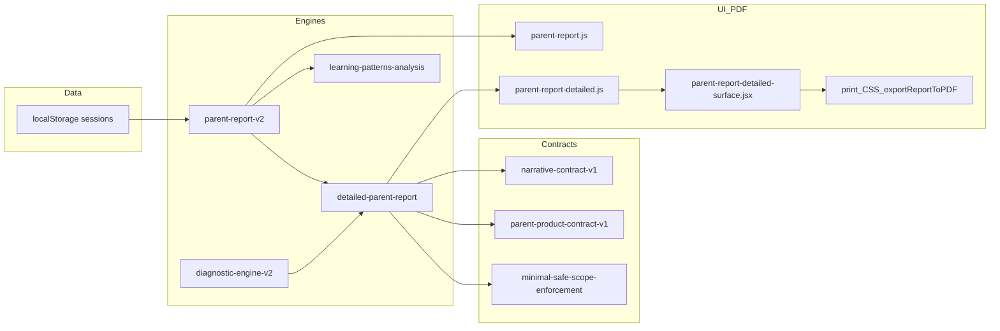

# Parent report product audit (read-only)

This document answers your 10 audit sections using the current codebase. It does **not** propose code changes here beyond phased repair **intent** (Phase A–G) and acceptance criteria.

---

## 1. Exact files involved (by concern)

### Short report (`/learning/parent-report`)

| Role | Primary files |
|------|----------------|
| Page shell, period/query hydration, diagnostics view glue, charts, PDF host | [pages/learning/parent-report.js](pages/learning/parent-report.js) |
| Aggregated report object (maps, summary, pattern diagnostics attachment) | [utils/parent-report-v2.js](utils/parent-report-v2.js) |
| Pattern / “learning intelligence” diagnostics surfaced on short | [utils/learning-patterns-analysis.js](utils/learning-patterns-analysis.js) |
| Short “contract” strip (top summary from detailed) | [components/parent-report-short-contract-preview.jsx](components/parent-report-short-contract-preview.jsx) |
| Chart labels, legacy `generateParentReport`, **PDF export** (`exportReportToPDF`, `parent-report-pdf` host) | [utils/math-report-generator.js](utils/math-report-generator.js) |
| Hebrew labels for diagnostics rows | [utils/parent-report-ui-explain-he.js](utils/parent-report-ui-explain-he.js), [utils/parent-report-language/index.js](utils/parent-report-language/index.js) |
| Math row display names (operation-only) | [utils/math-topic-parent-display.js](utils/math-topic-parent-display.js) |

Short also calls `generateDetailedParentReport` **only** to populate `shortContractTop` (see `parent-report.js` effects)—so detailed engine partially feeds the short page header/contract strip.

### Detailed report + summary mode (`/learning/parent-report-detailed`, `?mode=summary`)

| Role | Primary files |
|------|----------------|
| Page: mode toggle, print CSS, layout, Plan/Goal cards, section assembly | [pages/learning/parent-report-detailed.js](pages/learning/parent-report-detailed.js) |
| SSR/test renderable twin | [pages/learning/parent-report-detailed.renderable.jsx](pages/learning/parent-report-detailed.renderable.jsx) |
| Payload builder: V2 base + diagnosticEngineV2 + topic recommendations + executive summary + contracts | [utils/detailed-parent-report.js](utils/detailed-parent-report.js) |
| Reusable sections: executive summary, subject blocks, topic strips, bullets | [components/parent-report-detailed-surface.jsx](components/parent-report-detailed-surface.jsx) |
| Contract UI blocks | [components/parent-report-contract-ui-blocks.jsx](components/parent-report-contract-ui-blocks.jsx) |
| Parent-facing letters / topic narrative | [utils/detailed-report-parent-letter-he.js](utils/detailed-report-parent-letter-he.js) |
| Topic next-step / recommendations | [utils/topic-next-step-engine.js](utils/topic-next-step-engine.js), [utils/topic-next-step-phase2.js](utils/topic-next-step-phase2.js) |
| Product contract (top-level parent messaging) | [utils/contracts/parent-product-contract-v1.js](utils/contracts/parent-product-contract-v1.js) |
| Narrative contract (WE0–WE4, hedges, section text) | [utils/contracts/narrative-contract-v1.js](utils/contracts/narrative-contract-v1.js) |
| Evidence / readiness gating, clamping recommendations | [utils/minimal-safe-scope-enforcement.js](utils/minimal-safe-scope-enforcement.js), [utils/parent-report-decision-gates.js](utils/parent-report-decision-gates.js) |
| “Strong positive” unit filter (used in detailed path) | [utils/parent-report-recommendation-consistency.js](utils/parent-report-recommendation-consistency.js) |
| Executive / cross-subject Hebrew strings | [utils/parent-report-language/index.js](utils/parent-report-language/index.js) (imports like `executiveV2*`, `tierStableStrengthHe`, etc.) |
| Optional Copilot shell (does not replace report engine) | [components/parent-copilot/parent-copilot-shell.jsx](components/parent-copilot/parent-copilot-shell.jsx) |

**Summary mode** is the **same page and same payload** as full detailed, with `normalizeDisplayMode(router.query.mode)` and `compact` / conditional branches—not a separate minimal pipeline.

### PDF / print

| Role | Files |
|------|--------|
| Short: print/canvas PDF entry | `exportReportToPDF` in [utils/math-report-generator.js](utils/math-report-generator.js); print target `#parent-report-pdf` in [pages/learning/parent-report.js](pages/learning/parent-report.js) |
| Detailed: print-specific CSS, `#parent-report-detailed-print` | [pages/learning/parent-report-detailed.js](pages/learning/parent-report-detailed.js) (large `<style>` / class rules) |

Automated PDF capture scripts (for QA, not runtime product logic): [scripts/qa-parent-pdf-export.mjs](scripts/qa-parent-pdf-export.mjs), [scripts/parent-report-site-pdfs-generate.mjs](scripts/parent-report-site-pdfs-generate.mjs).

### Narrative text

- Core: [utils/contracts/narrative-contract-v1.js](utils/contracts/narrative-contract-v1.js) (`buildNarrativeContractV1`, `narrativeSectionTextHe`, `applyNarrativeContractToRecord`; envelope **WE0** when `readiness === "insufficient"` or low confidence—even if raw volume exists).
- Applied in detailed: [utils/detailed-parent-report.js](utils/detailed-parent-report.js) (`attachNarrativeContractsToTopicRecommendations`).

### Recommendations

- [utils/topic-next-step-engine.js](utils/topic-next-step-engine.js), [utils/topic-next-step-phase2.js](utils/topic-next-step-phase2.js)
- Rewrites for Hebrew tone: [utils/detailed-report-parent-letter-he.js](utils/detailed-report-parent-letter-he.js), [utils/detailed-parent-report.js](utils/detailed-parent-report.js) (`rewriteParentRecommendationForDetailedHe`)
- Gating / thinning: [utils/minimal-safe-scope-enforcement.js](utils/minimal-safe-scope-enforcement.js), [utils/parent-report-diagnostic-restraint.js](utils/parent-report-diagnostic-restraint.js)

### Strengths / weaknesses

- Short: `buildParentReportDiagnosticsView` in [pages/learning/parent-report.js](pages/learning/parent-report.js) (depends on `report.patternDiagnostics.subjects` + `hasAnySignal` per subject).
- Detailed: `collectStrengthRows`, `topStrengthsAcrossHe`, positive-unit ranking in [utils/detailed-parent-report.js](utils/detailed-parent-report.js); display via [components/parent-report-detailed-surface.jsx](components/parent-report-detailed-surface.jsx) (`ExecutiveSummarySection` “חוזקות בכל המקצועות”).
- Diagnostic engine taxonomy (can surface probe labels): e.g. `probeHe: "דוגמה לכל סוג"` in [utils/diagnostic-engine-v2/taxonomy-science.js](utils/diagnostic-engine-v2/taxonomy-science.js) (risk of leaking into parent-visible strings if not sanitized upstream).

---

## 2. Per-PDF product assessment (inferred from architecture + strings)

### A. Short report PDF

**What is good**

- Single pipeline `generateParentReportV2` is the single aggregation source; period/custom range hydration exists on the page.
- Optional `ParentReportShortContractPreview` ties short to the same “product contract” language as detailed for the top strip.

**What is wrong / risks**

- The page is **large**: Recharts bar/line charts, per-subject tables, diagnostics blocks—everything targets the same `#parent-report-pdf` print root → **many pages** in PDF.
- Diagnostics view (`buildParentReportDiagnosticsView`) can return **`insufficient`** when `patternDiagnostics` lacks `hasAnySignal` **even if** `report.summary` shows large `totalQuestions`—see logic around `hasGlobalSignal` in `parent-report.js` (lines ~311–350 in current file). That reads as a **contradiction** to parents.
- Strengths: short UI is **weakness/diagnostic-centric** unless pattern diagnostics expose positive signals per subject.

**Contradictions**

- Global volume vs `diagnosticsView.mode === "insufficient"` + copy like “אין עדיין תחום שזוהה…” ([pages/learning/parent-report.js](pages/learning/parent-report.js) ~1484) while charts may still show data elsewhere.

**Debug / leakage**

- PDF path sets `color: #000000` in print styling inside [utils/math-report-generator.js](utils/math-report-generator.js) (not parent-facing text, but heavy-handed).
- Any unsanitized taxonomy `probeHe` could surface if wired into parent bullets (science taxonomy already contains `"דוגמה לכל סוג"`).

### B. Detailed report PDF (full mode)

**What is good**

- Rich payload: executive block, per-subject Phase 3 insights, topic recommendation strips, contracts—good **internal** completeness.

**What is wrong**

- **Repetition**: Same contract concepts reappear in `ParentTopContractSummaryBlock`, `ExecutiveSummarySection`, `SubjectPhase3Insights`, topic strips, and Copilot-adjacent UI—parent sees **templates**, not one story.
- `Bullets` / `PlanItemCards` / `GoalItemCards` show **“אין נתונים להצגה.”** whenever arrays are empty **after** aggressive sanitization (`pr1ParentVisibleTextHe` strips numeric-only lines, `000…`, long snake_case tokens) in [components/parent-report-detailed-surface.jsx](components/parent-report-detailed-surface.jsx) (~64–86, ~88–104). So **gated or stripped** content becomes indistinguishable from “no data.”

**Recommendations**

- Often hedged to RI0 / WE0 via narrative contract when readiness is `insufficient`—reads as vague (“עדיין מוקדם לקבוע”) even when headline metrics are strong.

### C. Summary mode PDF (`?mode=summary`)

**What is wrong**

- Summary is **not** a separate one-page narrative; it mostly reuses the same components with `compact` in places ([components/parent-report-detailed-surface.jsx](components/parent-report-detailed-surface.jsx) `ExecutiveSummarySection` still renders multiple grids/bullets).
- Same diagnostic / contract blocks can still print → **not** an executive one-pager.

---

## 3. Why positive / strong areas are not surfaced properly

1. **Short path**: Parent-facing “strength” depends heavily on **pattern diagnostics** (`hasAnySignal`). High English accuracy in raw maps does not automatically create `hasAnySignal` / weakness-strength rows—so the short diagnostics region stays empty or “insufficient” while charts show English activity.
2. **Narrative contract**: `deriveEnvelope` in [utils/contracts/narrative-contract-v1.js](utils/contracts/narrative-contract-v1.js) maps many real-world cases to **WE0/WE1** when readiness is `insufficient`/`forming` or confidence low—**systematically dampening** positive, specific language.
3. **Generic strength lines**: `tierStableStrengthHe()` is reused as a **template** for multiple “strong” topics in detailed ([utils/detailed-parent-report.js](utils/detailed-parent-report.js) references ~2113–2124 per grep)—parents perceive repetition, not distinct strengths.
4. **Sanitization**: `pr1ParentVisibleTextHe` can remove the **only** concrete substring (e.g. internal codes stripped) → bullets empty → “אין נתונים להצגה.”

---

## 4. Why “אין נתונים” / “אין מספיק ראיות” appears despite volume

**Separate layers do not agree:**

| Layer | Meaning of “enough” |
|-------|---------------------|
| `report.summary.totalQuestions` | Volume in selected date window |
| `patternDiagnostics.subjects[*].hasAnySignal` | Diagnostic pattern engine saw stable / risk signals |
| `contractsV1.readiness.readiness` | Conclusion readiness (often conservative) |
| Narrative WE | Hedge / intensity cap |
| UI `Bullets` / cards | Non-empty **after** sanitization |

So: **volume gate ≠ evidence gate ≠ UI strip gate.** Strings like “אין מספיק ראיות בשלב זה.” ([utils/detailed-parent-report.js](utils/detailed-parent-report.js) ~2129), parent-report-v2’s “עדיין אין מספיק ראיות…” (~911), and product contract fallbacks ([utils/contracts/parent-product-contract-v1.js](utils/contracts/parent-product-contract-v1.js) ~260) can all fire **in parallel** with charts showing lots of practice.

---

## 5. Why the short report becomes too long

- [pages/learning/parent-report.js](pages/learning/parent-report.js) renders **full** subject math/topic charts and large tables into the same scroll/print region as narrative—there is **no product-level page budget** (max sections, collapse topics, appendix split).
- PDF uses browser print of that entire subtree (`exportReportToPDF` → `#parent-report-pdf`).

---

## 6. Why summary mode is not a real executive summary

- Implemented as **mode flag on the same detailed page** ([pages/learning/parent-report-detailed.js](pages/learning/parent-report-detailed.js)) with partial `compact` styling—not a reduced data contract.
- Payload is still **full** `generateDetailedParentReport`—no separate “summary DTO” with capped bullets, single priority, and tables deferred.

---

## 7. Root-cause category (where the failure lives)

**Conclusion:** Not one layer. Issues span **engine outputs** (diagnostics vs summary mismatch), **contracts/gates** (over-conservative vs volume), **UI composition** (short page = full dashboard; summary = full payload), and **PDF** (prints entire DOM). Data generation (simulator) can be fine and still surface all these problems.

---

## 8. Proposed fixed product structure (target UX)

### Short (parent-facing “דוח קצר”)

- מצב כללי (1 short paragraph + 3 numbers max)
- 2–3 חוזקות (explicitly from **accuracy + consistency** rules, not only patternDiagnostics)
- 1–2 מוקדי קושי (only if evidence-ready or clearly labeled as “צעד שמרני”)
- מה השתנה (delta vs previous period—dedicated small block)
- **פעולה אחת** לשבוע הקרוב (single imperative)
- טבלת מקצועות **אחת** (subjects × questions × accuracy × time)—**no per-topic chart grid** in v1 short; move detail to appendix link “להרחבה במסמך המלא”

### Detailed

- Page 1: executive summary (answers the five parent questions explicitly)
- Strengths / focus / trend / evidence explanation (each once)
- Per-subject narrative (collapsed by default in HTML; expanded in PDF optional)
- בית: תוכנית פעולה קונקרטית (time-boxed, one week)
- נספח: טבלאות וגרפים

### Summary mode

- Literal **one page** PDF: same five answers + 3 bullets; **no** repeated contract blocks; tables only if a single mini-table fits.

---

## 9. Repair plan (phased)

| Phase | Goal |
|-------|------|
| **A** | Remove debug/fallback leakage: audit taxonomy `probeHe` → parent string paths; extend `sanitizeEngineSnippetHe` / PR1 rules; grep for `00000`, `דוגמה לכל סוג`, empty post-sanitize bullets. |
| **B** | Unify “no data” rules: define a single `ParentDataPresence` model (volume vs diagnostic vs conclusion readiness); UI never shows “אין נתונים” when volume &gt; threshold unless section truly has no rows; replace parallel contradictory strings. |
| **C** | Strengths engine: derive strengths from **raw maps** (high accuracy + n questions) independent of `hasAnySignal`; cap templates (`tierStableStrengthHe` diversity); wire into short + executive. |
| **D** | Restructure short: split `parent-report-pdf` into “page1_story” vs “appendix_charts”; default print only story + one table; charts behind “expand” on screen. |
| **E** | Restructure detailed: deduplicate contract blocks; summary mode consumes a **reduced** DTO, not full payload + CSS hide. |
| **F** | Hebrew wording: one style guide; reduce hedge stacking; separate “מוקדם לקבוע” from “אין נתונים”. |
| **G** | Browser + PDF QA: scripted scenarios (English strong + Math weak + high volume); assert PDF page count caps; no forbidden strings. |

---

## 10. Acceptance criteria (same simulated dataset)

- English strength visible in **short** and **summary** (named subject + metric + plain-language praise).
- Math weakness visible with **one** primary remediation sentence (not six gated variants).
- Exactly **one** numbered “עדיפות השבוע” item across the whole short PDF.
- Nowhere does UI say “אין נתונים” / “אין מספיק ראיות” for a section if that section’s underlying row count &gt; 0 after sanitization.
- Short PDF ≤ **N** pages (define N with product, e.g. 3–4) with charts optional.
- Summary PDF = **1** page (or 2 if you allow Hebrew density exception—must be explicit).
- No debug strings (`דוגמה לכל סוג`, raw enums, `00000` placeholders).
- No repeated identical recommendation paragraphs across blocks (dedupe hash on normalized Hebrew text).

---

**Note:** This audit is **code-derived**; final PDF wording should be spot-checked against your three captured PDFs when you run Phase G.
