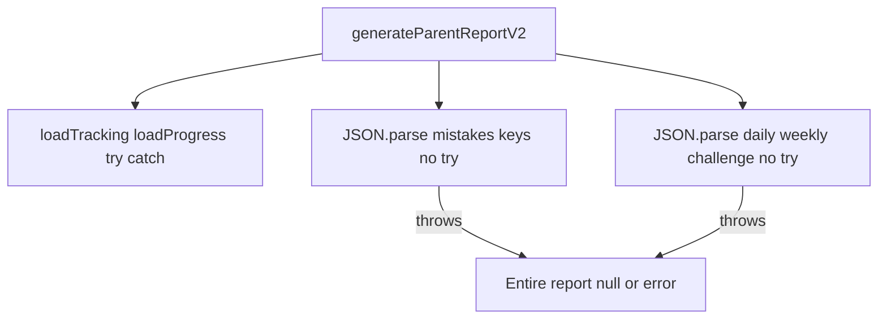

# Phase 1: strict verification and safe execution plan

## Scope and limits

- Proof is taken only from the cited files/lines in this repo (current `utils/parent-report-v2.js`, `utils/answer-compare.js`, `utils/parent-copilot/rollout-gates.js`, `utils/parent-copilot/llm-orchestrator.js`, `utils/parent-copilot/index.js`, representative `pages/index.js`, `utils/progress-storage.js`).
- **Not done in this pass:** exhaustive line-by-line classification of every `localStorage` call in every `pages/learning/*-master.js` (hundreds of calls). Where the table says "representative" or "inventory", that is the honest boundary of proof.

---

## 1. Verification table (exact proof)

| Area | Claim | File | Exact lines | Verified | Risk | Notes |
|------|--------|------|-------------|----------|------|-------|
| A | For **math** rows, `buildRowSummary` sets `base.improvement = null` explicitly. | [utils/parent-report-v2.js](c:/Users/ERAN%20YOSEF/Desktop/final%20projects/FINAL-WEB/LIOSH-WEB-TRY/utils/parent-report-v2.js) | 491 | **Yes** | Low (data shape) | Only place `improvement` appears in this file (single grep hit). |
| A | Non-math subjects: no `improvement` assignment in `buildRowSummary`; property absent unless merged elsewhere. | [utils/parent-report-v2.js](c:/Users/ERAN%20YOSEF/Desktop/final%20projects/FINAL-WEB/LIOSH-WEB-TRY/utils/parent-report-v2.js) | 469–492 | **Partial** | Medium | Downstream must tolerate missing vs `null`. |
| A | `latestSessionFieldValue`: if `sessions` is not an array → returns `null`. | [utils/parent-report-v2.js](c:/Users/ERAN%20YOSEF/Desktop/final%20projects/FINAL-WEB/LIOSH-WEB-TRY/utils/parent-report-v2.js) | 366–369 | **Yes** | Low | |
| A | `latestSessionFieldValue`: otherwise walks sessions, keeps latest by `parseSessionTime`, skips null/empty field values, returns `bestVal` (may stay `null`). | [utils/parent-report-v2.js](c:/Users/ERAN%20YOSEF/Desktop/final%20projects/FINAL-WEB/LIOSH-WEB-TRY/utils/parent-report-v2.js) | 366–380 | **Yes** | Low | |
| A | `sessionDurationSeconds`: uses `session.duration` when defined; else `(session.total||0)*30`. | [utils/parent-report-v2.js](c:/Users/ERAN%20YOSEF/Desktop/final%20projects/FINAL-WEB/LIOSH-WEB-TRY/utils/parent-report-v2.js) | 147–160 | **Yes** | Medium | Heuristic can mis-estimate time if `total` exists but semantics differ per tracker (comment at 148–149 acknowledges mixed trackers). |
| A | `loadTracking` / `loadProgress`: `JSON.parse(localStorage.getItem(...))` wrapped in `try/catch`, return `{}` on failure. | [utils/parent-report-v2.js](c:/Users/ERAN%20YOSEF/Desktop/final%20projects/FINAL-WEB/LIOSH-WEB-TRY/utils/parent-report-v2.js) | 558–571 | **Yes** | Low | |
| A | `evidenceContractsV1Enabled`: `localStorage.getItem` inside `try/catch`. | [utils/parent-report-v2.js](c:/Users/ERAN%20YOSEF/Desktop/final%20projects/FINAL-WEB/LIOSH-WEB-TRY/utils/parent-report-v2.js) | 82–91 | **Yes** | Low | Contradicts any claim “line 86 unguarded” for this read. |
| A | **`generateParentReportV2`**: six `JSON.parse(localStorage.getItem(...mistakes keys...))` with **no** surrounding `try/catch` in the shown block. | [utils/parent-report-v2.js](c:/Users/ERAN%20YOSEF/Desktop/final%20projects/FINAL-WEB/LIOSH-WEB-TRY/utils/parent-report-v2.js) | 1251–1266 | **Yes** | **High** | Quota / private mode / corrupt JSON → `JSON.parse` throws → entire report generation fails. |
| A | **`generateParentReportV2`**: `JSON.parse(localStorage.getItem("mleo_daily_challenge"|"mleo_weekly_challenge"))` **no** `try/catch` in the shown block. | [utils/parent-report-v2.js](c:/Users/ERAN%20YOSEF/Desktop/final%20projects/FINAL-WEB/LIOSH-WEB-TRY/utils/parent-report-v2.js) | 1416–1421 | **Yes** | **High** | Same failure mode as mistakes block. |
| B | Representative **unguarded** read/write: home page `useEffect` + `handleNameChange` use `localStorage` without `try/catch`. | [pages/index.js](c:/Users/ERAN%20YOSEF/Desktop/final%20projects/FINAL-WEB/LIOSH-WEB-TRY/pages/index.js) | 10–21 | **Yes** | Medium | Proves pattern exists project-wide; not exhaustive of all pages. |
| B | Counterexample: `loadMonthlyProgress` uses `try/catch` around `getItem` + `JSON.parse`. | [utils/progress-storage.js](c:/Users/ERAN%20YOSEF/Desktop/final%20projects/FINAL-WEB/LIOSH-WEB-TRY/utils/progress-storage.js) | 15–23 | **Yes** | Low | Good pattern already exists in repo for reuse mentally. |
| B | “All usages lack try/catch” globally | (grep inventory: many files under `pages/learning/*.js`, `utils/*-time-tracking.js`, etc.) | — | **No** (not fully enumerated) | — | Honest limit: only **proved** high-impact gaps in parent-report path + representative unguarded UI. |
| C | No `compareAnswers` mode for mixed numbers (e.g. dedicated `mixed_number`); JSDoc union lists finite set of modes. | [utils/answer-compare.js](c:/Users/ERAN%20YOSEF/Desktop/final%20projects/FINAL-WEB/LIOSH-WEB-TRY/utils/answer-compare.js) | 43–45, 56–162 | **Yes** | Medium | |
| C | `compareMathLearnerAnswer`: string branch uses `trimmed.includes("/") \|\| trimmed.includes(" ") \|\| isNaN(parseFloat(trimmed))` then often **string equality** vs canonical (lines 217–227); no Unicode vulgar fraction handling. | [utils/answer-compare.js](c:/Users/ERAN%20YOSEF/Desktop/final%20projects/FINAL-WEB/LIOSH-WEB-TRY/utils/answer-compare.js) | 184–227 | **Yes** | Medium | e.g. `parseFloat("3½")` is `3` in JS if numeric branch hit—risk of false correctness/false mismatch depending on branch. |
| C | **No** general Unicode normalization (`normalize("NFC")`) in this file; Hebrew relaxed strips niqqud class `[\u0591-\u05C7]`. | [utils/answer-compare.js](c:/Users/ERAN%20YOSEF/Desktop/final%20projects/FINAL-WEB/LIOSH-WEB-TRY/utils/answer-compare.js) | 23–40 | **Partial** | Low | Niqqud handled for relaxed mode; not full Unicode normalize. |
| C | Comma→dot: **only** in `compareGeometryLearnerAnswer` `toNumeric` (`replace(",", ".")`). | [utils/answer-compare.js](c:/Users/ERAN%20YOSEF/Desktop/final%20projects/FINAL-WEB/LIOSH-WEB-TRY/utils/answer-compare.js) | 274–280 | **Yes** | Medium | `compareMathLearnerAnswer` numeric path uses `parseFloat(trimmed)` without comma normalization (196–205). |
| C | `numeric_absolute_tolerance`: rejects non-finite or `tol <= 0`; **no** upper bound on `tol` before `Math.abs(a-b) < tol`. | [utils/answer-compare.js](c:/Users/ERAN%20YOSEF/Desktop/final%20projects/FINAL-WEB/LIOSH-WEB-TRY/utils/answer-compare.js) | 76–97 | **Yes** | Medium | Oversized caller `tolerance` makes almost all numeric answers “correct”. |
| D | LLM path disabled unless **all** of: `PARENT_COPILOT_FORCE_DETERMINISTIC` is not `"true"`, `PARENT_COPILOT_LLM_ENABLED` is `"true"`, `PARENT_COPILOT_LLM_EXPERIMENT` is `"true"`, and `PARENT_COPILOT_ROLLOUT_STAGE` is one of `internal` \| `beta` \| `full`. | [utils/parent-copilot/rollout-gates.js](c:/Users/ERAN%20YOSEF/Desktop/final%20projects/FINAL-WEB/LIOSH-WEB-TRY/utils/parent-copilot/rollout-gates.js) | 65–85 | **Partial** | — | **Not** “must be `full`” — default stage is `"internal"` (line 26) and **is allowed** (78–79). |
| D | `evaluateKpiGate` / `readKpiThresholds` **not** referenced inside `getLlmGateDecision` (KPI does not gate runtime enable in this file). | [utils/parent-copilot/rollout-gates.js](c:/Users/ERAN%20YOSEF/Desktop/final%20projects/FINAL-WEB/LIOSH-WEB-TRY/utils/parent-copilot/rollout-gates.js) | 28–59 vs 65–85 | **Yes** | Low | KPI exists; separate from env gate. |
| D | `maybeGenerateGroundedLlmDraft`: if `!gate.enabled` returns `{ ok:false, reason:"llm_disabled_by_rollout_gate", gateReasonCodes }` — no network call. | [utils/parent-copilot/llm-orchestrator.js](c:/Users/ERAN%20YOSEF/Desktop/final%20projects/FINAL-WEB/LIOSH-WEB-TRY/utils/parent-copilot/llm-orchestrator.js) | 184–192 | **Yes** | Low | |
| D | Async orchestration: always runs `runDeterministicCore` first; on LLM failure returns `finalizeTurnResponse` with `generationPath: "deterministic"` and `baseResponse` payload (lines 824–842). | [utils/parent-copilot/index.js](c:/Users/ERAN%20YOSEF/Desktop/final%20projects/FINAL-WEB/LIOSH-WEB-TRY/utils/parent-copilot/index.js) | 736–842 | **Yes** | Low | Confirms deterministic fallback when LLM disabled or errors. |

---

## 2. Verified issues that justify Phase 1 work

1. **High:** Unguarded `JSON.parse(localStorage…)` inside [`generateParentReportV2`](c:/Users/ERAN%20YOSEF/Desktop/final%20projects/FINAL-WEB/LIOSH-WEB-TRY/utils/parent-report-v2.js) (mistakes + daily/weekly challenge blocks)—proven lines 1251–1266 and 1416–1421.
2. **Medium:** `improvement` semantics incomplete (math forced `null`; others lack field)—proven line 491 only.
3. **Medium (product grading, out of Phase 1):** `answer-compare.js` gaps (mixed forms, comma inconsistency math vs geometry, unbounded tolerance)—proven in cited lines; **do not change in Phase 1** per your rules.

---

## 3. Safe fix plan (no code here)

### Group 1 — SAFE INFRA FIXES (DO NOW)

**Fix G1-1 — Defensive parse for mistakes arrays in `generateParentReportV2`**

| Field | Value |
|--------|--------|
| **File** | [utils/parent-report-v2.js](c:/Users/ERAN%20YOSEF/Desktop/final%20projects/FINAL-WEB/LIOSH-WEB-TRY/utils/parent-report-v2.js) |
| **Function** | `generateParentReportV2` (export starts line 1086) |
| **What to change** | Replace raw `JSON.parse(localStorage.getItem(...) \|\| "[]")` for the six mistake keys (lines 1251–1266) with a **local helper** (e.g. `safeJsonParseArray(key, fallback[])`) that wraps `getItem` + `parse` in `try/catch` and returns `[]` on any failure; ensure `Array.isArray` before use. |
| **Why** | Invalid JSON or `SecurityError`/`QuotaExceededError` on storage currently aborts the whole parent report. |
| **Edge cases** | `null` from `getItem`; empty string; non-array JSON object; private browsing throws on access. |
| **Expected after fix** | Report still returns; mistakes sections empty or partial instead of hard crash. |

**Fix G1-2 — Defensive parse for challenge blobs in `generateParentReportV2`**

| Field | Value |
|--------|--------|
| **File** | [utils/parent-report-v2.js](c:/Users/ERAN%20YOSEF/Desktop/final%20projects/FINAL-WEB/LIOSH-WEB-TRY/utils/parent-report-v2.js) |
| **Function** | `generateParentReportV2` |
| **What to change** | Same pattern for `mleo_daily_challenge` and `mleo_weekly_challenge` (lines 1416–1421): `try/catch` → fallback `{}` and verify `typeof === "object"` before spread/use. |
| **Why** | Same crash class as G1-1. |
| **Edge cases** | Stored value is `"null"` string, or array instead of object—pick conservative fallback `{}`. |
| **Expected after fix** | Challenges omitted or defaulted without killing the report. |

**Optional G1-3 (only if you expand Phase 1 scope beyond parent-report)**

| Field | Value |
|--------|--------|
| **File** | e.g. [pages/index.js](c:/Users/ERAN%20YOSEF/Desktop/final%20projects/FINAL-WEB/LIOSH-WEB-TRY/pages/index.js) |
| **Function** | `HomePage` `useEffect` / `handleNameChange` |
| **What to change** | Wrap `getItem`/`setItem` in `try/catch`; on failure keep in-memory state only. |
| **Why** | Avoid uncaught exceptions on restricted storage. |
| **Edge cases** | Quota on `setItem`. |
| **Expected after fix** | Home still usable; name not persisted when storage fails. |

*Recommendation:* Implement **G1-1 + G1-2 first** (single file, highest confidence, aligns with “report reliability”). Defer G1-3 unless you explicitly widen Phase 1.

**Post-fix verification (commands already in repo):**

- Run `npm run test:parent-report-phase1` (and any existing `parent-report` suite you rely on) after edits.

---

### Group 2 — CONTROLLED LOGIC FIXES (NEED CARE; not Phase 1 unless spec’d)

**Fix G2-1 — Define and compute `improvement` (or remove from contract)**

| Field | Value |
|--------|--------|
| **File** | [utils/parent-report-v2.js](c:/Users/ERAN%20YOSEF/Desktop/final%20projects/FINAL-WEB/LIOSH-WEB-TRY/utils/parent-report-v2.js) (+ possibly consumers in [utils/detailed-parent-report.js](c:/Users/ERAN%20YOSEF/Desktop/final%20projects/FINAL-WEB/LIOSH-WEB-TRY/utils/detailed-parent-report.js) / UI) |
| **Function** | `buildRowSummary` (and/or a small pure helper called from it) |
| **What to change** | Replace `if (subject === "math") base.improvement = null` with a **documented** metric (e.g. delta of accuracy or correct rate between first/second half of session window, or week-over-week if data exists)—**requires product definition** before coding. |
| **Why** | Field is misleading if always null/absent while UI or contracts imply trend. |
| **Edge cases** | Few sessions; division by zero; mixed `grade`/`level` within same row key. |
| **Expected after fix** | Stable, explainable trend or explicit `"unavailable"` sentinel agreed in contract. |

Do **not** start G2-1 in Phase 1 without a written definition of “improvement” and UI/contract sign-off.

---

### Group 3 — DO NOT TOUCH NOW (explicitly excluded from Phase 1)

- **[utils/answer-compare.js](c:/Users/ERAN%20YOSEF/Desktop/final%20projects/FINAL-WEB/LIOSH-WEB-TRY/utils/answer-compare.js):** mixed numbers, global comma normalization for math, Unicode NFC, tolerance caps — **changes learner correctness**; out of scope.
- **LLM enabling / gate relaxation / KPI wiring:** forbidden by your hard rules; defaults remain as in `rollout-gates.js`.
- **Question banks / subject expansion / UI redesign:** forbidden.

---

## 4. Mermaid — report generation failure mode (current, verified)

---

## 5. Hard rules compliance checklist

| Rule | Plan compliance |
|------|-----------------|
| Do not suggest enabling LLM | No LLM enablement; only documented existing gate + fallback. |
| Do not change questions/content | Group 3 excludes question banks. |
| No UI redesign | G1 touches no UI; G1-3 is optional tiny guard only. |
| No refactors | G1 adds minimal helper + localized wraps in one function. |
| Focus correctness / stability / data integrity / report reliability | Phase 1 = G1-1 + G1-2 only by default. |
