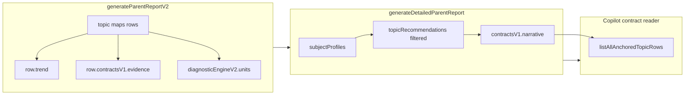

# Phase 2 execution package: contract + narrative integrity

Constraints you set are treated as **hard**: no UI layout changes, no LLM gate changes, no question/content edits, no scoring formula edits except where an **approved** improvement/trend contract explicitly requires them, no unrelated refactors.

---

## 1. Exact current state

### Improvement field

- **V2 row builder:** [`utils/parent-report-v2.js`](utils/parent-report-v2.js) — `buildRowSummary` returns a `base` object with **no** `improvement` for any subject except math, where it explicitly sets `base.improvement = null` (see `buildRowSummary` around the `base` object and `if (subject === "math") base.improvement = null`).
- **Implication:** Non-math rows **omit** the property; math rows carry **`null`**. There is **no** unified cross-subject “improvement %” in the V2 pipeline.
- **Legacy / other path:** [`utils/math-report-generator.js`](utils/math-report-generator.js) — `calculateImprovement` + per-operation `improvement` in a **different** report shape (not the same as `generateParentReportV2` topic maps). Relevant only if any UI still consumes that legacy structure (parent regular page uses V2 from `generateParentReportV2`).

### Trend fields

- **Computation:** [`utils/parent-report-row-trend.js`](utils/parent-report-row-trend.js) — `computeRowTrend` returns `version`, `windows`, `accuracyDirection` (`up` / `down` / `flat` / `unknown`), `fluencyDirection`, `independenceDirection`, `confidence` (0–1 scalar), `summaryHe` (Hebrew sentence built from period accuracies/counts), and `evidence` (durations, mistake counts, independence structs).
- **Attachment:** [`utils/parent-report-row-trend.js`](utils/parent-report-row-trend.js) — `enrichTopicMapsWithRowTrends` sets `row.trend` on every map row after sessions are filtered by period/mode (and math grade/level when composite key).
- **Pipeline order:** [`utils/parent-report-v2.js`](utils/parent-report-v2.js) — `enrichTopicMapsWithRowDiagnostics` → `enrichTopicMapsWithRowTrends` → `enrichTopicMapsWithRowBehaviorProfiles` → (optional) `attachEvidenceContractsV1ToTopicMaps` → … `runDiagnosticEngineV2` (trend before evidence contracts, as required by [`utils/parent-report-row-diagnostics.js`](utils/parent-report-row-diagnostics.js) comment).

### Evidence contracts

- **Builder:** [`utils/contracts/parent-report-contracts-v1.js`](utils/contracts/parent-report-contracts-v1.js) — `buildEvidenceContractV1` consumes `row`, `signals` (same row diagnostics fields), `trend` (`trend.accuracyDirection` → internal `trendState` via `normalizeTrendState`), `behaviorProfile`, period bounds, etc. Defines bands E0–E4, strengths, sufficiency, signal quality.
- **Attachment:** [`utils/parent-report-row-diagnostics.js`](utils/parent-report-row-diagnostics.js) — `attachEvidenceContractsV1ToTopicMaps` sets `row.contractsV1.evidence` and `row.contractsV1.evidenceValidation` (soft, non-throwing).
- **Feature flag:** [`utils/parent-report-v2.js`](utils/parent-report-v2.js) — `evidenceContractsV1Enabled()` reads `NEXT_PUBLIC_PARENT_REPORT_CONTRACTS_V1` (default on) and optional `localStorage` key `mleo_parent_report_contracts_v1`.

### Narrative contracts

- **Builder / validator:** [`utils/contracts/narrative-contract-v1.js`](utils/contracts/narrative-contract-v1.js) — `buildNarrativeContractV1`, `validateNarrativeContractV1`, `applyNarrativeContractToRecord`, `narrativeSectionTextHe`. Uses `deriveEnvelope` from `contractsV1` slices on the **input record** (readiness, confidence band, decision tier, recommendation eligibility, `cannotConcludeYet`). Observation slot is **q/acc + displayName only** — it does **not** read `contractsV1.evidence` or `row.trend.summaryHe`.
- **Detailed report wiring:** [`utils/detailed-parent-report.js`](utils/detailed-parent-report.js) — `attachNarrativeContractsToTopicRecommendations` maps each `topicRecommendations` row through `buildNarrativeContractV1` / `validate` / `applyNarrativeContractToRecord`. Executive consistency: `applyNarrativeConsistencyToExecutiveSummary` adds a cautious Hebrew line when any row has `WE0`/`WE1`.
- **Other producers:** [`utils/topic-next-step-engine.js`](utils/topic-next-step-engine.js) (next-step records), [`utils/detailed-report-parent-letter-he.js`](utils/detailed-report-parent-letter-he.js) (letter path).

### Hebrew language layer

- **Central modules:** [`utils/parent-report-language/forbidden-terms.js`](utils/parent-report-language/forbidden-terms.js) (ASCII/internal fragment ban list + readability leaks), [`utils/parent-report-language/parent-facing-normalize-he.js`](utils/parent-report-language/parent-facing-normalize-he.js), [`utils/parent-report-language/v2-parent-copy.js`](utils/parent-report-language/v2-parent-copy.js), variants, confidence/priority parent Hebrew, etc.
- **Selftest:** [`scripts/parent-report-hebrew-language-selftest.mjs`](scripts/parent-report-hebrew-language-selftest.mjs) — scans fixed samples + helpers for forbidden/readability leaks.
- **Regular report sanitization:** [`pages/learning/parent-report.js`](pages/learning/parent-report.js) — imports `shortReportDiagnosticsParentVisibleHe as diagnosticParentVisibleTextHe` and wraps multiple diagnostic strings (including `summaryHe` from pattern diagnostics).

### Regular report output

- **Data:** `generateParentReportV2` in [`utils/parent-report-v2.js`](utils/parent-report-v2.js) produces subject maps (`mathOperations`, `geometryTopics`, …) with rows enriched with diagnostics, **trend**, behavior, optional `contractsV1`, diagnostic units, etc.
- **UI:** [`pages/learning/parent-report.js`](pages/learning/parent-report.js) — Subject tables show operation/topic, level, grade, mode, last session, time, questions, correct, accuracy, status; **no** dedicated improvement column. `buildTopicRowsForChart` passes `trend` into chart row payloads but the **bar chart path shown** does not surface `trend` in tick labels (trend is carried for potential tooltips/other use — verify if any tooltip reads it elsewhere in file).

### Detailed report output

- **Entry:** [`utils/detailed-parent-report.js`](utils/detailed-parent-report.js) — `generateDetailedParentReport` builds `subjectProfiles` via `buildSubjectProfilesFromV2` when V2 diagnostic engine is present.
- **`topicRecommendations` filter:** Only units with `canonicalState.actionState` in **`diagnose_only` | `intervene`** become `topicRecommendations` (see `.filter` in `buildSubjectProfilesFromV2`). **Maintain / expand_cautiously** units appear under `maintain` / strengths lists, **not** in `topicRecommendations`.
- **Synthetic “trend” copy at subject level:** `trendNarrativeHe` uses `subjectV2TrendNarrativeHighPriorityHe` / `subjectV2TrendNarrativeStableHe` from [`utils/parent-report-language/v2-parent-copy.js`](utils/parent-report-language/v2-parent-copy.js) — **not** the same as per-row `row.trend.summaryHe`. `improving: []` is always empty in the pushed profile object.

### PDF output

- **Mechanism:** [`utils/math-report-generator.js`](utils/math-report-generator.js) — `exportReportToPDF(report, { elementId: "parent-report-pdf" })` prints the DOM subtree `#parent-report-pdf` from the regular page (see import in [`pages/learning/parent-report.js`](pages/learning/parent-report.js)). **No separate PDF contract path** — whatever the screen shows inside that subtree is what the PDF gets.

### Copilot usage of report data

- **Contract slice:** [`utils/parent-copilot/contract-reader.js`](utils/parent-copilot/contract-reader.js) — `contractsFromTopicRow`, `readContractsSliceForScope`, `findFirstAnchoredTopicRow` / `listAllAnchoredTopicRows` / `findTopicRowByKey` scan **`subjectProfiles[].topicRecommendations` only** and require `contractsV1.narrative.textSlots.observation` to be non-empty for “anchored” rows.
- **Truth packet:** [`utils/parent-copilot/truth-packet-v1.js`](utils/parent-copilot/truth-packet-v1.js) — Consumes anchored topic rows + narrative slots + intelligence snapshots; does **not** read raw `maps` from `generateParentReportV2` directly.

---

## 2. Exact gaps

| Gap | File | Function / area | Current behavior | Risk | Type |
|-----|------|-------------------|------------------|------|------|
| **Evidence contract not on detailed `topicRecommendations` rows** | [`utils/detailed-parent-report.js`](utils/detailed-parent-report.js) | `recommendationFromV2Unit` builds `contractsV1` from `outputGating.contractsV1` + canonical overrides only | **No merge** of `maps[subjectId][topicRowKey].contractsV1.evidence` (or `evidenceValidation`) onto the TR row | Copilot / letter / any consumer of TR `contracts` sees **decision/readiness/confidence** but **not** the same evidence band object as the V2 row; narrative envelope may not reflect evidence tier | **Missing contract** (serialization gap) |
| **Narrative q/acc vs evidence contract counts** | [`utils/contracts/narrative-contract-v1.js`](utils/contracts/narrative-contract-v1.js) | `buildObservationSlot` uses `input.questions` / `input.accuracy` | TR row `questions`/`accuracy` come from unit evidence trace; evidence contract uses `row.questions` etc. | Rare divergence if traces and row totals ever disagree → parent sees one number in narrative and another in diagnostics | **Product bug** (if divergence exists) / **contract** (if spec says single source of truth) |
| **Anchored rows only in `topicRecommendations`** | [`utils/parent-copilot/contract-reader.js`](utils/parent-copilot/contract-reader.js) | `findFirstAnchoredTopicRow`, `listAllAnchoredTopicRows`, `findTopicRowByKey` | Only **diagnose/intervene** rows (per detailed profile filter) can anchor | **Maintain-only** subjects: empty `topicRecommendations` → **no anchored row** → topic/executive contract paths may **miss** strength-first subjects even though maps have full contracts | **Product gap** + **missing contract** (scope definition) |
| **Cross-surface trend language** | [`utils/parent-report-row-trend.js`](utils/parent-report-row-trend.js) vs [`utils/detailed-parent-report.js`](utils/detailed-parent-report.js) | `computeRowTrend` `summaryHe` vs `trendNarrativeHe` | Row-level Hebrew trend narrative **exists on map rows** but detailed profile uses **generic** subject trend strings | Parents may read **different “trend” stories** between regular data export and detailed narrative | **Contract / product** (narrative alignment) |
| **Improvement semantics undefined** | [`utils/parent-report-v2.js`](utils/parent-report-v2.js) + legacy [`utils/math-report-generator.js`](utils/math-report-generator.js) | `improvement` only explicitly `null` for math V2 rows; legacy still computes improvement elsewhere | Inconsistent meaning of “improvement” across codepaths | Future UI/API might surface **conflicting** improvement definitions | **Missing contract** |
| **Evidence contracts env-disabled** | [`utils/parent-report-v2.js`](utils/parent-report-v2.js) | `evidenceContractsV1Enabled` | When off, rows lack `contractsV1.evidence` | Any code assuming evidence always present must guard | **Test / config gap** if tests do not cover off flag |
| **Hebrew trend `summaryHe` tone** | [`utils/parent-report-row-trend.js`](utils/parent-report-row-trend.js) | `computeRowTrend` strings | Declarative stats (“כ־X% דיוק…”) without tying to `trend.confidence` | Can read **overconfident** vs narrative `WE0` hedging on same row | **Product** (tone alignment) |

---

## 3. Proposed Phase 2 fixes (A / B / C)

### A. Must do now

1. **Document and implement a single “source of truth” matrix** (doc-only or minimal comment block in one owner file, e.g. [`utils/contracts/recommendation-contract-normalizer.js`](utils/contracts/recommendation-contract-normalizer.js) or a new tiny `parent-report-phase2-contracts.md` **only if you allow** — you asked not to add markdown unless needed; prefer **JSDoc on `recommendationFromV2Unit`**): which fields on `topicRecommendations[]` must mirror `maps` rows.
2. **Merge row-level `contractsV1.evidence` (+ validation) into `recommendationFromV2Unit` output** when building detailed `topicRecommendations`, by resolving `topicRowKey` → row from `baseReport` maps passed into `generateDetailedParentReport` (thread `maps` or `baseReport.mathOperations` etc. into the mapper — exact plumbing to confirm in `recommendationFromV2Unit` call chain).
3. **Tests proving evidence parity** between a chosen `maps[sid][key]` and the corresponding detailed `topicRecommendations` row after merge (extend [`scripts/parent-report-phase6-suite.mjs`](scripts/parent-report-phase6-suite.mjs) or add `scripts/parent-report-phase2-contracts-selftest.mjs`).

### B. Should do now

4. **Copilot / contract-reader scope decision (contract, not layout):** Either (4a) extend anchored discovery to include a **second** list (e.g. strength rows with narrative) **without** changing card layout, or (4b) document that Copilot **only** speaks to diagnose/intervene rows and adjust TruthPacket fallbacks so executive answers never imply row-level evidence when none anchored. Pick one and test [`scripts/parent-copilot-phase4-truth-path-suite.mjs`](scripts/parent-copilot-phase4-truth-path-suite.mjs) / product-behavior suites as applicable.
5. **Align narrative observation inputs with evidence contract** (e.g. pass `evidence.questionCount` / `accuracyPct` into `buildNarrativeContractV1` input when evidence exists) — **no scoring formula change**, only **field selection** for text.
6. **Hebrew / tone:** Add soft caveats to `row.trend.summaryHe` when `trend.confidence` is below threshold **or** route trend sentences through existing hedge patterns — copy-only if formulas unchanged.

### C. Defer

7. Full **golden HTML/PDF** snapshot suite in CI (heavy, flaky on fonts).
8. User-facing **improvement KPI** implementation until product spec + formula sign-off.
9. Unifying legacy `math-report-generator` improvement with V2 (large surface).

---

## 4. Per proposed fix (detail)

### Fix M1 — Evidence on detailed TR rows (A.1–A.3)

- **Files:** [`utils/detailed-parent-report.js`](utils/detailed-parent-report.js) (`recommendationFromV2Unit`, caller in `buildSubjectProfilesFromV2` / `applyGateToTextClampToTopicRecommendations` chain); tests in [`scripts/parent-report-phase6-suite.mjs`](scripts/parent-report-phase6-suite.mjs) or new `scripts/parent-report-phase2-contracts-selftest.mjs`.
- **Functions:** `recommendationFromV2Unit`; possibly a small helper `mergeRowEvidenceContractIntoTr(unit, rowFromMaps)`.
- **Old behavior:** `contractsV1` on TR = gating bundle only (decision/readiness/confidence/recommendation from [`utils/diagnostic-engine-v2/output-gating.js`](utils/diagnostic-engine-v2/output-gating.js) path), **no** `evidence`.
- **New behavior:** When `rowFromMaps?.contractsV1?.evidence` exists, **shallow merge** into `contractsV1` on the TR object (preserve gating keys; add `evidence` + `evidenceValidation`).
- **Edge cases:** `evidenceContractsV1Enabled()` false → no evidence on row (TR stays as today). Missing map row → skip merge. Version mismatch → trust row validation flags only.
- **Tests:** Fixture report: one subject with at least one diagnose unit; assert `baseReport` map row `contractsV1.evidence.evidenceBand` === TR `contractsV1.evidence.evidenceBand`.
- **No-regression proof:** Existing `npm run test:parent-report-phase6` + Copilot phase4/5 suites still pass; no UI className/grid changes.

### Fix M2 — Narrative numbers vs evidence (B.5)

- **Files:** [`utils/detailed-parent-report.js`](utils/detailed-parent-report.js) (pass richer `contractsV1` into `attachNarrativeContractsToTopicRecommendations`), [`utils/contracts/narrative-contract-v1.js`](utils/contracts/narrative-contract-v1.js) (optional: read `contractsV1.evidence` for q/acc when building observation).
- **Functions:** `buildNarrativeContractV1`, `buildObservationSlot`.
- **Old behavior:** Observation uses TR `questions`/`accuracy` from unit trace.
- **New behavior:** If evidence contract present, use its `questionCount` / `accuracyPct` (names per contract file) for observation strings.
- **Edge cases:** Evidence missing → fallback to current behavior.
- **Tests:** [`scripts/narrative-contract-v1-selftest.mjs`](scripts/narrative-contract-v1-selftest.mjs) + one integration case in phase6 suite.
- **No-regression:** Narrative validation still passes; WE envelopes unchanged for same inputs.

### Fix M3 — Copilot anchored rows (B.4)

- **Files:** [`utils/parent-copilot/contract-reader.js`](utils/parent-copilot/contract-reader.js), [`utils/parent-copilot/truth-packet-v1.js`](utils/parent-copilot/truth-packet-v1.js) (only if fallback text must change), targeted [`scripts/parent-copilot-phase4-truth-path-suite.mjs`](scripts/parent-copilot-phase4-truth-path-suite.mjs) (or scope suite).
- **Functions:** `listAllAnchoredTopicRows` / `findTopicRowByKey` / TruthPacket builders that assume at least one anchor.
- **Old behavior:** Anchors **only** from `topicRecommendations` with narrative observation.
- **New behavior (example 4a):** Also scan a named array (e.g. `maintain` / `topStrengths`) **if** those rows ever carry `contractsV1.narrative` — **only if** product approves attaching narrative to those rows **without** layout change (data-only). Alternative 4b: keep reader as-is; strengthen **safe fallback** when zero anchors.
- **Edge cases:** Avoid duplicating rows; subject ordering preserved (`SUBJECT_ORDER`).
- **No-regression:** `npm run test:parent-copilot-phase4` (and any suite that asserts anchor invariants).

### Fix M4 — Trend narrative alignment (B.6 / C)

- **Files:** [`utils/detailed-parent-report.js`](utils/detailed-parent-report.js) (`trendNarrativeHe` assignment), optionally [`utils/parent-report-language/v2-parent-copy.js`](utils/parent-report-language/v2-parent-copy.js), [`utils/parent-report-row-trend.js`](utils/parent-report-row-trend.js) (`summaryHe` only if copy change allowed without formula change).
- **Functions:** `buildSubjectProfilesFromV2` subject block setting `trendNarrativeHe`.
- **Old behavior:** Generic high/stable strings vs row `trend` on maps.
- **New behavior:** Derive short parent Hebrew line from **anchor row’s** `row.trend` (e.g. `summaryHe` trimmed / or label from `accuracyDirection` + confidence) when available.
- **Tests:** Phase6 or new selftest with mocked maps + known `trend`.

---

## 5. Improvement / trend decision (pick one letter)

**Recommendation: C** (with **improvement treated as B until specified**).

- **C — Trend:** Row-level `computeRowTrend` already backs **directional** language (`accuracyDirection`, `summaryHe`, `confidence`). The evidence contract already consumes `trend.accuracyDirection` in [`utils/contracts/parent-report-contracts-v1.js`](utils/contracts/parent-report-contracts-v1.js). Surfacing **only** that family of labels (plus optional soft caveats) avoids inventing new KPIs.
- **Improvement — do not implement (B semantics):** There is **no** defined improvement metric in V2 rows; math is explicitly `null`. Implementing **A** now would require a signed contract and risks touching formulas or parent expectations.

**Why C is safest:** It **binds parent copy to existing computed signals** already used downstream (evidence trendState), instead of introducing a new “improvement” number (A) or stripping useful directional text everywhere (B alone). Product still should **freeze copy** so “trend” means one thing across surfaces.

---

## 6. Hebrew quality gate (forbidden parent-facing wording)

**Already codified (extend, don’t duplicate blindly):**

- **Internal engine / leak tokens:** List in [`utils/parent-report-language/forbidden-terms.js`](utils/parent-report-language/forbidden-terms.js) — e.g. `insufficient_data`, `early_signal_only`, `probe`, `legacy`, `diagnosticenginev2`, `pattern_diagnostics`, raw ` p1`–`p4` fragments, etc.; readability leaks e.g. `מאסטרי`, `טקסונומיה`, `responsems`.
- **Overconfident phrases (narrative contract):** [`utils/contracts/narrative-contract-v1.js`](utils/contracts/narrative-contract-v1.js) — `FORBIDDEN_PHRASES` e.g. “בטוח לחלוטין”, “בוודאות מלאה”, “ללא ספק בכלל”, “חד משמעית”.
- **Phase 2 additions to forbid in parent-facing Hebrew (proposal):**
  - **Internal engine terms:** English snake_case paths (`contracts_v1`, `evidence_band`, `WE0` as raw token in user strings — if ever leaked), diagnostic unit ids, `topicRowKey` raw composite separators, “P4/P3” priority tokens in visible Hebrew.
  - **Overconfident:** “בוודאות”, “בטוח ש…”, “חייב להצליח”, “ייפתר בוודאות”, “סגור מבחינה מקצועית”, absolute guarantees of grade outcome.
  - **Robotic repetition:** Same opening clause **3+** times in one subject block (e.g. repeated “בשלב זה…” stacks) — enforce via existing variant pickers or add repetition check in selftest.
  - **Vague recommendations:** “לתרגל יותר” / “לשפר חולשות” without **subject + mechanism** already allowed by narrative intensity rules; any string that names no **action** when `RI1+` is claimed.

Enforcement path: extend [`scripts/parent-report-hebrew-language-selftest.mjs`](scripts/parent-report-hebrew-language-selftest.mjs) + optional scan of **rendered** detailed payload strings (phase6 already deep-imports contracts).

---

## 7. Tests — exact commands

**Parent report phase**

- `npm run test:parent-report-phase1`
- `npm run test:parent-report-phase6` (runs Hebrew language selftest + phase6 suite + pages SSR per [`package.json`](package.json))

**Hebrew language**

- `npm run test:parent-report-hebrew-language`
- Broader drift (if touching Copilot Hebrew): `npm run test:parent-hebrew-drift` (and related `test:parent-hebrew-*` from package.json if narrative strings change materially)

**Contract tests**

- `npx tsx scripts/contracts-v1-selftest.mjs` (evidence attach path)
- `npx tsx scripts/narrative-contract-v1-selftest.mjs` (if narrative inputs change)

**Copilot (if contract-reader or TruthPacket changes)**

- `npm run test:parent-copilot-phase4`
- `npm run test:parent-copilot-phase5`
- Smaller smoke if time-boxed: `npm run test:parent-copilot-product-behavior`

**Snapshot / golden (optional Phase 2 plan)**

- Add **deterministic JSON fixture** snapshots: `generateParentReportV2(...)` and `generateDetailedParentReport(...)` **stable subset** (e.g. `subjectProfiles[].topicRecommendations[].contractsV1` + `diagnosticEngineV2.units[].topicRowKey`) stored under `scripts/fixtures/parent-report-phase2/` with hash compare in a new `scripts/parent-report-phase2-golden.mjs` run via `npm run test:parent-report-phase2-golden` (script to add after approval).
- **Exclude** full PDF bitmap compare in Phase 2 (defer C.7); optional **one** html2pdf smoke remains manual unless you already have harness.

---

## Summary

Phase 2 should **merge map-level evidence contracts into detailed `topicRecommendations`**, **align narrative numbers with that evidence when present**, and **decide explicitly** how Copilot finds anchors when `topicRecommendations` is empty for strength-led profiles. Trend should **lean on existing `row.trend` (option C)**; improvement should **remain unspecified / null (B semantics)** until a separate contract approves **A**. No UI layout or LLM gate changes; scoring formulas unchanged unless the improvement/trend contract document explicitly requires a formula edit.
