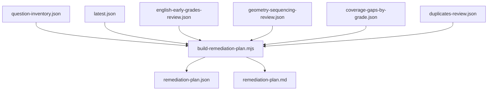

# Phase 3.5 Remediation Planner

## Scope and constraints
- Keep this phase reports/tools only: no question bank edits, no UI changes, no Hebrew product copy changes, no duplicate deletions, and no build-gating.
- Add one new planner script that reads existing Phase 3 artifacts and emits `remediation-plan.json` + `remediation-plan.md`.

## Files to add/update
- Add [`c:\Users\ERAN YOSEF\Desktop\final projects\FINAL-WEB\LIOSH-WEB-TRY\scripts\curriculum-audit\build-remediation-plan.mjs`](c:\Users\ERAN YOSEF\Desktop\final projects\FINAL-WEB\LIOSH-WEB-TRY\scripts\curriculum-audit\build-remediation-plan.mjs)
- Update [`c:\Users\ERAN YOSEF\Desktop\final projects\FINAL-WEB\LIOSH-WEB-TRY\package.json`](c:\Users\ERAN YOSEF\Desktop\final projects\FINAL-WEB\LIOSH-WEB-TRY\package.json)
- Update [`c:\Users\ERAN YOSEF\Desktop\final projects\FINAL-WEB\LIOSH-WEB-TRY\docs\curriculum-audit.md`](c:\Users\ERAN YOSEF\Desktop\final projects\FINAL-WEB\LIOSH-WEB-TRY\docs\curriculum-audit.md)

## Data flow design

## Implementation plan
- Build robust input loading and validation in the new script:
  - Require all six inputs under `reports/curriculum-audit`.
  - Reuse existing script conventions (`ROOT`, `OUT_DIR`, `writeFiles`, `isMain` guard, JSON+MD output pair).
- Construct a unified remediation item model by joining:
  - `latest.classifications[]` with `question-inventory.records[]` by `questionId`.
  - Duplicate categories by `subject + stemHash` expansion from inventory.
  - Coverage gaps as synthetic action items (no single `questionId`) with stable IDs like `coverage:<subject>:g<grade>`.
- Implement priority and action policy rules:
  - `Priority 0`: science g6 critical coverage, any `too_advanced`, static `likely_problem_duplicates`, early English formal grammar/sentence risks, runtime unclear grade/topic if found.
  - `Priority 1`: science g4/g2 low coverage, Hebrew upper-grade low coverage, same-stem cross-grade static reuse, geometry sequencing risks, Moledet repeated live-runtime values.
  - `Priority 2`: generator-only duplicates, correctly-tagged enrichment-only, acceptable aligned-low-confidence backlog.
  - `recommendedAction` mapping: `keep`, `review_manually`, `move_grade`, `mark_enrichment`, `rewrite_question`, `split_by_grade_depth`, `add_more_questions`, `remove_duplicate`, `ignore_generator_sample`.
- Add subject-balanced ranking and tie-break behavior:
  - Keep `Top 25 overall`.
  - Add subject sections: English/Hebrew/Math/Geometry/Science/Moledet-Geo top 25 each.
  - Apply tie-break only when scores are close (e.g., within small delta): `science > english > geometry > hebrew > math > moledet-geography`.
- Emit report outputs:
  - `remediation-plan.json` with full `items[]`, counts by priority/action/subject, and queue slices.
  - `remediation-plan.md` with required sections:
    - Top 25 overall
    - Top 25 per subject
    - Coverage gap action list
    - Duplicate cleanup list (static vs generator split)
    - Do-not-touch-yet generator-only warnings
- Wire npm scripts:
  - Add `audit:curriculum:remediation`.
  - Extend `qa:curriculum-audit` to run remediation last:
    - inventory → audit → rollup → map-coverage → focused → duplicates → remediation.
- Update docs for Phase 3.5:
  - Explain what remediation plan is and how to read it.
  - Clarify it does not edit content yet.
  - Document `remove_duplicate` vs `ignore_generator_sample` decisioning.
  - Clarify low coverage means adding content, not mutating existing rows.

## Verification plan
- Run `npm run qa:curriculum-audit` and confirm remediation outputs are produced.
- Run `npm run build` and confirm pass.
- Validate final summary from `remediation-plan.json`:
  - total items
  - counts by priority
  - counts by recommendedAction
  - top overall + top subject queues
  - coverage actions
  - duplicate cleanup split static vs generator
- Confirm via git diff that only scripts/docs/package changes are present (no question banks/UI changes).