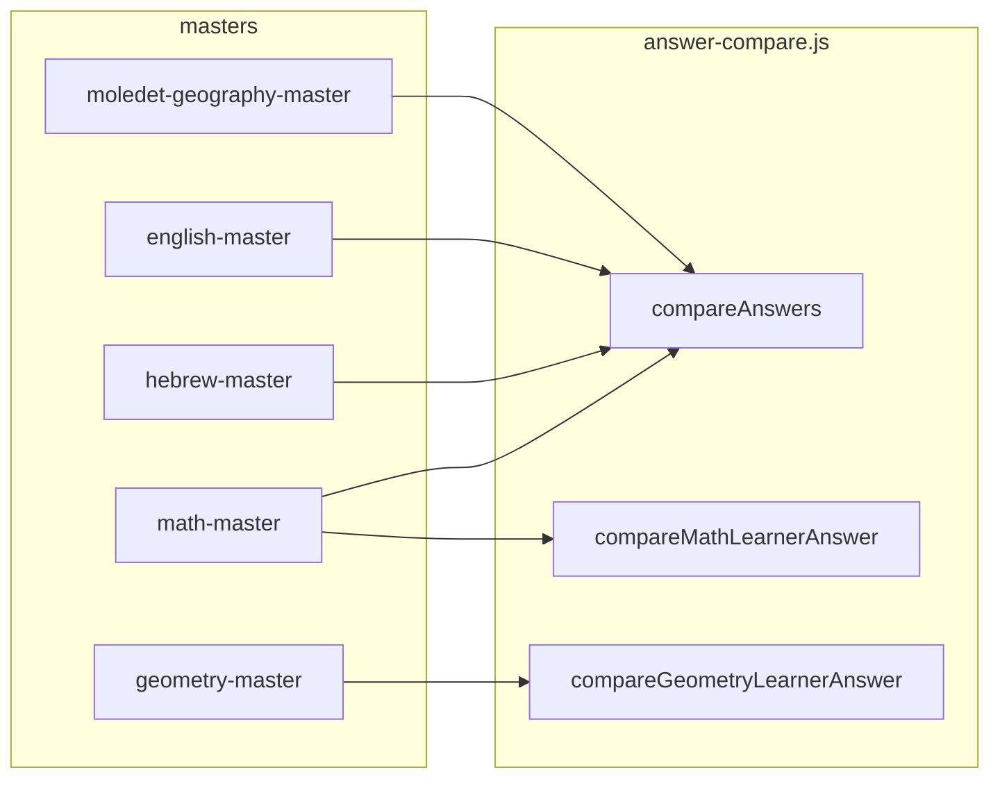

# Phase 3 execution package: Answer Compare Integrity

Hard constraints (yours): no UI changes, no report logic, no AI/LLM/Copilot, no question/content pool edits, no scoring formula changes **outside** answer comparison, no unrelated refactors.

---

## 1. Exact current state

### Central module: [`utils/answer-compare.js`](utils/answer-compare.js)

**Exports:** `compareAnswers`, `compareMathLearnerAnswer`, `compareGeometryLearnerAnswer`, `normalizeAnswerExactText`, `normalizeHebrewRelaxedAnswer`, `warnDuplicateMcqOptionsDevOnly`.

**`compareAnswers(p)` — modes**

| Mode | Behavior |
|------|------------|
| `mcq_index` | `Number(user) === Number(expectedIndex)`; both must be finite. |
| `exact_integer` | `parseInt(String(user).trim(), 10)` vs `Number(expected)`; empty string → NaN → false. |
| `trim_string_equal` | `String(user).trim() === String(expected).trim()` (raw, no comma/Unicode normalization). |
| `numeric_absolute_tolerance` | Requires finite `p.tolerance > 0` or throws. Equality: `a === b` OR both **typeof `number`**, finite, `Math.abs(a-b) < tol`. **No string coercion** for `user`/`expected`. |
| `numeric_scale_relative_tolerance` | Requires positive `scaleFloor`, `relativeFactor`, `minTolerance` or throws. `Number(user)`, `Number(expected)`; if not finite → false; else `tol = max(minTolerance, scale * relativeFactor)` with `scale = max(|a|,|b|,scaleFloor)`; `|a-b| <= tol`. |
| `hebrew_relaxed_text` | `normalizeHebrewRelaxedAnswer` on user and each candidate: strip niqqud (`\u0591-\u05C7`), quote/punct map, surrounding punct trim, collapse spaces, `.toLowerCase()`. List from `acceptedList` or `[expected]`. |
| `hebrew_niqqud_strict` | Uses [`utils/hebrew-spelling-niqqud.js`](utils/hebrew-spelling-niqqud.js) `normalizeAnswerForSpellingNiqqudStrict` (does **not** strip niqqud; only quote unification + surrounding punct + whitespace + lower). Same list resolution as relaxed. |
| `exact_text` | `normalizeAnswerExactText`: curly quotes → ASCII, strip leading/trailing punctuation/space, collapse spaces, ASCII `.toLowerCase()`. List from `acceptedList` or `[expected]`. |

**`compareMathLearnerAnswer(p)`**

- Requires finite `numericTolerance > 0` or throws (caller-only; [`pages/learning/math-master.js`](pages/learning/math-master.js) uses `MATH_NUMERIC_TOLERANCE = 0.01`).
- String `user`: trim; if `<` `>` `=` → string comparison path; else if contains `/` or space OR `isNaN(parseFloat(trimmed))` → **treat as string** (`numericAnswer = trimmed`); else `parseFloat(trimmed)` (no comma→dot; `parseFloat("1,5")` → `1`).
- Non-string `user`: used as `numericAnswer` directly.
- If correct side looks like comparison sign or fraction/space/non-numeric string: **strict string equality** after trim between `numericAnswer` and `correctAnswer`.
- Else numeric branch: `parseFloat` if string correct, else number; correct if exact match or `|a-b| < tol` for two finite numbers.

**`compareGeometryLearnerAnswer(p)`**

- Requires positive finite `scaleFloor`, `relativeFactor`, `minTolerance` or throws (caller supplies; same pattern as geometry-master).
- `toNumeric`: strings use `trim().replace(",", ".")` then `Number(...)`; non-string finite number passes through.
- If both numeric: same scale-relative tolerance as `compareAnswers` numeric_scale mode.
- Else: **trim string equality** (no relaxed Hebrew / no exact_text normalization).

**`warnDuplicateMcqOptionsDevOnly`**

- Dev-only (`NODE_ENV === "development"`): warns if duplicate option strings (science MCQ safety note); does not affect correctness.

### Hebrew niqqud policy wiring (call site, not in answer-compare)

[`pages/learning/hebrew-master.js`](pages/learning/hebrew-master.js): `handleAnswer` chooses `hebrew_niqqud_strict` vs `hebrew_relaxed_text` via `isSpellingTargetWordInQuotesContextFromStem(spellingStemForNiqqudDetect(currentQuestion))`. MCQ button preview uses same branch ([~3293–3302](pages/learning/hebrew-master.js)). Spelling contract documented in [`utils/hebrew-spelling-niqqud.js`](utils/hebrew-spelling-niqqud.js) header (niqqud inside quoted spans stripped for **display** only; strict compare keeps niqqud for בית vs בֵּית).

### Subject usage (compare paths)

| Surface | Function / mode | Notes |
|---------|-----------------|--------|
| Math | `compareMathLearnerAnswer` + some `compareAnswers` ([`math-master.js`](pages/learning/math-master.js)) | Tolerance `0.01` from page constant. |
| Geometry | `compareGeometryLearnerAnswer` | Comma normalized in util only here. |
| Hebrew | `compareAnswers` relaxed / strict + `exact_integer` for practice grid | Practice multiplication uses integer mode ([~1250](pages/learning/hebrew-master.js)). |
| English | `compareAnswers` `exact_text` + `acceptedList` | ([~1932](pages/learning/english-master.js)). |
| Moledet-geography | `exact_text` / `exact_integer` practice | Same patterns as Hebrew practice / text MCQ ([~1093–1178](pages/learning/moledet-geography-master.js)). |
| Science | **No** `compareAnswers` for grading | Index equality `idx === correctIndex` ([~1638](pages/learning/science-master.js)); only `warnDuplicateMcqOptionsDevOnly` from answer-compare. |

### Selftests today

- [`scripts/answer-compare-selftest.mjs`](scripts/answer-compare-selftest.mjs) — `npm run test:answer-compare` ([`package.json`](package.json)): core modes, throws on missing tolerance params, math fractions/comparisons/numeric tol, geometry comma, one Hebrew relaxed case, normalizer smoke.
- Optional product harness: `npm run test:e2e-hebrew-niqqud` (browser niqqud path; not unit-level answer-compare).

---

## 2. Exact gaps

| Gap | File | Function | Current behavior | Example failing / surprising input | Risk | Type |
|-----|------|----------|------------------|--------------------------------------|------|------|
| **Math comma decimal** | [`utils/answer-compare.js`](utils/answer-compare.js) | `compareMathLearnerAnswer` | No `,` → `.` before `parseFloat` | User `"1,5"` vs correct `1.5` → parses as `1` | Wrong pass/fail in locales using comma | **Bug** (if product wants comma in math) |
| **Math vs geometry numeric input parity** | same | `compareMathLearnerAnswer` vs `compareGeometryLearnerAnswer` | Geometry normalizes comma; math does not | Same learner input behavior differs by subject | Inconsistent UX policy | **Policy / limitation** |
| **`exact_integer` parseInt hazards** | [`utils/answer-compare.js`](utils/answer-compare.js) | `compareAnswers` `exact_integer` | `parseInt` stops at first non-digit | `"7abc"` matches `7`; `"3.5"` → `3` vs expected `3` accidental match | Silent wrong accept or reject | **Bug** |
| **`numeric_absolute_tolerance` no coercion** | [`utils/answer-compare.js`](utils/answer-compare.js) | `compareAnswers` | Requires both operands to be JS `number` for tol branch | `user: "2"`, `expected: 2` (number) → false despite numeric equality | Inconsistent if callers pass strings | **Limitation / bug** depending on contract |
| **Mixed / equivalent fractions** | [`utils/answer-compare.js`](utils/answer-compare.js) | `compareMathLearnerAnswer` string branch | String equality only for fraction/mixed forms | `"1 1/2"` vs `"3/2"` both correct mathematically → false | Pedagogic frustration | **Policy** (unless canon says exact string only) |
| **Unicode compatibility forms** | `normalizeAnswerExactText`, Hebrew normalizers | N/A | No `String.prototype.normalize("NFC")` / NFKC | Composed vs decomposed Unicode “looks identical” → mismatch | Rare false negatives | **Limitation**; NFKC risky for Hebrew |
| **Math-only: leading/trailing junk on numeric string** | `compareMathLearnerAnswer` | `parseFloat(trimmed)` | No full numeric strip beyond trim | `" 2.0 kg "` may fail parse path or fall string path unpredictably | Edge false negatives | **Bug / edge** |
| **Science MCQ not centralized** | [`pages/learning/science-master.js`](pages/learning/science-master.js) | `handleAnswer` | Index compare only | Duplicate labels still ambiguous at index level (dev warn only) | Content authoring risk | **Policy + tooling** (not necessarily Phase 3 code) |
| **Hebrew MCQ compares full option text** | [`pages/learning/hebrew-master.js`](pages/learning/hebrew-master.js) | `compareAnswers` on each `answer` string | Correctness for unselected options computed for styling | Performance only; logic OK | Low | **N/A bug** |
| **Tolerance caps** | Callers + util | `compareMathLearnerAnswer` / `numeric_*` | No max clamp inside util; bad caller could pass huge tol | Oversized `numericTolerance` marks wrong as right | Integrity if caller bugs | **Policy** (document max + assert in dev or clamp) |

---

## 3. Proposed Phase 3 fixes (A / B / C)

### A. Must do now

1. **Document the authoritative comparison contract** in one place (short module header + mode matrix in [`utils/answer-compare.js`](utils/answer-compare.js) JSDoc only; no new markdown file unless you request it): per mode, accepted input types, comma rules, tolerance ownership (caller vs util).
2. **Harden `exact_integer`**: reject strings with non-digit junk (e.g. full-string `/^-?\d+$/` or stricter), reject decimals if product says integers only; align with Hebrew/moledet practice inputs.
3. **Math comma-decimal parity (minimal)**: In `compareMathLearnerAnswer` **only** on the pure-numeric string branch (not fraction/comparison path), apply the same single comma→dot rule as geometry’s `toNumeric` **before** `parseFloat`, with explicit tests so `"3/4"` and `"1 1/2"` paths unchanged.

### B. Should do now

4. **`numeric_absolute_tolerance` numeric coercion**: Optional strict parse (trim, single comma→dot, reject dual separators) then compare; **only** if callers are confirmed to pass strings today (grep before implementing).
5. **Selftest expansion**: mixed-number **policy** cases (whatever policy you pick: either document “string must match canonical content” or add equivalence table behind a flag — second option is larger).
6. **Unicode NFC (not NFKC) for `exact_text` and possibly Hebrew strict outer normalization only**: apply only to codepoints where NFKC changes Hebrew semantics are avoided (e.g. limit to Latin digits/letters range) — **needs policy** (see §5).

### C. Defer

7. Full rational / mixed-number canonicalization (algebraic equivalence).
8. NFKC globally for Hebrew (breaks niqqud semantics).
9. Routing science MCQ through `compareAnswers({ mode: "mcq_index" })` (touches non-compare hot path semantics only if you want consistency).
10. Centralizing all masters on `compareAnswers` (out of scope for “compare integrity” if science is intentionally index-based).

---

## 4. Per proposed fix (detail)

### Fix A2 — `exact_integer` hardening

- **Files:** [`utils/answer-compare.js`](utils/answer-compare.js); [`scripts/answer-compare-selftest.mjs`](scripts/answer-compare-selftest.mjs).
- **Old:** `parseInt` prefix acceptance.
- **New:** Only accept full-string integer pattern (and optional leading `-` for future-proofing if product approves); else false (or explicit `rejectInvalid` flag — prefer simplest: false).
- **Edge cases:** `"007"`, `"+"`, empty, `" 12 "`, locale spaces.
- **Tests:** assert false for `"7abc"`, `"3.5"` vs `3` if decimals disallowed; assert true for `" 7 "` vs `7` if still desired.
- **No-regression:** `npm run test:answer-compare`; run Hebrew/moledet smoke paths that use `exact_integer` (manual or existing e2e if any).

### Fix A3 — Math comma on numeric branch

- **Files:** [`utils/answer-compare.js`](utils/answer-compare.js); [`scripts/answer-compare-selftest.mjs`](scripts/answer-compare-selftest.mjs).
- **Old:** `parseFloat("1,5")` → `1`.
- **New:** On numeric-only branch, normalize at most one comma as decimal separator (document: **not** thousands separators).
- **Edge cases:** `"1,000"` ambiguous — policy: treat as invalid numeric string → fall through to false or string path (pick one in §5).
- **Tests:** `"1,5"` vs `1.5` + tol; unchanged tests for `"3/4"`, `"<"`.
- **No-regression:** `npm run test:answer-compare`; `npm run test:parent-report-phase6` not required for compare-only but optional full suite.

### Fix B4 — `numeric_absolute_tolerance` coercion (optional)

- **Old:** Strings never get tolerance compare.
- **New:** Shared internal `toFiniteNumberLoose` (same rules as geometry or stricter) when both sides parse as finite.
- **Edge cases:** Infinity, `""`, `"2e-3"`.
- **Tests:** new cases in answer-compare-selftest only if implemented.

---

## 5. Policy decisions required

1. **Mixed numbers / fractions:** Is the contract **literal string equality** to authored `correctAnswer` (current), or should **limited** equivalences be allowed (e.g. `3/2` vs `1 1/2`)? If yes, define canonical form and where it lives (content vs util).
2. **Decimal comma:** Confirm **math** accepts comma same as geometry for **plain decimals only**; explicitly **exclude** fraction strings and comparison tokens from comma substitution.
3. **Tolerance cap:** Max `numericTolerance` for math and max relative parameters for geometry — enforce in util (throw in dev / clamp in prod) vs document-only. Suggested: hard cap aligned with current `0.01` math usage unless product specifies otherwise.
4. **Unicode normalization:** Prefer **NFC** for Latin-only paths or no Hebrew NFKC. **Do not** apply NFKC to full Hebrew strings in strict niqqud mode.
5. **Hebrew niqqud strict:** Must preserve niqqud distinctions for spelling-in-quotes stems per [`hebrew-spelling-niqqud.js`](utils/hebrew-spelling-niqqud.js); relaxed mode continues to strip all niqqud; any change to detection (`isSpellingTargetWordInQuotesContextFromStem`) is **content/behavior** and out of Phase 3 unless framed as compare-only bug with tests.

---

## 6. Test plan

**Existing commands**

- `npm run test:answer-compare`
- Optionally: `npm run test:e2e-hebrew-niqqud` (broader product; not a substitute for unit selftests)

**New selftest cases (in [`scripts/answer-compare-selftest.mjs`](scripts/answer-compare-selftest.mjs))**

- `exact_integer`: invalid suffix, decimal string, leading zeros (per policy).
- `compareMathLearnerAnswer`: comma decimal success; regression: `3/4`, `<`, `2.005` vs `2` with `0.01`.
- `compareGeometryLearnerAnswer`: regression existing comma test; add dual-separator negative if policy rejects.
- `hebrew_relaxed_text` / `hebrew_niqqud_strict`: pair of strings that differ only in niqqud (strict false / relaxed true) using inline literals (no content pool change).

**Regression for valid existing answers**

- Preserve all current assertions in `answer-compare-selftest.mjs` as baseline.
- After any coercion change, add **golden string pairs** from production examples (copy-paste from known-good questions) as fixed asserts — still no pool edits.

---

## Summary

Phase 3 should treat [`utils/answer-compare.js`](utils/answer-compare.js) as the single integrity surface for text/numeric modes, align **math numeric string** behavior with **geometry comma** policy on a clearly bounded branch, and close **`exact_integer`** footguns—while leaving mixed-number **algebra**, global **Unicode**, and **science index** routing as explicit policy or deferred work per constraints above.
