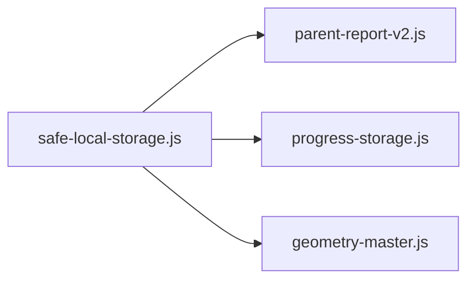

# Phase 4 execution package — storage abstraction + safe localStorage + export/import plan

## Context and constraints

- **In scope:** new [`utils/safe-local-storage.js`](c:/Users/ERAN%20YOSEF/Desktop/final%20projects/FINAL-WEB/LIOSH-WEB-TRY/utils/safe-local-storage.js), adoption in [`utils/parent-report-v2.js`](c:/Users/ERAN%20YOSEF/Desktop/final%20projects/FINAL-WEB/LIOSH-WEB-TRY/utils/parent-report-v2.js), [`utils/progress-storage.js`](c:/Users/ERAN%20YOSEF/Desktop/final%20projects/FINAL-WEB/LIOSH-WEB-TRY/utils/progress-storage.js), and **one** pilot learning page.
- **Hard rules (must hold):** no UI redesign; no report **logic** changes (only swap how bytes are read/written); no AI/Copilot changes; no content/question changes; **no storage key renames**; **no automatic data migration** (import/export is an explicit, user-driven contract only).
- **Explicitly out of scope for Phase 4 code changes:** [`utils/ai-hybrid-diagnostic/learning-loop.js`](c:/Users/ERAN%20YOSEF/Desktop/final%20projects/FINAL-WEB/LIOSH-WEB-TRY/utils/ai-hybrid-diagnostic/learning-loop.js), [`utils/ai-hybrid-diagnostic/rollout-config.js`](c:/Users/ERAN%20YOSEF/Desktop/final%20projects/FINAL-WEB/LIOSH-WEB-TRY/utils/ai-hybrid-diagnostic/rollout-config.js), [`utils/parent-copilot/telemetry-store.js`](c:/Users/ERAN%20YOSEF/Desktop/final%20projects/FINAL-WEB/LIOSH-WEB-TRY/utils/parent-copilot/telemetry-store.js), and other `localStorage` call sites except the pilot page — document them for later waves.

---

## 1. Current localStorage usage map (inventory)

Groupings below list **stable key names** (no renames in Phase 4). File lists are representative; full repo set comes from `rg localStorage`.

| Area | Keys / patterns | Primary files |
|------|------------------|---------------|
| **Global learner profile** | `mleo_player_name`, `mleo_player_avatar`, `mleo_player_avatar_image` | [`pages/index.js`](c:/Users/ERAN%20YOSEF/Desktop/final%20projects/FINAL-WEB/LIOSH-WEB-TRY/pages/index.js), all `pages/learning/*-master.js`, [`pages/mleo-memory.js`](c:/Users/ERAN%20YOSEF/Desktop/final%20projects/FINAL-WEB/LIOSH-WEB-TRY/pages/mleo-memory.js), [`pages/learning/parent-report.js`](c:/Users/ERAN%20YOSEF/Desktop/final%20projects/FINAL-WEB/LIOSH-WEB-TRY/pages/learning/parent-report.js), [`pages/learning/parent-report-detailed.js`](c:/Users/ERAN%20YOSEF/Desktop/final%20projects/FINAL-WEB/LIOSH-WEB-TRY/pages/learning/parent-report-detailed.js) |
| **Parent report contracts flag** | `mleo_parent_report_contracts_v1` | [`utils/parent-report-v2.js`](c:/Users/ERAN%20YOSEF/Desktop/final%20projects/FINAL-WEB/LIOSH-WEB-TRY/utils/parent-report-v2.js) (`evidenceContractsV1Enabled`) |
| **Math** | `mleo_math_master`, `mleo_math_master_progress`, `mleo_mistakes`, `mleo_math_learning_intel` ([`utils/math-learning-intel.js`](c:/Users/ERAN%20YOSEF/Desktop/final%20projects/FINAL-WEB/LIOSH-WEB-TRY/utils/math-learning-intel.js)); daily/weekly `mleo_daily_challenge`, `mleo_weekly_challenge` | [`pages/learning/math-master.js`](c:/Users/ERAN%20YOSEF/Desktop/final%20projects/FINAL-WEB/LIOSH-WEB-TRY/pages/learning/math-master.js), [`utils/math-time-tracking.js`](c:/Users/ERAN%20YOSEF/Desktop/final%20projects/FINAL-WEB/LIOSH-WEB-TRY/utils/math-time-tracking.js) (`TIME_TRACKING_KEY` + geometry time key there) |
| **Geometry** | `mleo_geometry_master`, `mleo_geometry_master_progress`, `mleo_geometry_mistakes`, `mleo_geometry_daily_challenge`, `mleo_weekly_challenge`; intel key inside [`utils/geometry-learning-intel.js`](c:/Users/ERAN%20YOSEF/Desktop/final%20projects/FINAL-WEB/LIOSH-WEB-TRY/utils/geometry-learning-intel.js) | [`pages/learning/geometry-master.js`](c:/Users/ERAN%20YOSEF/Desktop/final%20projects/FINAL-WEB/LIOSH-WEB-TRY/pages/learning/geometry-master.js) |
| **English** | `mleo_english_master`, `mleo_english_master_progress`, `mleo_english_mistakes` | [`pages/learning/english-master.js`](c:/Users/ERAN%20YOSEF/Desktop/final%20projects/FINAL-WEB/LIOSH-WEB-TRY/pages/learning/english-master.js), [`utils/english-time-tracking.js`](c:/Users/ERAN%20YOSEF/Desktop/final%20projects/FINAL-WEB/LIOSH-WEB-TRY/utils/english-time-tracking.js) |
| **Science** | `mleo_science_master`, `mleo_science_master_progress`, mistakes/intel constants in science-master, `mleo_science_daily_challenge`, `mleo_science_weekly_challenge` | [`pages/learning/science-master.js`](c:/Users/ERAN%20YOSEF/Desktop/final%20projects/FINAL-WEB/LIOSH-WEB-TRY/pages/learning/science-master.js), [`utils/science-time-tracking.js`](c:/Users/ERAN%20YOSEF/Desktop/final%20projects/FINAL-WEB/LIOSH-WEB-TRY/utils/science-time-tracking.js) |
| **Hebrew** | `mleo_hebrew_master`, `mleo_hebrew_master_progress`, `mleo_hebrew_mistakes`, shared `mleo_daily_challenge` / `mleo_weekly_challenge` | [`pages/learning/hebrew-master.js`](c:/Users/ERAN%20YOSEF/Desktop/final%20projects/FINAL-WEB/LIOSH-WEB-TRY/pages/learning/hebrew-master.js), [`utils/hebrew-time-tracking.js`](c:/Users/ERAN%20YOSEF/Desktop/final%20projects/FINAL-WEB/LIOSH-WEB-TRY/utils/hebrew-time-tracking.js) |
| **Moledet geography** | `mleo_moledet_geography_master`, progress, mistakes keys | [`pages/learning/moledet-geography-master.js`](c:/Users/ERAN%20YOSEF/Desktop/final%20projects/FINAL-WEB/LIOSH-WEB-TRY/pages/learning/moledet-geography-master.js), [`utils/moledet-geography-time-tracking.js`](c:/Users/ERAN%20YOSEF/Desktop/final%20projects/FINAL-WEB/LIOSH-WEB-TRY/utils/moledet-geography-time-tracking.js) |
| **Monthly / rewards (shared module)** | `LEO_MONTHLY_PROGRESS`, `LEO_PROGRESS_LOG`, `LEO_REWARD_CHOICE`, `LEO_REWARD_CELEBRATION` | [`utils/progress-storage.js`](c:/Users/ERAN%20YOSEF/Desktop/final%20projects/FINAL-WEB/LIOSH-WEB-TRY/utils/progress-storage.js), consumers e.g. [`pages/parent/rewards.js`](c:/Users/ERAN%20YOSEF/Desktop/final%20projects/FINAL-WEB/LIOSH-WEB-TRY/pages/parent/rewards.js), learning masters importing `addSessionProgress` / `loadMonthlyProgress` |
| **Parent report V2 reads** | All `SUBJECT_DEFS` `trackingKey`, `progressStorage()`, `mistakesKey` plus `mleo_daily_challenge`, `mleo_weekly_challenge` | [`utils/parent-report-v2.js`](c:/Users/ERAN%20YOSEF/Desktop/final%20projects/FINAL-WEB/LIOSH-WEB-TRY/utils/parent-report-v2.js) — `loadTracking`, `loadProgress`, `safeLocalStorageJsonArray`, `safeLocalStorageJsonObject` |
| **Games / misc** | Penalty high score keys, etc. | [`pages/mleo-penalty.js`](c:/Users/ERAN%20YOSEF/Desktop/final%20projects/FINAL-WEB/LIOSH-WEB-TRY/pages/mleo-penalty.js), other `pages/mleo-*.js`, [`components/InstallAppPrompt.js`](c:/Users/ERAN%20YOSEF/Desktop/final%20projects/FINAL-WEB/LIOSH-WEB-TRY/components/InstallAppPrompt.js), hooks/utils as found by search |

**Note:** [`utils/parent-report-v2.js`](c:/Users/ERAN%20YOSEF/Desktop/final%20projects/FINAL-WEB/LIOSH-WEB-TRY/utils/parent-report-v2.js) already implements **read-only** defensive patterns (`safeLocalStorageJsonArray` / `safeLocalStorageJsonObject`); `loadTracking` / `loadProgress` still use bare `JSON.parse(localStorage.getItem(...))` in try/catch (lines ~558–571). That inconsistency is the main internal adoption target.

---

## 2. Safe storage module API (proposed contract)

New file: [`utils/safe-local-storage.js`](c:/Users/ERAN%20YOSEF/Desktop/final%20projects/FINAL-WEB/LIOSH-WEB-TRY/utils/safe-local-storage.js).

**Primitives (SSR-safe, never throw across boundary):**

- `isLocalStorageAvailable()` — `typeof window !== "undefined"` and probe read (optional tiny write probe only if product requires it; default: read-only check).
- `safeGetItem(key: string): string | null` — wrap `getItem`; on any throw → `null`.
- `safeSetItem(key: string, value: string): { ok: boolean; error?: "quota" | "unknown" }` — wrap `setItem`; classify `QuotaExceededError` where possible; never throw to callers.
- `safeRemoveItem(key: string): void` — swallow errors.

**JSON helpers (align with existing parent-report helpers):**

- `safeGetJsonObject(key, fallback = {})` — same semantics as current `safeLocalStorageJsonObject` (plain object only).
- `safeGetJsonArray(key, fallback = [])` — same semantics as current `safeLocalStorageJsonArray`.
- `safeSetJson(key, value)` — `JSON.stringify`; return same `{ ok, error? }` as `safeSetItem`; optional `replacer`/`space` only if needed for debugging (default: compact).

**Non-goals in the module itself:** no key renaming, no migration, no encryption, no IndexedDB — keep a thin façade over `localStorage` only.

**Documentation (in-module JSDoc):** caller owns schema validation; this layer only guarantees **no throw** and **quota awareness** for writes.

---

## 3. Adoption plan by file (ordered execution)



| Step | File | Action |
|------|------|--------|
| 1 | [`utils/safe-local-storage.js`](c:/Users/ERAN%20YOSEF/Desktop/final%20projects/FINAL-WEB/LIOSH-WEB-TRY/utils/safe-local-storage.js) | Add module + JSDoc contract above. |
| 2 | [`utils/parent-report-v2.js`](c:/Users/ERAN%20YOSEF/Desktop/final%20projects/FINAL-WEB/LIOSH-WEB-TRY/utils/parent-report-v2.js) | Replace direct `localStorage` in `evidenceContractsV1Enabled` with `safeGetItem`. Replace `loadTracking` / `loadProgress` internals to delegate to `safeGetJsonObject` (same `{}` default). Replace private `safeLocalStorageJsonArray` / `safeLocalStorageJsonObject` bodies with re-exports or thin wrappers calling the shared module **without changing return shapes** used downstream. **No changes** to aggregation, date filters, or recommendation logic. |
| 3 | [`utils/progress-storage.js`](c:/Users/ERAN%20YOSEF/Desktop/final%20projects/FINAL-WEB/LIOSH-WEB-TRY/utils/progress-storage.js) | Route all `localStorage` reads/writes through `safe-*` helpers; preserve existing try/catch behavior where it intentionally swallows (writes should still no-op on failure, optionally log only if already a pattern — do not add new user-visible UI). |
| 4 (pilot) | [`pages/learning/geometry-master.js`](c:/Users/ERAN%20YOSEF/Desktop/final%20projects/FINAL-WEB/LIOSH-WEB-TRY/pages/learning/geometry-master.js) | Replace **every** `localStorage.*` in this file with `safe-local-storage` primitives or JSON helpers. **Do not** change `STORAGE_KEY`, key string literals, or merge semantics of saved objects. |

**Pilot choice rationale:** geometry-master already imports [`utils/progress-storage.js`](c:/Users/ERAN%20YOSEF/Desktop/final%20projects/FINAL-WEB/LIOSH-WEB-TRY/utils/progress-storage.js) for monthly/session aggregation **and** uses direct `localStorage` for progress, mistakes, challenges, and profile keys — one file exercises **both** the shared monthly module path and the per-subject key pattern, without being the largest surface (math).

**Deferred (document only, Phase 4b+):** time-tracking utils (`math-time-tracking`, `hebrew-time-tracking`, `english-time-tracking`, `moledet-geography-time-tracking`, `science-time-tracking`), `math-learning-intel`, `geometry-learning-intel`, remaining masters, games, [`pages/learning/parent-report-detailed.js`](c:/Users/ERAN%20YOSEF/Desktop/final%20projects/FINAL-WEB/LIOSH-WEB-TRY/pages/learning/parent-report-detailed.js), AI/copilot stores.

---

## 4. Export / import bundle design (spec only; no migration)

**Purpose:** optional backup/restore or device move using **existing** keys as dictionary entries — still **no rename**, **no automatic merge on app load**.

**Suggested bundle shape (versioned JSON):**

```json
{
  "schemaVersion": 1,
  "exportedAt": "ISO-8601",
  "origin": "optional non-PII label",
  "entries": {
    "mleo_geometry_master": "<exact string as stored in localStorage>",
    "mleo_geometry_master_progress": "{...}"
  }
}
```

- **Values:** always **strings** as stored in `localStorage` (round-trip safe). Consumers that today `JSON.parse` keep doing so after import.
- **Allowlist:** Phase 4 spec should define a static list (e.g. union of `SUBJECT_DEFS` keys from parent-report-v2 + `LEO_*` + global profile keys + pilot-only keys for geometry) so imports cannot inject arbitrary keys outside product contract.
- **Import modes (pick one default + document the other):**
  - **Replace:** for each key in bundle, `safeSetItem` (overwrite).
  - **Merge:** only where existing code already merges objects (e.g. progress maps); **do not invent new merge semantics** in Phase 4 — if merge is ambiguous, default to **replace per key** or **skip** with structured result `{ appliedKeys, skippedKeys, errors }`.
- **Validation:** `schemaVersion` must match; reject unknown versions (no silent migration).
- **Wire-up timing:** implementing `exportBundle()` / `importBundle()` can live in `safe-local-storage.js` or a sibling `utils/local-storage-bundle.js` in a **later sub-phase** if you want zero risk to report reads in the first PR; Phase 4 minimum is **design + optional thin API stubs** without UI entry points (respects “no UI redesign” — hooking a button would be a separate explicit task).

---

## 5. Edge cases

| Edge case | Handling |
|------------|----------|
| **SSR / no `window`** | All helpers return fallbacks (`null`, `{}`, `[]`, `{ ok: false }`) — mirror [`progress-storage.js`](c:/Users/ERAN%20YOSEF/Desktop/final%20projects/FINAL-WEB/LIOSH-WEB-TRY/utils/progress-storage.js) `typeof window === "undefined"` guards. |
| **Private mode / access throws** | `safeGetItem` / `safeSetItem` swallow; callers keep current degraded behavior. |
| **QuotaExceededError** | Surface `{ ok: false, error: "quota" }`; callers continue best-effort (progress-storage already ignores many write failures). |
| **Corrupt JSON in store** | Read helpers return fallback empty structures (parity with parent-report-v2 today). |
| **Non-object JSON where object expected** | Return `{}` (existing `safeLocalStorageJsonObject` rule). |
| **Concurrent tabs** | No transaction layer; document “last writer wins” — unchanged from today. |
| **Very large values (e.g. avatar image data URL)** | Still subject to quota; no chunking in Phase 4. |
| **Import bundle contains unknown keys** | Reject or strip based on allowlist; never write arbitrary keys. |
| **String values that are not JSON but used as raw strings** | Bundle stores raw string; import uses `setItem` only — no parse until consumer reads. |

---

## 6. Tests plan

Follow existing repo pattern: **Node `tsx` selftest** + `npm run` script (same family as [`scripts/answer-compare-selftest.mjs`](c:/Users/ERAN%20YOSEF/Desktop/final%20projects/FINAL-WEB/LIOSH-WEB-TRY/scripts/answer-compare-selftest.mjs)).

| Test file | Cases |
|-----------|--------|
| `scripts/safe-local-storage-selftest.mjs` (new) | Install a minimal `globalThis.localStorage` mock (Map-backed) throwing on demand for quota simulation. Assert: `safeGetItem` never throws; `safeSetJson` returns `ok: false` on throw; `safeGetJsonObject` / `safeGetJsonArray` defaults on invalid JSON / wrong type; SSR path (`window` undefined) returns fallbacks. |
| Regression | After adoption: `npm run test:parent-report-phase1` and/or `test:parent-report-phase6` if CI uses them — **no expectation changes** in report assertions (storage is transparent). |
| Pilot sanity | Manual or lightweight: open geometry master, complete one action that persists progress, reload — unchanged UX. |

**Out of scope for automated tests in Phase 4:** real browser quota, multi-tab races.

---

## Deliverables checklist (when implementation starts)

1. Add [`utils/safe-local-storage.js`](c:/Users/ERAN%20YOSEF/Desktop/final%20projects/FINAL-WEB/LIOSH-WEB-TRY/utils/safe-local-storage.js).
2. Refactor [`utils/parent-report-v2.js`](c:/Users/ERAN%20YOSEF/Desktop/final%20projects/FINAL-WEB/LIOSH-WEB-TRY/utils/parent-report-v2.js) reads only (no report logic edits).
3. Refactor [`utils/progress-storage.js`](c:/Users/ERAN%20YOSEF/Desktop/final%20projects/FINAL-WEB/LIOSH-WEB-TRY/utils/progress-storage.js).
4. Pilot: [`pages/learning/geometry-master.js`](c:/Users/ERAN%20YOSEF/Desktop/final%20projects/FINAL-WEB/LIOSH-WEB-TRY/pages/learning/geometry-master.js) only among learning pages.
5. Add `scripts/safe-local-storage-selftest.mjs` + `package.json` script `test:safe-local-storage`.
6. Document export/import bundle in module JSDoc or a short comment block next to stub APIs (no new user-facing markdown file unless you explicitly request one later).
