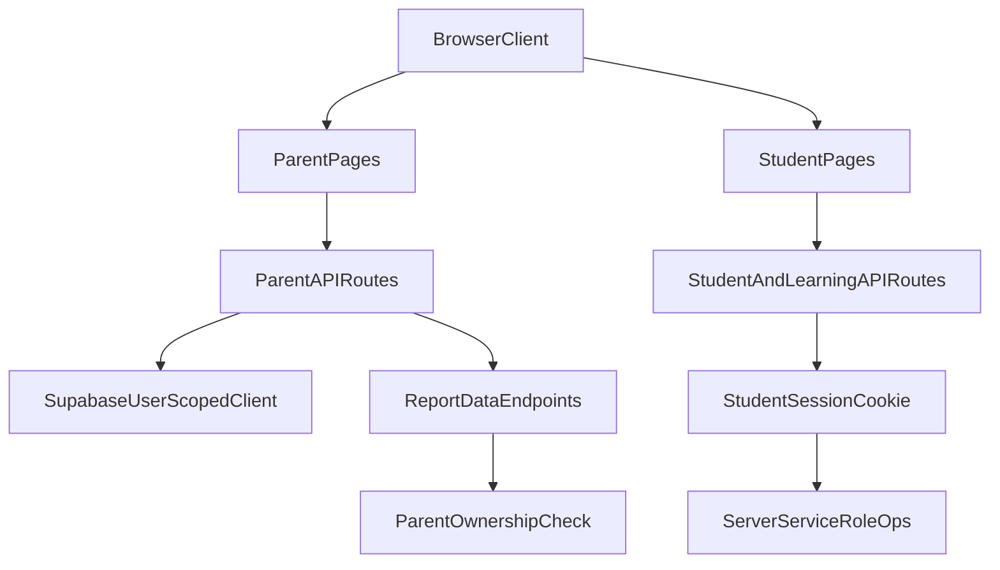

# Safe Documentation Prep Plan

## Scope Guardrails
- Work strictly in documentation files only under `docs/` (and nested docs folders).
- No product/source code edits.
- No simulation/report execution commands.
- Do not open or analyze latest overnight run artifacts (`FINAL_REPORT*`, latest run folder).

## Target Files To Create
- [docs/launch-readiness-checklist.md](c:/Users/ERAN%20YOSEF/Desktop/final%20projects/FINAL-WEB/LIOSH-WEB-TRY/docs/launch-readiness-checklist.md)
- [docs/site-map-and-protection-audit.md](c:/Users/ERAN%20YOSEF/Desktop/final%20projects/FINAL-WEB/LIOSH-WEB-TRY/docs/site-map-and-protection-audit.md)
- [docs/auth-security-readonly-audit.md](c:/Users/ERAN%20YOSEF/Desktop/final%20projects/FINAL-WEB/LIOSH-WEB-TRY/docs/auth-security-readonly-audit.md)
- [docs/hebrew-copy-review/parent-ai-copy-suggestions.md](c:/Users/ERAN%20YOSEF/Desktop/final%20projects/FINAL-WEB/LIOSH-WEB-TRY/docs/hebrew-copy-review/parent-ai-copy-suggestions.md)
- [docs/question-bank-professional-qa-plan.md](c:/Users/ERAN%20YOSEF/Desktop/final%20projects/FINAL-WEB/LIOSH-WEB-TRY/docs/question-bank-professional-qa-plan.md)
- [docs/mobile-rtl-manual-qa-checklist.md](c:/Users/ERAN%20YOSEF/Desktop/final%20projects/FINAL-WEB/LIOSH-WEB-TRY/docs/mobile-rtl-manual-qa-checklist.md)
- [docs/post-simulation-next-step-template.md](c:/Users/ERAN%20YOSEF/Desktop/final%20projects/FINAL-WEB/LIOSH-WEB-TRY/docs/post-simulation-next-step-template.md)

## Planned Content Per File
- `launch-readiness-checklist.md`
  - Full launch checklist items requested (parent flow, student flow, reports, PDF, Copilot/Parent AI, coverage, mobile/RTL, auth/security, Supabase/Vercel/env/dev-routes).
  - Each line will include: `Status: unchecked`, `Risk level`, `How to verify`, `Launch blocker: yes/no`.
  - Final section: deferred commands to run only after simulation completion.

- `site-map-and-protection-audit.md`
  - Route inventory from `pages/` and `pages/api/` grouped by parent/student/practice/report/pdf/auth/dev/public.
  - Explicit lists for: parent-auth required, student-auth required, never-public routes.
  - “Risky/unclear routes” with concise rationale.

- `auth-security-readonly-audit.md`
  - Findings split by Critical/High/Medium/Low.
  - Include files involved and exact follow-up fixes (recommendations only, no implementation).
  - Coverage for: parent/student auth, username-PIN login, session/logout, ownership checks, service role use, public env exposure, dev/simulator routes, Supabase client/server separation.

- `parent-ai-copy-suggestions.md`
  - Suggestion blocks in exact required schema:
    - Current text
    - Where found
    - Issue
    - Suggestion 1
    - Suggestion 2
    - Risk level
    - Requires owner approval: yes
    - Status: waiting for approval
  - Focus only on parent-facing Hebrew wording surfaces (insight, short/detailed summaries, do/avoid-now, weak-data, external answers, Copilot, disclaimers, PDF wording).

- `question-bank-professional-qa-plan.md`
  - Per subject (Math, Geometry, Hebrew, English, Science, Homeland/Geography): grades/topics/subtopics/difficulty/metadata/answer+distractor checks/Hebrew wording/pedagogic checks/sample-size/blockers/polish.
  - Define future output folders and artifact contracts:
    - `reports/content-quality-audit/<timestamp>/`
    - `questions-bank-quality-audit`
    - `subject-coverage-audit`
    - `pedagogic-sample-review`

- `mobile-rtl-manual-qa-checklist.md`
  - Manual QA matrix for requested screens/components and layout behaviors (small screens, orientation, clipping, RTL integrity, null/NaN/00000 checks).

- `post-simulation-next-step-template.md`
  - Empty execution template for immediate post-run actions only:
    - Analyze `FINAL_REPORT.md`
    - Analyze `FINAL_REPORT.json`
    - Analyze `MORNING_SUMMARY.md`
    - Analyze logs
    - classify failures
    - separate product vs infra
    - identify critical blockers
    - fix blockers first
    - rerun targeted QA
    - run final QA

## Readonly Findings To Embed (No Fixes Now)
- Critical:
  - Dev coin endpoint with hardcoded secret in `pages/api/student/dev-add-coins.js`.
  - Student PIN login brute-force risk in `pages/api/student/login.js`.
- High:
  - Engine review status route gate relies on public flag and no auth token (`pages/api/learning-simulator/engine-review-pack-status.js`).
  - Public env flags used as admin gates (`NEXT_PUBLIC_ENABLE_*`).
  - Copilot multi-mode auth/dev pathways require strict env hygiene (`pages/api/parent/copilot-turn.js`).
- Medium/Low:
  - Unauthenticated Hebrew utility routes exposure/cost-abuse risk.
  - Dev/simulator surfaces require strict production disablement.

## Auth/Route Data Flow (for docs explanation)

## Verification After Drafting Docs
- Validate all seven files exist with requested headings/sections.
- Confirm only markdown docs were created/edited.
- Provide concise Hebrew delivery note including created files, no-code-change confirmations, key risks found, and next waiting-step recommendation.