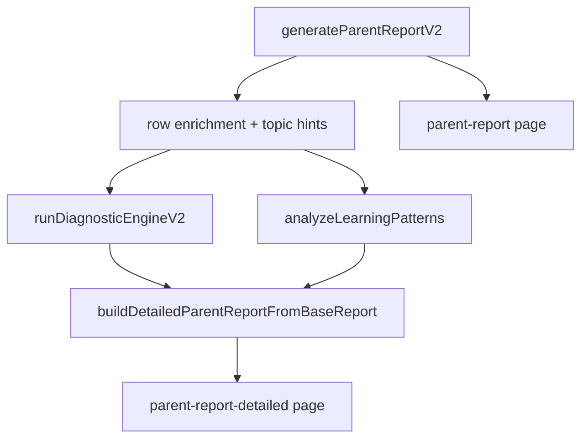
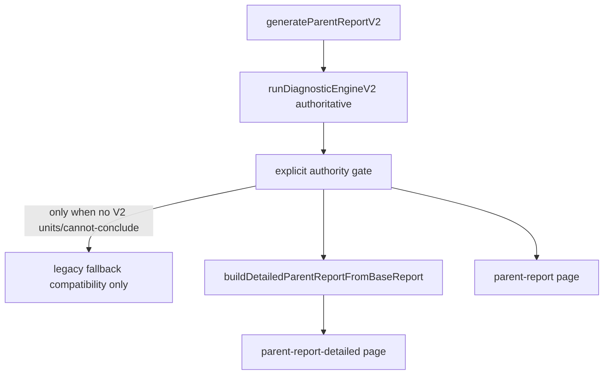

# Stage1 Closed Execution To Pilot

## Scope Lock
- מקור אמת מחייב: [docs/stage1-scientific-blueprint-source-of-truth.md](docs/stage1-scientific-blueprint-source-of-truth.md) ו-[docs/stage1-freeze-checklist.md](docs/stage1-freeze-checklist.md).
- אין פתיחת blueprint חדש, אין feature sprawl, אין side quests.
- סמכות מוצרית: `diagnosticEngineV2` ראשי; legacy fallback בלבד ורק בתנאים מפורשים.
- כלל חסימה מחייב: כל כשל חוסם ב־core engine / output contracts / authority model עוצר מעבר לפאזה הבאה עד תיקון ואימות מחדש של אותה פאזה.

## Baseline Architecture (Current)

## Target Architecture (Authority Clean)

## Phase Plan

### Phase 1 — Stabilization & Authority Cleanup
- קבצים עיקריים לעדכון:
  - [utils/parent-report-v2.js](utils/parent-report-v2.js) — existing file
  - [utils/detailed-parent-report.js](utils/detailed-parent-report.js) — existing file
  - [pages/learning/parent-report.js](pages/learning/parent-report.js) — existing file
  - [docs/DIAGNOSTIC_ENGINE_V2.md](docs/DIAGNOSTIC_ENGINE_V2.md) — existing file
- פעולות:
  - מיפוי וסגירת נקודות mixed authority.
  - קביעת `diagnosticPrimarySource` עקבי לאורך base+detailed+UI.
  - החלטת סמכות חד־משמעית: גם `pages/learning/parent-report.js` וגם detailed flow עוברים ל־V2 authority; legacy נשאר fallback compatibility only כאשר אין `diagnosticEngineV2.units` שימושיים או כאשר יש `cannot-conclude` מפורש.
  - הפיכת legacy ל-fallback שקוף בלבד (ללא silent fallback).
- Exit gate: V2 מקור ראשי בכל הזרימה המרכזית.
- Validation:
  - pass: שני המסלולים (`parent-report` + `parent-report-detailed`) מציגים סמכות V2 כראשית, ללא dual-authority חבוי, וכל fallback מסומן מפורשות.
  - pass with controlled leftovers: נשארו רק חוסרים תיעודיים/נראות שאינם משנים authority runtime, עם רשימת follow-up סגורה.
  - fail: קיימת נקודת authority ראשית מבוססת legacy, fallback שקט, או חוזה authority לא עקבי בין המסלולים.
  - build requirement: `npm run build` אינו חובה בסוף פאזה זו; חובה להריץ `npm run test:parent-report-phase1` וולידציית authority ייעודית.

### Phase 2 — Engine QA Harness
- קבצים עיקריים:
  - [tests/fixtures/parent-report-pipeline.mjs](tests/fixtures/parent-report-pipeline.mjs) — existing file
  - [scripts/parent-report-phase6-suite.mjs](scripts/parent-report-phase6-suite.mjs) — existing file
  - [scripts/topic-next-step-engine-scenarios.mjs](scripts/topic-next-step-engine-scenarios.mjs) — existing file
  - [scripts/diagnostic-engine-v2-harness.mjs](scripts/diagnostic-engine-v2-harness.mjs) — create if missing
  - [package.json](package.json) — existing file
- פעולות:
  - הרחבת מטריצת תרחישים לכל 6 מקצועות.
  - כיסוי sparse/contradictory/fragile/mastery/foundational/local/speed/hints/mixed/transfer/regression/recovery.
  - ציר expected-vs-actual מובנה ובר-מדידה.
- Exit gate: blind spots נראים מדידים.
- Validation:
  - pass: כל 6 המקצועות וכל משפחות התרחישים מכוסים ב־harness עם expected-vs-actual וסטטוס כמותי ברור.
  - pass with controlled leftovers: לכל היותר 1-2 תרחישים לא חוסמים חסרים זמנית, עם rationale מפורש שלא פוגע בקריטיות engine/authority/contracts.
  - fail: חסר כיסוי למקצוע, חסר expected-vs-actual למדדים core (`diagnosis/confidence/priority/gating/probe/intervention`), או חוסר יכולת למדוד blind spots.
  - build requirement: `npm run build` אינו חובה בסוף פאזה זו; חובה להריץ `npm run test:topic-next-step-phase2` + `npm run test:topic-next-step-engine-scenarios` + harness V2.

### Phase 3 — Engine Correction Pass
- קבצים עיקריים (לפי failures בפועל):
  - [utils/diagnostic-engine-v2/run-diagnostic-engine-v2.js](utils/diagnostic-engine-v2/run-diagnostic-engine-v2.js) — existing file
  - [utils/diagnostic-engine-v2/confidence-policy.js](utils/diagnostic-engine-v2/confidence-policy.js) — existing file
  - [utils/diagnostic-engine-v2/priority-policy.js](utils/diagnostic-engine-v2/priority-policy.js) — existing file
  - [utils/diagnostic-engine-v2/output-gating.js](utils/diagnostic-engine-v2/output-gating.js) — existing file
- פעולות:
  - תיקוני לוגיקה ממוקדים רק על כשלים שנמדדו.
  - בדיקות רגרסיה לאחר כל תיקון אצווה.
- Exit gate: pass rate קביל וללא regression.
- Validation:
  - pass: כל הכשלים החוסמים מפאזה 2 נסגרו, pass rate עומד בסף שהוגדר ב־harness, וללא regression בתרחישים שכבר עברו.
  - pass with controlled leftovers: נשארו כשלים לא חוסמים בלבד עם mitigation זמני שלא סותר blueprint/source-of-truth.
  - fail: קיים כשל חוסם פתוח, ירידה באיכות במדדים core, או תיקון שמייצר regression לא מבוקר.
  - build requirement: `npm run build` אינו חובה בסוף פאזה זו; חובה להריץ את כל בדיקות harness של phases 1-3.

### Phase 4 — End-to-End Product QA
- קבצים עיקריים:
  - [utils/parent-report-v2.js](utils/parent-report-v2.js) — existing file
  - [utils/detailed-parent-report.js](utils/detailed-parent-report.js) — existing file
  - [pages/learning/parent-report.js](pages/learning/parent-report.js) — existing file
  - [pages/learning/parent-report-detailed.js](pages/learning/parent-report-detailed.js) — existing file
  - [scripts/parent-report-pages-ssr.mjs](scripts/parent-report-pages-ssr.mjs) — existing file
- פעולות:
  - וולידציה מלאה של base->V2->detailed->structured output.
  - וולידציה של cannot-conclude ו-fallback behavior מפורש בלבד.
- Exit gate: אין payload contracts שבורים ואין critical empty sections ללא explicit behavior.
- Validation:
  - pass: זרימה end-to-end מלאה עובדת, חוזי payload נשמרים, ו־cannot-conclude/fallback מוצגים מפורשות ללא silent failure.
  - pass with controlled leftovers: פערי טקסט/נראות לא קריטיים בלבד, ללא הפרת contracts או authority model.
  - fail: שבר חוזה payload, section קריטי ריק ללא behavior מפורש, או סטייה ממודל authority.
  - build requirement: `npm run build` חובה בסוף פאזה זו.

### Phase 5 — Evidence Hardening
- קבצים עיקריים:
  - [utils/diagnostic-engine-v2/unit-builder.js](utils/diagnostic-engine-v2/unit-builder.js) — existing file
  - [utils/diagnostic-engine-v2/evidence-utils.js](utils/diagnostic-engine-v2/evidence-utils.js) — existing file
  - [utils/parent-report-v2.js](utils/parent-report-v2.js) — existing file
- פעולות:
  - audit ל־raw mistakes, recurrenceFull, timestamps, pattern families, sparse windows.
  - הקשחת חוזק ראיות ומניעת overclaim תחת ראיות חלשות.
- Exit gate: weak evidence לא מייצר overclaim.
- Validation:
  - pass: evidence strength עקבי עם איכות ראיות בפועל, overclaim לא מופיע תחת weak/sparse/contradictory evidence.
  - pass with controlled leftovers: נשארו חריגות evidence לא חוסמות עם סימון explicit limitation.
  - fail: מקרה overclaim לא פתור, או reliance עודף על fallback חלש בניגוד ל־source-of-truth.
  - build requirement: `npm run build` אינו חובה בסוף פאזה זו; חובה rerun harness + phase6 suite.

### Phase 6 — Pedagogical Review Pass
- קבצים עיקריים:
  - [utils/diagnostic-engine-v2/taxonomy/index.js](utils/diagnostic-engine-v2/taxonomy/index.js) — existing file
  - [utils/diagnostic-engine-v2/build-probe.js](utils/diagnostic-engine-v2/build-probe.js) — existing file
  - [utils/diagnostic-engine-v2/build-intervention.js](utils/diagnostic-engine-v2/build-intervention.js) — existing file
  - [docs/PARENT_REPORT_QA_CALIBRATION.md](docs/PARENT_REPORT_QA_CALIBRATION.md) — existing file
  - [docs/pedagogical-verdict-matrix.md](docs/pedagogical-verdict-matrix.md) — create if missing
- פעולות:
  - סקירת diagnosis/confidence/probe/intervention לכל מקצוע.
  - תיקון outputs טכניים אך לא פדגוגיים.
- Deliverable קשיח:
  - verdict פר מקצוע (`math`, `geometry`, `hebrew`, `english`, `science`, `moledet-geography`).
  - סיווג pedagogical issues ל־blocking / non-blocking.
  - הכרעת pedagogical go/no-go לפיילוט (מפורשת ומנומקת).
- Exit gate: איכות פדגוגית קבילה בכל 6 המקצועות.
- Validation:
  - pass: לכל מקצוע verdict `acceptable` ללא issue blocking פתוח, ו־pedagogical go לפיילוט.
  - pass with controlled leftovers: רק non-blocking issues פתוחים עם mitigation/monitoring ברור, ו־go מותנה לפיילוט.
  - fail: issue pedagogical blocking פתוח באחד המקצועות או verdict no-go לפיילוט.
  - build requirement: `npm run build` אינו חובה בסוף פאזה זו; חובה phase6 suite + סקירת verdict matrix.

### Phase 7 — Product Readiness Polish
- קבצים עיקריים:
  - [pages/learning/parent-report.js](pages/learning/parent-report.js) — existing file
  - [pages/learning/parent-report-detailed.js](pages/learning/parent-report-detailed.js) — existing file
  - [utils/parent-report-payload-normalize.js](utils/parent-report-payload-normalize.js) — existing file
- פעולות:
  - שיפורי קריאות ומבנה מינימליים בלבד.
  - שמירה על יציבות לוגית; ללא redesign.
- Exit gate: outputs קריאים ושמישים לבדיקות ופיילוט.
- Validation:
  - pass: הפלט קריא, עקבי, ושמיש לבודקים ללא שינוי לוגיקה.
  - pass with controlled leftovers: נותרו בעיות ניסוח מינוריות בלבד שאינן פוגעות ב־usability בבדיקות/פיילוט.
  - fail: polish שבר behavior/contracts או שקריאות לא מספיקה להפעלה מבוקרת.
  - build requirement: `npm run build` חובה בסוף פאזה זו.

### Phase 8 — Pilot Readiness Package
- קבצים עיקריים:
  - [docs/stage1-freeze-checklist.md](docs/stage1-freeze-checklist.md) — existing file
  - [docs/PARENT_REPORT_QA_CALIBRATION.md](docs/PARENT_REPORT_QA_CALIBRATION.md) — existing file
  - [docs/pilot-readiness-package.md](docs/pilot-readiness-package.md) — create if missing
- פעולות:
  - הגדרת success criteria, severe issue categories, known limitations, review checklist.
  - פסק דין `ready for testing` / `ready for pilot` / `not ready`.
- Exit gate: חבילת פיילוט סגורה לשימוש מבוקר.
- Validation:
  - pass: כל קריטריוני ה־pilot package מלאים, severe categories מוגדרות, וניתן verdict מבוסס evidence.
  - pass with controlled leftovers: חסרים לא חוסמים בתיעוד בלבד, עם תאריך/בעלים לסגירה לפני pilot רחב.
  - fail: חסר רכיב חובה בחבילה, או verdict אינו נתמך בנתוני phases 1-7.
  - build requirement: `npm run build` חובה בסוף פאזה זו (final freeze build).

## Validation Spine (sequenced and hardened)
- baseline tests after each phase as relevant:
  - `npm run test:parent-report-phase1`
  - `npm run test:topic-next-step-phase2`
  - `npm run test:topic-next-step-engine-scenarios`
  - `npm run test:parent-report-phase6`
- build cadence:
  - חובה `npm run build` בסוף Phase 4, Phase 7, ו־Phase 8 בלבד.
  - אין חובה להריץ build בסוף Phase 1/2/3/5/6 אלא אם יש חשד לשבר bundling/runtime.
- כלל מעבר פאזה:
  - מעבר לפאזה הבאה מותר רק כאשר verdict הפאזה הנוכחית אינו `fail` ואין blocking failure פתוח לפי כלל החסימה.

## Execution Reporting Contract (per phase)
- phase name
- exact files changed
- what was completed
- what failed
- what remains before exit gate
- verdict: `pass` / `pass with controlled leftovers` / `fail`

## Final Closeout Contract
- exact files changed across full program
- final architecture summary
- final authority model
- final engine flow
- final subject coverage status
- final QA summary
- final evidence limitations
- final pedagogical limitations
- final known pilot risks
- final verdict: `ready for testing` / `ready for pilot` / `not ready`