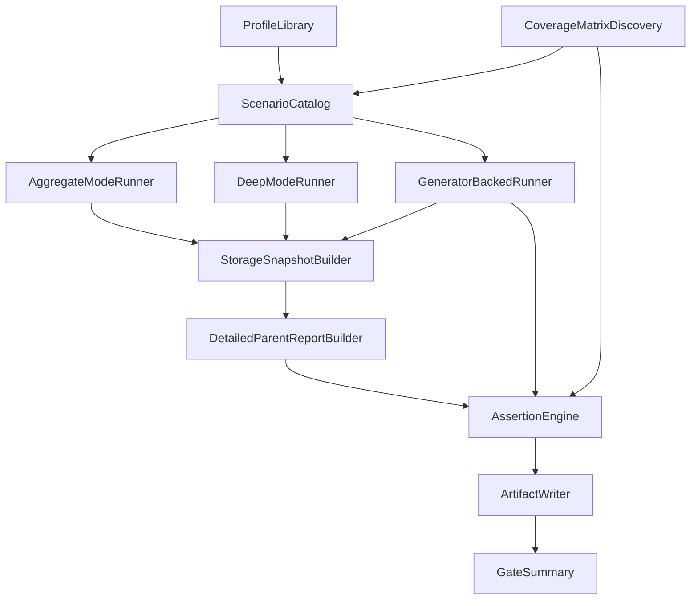

# Unified Automatic Learning Simulator Design

## A. Existing assets to reuse

- **Dev student simulator core (storage-faithful aggregate simulation):**
  - [`utils/dev-student-simulator/index.js`](utils/dev-student-simulator/index.js)
  - [`utils/dev-student-simulator/core.js`](utils/dev-student-simulator/core.js)
  - [`utils/dev-student-simulator/session-builder.js`](utils/dev-student-simulator/session-builder.js)
  - [`utils/dev-student-simulator/snapshot-builder.js`](utils/dev-student-simulator/snapshot-builder.js)
  - [`utils/dev-student-simulator/custom-session-builder.js`](utils/dev-student-simulator/custom-session-builder.js)
  - [`utils/dev-student-simulator/browser-storage.js`](utils/dev-student-simulator/browser-storage.js)
- **Deep longitudinal simulation engine:**
  - [`scripts/lib/deep-learning-sim-storage.mjs`](scripts/lib/deep-learning-sim-storage.mjs)
  - [`scripts/parent-report-deep-learning-simulation-generate.mjs`](scripts/parent-report-deep-learning-simulation-generate.mjs)
  - [`scripts/parent-report-deep-learning-simulation-audit.mjs`](scripts/parent-report-deep-learning-simulation-audit.mjs)
- **Learning simulation fixture pipeline:**
  - [`tests/fixtures/parent-report-learning-simulations.mjs`](tests/fixtures/parent-report-learning-simulations.mjs)
  - [`scripts/parent-report-learning-simulation-generate.mjs`](scripts/parent-report-learning-simulation-generate.mjs)
  - [`scripts/parent-report-learning-simulation-audit.mjs`](scripts/parent-report-learning-simulation-audit.mjs)
- **Report/persona assertions seed set:**
  - [`tests/fixtures/parent-report-persona-corpus.mjs`](tests/fixtures/parent-report-persona-corpus.mjs)
  - [`scripts/parent-report-persona-corpus-audit.mjs`](scripts/parent-report-persona-corpus-audit.mjs)
  - [`scripts/parent-report-product-contract-audit.mjs`](scripts/parent-report-product-contract-audit.mjs)
  - [`scripts/parent-report-short-vs-detailed-consistency-audit.mjs`](scripts/parent-report-short-vs-detailed-consistency-audit.mjs)
- **Question quality and coverage audits:**
  - [`scripts/generator-deterministic-harness.mjs`](scripts/generator-deterministic-harness.mjs)
  - [`scripts/audit-question-banks.mjs`](scripts/audit-question-banks.mjs)
  - [`scripts/audit-skill-coverage.mjs`](scripts/audit-skill-coverage.mjs)
  - [`scripts/audit-weak-coverage-action-plan.mjs`](scripts/audit-weak-coverage-action-plan.mjs)
- **Decision/canonical/oracle safety surfaces:**
  - [`scripts/canonical-topic-state-e2e.mjs`](scripts/canonical-topic-state-e2e.mjs)
  - [`scripts/oracle-conformance-tests.mjs`](scripts/oracle-conformance-tests.mjs)
  - [`utils/contracts/parent-product-contract-v1.js`](utils/contracts/parent-product-contract-v1.js)
  - [`utils/detailed-parent-report.js`](utils/detailed-parent-report.js)

## B. Coverage matrix design (grade x subject x level x topic)

- **Matrix authority rule (no guessing):**
  - Build matrix from subject-specific source-of-truth files and persist as generated artifact.
- **Discovered topic keys and sources:**
  - **Math ops:** from [`utils/math-constants.js`](utils/math-constants.js) (`GRADES[g1..g6].operations`, `OPERATIONS`)
  - **Geometry topics:** from [`utils/geometry-constants.js`](utils/geometry-constants.js) (`GRADES[g1..g6].topics`)
  - **Science topics:** from [`data/science-curriculum.js`](data/science-curriculum.js) (`SCIENCE_GRADES[g1..g6].topics`) with runtime cross-check in [`pages/learning/science-master.js`](pages/learning/science-master.js)
  - **English topics:** from [`data/english-curriculum.js`](data/english-curriculum.js) (`ENGLISH_GRADES[g1..g6].topics`) with gating via [`utils/grade-gating.js`](utils/grade-gating.js)
  - **Hebrew topics:** runtime allow-list from [`utils/hebrew-constants.js`](utils/hebrew-constants.js) (`GRADES[g1..g6].topics`), curriculum display from [`data/hebrew-curriculum.js`](data/hebrew-curriculum.js)
  - **Moledet/geography topics:** runtime allow-list from [`utils/moledet-geography-constants.js`](utils/moledet-geography-constants.js), curriculum from [`data/moledet-geography-curriculum.js`](data/moledet-geography-curriculum.js)
- **Levels:** `easy`, `medium`, `hard` from subject constants and runtime gating.
- **Naming normalization map (required):**
  - Subject aliases mapped centrally: `moledet-geography` <-> `moledet_geography` <-> `geography` (spine context only).
  - Preserve original IDs in simulation payloads; normalize only for matrix joins and reports.
- **Matrix outputs:**
  - `coverage-matrix.json` with fields: `grade`, `subjectCanonical`, `subjectRuntime`, `level`, `topic`, `sourceFile`, `isRuntimeSupported`, `isCurriculumDeclared`, `isGeneratorBacked`.

## C. Student profile taxonomy

- **Base profiles per grade (g1..g6):**
  - `strong_all_subjects`, `weak_all_subjects`, `average_student`, `random_guessing_student`, `thin_data_student`, `improving_student`, `declining_student`, `inconsistent_student`, `fast_wrong_student`, `slow_correct_student`, `subject_specific_weak_math`, `subject_specific_weak_hebrew`, `subject_specific_weak_english`, `subject_specific_weak_science`, `subject_specific_weak_geometry`, `subject_specific_weak_moledet_geography`.
- **Topic-specific profile generation strategy:**
  - Auto-derive profile IDs from discovered topics, e.g. `weak_math_<operation>`, `weak_geometry_<topic>`, `weak_hebrew_<topic>`, `weak_english_<topic>`, `weak_science_<topic>`, `weak_moledet_geography_<topic>`.
  - Keep curated aliases for human readability where they map to real topic keys (example: `weak_math_fractions` maps to operation `fractions`).
- **Profile behavior dimensions:**
  - Accuracy curve, pace curve, hint usage rate, consistency variance, topic preference distribution, grade/level boundaries, confidence suppression bias (for thin/random profiles), trend shape (up/down/flat).

## D. Scenario schema proposal

- **Unified schema (single source for all modes):**
  - `scenarioId`, `mode` (`aggregate` | `deep` | `generator_backed`)
  - `grade`, `subjects[]`, `levels[]`, `topicTargets[]`
  - `profileRef`, `timeHorizonDays` (`1|3|7|30|90`)
  - `sessionPlan` (`targetSessions`, `dailyCadence`, `subjectMix`, `topicMix`, `levelProgressionPolicy`)
  - `answerPolicy` (`accuracyByTopic`, `randomGuessRate`, `hintUsage`, `responseTimeModel`)
  - `expected` (assertion object)
  - `artifacts` options (`reports`, `pdf`, `screenshots`, `traceOnFailure`).
- **Mode behaviors:**
  - **Aggregate mode:** use existing snapshot/session builders from dev simulator + learning fixture style.
  - **Deep mode:** use deep-learning-sim-storage functions and long-span validation semantics.
  - **Generator-backed mode (optional by config):** draw real questions from subject generators/banks before answer simulation, then project to learning storage and engine inputs.

## E. Assertion schema proposal

- **Scenario-level expected contract:**
  - `mustMention[]`, `mustNotMention[]`
  - `allowedTone[]`, `forbiddenTone[]`
  - `topWeaknessExpected`, `topStrengthExpected`
  - `trendExpected` (`up|down|flat|insufficient`)
  - `evidenceLevelExpected` (`thin|medium|high`)
  - `confidenceShouldBeCautious` (boolean)
  - `noContradiction`, `noGenericOnlyReport`, `noFalseStrongConclusion`, `noFalseWeakConclusion`.
- **Assertion engines (reused + extended):**
  - Contract assertions on `parentProductContractV1.top` and `parentProductContractV1.subjects` from [`utils/contracts/parent-product-contract-v1.js`](utils/contracts/parent-product-contract-v1.js).
  - Cross-surface consistency using patterns from [`scripts/parent-report-short-vs-detailed-consistency-audit.mjs`](scripts/parent-report-short-vs-detailed-consistency-audit.mjs).
  - Product-oracle safety checks via [`scripts/oracle-conformance-tests.mjs`](scripts/oracle-conformance-tests.mjs) and canonical state checks via [`scripts/canonical-topic-state-e2e.mjs`](scripts/canonical-topic-state-e2e.mjs).
  - Report text forbidden-internal checks via `FORBIDDEN_INTERNAL_PARENT_TERMS` in [`utils/contracts/parent-product-contract-v1.js`](utils/contracts/parent-product-contract-v1.js).
- **Question integrity assertions (generator-backed and/or question mode):**
  - non-empty question text, answer presence, options validity, duplicate option constraints, grade-topic-level fit, diagnostic metadata presence where required, no impossible level jumps.

## F. Command structure

- **Primary commands:**
  - `qa:learning-simulator`
  - `qa:learning-simulator:quick`
  - `qa:learning-simulator:deep`
  - `qa:learning-simulator:reports`
  - `qa:learning-simulator:questions`
- **Execution semantics:**
  - `quick`: fast deterministic subset + contract/report assertions + minimal matrix smoke across all subjects/grades.
  - `deep`: longitudinal 30/90-day heavy scenarios + trend/evidence robustness checks.
  - `reports`: render/audit focused (JSON first, optional PDF/screenshots).
  - `questions`: generator and bank integrity + grade/topic/level compatibility checks.
  - default `qa:learning-simulator`: orchestrates staged sequence and outputs unified summary.

## G. Output artifacts

- `run-summary.json` (machine-readable master result)
- `run-summary.md` (human summary)
- `coverage-matrix.json` (full discovered matrix)
- `failed-scenarios.json` (full failure payloads)
- `per-student/<scenarioId>.report.json` (normalized report + assertion evidence)
- `per-student/<scenarioId>.storage.json` (simulated storage snapshot)
- `per-student/<scenarioId>.question-audit.json` (when generator-backed)
- Optional render artifacts: PDFs/screenshots; optional Playwright traces only on rendering failures.

## H. Phased implementation plan

- **Phase 0 — Coverage matrix discovery**
  - Implement matrix discovery module from source files listed in Section B.
  - Persist normalization/alias map and matrix artifact.
- **Phase 1 — Unified scenario schema**
  - Add schema types/validator and migration adapters for existing fixtures (`parent-report-learning-simulations`, deep scenarios, dev presets).
- **Phase 2 — Aggregate simulator runner**
  - Build deterministic aggregate runner using existing storage builders (`dev-student-simulator` + fixture storage builder style).
- **Phase 3 — Report assertions**
  - Add assertion runner over `detailed-parent-report` outputs and contract consistency checks.
- **Phase 4 — Generator-backed simulation**
  - Add optional per-subject adapter layer for question generation and question-level integrity assertions.
- **Phase 5 — Long-horizon deep runs**
  - Integrate deep timeline runner (30/90-day policies), robust trend/evidence assertions, stability checks.
- **Phase 6 — Final orchestrator (`qa:learning-simulator`)**
  - Wire subcommands, selective filters (grade/subject/topic/profile), artifact writer, and PASS/FAIL summary.
- **Phase 7 — CI/release gate**
  - Add staged CI jobs: quick gate on PR, deep nightly, full release matrix before deploy.

## I. Estimated scenario counts (initial target)

- **Quick gate:** ~120-180 scenarios
  - Goal: every grade and subject touched daily, all levels touched, broad topic coverage sampled.
- **Deep/nightly gate:** ~300-500 scenarios
  - Includes 30/90-day trajectories, trend profiles, thin-data and contradiction stress cases.
- **Full release gate:** ~900-1400 scenarios
  - Full matrix closure across grade x subject x level x topic with profile families and mode mix.
- **Coverage guarantee rule:**
  - Every matrix cell must be covered by at least one scenario in either quick/deep/full tiers; uncovered cells must fail gate with explicit list.

## J. Risks and decisions needed

- **Subject naming drift risk:** `moledet-geography` vs `moledet_geography` vs `geography`; resolve with canonical map and strict adapters.
- **Curriculum vs runtime topic mismatch risk:** especially `mixed` topic availability differences (Hebrew/Moledet data files vs runtime constants); choose runtime allow-list as simulation authority, keep curriculum flag in matrix for visibility.
- **Generator parity risk:** English/science/moledet paths are not uniformly structured; generator-backed mode requires per-subject adapter contracts.
- **Text assertion brittleness risk:** Hebrew copy variations can cause false fails; use layered assertions (contract fields first, text heuristics second).
- **Combinatorial explosion risk:** enforce staged gates and pairwise+risk-based sampling in quick mode.
- **Determinism risk:** standardize seed and anchor-time policy per run and persist in artifacts.

## K. Exact files likely to be created/touched later

- **Likely new files:**
  - `scripts/learning-simulator/index.mjs`
  - `scripts/learning-simulator/run-quick.mjs`
  - `scripts/learning-simulator/run-deep.mjs`
  - `scripts/learning-simulator/run-reports.mjs`
  - `scripts/learning-simulator/run-questions.mjs`
  - `scripts/learning-simulator/lib/coverage-matrix.mjs`
  - `scripts/learning-simulator/lib/subject-topics-discovery.mjs`
  - `scripts/learning-simulator/lib/profile-library.mjs`
  - `scripts/learning-simulator/lib/scenario-schema.mjs`
  - `scripts/learning-simulator/lib/assertion-engine.mjs`
  - `scripts/learning-simulator/lib/artifact-writer.mjs`
  - `tests/fixtures/learning-simulator/profiles/*.mjs`
  - `tests/fixtures/learning-simulator/scenarios/*.mjs`
- **Likely touched existing files:**
  - [`package.json`](package.json) (new command wiring only)
  - [`scripts/parent-report-learning-simulation-audit.mjs`](scripts/parent-report-learning-simulation-audit.mjs) (adapter/reuse exports)
  - [`scripts/parent-report-deep-learning-simulation-audit.mjs`](scripts/parent-report-deep-learning-simulation-audit.mjs) (adapter/reuse exports)
  - [`scripts/audit-question-banks.mjs`](scripts/audit-question-banks.mjs) (optional exportable validators)
  - [`scripts/generator-deterministic-harness.mjs`](scripts/generator-deterministic-harness.mjs) (optional reusable API extraction)
  - [`scripts/parent-report-product-contract-audit.mjs`](scripts/parent-report-product-contract-audit.mjs) (optional shared assertion helpers)

## Architecture/data-flow overview

## Execution strategy (quick/nightly/full)

- **Quick gate (PR):**
  - Deterministic seed set, limited horizons (1/3/7), all grades+subjects represented, high-risk profiles included (thin/random/declining/fast-wrong).
- **Nightly deep gate:**
  - Adds 30/90-day horizons, deep mode scenarios, trend stability and no-false-confidence stress.
- **Full release gate:**
  - Full matrix closure and generator-backed expansion, report/render verification bundle, strict PASS/FAIL with fail-fast summaries and artifact bundles.
- **Targeted subject gate:**
  - Filtered execution by `--subject`, `--grade`, `--topic`, `--profile` for rapid debugging and regression isolation.