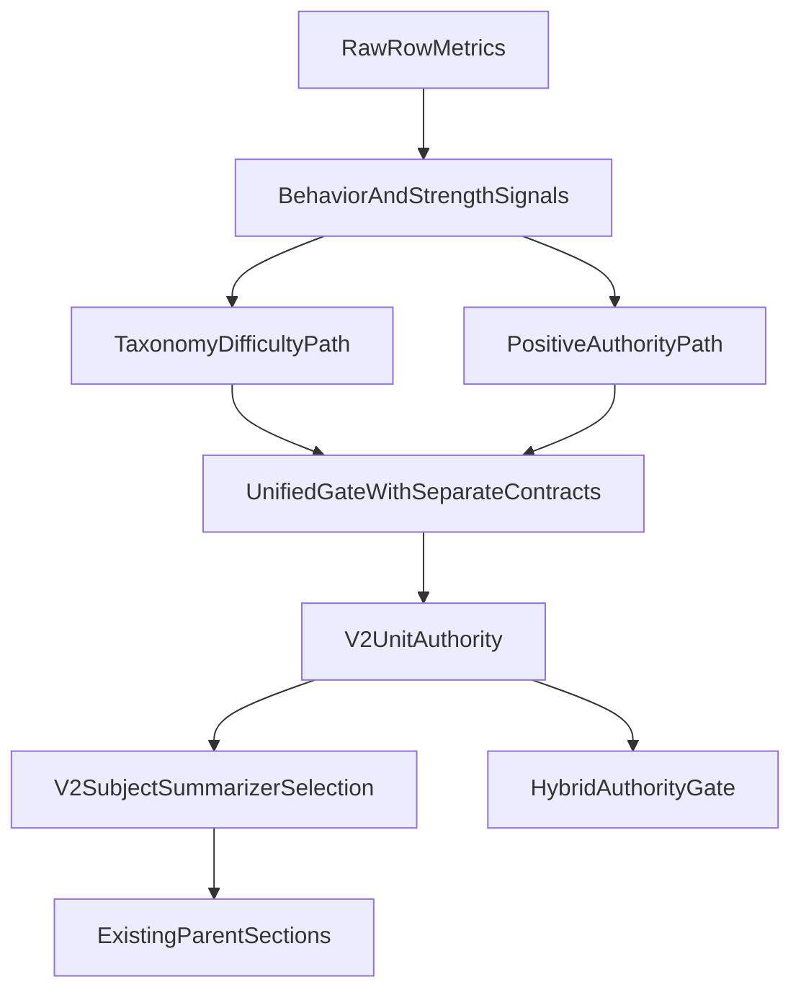

# V2 Positive Authority Final Implementation Plan (Locked Revision)

## 1. Executive plan summary

- **What exactly will change:** Add a separate positive-authority contract in V2 (new machine fields and gating path), route it through summarization/output selection, and keep taxonomy/difficulty path intact as a parallel authority lane.
- **What exactly will not change:** No approved parent-facing Hebrew strings, no new parent-facing Hebrew literals, no PDF generation/export/render/template/layout/styling changes, no report UI redesign.
- **Product goal:** In clearly strong/high/excellent performance cases, parent report must produce strong positive authority even when taxonomy match is missing; caution may still appear when needed, but as additive context rather than structural block.

## 2. Scope boundaries

- **In scope**
  - V2 unit authority fields for positive conclusions.
  - V2 gating logic changes for positive vs caution coexistence.
  - V2 subject summarizer routing changes (selection/population only).
  - Detailed report V2 summary/profile routing alignment.
  - Hybrid compatibility checks for contract consistency.

- **Out of scope (explicit freeze)**
  - Any change to approved parent-facing Hebrew wording.
  - Any new Hebrew literals in parent-facing flows unless explicitly approved later.
  - Any PDF-related change: generation, export, rendering, templates, layout, styling.
  - Any redesign of report surfaces/components.
  - Taxonomy content rewrite.

- **Files that will be changed**
  - [c:\\Users\\ERAN YOSEF\\Desktop\\final projects\\FINAL-WEB\\LIOSH-WEB-TRY\\utils\\diagnostic-engine-v2\\run-diagnostic-engine-v2.js](c:\\Users\\ERAN YOSEF\\Desktop\\final projects\\FINAL-WEB\\LIOSH-WEB-TRY\\utils\\diagnostic-engine-v2\\run-diagnostic-engine-v2.js)
  - [c:\\Users\\ERAN YOSEF\\Desktop\\final projects\\FINAL-WEB\\LIOSH-WEB-TRY\\utils\\diagnostic-engine-v2\\output-gating.js](c:\\Users\\ERAN YOSEF\\Desktop\\final projects\\FINAL-WEB\\LIOSH-WEB-TRY\\utils\\diagnostic-engine-v2\\output-gating.js)
  - [c:\\Users\\ERAN YOSEF\\Desktop\\final projects\\FINAL-WEB\\LIOSH-WEB-TRY\\utils\\parent-report-v2.js](c:\\Users\\ERAN YOSEF\\Desktop\\final projects\\FINAL-WEB\\LIOSH-WEB-TRY\\utils\\parent-report-v2.js)
  - [c:\\Users\\ERAN YOSEF\\Desktop\\final projects\\FINAL-WEB\\LIOSH-WEB-TRY\\utils\\detailed-parent-report.js](c:\\Users\\ERAN YOSEF\\Desktop\\final projects\\FINAL-WEB\\LIOSH-WEB-TRY\\utils\\detailed-parent-report.js)

- **Files that may be changed only if strictly required**
  - [c:\\Users\\ERAN YOSEF\\Desktop\\final projects\\FINAL-WEB\\LIOSH-WEB-TRY\\utils\\diagnostic-engine-v2\\strength-profile.js](c:\\Users\\ERAN YOSEF\\Desktop\\final projects\\FINAL-WEB\\LIOSH-WEB-TRY\\utils\\diagnostic-engine-v2\\strength-profile.js)
  - [c:\\Users\\ERAN YOSEF\\Desktop\\final projects\\FINAL-WEB\\LIOSH-WEB-TRY\\utils\\diagnostic-engine-v2\\confidence-policy.js](c:\\Users\\ERAN YOSEF\\Desktop\\final projects\\FINAL-WEB\\LIOSH-WEB-TRY\\utils\\diagnostic-engine-v2\\confidence-policy.js)
  - [c:\\Users\\ERAN YOSEF\\Desktop\\final projects\\FINAL-WEB\\LIOSH-WEB-TRY\\utils\\ai-hybrid-diagnostic\\authority-gate.js](c:\\Users\\ERAN YOSEF\\Desktop\\final projects\\FINAL-WEB\\LIOSH-WEB-TRY\\utils\\ai-hybrid-diagnostic\\authority-gate.js)
  - [c:\\Users\\ERAN YOSEF\\Desktop\\final projects\\FINAL-WEB\\LIOSH-WEB-TRY\\utils\\ai-hybrid-diagnostic\\v2-authority-snapshot.js](c:\\Users\\ERAN YOSEF\\Desktop\\final projects\\FINAL-WEB\\LIOSH-WEB-TRY\\utils\\ai-hybrid-diagnostic\\v2-authority-snapshot.js)
  - [c:\\Users\\ERAN YOSEF\\Desktop\\final projects\\FINAL-WEB\\LIOSH-WEB-TRY\\utils\\ai-hybrid-diagnostic\\validate-hybrid-runtime.js](c:\\Users\\ERAN YOSEF\\Desktop\\final projects\\FINAL-WEB\\LIOSH-WEB-TRY\\utils\\ai-hybrid-diagnostic\\validate-hybrid-runtime.js)

- **Files forbidden to change**
  - Hebrew/copy files (frozen):
    - [c:\\Users\\ERAN YOSEF\\Desktop\\final projects\\FINAL-WEB\\LIOSH-WEB-TRY\\utils\\parent-report-language\\parent-facing-normalize-he.js](c:\\Users\\ERAN YOSEF\\Desktop\\final projects\\FINAL-WEB\\LIOSH-WEB-TRY\\utils\\parent-report-language\\parent-facing-normalize-he.js)
    - [c:\\Users\\ERAN YOSEF\\Desktop\\final projects\\FINAL-WEB\\LIOSH-WEB-TRY\\utils\\parent-report-language\\pedagogy-glossary-he.js](c:\\Users\\ERAN YOSEF\\Desktop\\final projects\\FINAL-WEB\\LIOSH-WEB-TRY\\utils\\parent-report-language\\pedagogy-glossary-he.js)
    - [c:\\Users\\ERAN YOSEF\\Desktop\\final projects\\FINAL-WEB\\LIOSH-WEB-TRY\\utils\\parent-report-ui-explain-he.js](c:\\Users\\ERAN YOSEF\\Desktop\\final projects\\FINAL-WEB\\LIOSH-WEB-TRY\\utils\\parent-report-ui-explain-he.js)
    - [c:\\Users\\ERAN YOSEF\\Desktop\\final projects\\FINAL-WEB\\LIOSH-WEB-TRY\\utils\\parent-report-language\\v2-parent-copy.js](c:\\Users\\ERAN YOSEF\\Desktop\\final projects\\FINAL-WEB\\LIOSH-WEB-TRY\\utils\\parent-report-language\\v2-parent-copy.js)
    - [c:\\Users\\ERAN YOSEF\\Desktop\\final projects\\FINAL-WEB\\LIOSH-WEB-TRY\\utils\\parent-report-language\\short-report-v2-copy.js](c:\\Users\\ERAN YOSEF\\Desktop\\final projects\\FINAL-WEB\\LIOSH-WEB-TRY\\utils\\parent-report-language\\short-report-v2-copy.js)
    - [c:\\Users\\ERAN YOSEF\\Desktop\\final projects\\FINAL-WEB\\LIOSH-WEB-TRY\\utils\\detailed-report-parent-letter-he.js](c:\\Users\\ERAN YOSEF\\Desktop\\final projects\\FINAL-WEB\\LIOSH-WEB-TRY\\utils\\detailed-report-parent-letter-he.js)
  - PDF-related files (frozen):
    - [c:\\Users\\ERAN YOSEF\\Desktop\\final projects\\FINAL-WEB\\LIOSH-WEB-TRY\\pages\\learning\\parent-report.js](c:\\Users\\ERAN YOSEF\\Desktop\\final projects\\FINAL-WEB\\LIOSH-WEB-TRY\\pages\\learning\\parent-report.js)
    - [c:\\Users\\ERAN YOSEF\\Desktop\\final projects\\FINAL-WEB\\LIOSH-WEB-TRY\\pages\\learning\\parent-report-detailed.js](c:\\Users\\ERAN YOSEF\\Desktop\\final projects\\FINAL-WEB\\LIOSH-WEB-TRY\\pages\\learning\\parent-report-detailed.js)
    - [c:\\Users\\ERAN YOSEF\\Desktop\\final projects\\FINAL-WEB\\LIOSH-WEB-TRY\\utils\\math-report-generator.js](c:\\Users\\ERAN YOSEF\\Desktop\\final projects\\FINAL-WEB\\LIOSH-WEB-TRY\\utils\\math-report-generator.js)
    - [c:\\Users\\ERAN YOSEF\\Desktop\\final projects\\FINAL-WEB\\LIOSH-WEB-TRY\\scripts\\qa-parent-pdf-export.mjs](c:\\Users\\ERAN YOSEF\\Desktop\\final projects\\FINAL-WEB\\LIOSH-WEB-TRY\\scripts\\qa-parent-pdf-export.mjs)

## 3. Target architecture

- Positive authority uses **separate fields**; it does not silently overload taxonomy diagnosis semantics.
- Taxonomy path remains authoritative for taxonomy diagnosis.
- Positive path can authorize positive conclusion without taxonomy match when success evidence is strong and guardrails pass.
- Caution remains additive; it should not automatically deny positive conclusion in high-success cases.

## 4. Exact implementation plan by layer (locked contract)

### 4.1 New contract fields (exact)

- **Created on V2 unit (machine-only fields):**
  - `positiveAuthorityEligible: boolean`
  - `positiveConclusionAllowed: boolean`
  - `positiveAuthorityLevel: "none" | "good" | "very_good" | "excellent"`
  - `additiveCautionAllowed: boolean`
  - `positiveAuthorityReasonCodes: string[]`

- **Where created:**
  - initial eligibility in `runDiagnosticEngineV2()` from row/strength signals.
  - final allow/deny and level in `applyOutputGating()`.

- **Where consumed:**
  - `summarizeV2UnitsForSubject()` in `parent-report-v2.js` for bucket routing.
  - `buildExecutiveSummaryFromV2()` and `buildSubjectProfilesFromV2()` in `detailed-parent-report.js`.
  - hybrid snapshot/gate only if strict compatibility requires awareness of new fields.

### 4.2 Exact boolean logic contract (initial plan target)

- `positiveAuthorityEligible = true` when all hold:
  - strong success signal exists (`stable_mastery` tag or equivalent explicit high-performance criteria),
  - sufficient volume for positive claim,
  - no contradictory state (`confidence === "contradictory"` false).

- `positiveConclusionAllowed = true` when:
  - `positiveAuthorityEligible === true`,
  - none of hard deny guardrails are true.

- `positiveAuthorityLevel`:
  - `"excellent"` for strongest high-performance+volume combinations,
  - `"very_good"` for high performance with sufficient support but below excellent threshold,
  - `"good"` for positive but lower confidence/volume than above,
  - `"none"` otherwise.

- `additiveCautionAllowed = true` when:
  - positive conclusion is allowed,
  - and caution signals exist (recurrence/weak evidence/risk flags), but not hard deny.

- **Hard deny guardrails that can still force `cannotConcludeYet = true`:**
  - contradictory evidence state,
  - weak-evidence branch that explicitly requires probe-only,
  - insufficient-data branch below minimum authority floor,
  - explicit governance/contract safety constraints.

### 4.3 Do not overload `diagnosisAllowed` without proof

- Plan default: keep taxonomy diagnosis semantics separate.
- `diagnosisAllowed` remains tied to taxonomy diagnosis path.
- Positive path uses new contract fields above.
- If any reuse of `diagnosisAllowed` is unavoidable, implementation must first prove (via explicit call-site audit) that all downstream consumers remain semantically safe; otherwise reuse is forbidden.

### 4.4 Layer-by-layer steps

1. **Row-level positive eligibility**
   - File: `run-diagnostic-engine-v2.js` (and `strength-profile.js` only if needed).
   - Purpose: compute `positiveAuthorityEligible` + preliminary reason codes.
   - Expected behavior: high-success rows are explicitly tagged for positive authority before taxonomy gating.

2. **Unified gate with separate contracts**
   - File: `output-gating.js`.
   - Purpose: set `positiveConclusionAllowed`, `positiveAuthorityLevel`, `additiveCautionAllowed` and reconcile with `cannotConcludeYet`.
   - Expected behavior: missing taxonomy alone cannot block strong positive authority.

3. **Confidence interaction (conditional)**
   - File: `confidence-policy.js` only if required.
   - Purpose: avoid contradictory confidence outcomes against positive-authority gate.
   - Expected behavior: no semantic conflict between confidence and new positive fields.

4. **Subject summarizer routing**
   - File: `parent-report-v2.js`.
   - Purpose: route positive-authority units into existing positive buckets and outputs.
   - Expected behavior: existing sections receive populated positive data without text changes.

5. **Detailed report alignment**
   - File: `detailed-parent-report.js`.
   - Purpose: ensure executive/profile summaries reflect same positive-authority decisions.
   - Expected behavior: detailed V2 path mirrors main V2 positive selection logic.

6. **Hybrid compatibility (strictly if needed)**
   - Files: `authority-gate.js`, `v2-authority-snapshot.js`, `validate-hybrid-runtime.js`.
   - Purpose: preserve V2-as-authority contract and avoid payload/mode regressions.
   - Expected behavior: hybrid remains consistent, no contradictory authority modes.

## 5. Non-regression guarantees (locked)

- **Hebrew freeze:** zero changes to approved parent-visible Hebrew text in all frozen copy files.
- **No new Hebrew literals:** no new parent-facing Hebrew literals introduced anywhere unless explicitly approved later.
- **PDF freeze:** zero changes to PDF generation, export, rendering, templates, layout, or PDF-related styling.
- Difficulty detection remains unchanged unless explicitly required for safe coexistence with positive authority.
- Existing report surface structure remains unchanged.

## 6. Acceptance criteria

- **90% / 21q / no recurrence**
  - `positiveConclusionAllowed`: required
  - caution: allowed as additive
  - strong positive output: required
  - `cannotConcludeYet`: forbidden when taxonomy-miss is the only blocker

- **95% / 21q / no recurrence**
  - `positiveConclusionAllowed`: required
  - caution: optional additive only
  - strong positive output: required
  - `cannotConcludeYet`: forbidden when taxonomy-miss is the only blocker

- **100% / 21q / no recurrence**
  - `positiveConclusionAllowed`: required
  - caution: not required
  - strong positive output: required
  - `cannotConcludeYet`: forbidden

- **90% / 21q / recurring same error**
  - `positiveConclusionAllowed`: required
  - caution: required additive
  - strong positive output: required with targeted caution
  - `cannotConcludeYet`: allowed only if hard deny guardrails are met

## 7. Regression risk map and controls

- **Over-positivity**
  - Control: strict eligibility + hard deny guardrails + authority level tiers.
- **Masking recurring weakness**
  - Control: additive caution remains mandatory when recurrence/risk signals exist.
- **Summary regressions**
  - Control: route logic changes only; no section or wording changes.
- **Hybrid contract collision**
  - Control: update snapshot/gate/validator only in lockstep and only if needed.
- **Maintain/improving/stable bucket collision**
  - Control: deterministic routing precedence with explicit unit tests.

## 8. Test plan and final diff-audit requirements (design only)

- **Scenario matrix**
  - 90/21/no recurrence
  - 95/21/no recurrence
  - 100/21/no recurrence
  - 90/21/recurring same error
  - contradiction/weak-evidence negative controls

- **Automated checks**
  - unit tests for new positive contract fields and gate outcomes
  - summarizer tests for positive/caution bucket population
  - hybrid compatibility tests if hybrid files are touched

- **Manual checks**
  - parent report positive+caution balance in existing sections
  - detailed report alignment with same authority outcomes

- **Mandatory final diff audit (hard gate before approval)**
  - prove **zero changes** in approved Hebrew copy files
  - prove **zero changes** in PDF-related files
  - prove **no opportunistic cleanup** outside locked scope
  - provide explicit changed-file list and justify each against scope

## 9. Final rollout order

1. Implement V2 positive contract fields in unit build path.
2. Implement unified gating updates using separate positive fields.
3. Update V2 summarizer routing to surface positive authority in existing buckets.
4. Align detailed V2 summary/profile routing.
5. Apply minimal hybrid compatibility updates only if contract requires.
6. Execute scenario matrix and non-regression validation.
7. Execute strict final diff audit (Hebrew freeze + PDF freeze + scope lock).
8. Submit implementation for approval only if all hard gates pass.

## 10. Locked appendix: exact thresholds and routing rules

### 10.1 Exact thresholds table (numeric/boolean)

| Field | Exact rule (planned) | Inputs (existing signals only) |
|---|---|---|
| `positiveAuthorityEligible` | `true` iff `(stableMasteryTag === true) OR (q >= 10 AND acc >= 90 AND wrongRatio <= 0.20 AND needsPractice === false)` | `strengthProfile.tags`, `questions`, `accuracy`, `wrong`, `needsPractice` |
| `positiveAuthorityLevel = excellent` | `true` iff `q >= 20 AND acc >= 95 AND wrongRatio <= 0.05` | `questions`, `accuracy`, `wrongRatio` |
| `positiveAuthorityLevel = very_good` | `true` iff not `excellent` AND `q >= 20 AND acc >= 90 AND wrongRatio <= 0.15` | `questions`, `accuracy`, `wrongRatio` |
| `positiveAuthorityLevel = good` | `true` iff not `excellent/very_good` AND `positiveAuthorityEligible === true` | computed fields above |
| `positiveConclusionAllowed` | `true` iff `positiveAuthorityEligible === true` AND `hardDeny === false` | computed fields + hard deny table |
| `additiveCautionAllowed` | `true` iff `positiveConclusionAllowed === true` AND `(recurrenceFull === true OR wrongCountForRules >= 2 OR confidenceLevel === "moderate")` | `recurrence.full`, `wrongCountForRules`, `confidence.level` |
| `cannotConcludeYet` (positive path) | `true` iff `hardDeny === true`; otherwise `false` even when `hasTaxonomyMatch === false` | hard deny conditions below + `hasTaxonomyMatch` |

### 10.2 Exact hard-deny table (`hardDeny => cannotConcludeYet`)

| Hard deny condition | Exact rule |
|---|---|
| Contradictory evidence | `confidenceLevel === "contradictory"` |
| Weak evidence guardrail | `weakEvidence === true` |
| Insufficient data guardrail | `confidenceLevel === "insufficient_data"` |
| Counter-evidence strong | `counterEvidenceStrong === true` |
| Early-signal invalidation | `hintInvalidates === true AND confidenceLevel === "early_signal_only"` |

### 10.3 Exact routing table + precedence

| `positiveAuthorityLevel` | Bucket routing (existing buckets only) | `evidenceSuccess` |
|---|---|---|
| `excellent` | `stableExcellence` (primary) | yes |
| `very_good` | `topStrengths` (primary) | yes |
| `good` | `maintain` (primary) | optional (yes when subject has no higher-level positive unit) |
| `none` | no positive bucket routing | no |

**Precedence rules (to avoid duplicates):**

1. Per unit, route to exactly one positive bucket by level priority: `stableExcellence > topStrengths > maintain`.
2. A unit routed to `stableExcellence` must not appear in `topStrengths` or `maintain`.
3. A unit routed to `topStrengths` must not appear in `maintain`.
4. `improving` is not fed by positive-authority levels; it remains non-positive trend/progress routing.
5. `evidenceSuccess` is selected from highest-level positive units first (max 2), after deduplication.

### 10.4 Exact scenario mapping (locked expected values)

| Scenario | `positiveAuthorityEligible` | `positiveConclusionAllowed` | `positiveAuthorityLevel` | `additiveCautionAllowed` | `diagnosisAllowed` | `cannotConcludeYet` |
|---|---|---|---|---|---|---|
| `90% / 21q / no recurrence` | `true` | `true` | `very_good` | `true` (`wrongCountForRules >= 2`) | `true` (taxonomy path unchanged) | `false` |
| `95% / 21q / no recurrence` | `true` | `true` | `excellent` | `false` | `false` (taxonomy path unchanged) | `false` |
| `100% / 21q / no recurrence` | `true` | `true` | `excellent` | `false` | `false` (taxonomy path unchanged) | `false` |
| `90% / 21q / recurring same error` | `true` | `true` | `very_good` | `true` | `true` (taxonomy path unchanged) | `false` |
